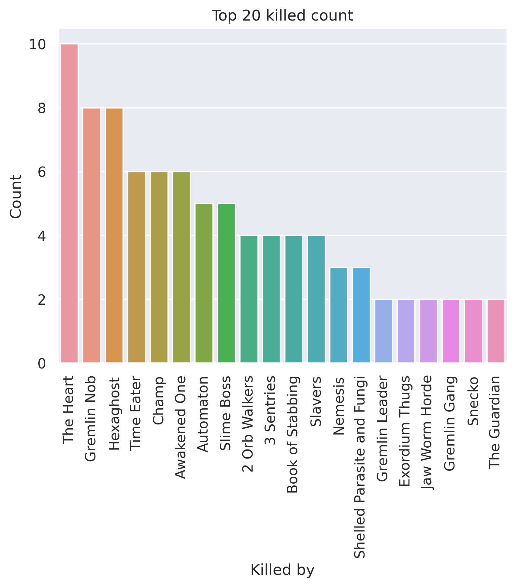

# 200 rotating sample - All characters
## General stats
- Total games played: 200
- Win rate (%): 49.5
- Avg playtime (mins): 74.83
- Avg floor reached: 43.29
- Max score: 3632
- Times rest: 1.22
- Times smith: 4.87
- Max hp >= 80: 50
- Max hp <= 40: 17

### Top 10 damage taken fights (excluding heart)
| Enemy         |   Damage Taken |
|---------------|----------------|
| 2 Orb Walkers |            122 |
| Awakened One  |            117 |
| Time Eater    |            109 |
| Time Eater    |            108 |
| Champ         |            107 |
| Time Eater    |            105 |
| Champ         |             97 |
| 2 Orb Walkers |             91 |
| Time Eater    |             90 |
| Collector     |             88 |

## Card stats
### Top 10 card removed count
| Card     |   Count |
|----------|---------|
| Defend_P |      67 |
| Strike_R |      64 |
| Strike_P |      49 |
| Strike_G |      40 |
| Strike_B |      36 |
| Defend_B |      27 |
| Regret   |      11 |
| Defend_G |      10 |
| Zap      |       9 |
| Pain     |       6 |

### Top 80 card win rate (exclude duplicate)
| Card             |   Win rate |     | Card               |   Win rate |
|------------------|------------|-----|--------------------|------------|
| ConjureBlade     |       1    |     | True Grit          |       0.83 |
| Multi-Cast       |       1    |     | Body Slam          |       0.83 |
| SandsOfTime      |       1    |     | Glass Knife        |       0.83 |
| Swift Strike     |       1    |     | Vault              |       0.83 |
| Entrench         |       1    |     | Burst              |       0.83 |
| BattleHymn       |       1    |     | Dark Shackles      |       0.82 |
| WindmillStrike   |       1    |     | Seeing Red         |       0.81 |
| Berserk          |       1    |     | Offering           |       0.81 |
| Enlightenment    |       1    |     | Corruption         |       0.81 |
| Indignation      |       1    |     | Lockon             |       0.8  |
| J.A.X.           |       1    |     | Limit Break        |       0.8  |
| Swivel           |       1    |     | Purity             |       0.8  |
| Violence         |       1    |     | Pummel             |       0.8  |
| The Bomb         |       1    |     | Omniscience        |       0.8  |
| LikeWater        |       1    |     | ClearTheMind       |       0.8  |
| Mayhem           |       1    |     | Crescendo          |       0.8  |
| Thunder Strike   |       1    |     | TalkToTheHand      |       0.79 |
| Weave            |       1    |     | Scrawl             |       0.79 |
| Deep Breath      |       1    |     | Exhume             |       0.79 |
| Establishment    |       1    |     | Capacitor          |       0.79 |
| Impatience       |       1    |     | Apotheosis         |       0.79 |
| Worship          |       1    |     | Disarm             |       0.77 |
| Perseverance     |       1    |     | Fusion             |       0.77 |
| FollowUp         |       1    |     | Night Terror       |       0.77 |
| Shame            |       1    |     | Burning Pact       |       0.76 |
| Heavy Blade      |       1    |     | Bloodletting       |       0.76 |
| Alpha            |       1    |     | Feel No Pain       |       0.76 |
| Fasting2         |       1    |     | Finisher           |       0.75 |
| Finesse          |       1    |     | DeceiveReality     |       0.75 |
| Havoc            |       1    |     | Force Field        |       0.75 |
| Clumsy           |       1    |     | Heatsinks          |       0.75 |
| PanicButton      |       0.89 |     | Spot Weakness      |       0.75 |
| Secret Technique |       0.89 |     | Shockwave          |       0.75 |
| Demon Form       |       0.88 |     | Wraith Form        |       0.75 |
| Devotion         |       0.86 |     | Steam Power        |       0.75 |
| White Noise      |       0.86 |     | Ragnarok           |       0.75 |
| Flex             |       0.86 |     | Sentinel           |       0.75 |
| Flame Barrier    |       0.85 |     | Apparition         |       0.75 |
| Seek             |       0.85 |     | Dark Embrace       |       0.74 |
| Warcry           |       0.83 |     | Tools of the Trade |       0.73 |

### Card pick rate act 1 (exclude boss)
| Card               |   Pick rate |     | Card              |   Pick rate |
|--------------------|-------------|-----|-------------------|-------------|
| A Thousand Cuts    |        1    |     | Flying Knee       |        0.24 |
| Immolate           |        1    |     | ForeignInfluence  |        0.24 |
| Madness            |        1    |     | Consecrate        |        0.23 |
| Master of Strategy |        1    |     | Capacitor         |        0.23 |
| Glass Knife        |        1    |     | Headbutt          |        0.23 |
| Swift Strike       |        1    |     | Auto Shields      |        0.22 |
| Scrawl             |        1    |     | Footwork          |        0.22 |
| Shockwave          |        1    |     | Infernal Blade    |        0.22 |
| Buffer             |        1    |     | Steam             |        0.21 |
| Seek               |        1    |     | Infinite Blades   |        0.21 |
| Offering           |        1    |     | DeceiveReality    |        0.21 |
| Dramatic Entrance  |        1    |     | Choke             |        0.21 |
| Biased Cognition   |        1    |     | Escape Plan       |        0.2  |
| HandOfGreed        |        1    |     | Consume           |        0.2  |
| Impervious         |        1    |     | Meteor Strike     |        0.2  |
| Echo Form          |        1    |     | Unload            |        0.2  |
| Feed               |        1    |     | Perfected Strike  |        0.19 |
| Fiend Fire         |        1    |     | Melter            |        0.19 |
| Adrenaline         |        1    |     | Dropkick          |        0.18 |
| After Image        |        1    |     | SKIP              |        0.18 |
| Alchemize          |        1    |     | Prepared          |        0.18 |
| Wraith Form        |        1    |     | Conclude          |        0.17 |
| The Bomb           |        1    |     | Rupture           |        0.17 |
| LessonLearned      |        1    |     | Sever Soul        |        0.17 |
| Envenom            |        1    |     | Go for the Eyes   |        0.16 |
| Hyperbeam          |        1    |     | Beam Cell         |        0.16 |
| Defragment         |        0.89 |     | Cloak And Dagger  |        0.16 |
| Terror             |        0.86 |     | Cleave            |        0.15 |
| Whirlwind          |        0.85 |     | Clothesline       |        0.14 |
| InnerPeace         |        0.85 |     | Slice             |        0.14 |
| Adaptation         |        0.85 |     | Sucker Punch      |        0.14 |
| Die Die Die        |        0.83 |     | SignatureMove     |        0.13 |
| Tools of the Trade |        0.83 |     | Crescendo         |        0.13 |
| Doom and Gloom     |        0.82 |     | Weave             |        0.12 |
| Electrodynamics    |        0.8  |     | Static Discharge  |        0.12 |
| Reaper             |        0.8  |     | Flex              |        0.12 |
| Calculated Gamble  |        0.79 |     | Rip and Tear      |        0.11 |
| Blood for Blood    |        0.77 |     | White Noise       |        0.11 |
| MentalFortress     |        0.76 |     | Indignation       |        0.11 |
| Tantrum            |        0.75 |     | Redo              |        0.11 |
| Genetic Algorithm  |        0.75 |     | Leap              |        0.1  |
| Predator           |        0.75 |     | Worship           |        0.09 |
| Self Repair        |        0.73 |     | Halt              |        0.09 |
| Bouncing Flask     |        0.71 |     | Barrage           |        0.09 |
| Second Wind        |        0.7  |     | Catalyst          |        0.08 |
| Coolheaded         |        0.69 |     | Concentrate       |        0.08 |
| FearNoEvil         |        0.69 |     | Intimidate        |        0.08 |
| TalkToTheHand      |        0.68 |     | Study             |        0.07 |
| Pommel Strike      |        0.67 |     | Sanctity          |        0.07 |
| Glacier            |        0.67 |     | Aggregate         |        0.07 |
| Brutality          |        0.67 |     | Steam Power       |        0.07 |
| Corruption         |        0.67 |     | Caltrops          |        0.07 |
| Demon Form         |        0.67 |     | Heatsinks         |        0.07 |
| Acrobatics         |        0.65 |     | Reckless Charge   |        0.07 |
| Backstab           |        0.64 |     | CrushJoints       |        0.06 |
| Masterful Stab     |        0.64 |     | Accuracy          |        0.06 |
| Meditate           |        0.62 |     | Riddle With Holes |        0.06 |
| Chill              |        0.62 |     | Force Field       |        0.06 |
| Noxious Fumes      |        0.62 |     | Entrench          |        0.06 |
| Double Tap         |        0.6  |     | WindmillStrike    |        0.05 |
| Malaise            |        0.6  |     | Flechettes        |        0.05 |
| Battle Trance      |        0.6  |     | Quick Slash       |        0.05 |
| Feel No Pain       |        0.6  |     | Thunderclap       |        0.05 |
| Blade Dance        |        0.59 |     | Scrape            |        0.05 |
| Dagger Spray       |        0.58 |     | Outmaneuver       |        0.04 |
| Well Laid Plans    |        0.58 |     | Claw              |        0.04 |
| Inflame            |        0.58 |     | Wild Strike       |        0.03 |
| Sunder             |        0.57 |     | Heavy Blade       |        0.03 |
| Reinforced Body    |        0.57 |     | Dodge and Roll    |        0.02 |
| Hologram           |        0.56 |     | Turbo             |        0.02 |
| Shrug It Off       |        0.56 |     | Body Slam         |        0.02 |
| EmptyFist          |        0.55 |     | Havoc             |        0.02 |
| Leg Sweep          |        0.55 |     | JustLucky         |        0.02 |
| Undo               |        0.55 |     | Warcry            |        0.02 |
| Evolve             |        0.55 |     | True Grit         |        0    |
| Hemokinesis        |        0.54 |     | Collect           |        0    |
| EmptyMind          |        0.54 |     | ConjureBlade      |        0    |
| Ball Lightning     |        0.54 |     | Deep Breath       |        0    |
| Power Through      |        0.53 |     | Thunder Strike    |        0    |
| Wallop             |        0.53 |     | Reboot            |        0    |
| Eviscerate         |        0.53 |     | ClearTheMind      |        0    |
| Darkness           |        0.53 |     | Thinking Ahead    |        0    |
| BootSequence       |        0.53 |     | Deflect           |        0    |
| Cold Snap          |        0.52 |     | DeusExMachina     |        0    |
| Backflip           |        0.52 |     | DevaForm          |        0    |
| Skim               |        0.5  |     | Devotion          |        0    |
| Carnage            |        0.5  |     | Distraction       |        0    |
| Rainbow            |        0.5  |     | Sword Boomerang   |        0    |
| Flame Barrier      |        0.5  |     | Swivel            |        0    |
| Blasphemy          |        0.5  |     | ThirdEye          |        0    |
| Panacea            |        0.5  |     | Chaos             |        0    |
| Dark Shackles      |        0.5  |     | Clash             |        0    |
| Bullet Time        |        0.5  |     | Berserk           |        0    |
| FTL                |        0.5  |     | All For One       |        0    |
| Disarm             |        0.5  |     | Alpha             |        0    |
| Trip               |        0.5  |     | Wish              |        0    |
| Compile Driver     |        0.49 |     | Wireheading       |        0    |
| Anger              |        0.49 |     | Amplify           |        0    |
| Spot Weakness      |        0.46 |     | Bane              |        0    |
| FlurryOfBlows      |        0.46 |     | BattleHymn        |        0    |
| Bludgeon           |        0.43 |     | Blizzard          |        0    |
| CutThroughFate     |        0.42 |     | Dual Wield        |        0    |
| Crippling Poison   |        0.42 |     | Blur              |        0    |
| CarveReality       |        0.42 |     | WaveOfTheHand     |        0    |
| Barricade          |        0.4  |     | BowlingBash       |        0    |
| Metallicize        |        0.4  |     | Violence          |        0    |
| Dagger Throw       |        0.4  |     | Vengeance         |        0    |
| Armaments          |        0.39 |     | Brilliance        |        0    |
| ReachHeaven        |        0.39 |     | Burst             |        0    |
| Hello World        |        0.39 |     | Doppelganger      |        0    |
| Reflex             |        0.38 |     | Enlightenment     |        0    |
| Exhume             |        0.38 |     | EmptyBody         |        0    |
| Conserve Battery   |        0.37 |     | Purity            |        0    |
| Endless Agony      |        0.36 |     | LikeWater         |        0    |
| Loop               |        0.36 |     | MasterReality     |        0    |
| Underhanded Strike |        0.36 |     | Secret Technique  |        0    |
| PiercingWail       |        0.36 |     | Mayhem            |        0    |
| Bloodletting       |        0.36 |     | Searing Blow      |        0    |
| Poisoned Stab      |        0.35 |     | Multi-Cast        |        0    |
| Rebound            |        0.35 |     | Nirvana           |        0    |
| Dash               |        0.33 |     | SashWhip          |        0    |
| Limit Break        |        0.33 |     | SandsOfTime       |        0    |
| Ghostly Armor      |        0.33 |     | Omniscience       |        0    |
| Creative AI        |        0.33 |     | PathToVictory     |        0    |
| Bandage Up         |        0.33 |     | Perseverance      |        0    |
| Iron Wave          |        0.33 |     | Phantasmal Killer |        0    |
| Machine Learning   |        0.33 |     | Pray              |        0    |
| Pummel             |        0.33 |     | Reprogram         |        0    |
| Secret Weapon      |        0.33 |     | Prostrate         |        0    |
| Dark Embrace       |        0.32 |     | Protect           |        0    |
| Twin Strike        |        0.32 |     | Juggernaut        |        0    |
| Double Energy      |        0.3  |     | Sentinel          |        0    |
| Tempest            |        0.3  |     | Setup             |        0    |
| Deadly Poison      |        0.3  |     | Stack             |        0    |
| Combust            |        0.29 |     | Establishment     |        0    |
| Rage               |        0.29 |     | Evaluate          |        0    |
| WheelKick          |        0.29 |     | Expertise         |        0    |
| Recycle            |        0.29 |     | Storm             |        0    |
| Tactician          |        0.29 |     | Fasting2          |        0    |
| Skewer             |        0.27 |     | Finisher          |        0    |
| Singing Bowl       |        0.27 |     | Fire Breathing    |        0    |
| Rampage            |        0.27 |     | Fission           |        0    |
| Fusion             |        0.27 |     | Impatience        |        0    |
| Uppercut           |        0.27 |     | SpiritShield      |        0    |
| Sweeping Beam      |        0.26 |     | FlyingSleeves     |        0    |
| Night Terror       |        0.25 |     | FollowUp          |        0    |
| Storm of Steel     |        0.25 |     | Forethought       |        0    |
| Seeing Red         |        0.25 |     | Good Instincts    |        0    |
| Lockon             |        0.25 |     | Grand Finale      |        0    |
| Burning Pact       |        0.25 |     | Heel Hook         |        0    |
| Streamline         |        0.25 |     | WreathOfFlame     |        0    |
| All Out Attack     |        0.25 |     |   |   |

### Card pick rate after act 1 (exclude boss)
| Card               |   Pick rate |     | Card               |   Pick rate |
|--------------------|-------------|-----|--------------------|-------------|
| PanicButton        |        1    |     | Beam Cell          |        0.11 |
| Scrawl             |        1    |     | Chaos              |        0.11 |
| Vault              |        1    |     | Worship            |        0.11 |
| Finesse            |        1    |     | Caltrops           |        0.11 |
| Offering           |        1    |     | Skewer             |        0.11 |
| Ragnarok           |        1    |     | Madness            |        0.11 |
| Impervious         |        1    |     | Finisher           |        0.11 |
| Seek               |        1    |     | Deflect            |        0.11 |
| Adrenaline         |        1    |     | Dodge and Roll     |        0.11 |
| Echo Form          |        1    |     | Armaments          |        0.1  |
| Skim               |        0.94 |     | Conserve Battery   |        0.1  |
| Exhume             |        0.91 |     | Establishment      |        0.1  |
| After Image        |        0.9  |     | Bouncing Flask     |        0.1  |
| Calculated Gamble  |        0.84 |     | Hyperbeam          |        0.1  |
| Acrobatics         |        0.84 |     | WheelKick          |        0.1  |
| Alchemize          |        0.83 |     | Clothesline        |        0.1  |
| Defragment         |        0.8  |     | Consume            |        0.1  |
| Shockwave          |        0.8  |     | Sweeping Beam      |        0.09 |
| Night Terror       |        0.8  |     | Cold Snap          |        0.09 |
| Disarm             |        0.76 |     | Metallicize        |        0.08 |
| Meteor Strike      |        0.75 |     | Deadly Poison      |        0.08 |
| Burst              |        0.75 |     | Headbutt           |        0.08 |
| Doppelganger       |        0.75 |     | Barrage            |        0.08 |
| Power Through      |        0.74 |     | Halt               |        0.07 |
| Corruption         |        0.73 |     | CrushJoints        |        0.07 |
| Secret Technique   |        0.71 |     | Havoc              |        0.07 |
| Wraith Form        |        0.71 |     | ClearTheMind       |        0.06 |
| Feed               |        0.71 |     | Wireheading        |        0.06 |
| Tools of the Trade |        0.71 |     | FlurryOfBlows      |        0.06 |
| Battle Trance      |        0.68 |     | Rebound            |        0.06 |
| Glacier            |        0.67 |     | Force Field        |        0.06 |
| Creative AI        |        0.67 |     | Tempest            |        0.06 |
| Burning Pact       |        0.67 |     | Swivel             |        0.06 |
| Malaise            |        0.67 |     | Backstab           |        0.06 |
| Double Tap         |        0.67 |     | Ball Lightning     |        0.06 |
| Flash of Steel     |        0.67 |     | Scrape             |        0.06 |
| Recycle            |        0.67 |     | Masterful Stab     |        0.06 |
| Biased Cognition   |        0.67 |     | Riddle With Holes  |        0.06 |
| Fission            |        0.67 |     | Flechettes         |        0.05 |
| Fiend Fire         |        0.67 |     | Leap               |        0.05 |
| Backflip           |        0.66 |     | Dagger Spray       |        0.05 |
| Compile Driver     |        0.65 |     | Flying Knee        |        0.05 |
| Adaptation         |        0.65 |     | Endless Agony      |        0.05 |
| PiercingWail       |        0.62 |     | Heavy Blade        |        0.05 |
| Barricade          |        0.62 |     | All Out Attack     |        0.05 |
| Coolheaded         |        0.61 |     | WaveOfTheHand      |        0.04 |
| Reaper             |        0.6  |     | Dagger Throw       |        0.04 |
| Buffer             |        0.6  |     | Crescendo          |        0.04 |
| InnerPeace         |        0.6  |     | Intimidate         |        0.04 |
| Leg Sweep          |        0.58 |     | Perfected Strike   |        0.04 |
| Dark Embrace       |        0.58 |     | Rupture            |        0.04 |
| Shrug It Off       |        0.57 |     | Hello World        |        0.04 |
| Feel No Pain       |        0.57 |     | Combust            |        0.04 |
| Second Wind        |        0.55 |     | Steam              |        0.04 |
| Hologram           |        0.55 |     | Sucker Punch       |        0.04 |
| Reflex             |        0.52 |     | Vengeance          |        0.04 |
| Tactician          |        0.52 |     | Collect            |        0.03 |
| Core Surge         |        0.5  |     | DeceiveReality     |        0.03 |
| Corpse Explosion   |        0.5  |     | Cloak And Dagger   |        0.03 |
| Well Laid Plans    |        0.5  |     | ForeignInfluence   |        0.03 |
| Phantasmal Killer  |        0.5  |     | Twin Strike        |        0.03 |
| Capacitor          |        0.5  |     | SashWhip           |        0.03 |
| Bullet Time        |        0.5  |     | Fasting2           |        0.03 |
| Meditate           |        0.5  |     | Slice              |        0.02 |
| Master of Strategy |        0.5  |     | Poisoned Stab      |        0.02 |
| Dark Shackles      |        0.5  |     | Iron Wave          |        0.02 |
| EmptyMind          |        0.48 |     | EmptyFist          |        0.02 |
| Catalyst           |        0.47 |     | Quick Slash        |        0.02 |
| TalkToTheHand      |        0.46 |     | Cleave             |        0.01 |
| Dual Wield         |        0.46 |     | Streamline         |        0.01 |
| Reinforced Body    |        0.45 |     | Consecrate         |        0.01 |
| Devotion           |        0.44 |     | Evaluate           |        0.01 |
| Footwork           |        0.44 |     | Transmutation      |        0    |
| Omniscience        |        0.43 |     | The Bomb           |        0    |
| Electrodynamics    |        0.43 |     | Swift Strike       |        0    |
| Bloodletting       |        0.43 |     | Thunderclap        |        0    |
| Escape Plan        |        0.41 |     | Unload             |        0    |
| Fusion             |        0.41 |     | ThirdEye           |        0    |
| Evolve             |        0.4  |     | Storm of Steel     |        0    |
| Doom and Gloom     |        0.39 |     | Storm              |        0    |
| Sentinel           |        0.38 |     | Thunder Strike     |        0    |
| Undo               |        0.38 |     | SpiritShield       |        0    |
| Amplify            |        0.38 |     | Violence           |        0    |
| MentalFortress     |        0.37 |     | Weave              |        0    |
| BootSequence       |        0.37 |     | Wild Strike        |        0    |
| Flame Barrier      |        0.37 |     | Searing Blow       |        0    |
| Chill              |        0.35 |     | WindmillStrike     |        0    |
| Pummel             |        0.35 |     | SignatureMove      |        0    |
| Aggregate          |        0.35 |     | A Thousand Cuts    |        0    |
| Terror             |        0.35 |     | SandsOfTime        |        0    |
| Seeing Red         |        0.35 |     | Sanctity           |        0    |
| Double Energy      |        0.33 |     | Conclude           |        0    |
| Apotheosis         |        0.33 |     | ConjureBlade       |        0    |
| Darkness           |        0.33 |     | Deep Breath        |        0    |
| Secret Weapon      |        0.33 |     | Demon Form         |        0    |
| Predator           |        0.33 |     | DeusExMachina      |        0    |
| Turbo              |        0.33 |     | DevaForm           |        0    |
| Blur               |        0.32 |     | Die Die Die        |        0    |
| Concentrate        |        0.32 |     | Distraction        |        0    |
| Eviscerate         |        0.31 |     | Dramatic Entrance  |        0    |
| SKIP               |        0.31 |     | EmptyBody          |        0    |
| Crippling Poison   |        0.31 |     | Enlightenment      |        0    |
| Uppercut           |        0.31 |     | Envenom            |        0    |
| Pommel Strike      |        0.3  |     | FTL                |        0    |
| Whirlwind          |        0.29 |     | Fire Breathing     |        0    |
| Blood for Blood    |        0.29 |     | Flex               |        0    |
| Rage               |        0.29 |     | Claw               |        0    |
| Loop               |        0.29 |     | Clash              |        0    |
| Impatience         |        0.29 |     | Chrysalis          |        0    |
| Singing Bowl       |        0.28 |     | Berserk            |        0    |
| Go for the Eyes    |        0.28 |     | All For One        |        0    |
| Tantrum            |        0.28 |     | Alpha              |        0    |
| True Grit          |        0.28 |     | Anger              |        0    |
| Genetic Algorithm  |        0.28 |     | Bandage Up         |        0    |
| Spot Weakness      |        0.27 |     | Bane               |        0    |
| Prepared           |        0.27 |     | BattleHymn         |        0    |
| Redo               |        0.27 |     | Blasphemy          |        0    |
| Self Repair        |        0.26 |     | Choke              |        0    |
| White Noise        |        0.25 |     | Blizzard           |        0    |
| Static Discharge   |        0.25 |     | Bludgeon           |        0    |
| FearNoEvil         |        0.24 |     | BowlingBash        |        0    |
| Sunder             |        0.24 |     | Brilliance         |        0    |
| Blind              |        0.22 |     | Carnage            |        0    |
| Machine Learning   |        0.22 |     | CarveReality       |        0    |
| Immolate           |        0.22 |     | FlyingSleeves      |        0    |
| Warcry             |        0.21 |     | FollowUp           |        0    |
| CutThroughFate     |        0.21 |     | Forethought        |        0    |
| Thinking Ahead     |        0.2  |     | Protect            |        0    |
| Brutality          |        0.2  |     | Multi-Cast         |        0    |
| Expertise          |        0.19 |     | Nirvana            |        0    |
| Wallop             |        0.19 |     | Panacea            |        0    |
| Outmaneuver        |        0.18 |     | Panache            |        0    |
| Dash               |        0.18 |     | PathToVictory      |        0    |
| Entrench           |        0.18 |     | Perseverance       |        0    |
| Study              |        0.17 |     | Rainbow            |        0    |
| Blade Dance        |        0.17 |     | Metamorphosis      |        0    |
| MasterReality      |        0.17 |     | Rampage            |        0    |
| Reboot             |        0.17 |     | ReachHeaven        |        0    |
| Limit Break        |        0.17 |     | Reckless Charge    |        0    |
| Trip               |        0.17 |     | Reprogram          |        0    |
| Juggernaut         |        0.17 |     | Rip and Tear       |        0    |
| Setup              |        0.16 |     | Sadistic Nature    |        0    |
| Body Slam          |        0.15 |     | Mind Blast         |        0    |
| Prostrate          |        0.15 |     | Melter             |        0    |
| Stack              |        0.14 |     | Glass Knife        |        0    |
| Auto Shields       |        0.14 |     | Infinite Blades    |        0    |
| Purity             |        0.14 |     | Good Instincts     |        0    |
| Discovery          |        0.14 |     | Grand Finale       |        0    |
| Noxious Fumes      |        0.14 |     | Heel Hook          |        0    |
| HandOfGreed        |        0.14 |     | Hemokinesis        |        0    |
| Dropkick           |        0.14 |     | Indignation        |        0    |
| Sever Soul         |        0.14 |     | Infernal Blade     |        0    |
| Pray               |        0.14 |     | Jack Of All Trades |        0    |
| Steam Power        |        0.13 |     | Mayhem             |        0    |
| Accuracy           |        0.12 |     | Judgement          |        0    |
| Inflame            |        0.12 |     | JustLucky          |        0    |
| Underhanded Strike |        0.12 |     | LessonLearned      |        0    |
| Wish               |        0.12 |     | LikeWater          |        0    |
| Ghostly Armor      |        0.12 |     | Lockon             |        0    |
| Sword Boomerang    |        0.12 |     | Magnetism          |        0    |
| Heatsinks          |        0.12 |     | WreathOfFlame      |        0    |

## Relic stats
### Top relic win rate
| Relic               |   Win rate |     | Relic            |   Win rate |
|---------------------|------------|-----|------------------|------------|
| HandDrill           |       1    |     | Snecko Eye       |       0.87 |
| Busted Crown        |       1    |     | Pocketwatch      |       0.85 |
| WristBlade          |       1    |     | Meat on the Bone |       0.84 |
| Magic Flower        |       1    |     | Mummified Hand   |       0.84 |
| Mark of Pain        |       1    |     | Symbiotic Virus  |       0.83 |
| VioletLotus         |       1    |     | TeardropLocket   |       0.83 |
| TwistedFunnel       |       1    |     | Torii            |       0.83 |
| Mark of the Bloom   |       1    |     | Runic Pyramid    |       0.82 |
| Tough Bandages      |       1    |     | Frozen Eye       |       0.82 |
| MutagenicStrength   |       1    |     | Medical Kit      |       0.82 |
| Tingsha             |       1    |     | Whetstone        |       0.82 |
| Nloth's Gift        |       1    |     | Paper Frog       |       0.8  |
| The Specimen        |       1    |     | Pandora's Box    |       0.8  |
| PrismaticShard      |       1    |     | WarpedTongs      |       0.8  |
| Ring of the Serpent |       1    |     | Lee's Waffle     |       0.8  |
| Bird Faced Urn      |       0.94 |     | Kunai            |       0.8  |
| Self Forming Clay   |       0.9  |     | Yang             |       0.8  |
| TheAbacus           |       0.89 |     | Chemical X       |       0.8  |
| TungstenRod         |       0.88 |     | Bronze Scales    |       0.79 |
| StoneCalendar       |       0.88 |     | Gambling Chip    |       0.78 |

### Bottom relic win rate
| Relic          |   Win rate |     | Relic               |   Win rate |
|----------------|------------|-----|---------------------|------------|
| Blood Vial     |       0.56 |     | Emotion Chip        |       0.5  |
| Bag of Marbles |       0.56 |     | Coffee Dripper      |       0.48 |
| Potion Belt    |       0.55 |     | Darkstone Periapt   |       0.47 |
| War Paint      |       0.55 |     | Matryoshka          |       0.47 |
| OrangePellets  |       0.55 |     | Peace Pipe          |       0.47 |
| CeramicFish    |       0.54 |     | Velvet Choker       |       0.43 |
| Regal Pillow   |       0.53 |     | NeowsBlessing       |       0.41 |
| Smiling Mask   |       0.53 |     | Paper Crane         |       0.4  |
| Boot           |       0.52 |     | Runic Cube          |       0.4  |
| Cracked Core   |       0.52 |     | Philosopher's Stone |       0.37 |
| Art of War     |       0.51 |     | Ring of the Snake   |       0.34 |
| Cursed Key     |       0.5  |     | Necronomicon        |       0.33 |
| GoldenEye      |       0.5  |     | Cauldron            |       0.33 |
| Sozu           |       0.5  |     | Golden Idol         |       0.3  |
| Champion Belt  |       0.5  |     | Nuclear Battery     |       0.25 |
| HolyWater      |       0.5  |     | Odd Mushroom        |       0.17 |
| Tiny Chest     |       0.5  |     | Ectoplasm           |       0.17 |
| Brimstone      |       0.5  |     | GremlinMask         |       0    |
| Bottled Flame  |       0.5  |     | Calling Bell        |       0    |
| Runic Dome     |       0.5  |     | Sling               |       0    |

### Act 1 boss relic pick rate
| Relic               |   Pick rate |     | Relic         |   Pick rate |
|---------------------|-------------|-----|---------------|-------------|
| Nuclear Battery     |        1    |     | Cursed Key    |        0.26 |
| Ring of the Serpent |        1    |     | HolyWater     |        0.25 |
| Runic Pyramid       |        0.94 |     | Runic Cube    |        0.25 |
| Pandora's Box       |        0.79 |     | Velvet Choker |        0.24 |
| VioletLotus         |        0.71 |     | SacredBark    |        0.17 |
| Coffee Dripper      |        0.69 |     | Mark of Pain  |        0.17 |
| Philosopher's Stone |        0.54 |     | Calling Bell  |        0.11 |
| Fusion Hammer       |        0.44 |     | WristBlade    |        0.11 |
| Snecko Eye          |        0.42 |     | Sozu          |        0.05 |
| SlaversCollar       |        0.37 |     | Ectoplasm     |        0.04 |
| Empty Cage          |        0.36 |     | FrozenCore    |        0    |
| Astrolabe           |        0.33 |     | Runic Dome    |        0    |
| Black Star          |        0.33 |     | Black Blood   |        0    |
| HoveringKite        |        0.29 |     | Busted Crown  |        0    |
| Inserter            |        0.29 |     | Tiny House    |        0    |

### Act 1 boss relic win rate
| Relic               |   Win rate |     | Relic               |   Win rate |
|---------------------|------------|-----|---------------------|------------|
| WristBlade          |       1    |     | HoveringKite        |       0.5  |
| Mark of Pain        |       1    |     | HolyWater           |       0.5  |
| VioletLotus         |       1    |     | Runic Cube          |       0.5  |
| Ectoplasm           |       1    |     | SlaversCollar       |       0.5  |
| Ring of the Serpent |       1    |     | Coffee Dripper      |       0.5  |
| Snecko Eye          |       0.91 |     | Velvet Choker       |       0.5  |
| Runic Pyramid       |       0.88 |     | Cursed Key          |       0.4  |
| Fusion Hammer       |       0.75 |     | Empty Cage          |       0.33 |
| Pandora's Box       |       0.74 |     | Nuclear Battery     |       0.33 |
| SacredBark          |       0.67 |     | Philosopher's Stone |       0.23 |
| Astrolabe           |       0.56 |     | Sozu                |       0    |
| Inserter            |       0.5  |     | Calling Bell        |       0    |
| Black Star          |       0.5  |     |   |   |

### Act 2 boss relic pick rate
| Relic               |   Pick rate |     | Relic               |   Pick rate |
|---------------------|-------------|-----|---------------------|-------------|
| Inserter            |        1    |     | Philosopher's Stone |        0.31 |
| Runic Pyramid       |        0.85 |     | Runic Dome          |        0.27 |
| SlaversCollar       |        0.69 |     | Pandora's Box       |        0.24 |
| Coffee Dripper      |        0.69 |     | WristBlade          |        0.2  |
| Mark of Pain        |        0.67 |     | Tiny House          |        0.12 |
| HoveringKite        |        0.67 |     | Sozu                |        0.11 |
| Astrolabe           |        0.65 |     | Busted Crown        |        0.1  |
| Fusion Hammer       |        0.59 |     | Black Star          |        0.09 |
| VioletLotus         |        0.5  |     | Calling Bell        |        0.06 |
| Nuclear Battery     |        0.5  |     | Snecko Eye          |        0.06 |
| Empty Cage          |        0.5  |     | FrozenCore          |        0    |
| Cursed Key          |        0.43 |     | Black Blood         |        0    |
| Ring of the Serpent |        0.43 |     | Velvet Choker       |        0    |
| Runic Cube          |        0.38 |     | HolyWater           |        0    |
| SacredBark          |        0.32 |     |   |   |

### Act 2 boss relic win rate
| Relic               |   Win rate |     | Relic               |   Win rate |
|---------------------|------------|-----|---------------------|------------|
| Pandora's Box       |       1    |     | Runic Pyramid       |       0.78 |
| Inserter            |       1    |     | HoveringKite        |       0.75 |
| VioletLotus         |       1    |     | Cursed Key          |       0.67 |
| Snecko Eye          |       1    |     | Tiny House          |       0.67 |
| Ring of the Serpent |       1    |     | Sozu                |       0.67 |
| Black Star          |       1    |     | Astrolabe           |       0.64 |
| Mark of Pain        |       1    |     | Philosopher's Stone |       0.5  |
| WristBlade          |       1    |     | Nuclear Battery     |       0.5  |
| Empty Cage          |       1    |     | Runic Dome          |       0.5  |
| Busted Crown        |       1    |     | Coffee Dripper      |       0.45 |
| SacredBark          |       0.83 |     | Runic Cube          |       0.33 |
| SlaversCollar       |       0.82 |     | Calling Bell        |       0    |
| Fusion Hammer       |       0.8  |     |   |   |

