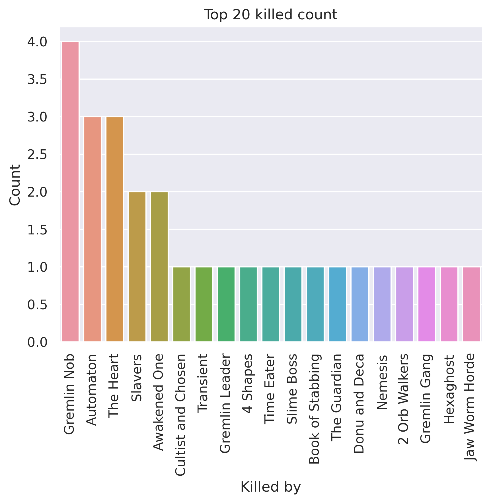
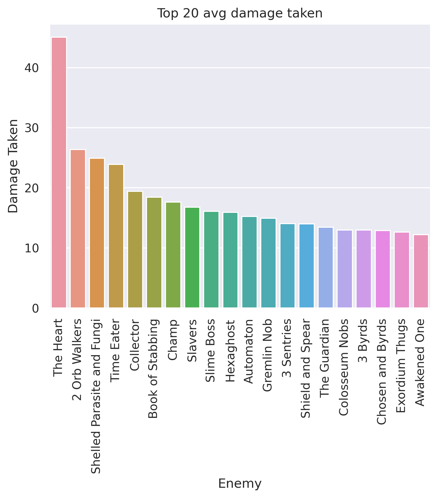
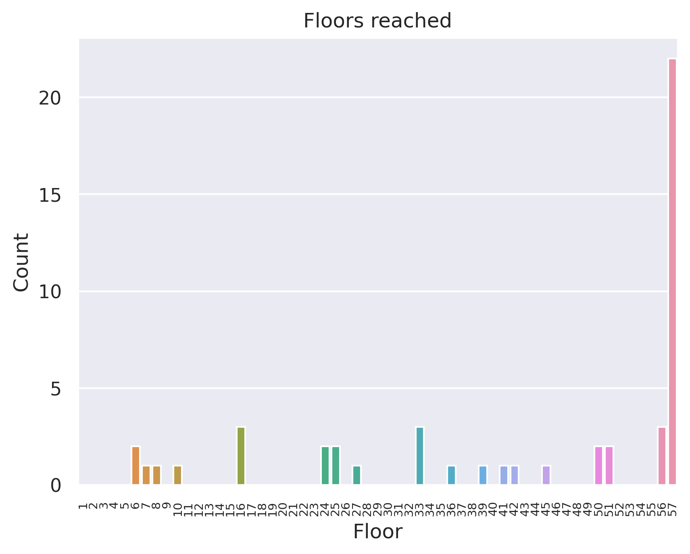
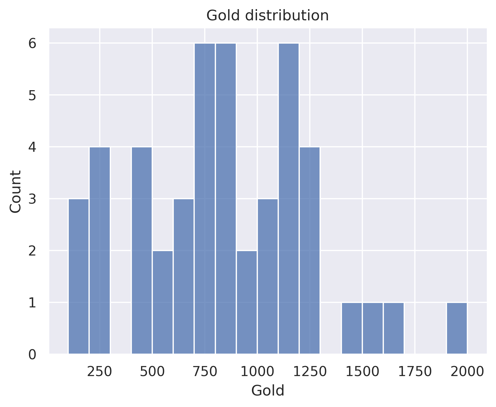

# 200 rotating sample - Defect
## General stats
- Total games played: 50
- Win rate (%): 44.0
- Avg playtime (mins): 83.73
- Avg floor reached: 42.72
- Max score: 3489
- Times rest: 1.0
- Times smith: 5.32
- Max hp >= 80: 9
- Max hp <= 40: 4

### Top 10 damage taken fights (excluding heart)
| Enemy            |   Damage Taken |
|------------------|----------------|
| Time Eater       |            109 |
| 2 Orb Walkers    |             91 |
| Slavers          |             88 |
| Collector        |             88 |
| Gremlin Nob      |             86 |
| Book of Stabbing |             83 |
| Automaton        |             72 |
| Shield and Spear |             72 |
| Nemesis          |             70 |
| Giant Head       |             68 |

## Card stats
### Top 10 card removed count
| Card      |   Count |
|-----------|---------|
| Strike_B  |      36 |
| Defend_B  |      27 |
| Zap       |       9 |
| Rainbow   |       2 |
| Normality |       2 |
| FTL       |       2 |
| Reprogram |       1 |
| Steam     |       1 |
| Cold Snap |       1 |
| Tempest   |       1 |

### Top 80 card win rate (exclude duplicate)
| Card               |   Win rate |     | Card               |   Win rate |
|--------------------|------------|-----|--------------------|------------|
| Acrobatics         |       1    |     | Buffer             |       0.69 |
| Dark Shackles      |       1    |     | Melter             |       0.67 |
| Dual Wield         |       1    |     | Loop               |       0.67 |
| Fasting2           |       1    |     | Master of Strategy |       0.67 |
| Impatience         |       1    |     | Storm              |       0.67 |
| Iron Wave          |       1    |     | Reboot             |       0.67 |
| Madness            |       1    |     | Rainbow            |       0.67 |
| Mayhem             |       1    |     | Creative AI        |       0.67 |
| Multi-Cast         |       1    |     | All For One        |       0.67 |
| Outmaneuver        |       1    |     | Core Surge         |       0.64 |
| Panacea            |       1    |     | Turbo              |       0.63 |
| PanicButton        |       1    |     | Meteor Strike      |       0.63 |
| PiercingWail       |       1    |     | Biased Cognition   |       0.62 |
| Purity             |       1    |     | Chill              |       0.6  |
| RitualDagger       |       1    |     | Consume            |       0.6  |
| Secret Technique   |       1    |     | Aggregate          |       0.6  |
| Secret Weapon      |       1    |     | Fission            |       0.59 |
| Shame              |       1    |     | Go for the Eyes    |       0.58 |
| Shrug It Off       |       1    |     | Hologram           |       0.57 |
| Spot Weakness      |       1    |     | Sunder             |       0.56 |
| TalkToTheHand      |       1    |     | Recycle            |       0.56 |
| Thunder Strike     |       1    |     | Hello World        |       0.56 |
| Tools of the Trade |       1    |     | Tempest            |       0.56 |
| Violence           |       1    |     | Darkness           |       0.55 |
| Well Laid Plans    |       1    |     | Defragment         |       0.55 |
| Deep Breath        |       1    |     | Compile Driver     |       0.54 |
| JustLucky          |       1    |     | Reinforced Body    |       0.52 |
| Clothesline        |       1    |     | Electrodynamics    |       0.5  |
| Apparition         |       0.86 |     | Glacier            |       0.5  |
| White Noise        |       0.86 |     | Stack              |       0.5  |
| Seek               |       0.85 |     | BootSequence       |       0.5  |
| Lockon             |       0.8  |     | Doom and Gloom     |       0.5  |
| Capacitor          |       0.79 |     | Bite               |       0.5  |
| Fusion             |       0.77 |     | Amplify            |       0.5  |
| Steam Power        |       0.75 |     | Hyperbeam          |       0.5  |
| Apotheosis         |       0.75 |     | Sweeping Beam      |       0.5  |
| Heatsinks          |       0.75 |     | FTL                |       0.5  |
| Force Field        |       0.75 |     | Coolheaded         |       0.49 |
| Leap               |       0.71 |     | Cold Snap          |       0.48 |
| Barrage            |       0.7  |     | Skim               |       0.47 |

### Card pick rate act 1 (exclude boss)
| Card              |   Pick rate |     | Card             |   Pick rate |
|-------------------|-------------|-----|------------------|-------------|
| Hyperbeam         |        1    |     | Capacitor        |        0.23 |
| Buffer            |        1    |     | Auto Shields     |        0.22 |
| JustLucky         |        1    |     | Steam            |        0.21 |
| Seek              |        1    |     | Consume          |        0.2  |
| Spot Weakness     |        1    |     | Meteor Strike    |        0.2  |
| Echo Form         |        1    |     | Melter           |        0.19 |
| Outmaneuver       |        1    |     | Go for the Eyes  |        0.16 |
| Dramatic Entrance |        1    |     | Beam Cell        |        0.16 |
| Biased Cognition  |        1    |     | Static Discharge |        0.12 |
| Well Laid Plans   |        1    |     | Rip and Tear     |        0.11 |
| Defragment        |        0.89 |     | White Noise      |        0.11 |
| Doom and Gloom    |        0.82 |     | Redo             |        0.11 |
| Electrodynamics   |        0.8  |     | Leap             |        0.1  |
| Genetic Algorithm |        0.75 |     | Barrage          |        0.09 |
| Self Repair       |        0.73 |     | SKIP             |        0.08 |
| Coolheaded        |        0.69 |     | Aggregate        |        0.07 |
| Glacier           |        0.67 |     | Heatsinks        |        0.07 |
| Chill             |        0.62 |     | Steam Power      |        0.07 |
| Reinforced Body   |        0.57 |     | Force Field      |        0.06 |
| Sunder            |        0.57 |     | Scrape           |        0.05 |
| Hologram          |        0.56 |     | Claw             |        0.04 |
| Undo              |        0.55 |     | Turbo            |        0.02 |
| Ball Lightning    |        0.54 |     | Chaos            |        0    |
| Darkness          |        0.53 |     | ClearTheMind     |        0    |
| BootSequence      |        0.53 |     | Study            |        0    |
| Cold Snap         |        0.52 |     | Blizzard         |        0    |
| FTL               |        0.5  |     | Sword Boomerang  |        0    |
| Iron Wave         |        0.5  |     | Thunder Strike   |        0    |
| Skim              |        0.5  |     | Amplify          |        0    |
| Rainbow           |        0.5  |     | Storm            |        0    |
| Compile Driver    |        0.49 |     | Perfected Strike |        0    |
| Hello World       |        0.39 |     | Deep Breath      |        0    |
| Conserve Battery  |        0.37 |     | Dual Wield       |        0    |
| Loop              |        0.36 |     | Stack            |        0    |
| Rebound           |        0.35 |     | Purity           |        0    |
| Machine Learning  |        0.33 |     | Entrench         |        0    |
| Creative AI       |        0.33 |     | Fission          |        0    |
| Tempest           |        0.3  |     | Secret Technique |        0    |
| Double Energy     |        0.3  |     | Forethought      |        0    |
| Recycle           |        0.29 |     | Reprogram        |        0    |
| Fusion            |        0.27 |     | All For One      |        0    |
| Sweeping Beam     |        0.26 |     | Reboot           |        0    |
| Streamline        |        0.25 |     | Multi-Cast       |        0    |
| Lockon            |        0.25 |     | EmptyMind        |        0    |

### Card pick rate after act 1 (exclude boss)
| Card               |   Pick rate |     | Card               |   Pick rate |
|--------------------|-------------|-----|--------------------|-------------|
| Dual Wield         |        1    |     | Tempest            |        0.06 |
| Secret Technique   |        1    |     | Force Field        |        0.06 |
| TalkToTheHand      |        1    |     | Scrape             |        0.06 |
| Tools of the Trade |        1    |     | Ball Lightning     |        0.06 |
| Impatience         |        1    |     | Leap               |        0.05 |
| Clothesline        |        1    |     | Hello World        |        0.04 |
| Seek               |        1    |     | Steam              |        0.04 |
| Blind              |        1    |     | Streamline         |        0.01 |
| Acrobatics         |        1    |     | Reprogram          |        0    |
| Secret Weapon      |        1    |     | Underhanded Strike |        0    |
| PanicButton        |        1    |     | Rip and Tear       |        0    |
| PiercingWail       |        1    |     | Vengeance          |        0    |
| Fasting2           |        1    |     | Weave              |        0    |
| Echo Form          |        1    |     | Storm              |        0    |
| Shrug It Off       |        1    |     | True Grit          |        0    |
| Skim               |        0.94 |     | Trip               |        0    |
| Defragment         |        0.8  |     | Transmutation      |        0    |
| Meteor Strike      |        0.75 |     | ThirdEye           |        0    |
| Creative AI        |        0.67 |     | Thinking Ahead     |        0    |
| Biased Cognition   |        0.67 |     | Swift Strike       |        0    |
| Fission            |        0.67 |     | Skewer             |        0    |
| Glacier            |        0.67 |     | Spot Weakness      |        0    |
| Recycle            |        0.67 |     | Study              |        0    |
| Compile Driver     |        0.65 |     | Thunder Strike     |        0    |
| Coolheaded         |        0.61 |     | Accuracy           |        0    |
| Buffer             |        0.6  |     | Rainbow            |        0    |
| Hologram           |        0.55 |     | Purity             |        0    |
| Capacitor          |        0.5  |     | Deep Breath        |        0    |
| Core Surge         |        0.5  |     | CrushJoints        |        0    |
| Reinforced Body    |        0.45 |     | Crescendo          |        0    |
| Electrodynamics    |        0.43 |     | Cloak And Dagger   |        0    |
| Fusion             |        0.41 |     | Cleave             |        0    |
| Doom and Gloom     |        0.39 |     | ClearTheMind       |        0    |
| Undo               |        0.38 |     | Claw               |        0    |
| Amplify            |        0.38 |     | Clash              |        0    |
| BootSequence       |        0.37 |     | Chrysalis          |        0    |
| Chill              |        0.35 |     | Choke              |        0    |
| Aggregate          |        0.35 |     | Blizzard           |        0    |
| Double Energy      |        0.33 |     | Bane               |        0    |
| Darkness           |        0.33 |     | Bandage Up         |        0    |
| Turbo              |        0.33 |     | Apotheosis         |        0    |
| Loop               |        0.29 |     | Anger              |        0    |
| Go for the Eyes    |        0.28 |     | All Out Attack     |        0    |
| Genetic Algorithm  |        0.28 |     | All For One        |        0    |
| Singing Bowl       |        0.28 |     | Discovery          |        0    |
| Redo               |        0.27 |     | Enlightenment      |        0    |
| Self Repair        |        0.26 |     | Establishment      |        0    |
| Static Discharge   |        0.25 |     | Iron Wave          |        0    |
| White Noise        |        0.25 |     | Perfected Strike   |        0    |
| Sunder             |        0.24 |     | Multi-Cast         |        0    |
| SKIP               |        0.23 |     | Mind Blast         |        0    |
| Machine Learning   |        0.22 |     | Metamorphosis      |        0    |
| Reboot             |        0.17 |     | Melter             |        0    |
| Auto Shields       |        0.14 |     | Lockon             |        0    |
| Stack              |        0.14 |     | Jack Of All Trades |        0    |
| Steam Power        |        0.13 |     | Heavy Blade        |        0    |
| Heatsinks          |        0.12 |     | Evaluate           |        0    |
| Beam Cell          |        0.11 |     | ForeignInfluence   |        0    |
| Chaos              |        0.11 |     | FollowUp           |        0    |
| Conserve Battery   |        0.1  |     | FlyingSleeves      |        0    |
| Hyperbeam          |        0.1  |     | Flex               |        0    |
| Consume            |        0.1  |     | Flash of Steel     |        0    |
| Sweeping Beam      |        0.09 |     | FTL                |        0    |
| Cold Snap          |        0.09 |     | Eviscerate         |        0    |
| Barrage            |        0.08 |     | HandOfGreed        |        0    |
| Rebound            |        0.06 |     |   |   |

## Relic stats
### Top relic win rate
| Relic             |   Win rate |     | Relic               |   Win rate |
|-------------------|------------|-----|---------------------|------------|
| Membership Card   |       1    |     | Kunai               |       0.86 |
| Calipers          |       1    |     | Question Card       |       0.83 |
| StoneCalendar     |       1    |     | Dead Branch         |       0.83 |
| Sozu              |       1    |     | Symbiotic Virus     |       0.83 |
| PrismaticShard    |       1    |     | Runic Pyramid       |       0.82 |
| Orrery            |       1    |     | Philosopher's Stone |       0.8  |
| Old Coin          |       1    |     | Oddly Smooth Stone  |       0.8  |
| Nilry's Codex     |       1    |     | Toxic Egg 2         |       0.8  |
| Mark of the Bloom |       1    |     | Bottled Tornado     |       0.8  |
| InkBottle         |       1    |     | DataDisk            |       0.78 |
| Ice Cream         |       1    |     | Bronze Scales       |       0.78 |
| Girya             |       1    |     | Inserter            |       0.75 |
| Frozen Eye        |       1    |     | Mercury Hourglass   |       0.75 |
| Du-Vu Doll        |       1    |     | Runic Capacitor     |       0.75 |
| DollysMirror      |       1    |     | Bottled Flame       |       0.75 |
| CaptainsWheel     |       1    |     | Chemical X          |       0.75 |
| WingedGreaves     |       1    |     | MawBank             |       0.75 |
| Bird Faced Urn    |       1    |     | Whetstone           |       0.75 |
| Busted Crown      |       1    |     | Frozen Egg 2        |       0.75 |
| Pandora's Box     |       0.88 |     | Gremlin Horn        |       0.71 |

### Bottom relic win rate
| Relic              |   Win rate |     | Relic             |   Win rate |
|--------------------|------------|-----|-------------------|------------|
| White Beast Statue |       0.44 |     | Nunchaku          |       0.29 |
| Dream Catcher      |       0.44 |     | Odd Mushroom      |       0.25 |
| SlaversCollar      |       0.43 |     | Nuclear Battery   |       0.25 |
| Toy Ornithopter    |       0.43 |     | Coffee Dripper    |       0.25 |
| Centennial Puzzle  |       0.42 |     | SacredBark        |       0.2  |
| Happy Flower       |       0.42 |     | Medical Kit       |       0    |
| Cursed Key         |       0.4  |     | Calling Bell      |       0    |
| Vajra              |       0.4  |     | WarpedTongs       |       0    |
| Golden Idol        |       0.4  |     | Necronomicon      |       0    |
| Blood Vial         |       0.4  |     | Matryoshka        |       0    |
| OrangePellets      |       0.4  |     | Ectoplasm         |       0    |
| Anchor             |       0.4  |     | Enchiridion       |       0    |
| Blue Candle        |       0.33 |     | Juzu Bracelet     |       0    |
| PreservedInsect    |       0.33 |     | Prayer Wheel      |       0    |
| Tiny Chest         |       0.33 |     | Torii             |       0    |
| NeowsBlessing      |       0.33 |     | Shovel            |       0    |
| Empty Cage         |       0.33 |     | Tiny House        |       0    |
| Bag of Marbles     |       0.33 |     | Sling             |       0    |
| Lizard Tail        |       0.33 |     | Thread and Needle |       0    |
| Black Star         |       0.33 |     | Omamori           |       0    |

### Act 1 boss relic pick rate
| Relic               |   Pick rate |     | Relic         |   Pick rate |
|---------------------|-------------|-----|---------------|-------------|
| Nuclear Battery     |        1    |     | Fusion Hammer |        0.25 |
| Runic Pyramid       |        1    |     | Astrolabe     |        0.25 |
| Pandora's Box       |        0.86 |     | SacredBark    |        0.2  |
| Philosopher's Stone |        0.75 |     | Calling Bell  |        0.17 |
| Snecko Eye          |        0.71 |     | SlaversCollar |        0.14 |
| Black Star          |        0.6  |     | FrozenCore    |        0    |
| Coffee Dripper      |        0.5  |     | Ectoplasm     |        0    |
| Velvet Choker       |        0.43 |     | Runic Dome    |        0    |
| Empty Cage          |        0.33 |     | Busted Crown  |        0    |
| Cursed Key          |        0.33 |     | Sozu          |        0    |
| Inserter            |        0.29 |     | Tiny House    |        0    |

### Act 1 boss relic win rate
| Relic               |   Win rate |     | Relic           |   Win rate |
|---------------------|------------|-----|-----------------|------------|
| Runic Pyramid       |       1    |     | Coffee Dripper  |       0.33 |
| Pandora's Box       |       0.83 |     | Nuclear Battery |       0.33 |
| Snecko Eye          |       0.8  |     | Astrolabe       |       0    |
| Philosopher's Stone |       0.67 |     | Calling Bell    |       0    |
| Velvet Choker       |       0.67 |     | Cursed Key      |       0    |
| Fusion Hammer       |       0.5  |     | Empty Cage      |       0    |
| Inserter            |       0.5  |     | SacredBark      |       0    |
| Black Star          |       0.33 |     | SlaversCollar   |       0    |

### Act 2 boss relic pick rate
| Relic               |   Pick rate |     | Relic         |   Pick rate |
|---------------------|-------------|-----|---------------|-------------|
| Runic Pyramid       |        1    |     | Runic Dome    |        0.3  |
| Coffee Dripper      |        1    |     | Sozu          |        0.25 |
| Empty Cage          |        1    |     | Pandora's Box |        0.17 |
| Inserter            |        1    |     | Tiny House    |        0.11 |
| SlaversCollar       |        0.67 |     | FrozenCore    |        0    |
| Astrolabe           |        0.5  |     | Black Star    |        0    |
| Fusion Hammer       |        0.5  |     | Calling Bell  |        0    |
| Philosopher's Stone |        0.5  |     | Busted Crown  |        0    |
| Nuclear Battery     |        0.5  |     | Snecko Eye    |        0    |
| Cursed Key          |        0.43 |     | Velvet Choker |        0    |
| SacredBark          |        0.4  |     |   |   |

### Act 2 boss relic win rate
| Relic               |   Win rate |     | Relic           |   Win rate |
|---------------------|------------|-----|-----------------|------------|
| Astrolabe           |       1    |     | Cursed Key      |       0.67 |
| Empty Cage          |       1    |     | Runic Dome      |       0.67 |
| Fusion Hammer       |       1    |     | Nuclear Battery |       0.5  |
| Inserter            |       1    |     | SacredBark      |       0.5  |
| Pandora's Box       |       1    |     | SlaversCollar   |       0.5  |
| Philosopher's Stone |       1    |     | Coffee Dripper  |       0.2  |
| Sozu                |       1    |     | Tiny House      |       0    |
| Runic Pyramid       |       0.71 |     |   |   |

