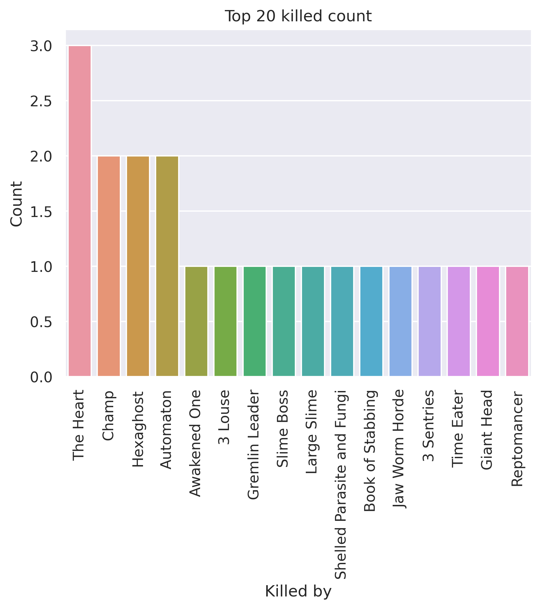
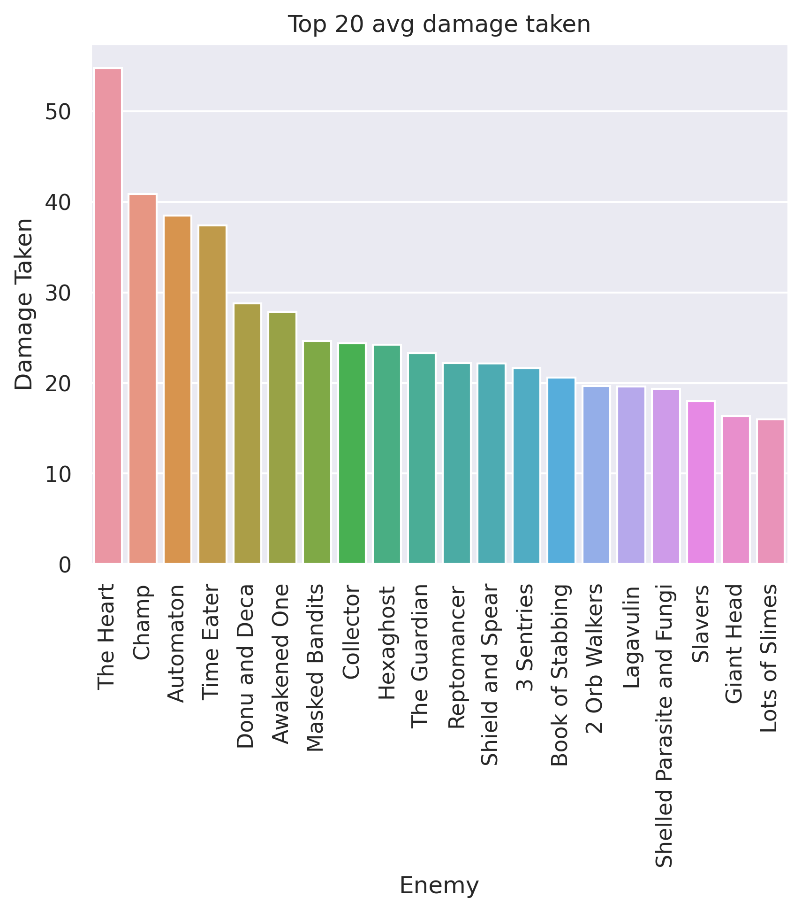
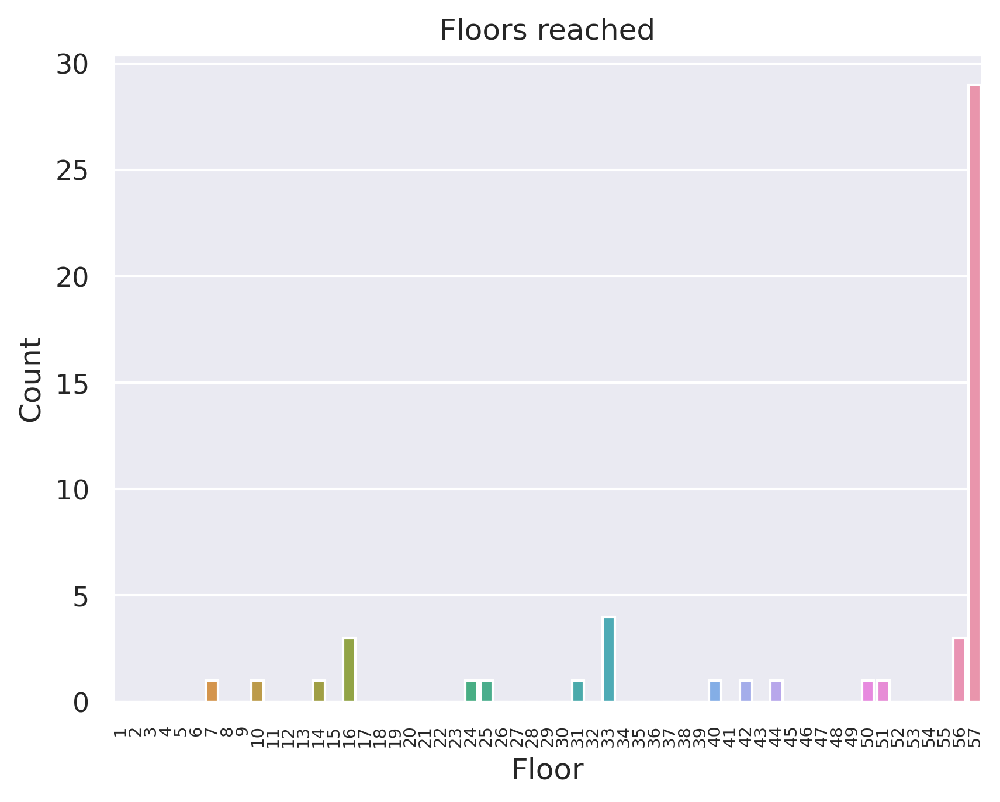
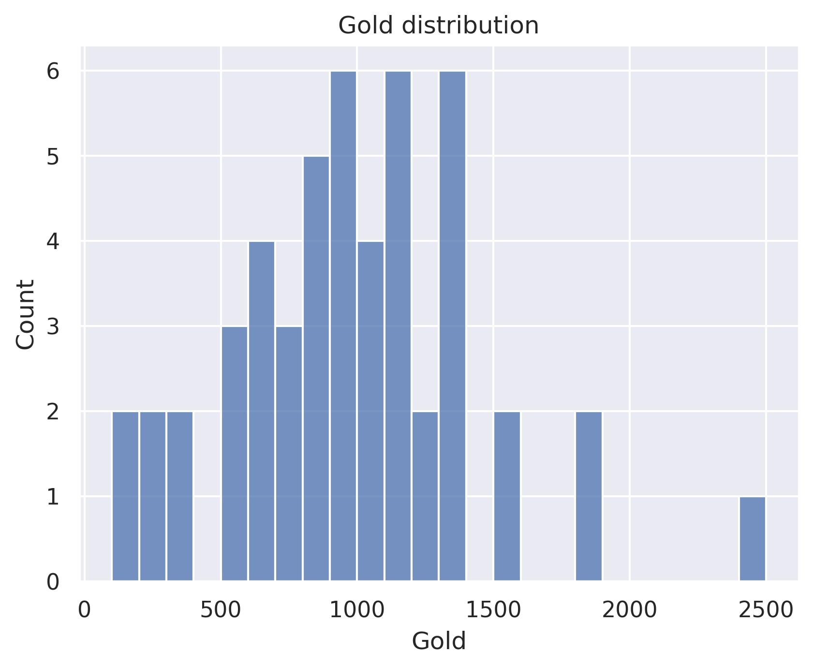

# 200 rotating sample - Ironclad
## General stats
- Total games played: 50
- Win rate (%): 58.0
- Avg playtime (mins): 82.92
- Avg floor reached: 46.78
- Max score: 3632
- Times rest: 1.3
- Times smith: 5.18
- Max hp >= 80: 27
- Max hp <= 40: 2

### Top 10 damage taken fights (excluding heart)
| Enemy        |   Damage Taken |
|--------------|----------------|
| Awakened One |            117 |
| Time Eater   |            108 |
| Champ        |            107 |
| Champ        |             97 |
| Time Eater   |             90 |
| Giant Head   |             86 |
| Time Eater   |             85 |
| Reptomancer  |             83 |
| Automaton    |             79 |
| Awakened One |             78 |

## Card stats
### Top 10 card removed count
| Card        |   Count |
|-------------|---------|
| Strike_R    |      64 |
| Regret      |       5 |
| Bash        |       5 |
| Doubt       |       4 |
| Anger       |       3 |
| Decay       |       2 |
| Bite        |       1 |
| Twin Strike |       1 |
| Cleave      |       1 |
| Headbutt    |       1 |

### Top 80 card win rate (exclude duplicate)
| Card              |   Win rate |     | Card             |   Win rate |
|-------------------|------------|-----|------------------|------------|
| Heavy Blade       |       1    |     | Ghostly Armor    |       0.71 |
| Clumsy            |       1    |     | Sword Boomerang  |       0.71 |
| Havoc             |       1    |     | Uppercut         |       0.71 |
| Purity            |       1    |     | Rupture          |       0.71 |
| Finesse           |       1    |     | Second Wind      |       0.71 |
| PanicButton       |       1    |     | Headbutt         |       0.71 |
| Entrench          |       1    |     | Reaper           |       0.71 |
| Panache           |       1    |     | Dual Wield       |       0.7  |
| Dramatic Entrance |       1    |     | Impervious       |       0.67 |
| Mayhem            |       1    |     | Perfected Strike |       0.67 |
| Decay             |       1    |     | Power Through    |       0.67 |
| Secret Technique  |       1    |     | Double Tap       |       0.67 |
| Dark Shackles     |       1    |     | Thunderclap      |       0.67 |
| Madness           |       1    |     | Twin Strike      |       0.67 |
| Necronomicurse    |       1    |     | Immolate         |       0.64 |
| Berserk           |       1    |     | Fiend Fire       |       0.64 |
| Apparition        |       1    |     | Feed             |       0.63 |
| J.A.X.            |       1    |     | Battle Trance    |       0.62 |
| Demon Form        |       0.88 |     | Shrug It Off     |       0.62 |
| Flex              |       0.86 |     | Armaments        |       0.62 |
| Flame Barrier     |       0.85 |     | Evolve           |       0.61 |
| True Grit         |       0.83 |     | Rampage          |       0.6  |
| Body Slam         |       0.83 |     | Metallicize      |       0.6  |
| Warcry            |       0.83 |     | Anger            |       0.6  |
| Seeing Red        |       0.81 |     | Barricade        |       0.6  |
| Offering          |       0.81 |     | Inflame          |       0.58 |
| Corruption        |       0.81 |     | Whirlwind        |       0.57 |
| Apotheosis        |       0.8  |     | Cleave           |       0.57 |
| Limit Break       |       0.8  |     | Pommel Strike    |       0.57 |
| Pummel            |       0.8  |     | Combust          |       0.57 |
| Exhume            |       0.79 |     | Strike_R         |       0.56 |
| Disarm            |       0.77 |     | Carnage          |       0.56 |
| Bloodletting      |       0.76 |     | Hemokinesis      |       0.56 |
| Burning Pact      |       0.76 |     | Clothesline      |       0.55 |
| Feel No Pain      |       0.76 |     | Bash             |       0.55 |
| Sentinel          |       0.75 |     | Defend_R         |       0.54 |
| Shockwave         |       0.75 |     | Reckless Charge  |       0.5  |
| Dark Embrace      |       0.74 |     | RitualDagger     |       0.5  |
| Blood for Blood   |       0.73 |     | Blind            |       0.5  |
| Spot Weakness     |       0.73 |     | Trip             |       0.5  |

### Card pick rate act 1 (exclude boss)
| Card            |   Pick rate |     | Card             |   Pick rate |
|-----------------|-------------|-----|------------------|-------------|
| Fiend Fire      |        1    |     | Dark Embrace     |        0.32 |
| Shockwave       |        1    |     | Twin Strike      |        0.32 |
| Immolate        |        1    |     | Rage             |        0.29 |
| Impervious      |        1    |     | Combust          |        0.29 |
| Secret Weapon   |        1    |     | Rampage          |        0.27 |
| Offering        |        1    |     | Uppercut         |        0.27 |
| Panacea         |        1    |     | Burning Pact     |        0.25 |
| Trip            |        1    |     | Seeing Red       |        0.25 |
| Feed            |        1    |     | Headbutt         |        0.23 |
| Whirlwind       |        0.85 |     | Infernal Blade   |        0.22 |
| Reaper          |        0.8  |     | Perfected Strike |        0.19 |
| Blood for Blood |        0.77 |     | Dropkick         |        0.18 |
| Second Wind     |        0.7  |     | Sever Soul       |        0.17 |
| Pommel Strike   |        0.67 |     | Rupture          |        0.17 |
| Demon Form      |        0.67 |     | Cleave           |        0.15 |
| Corruption      |        0.67 |     | SKIP             |        0.14 |
| Brutality       |        0.67 |     | Clothesline      |        0.14 |
| Double Tap      |        0.6  |     | Flex             |        0.12 |
| Battle Trance   |        0.6  |     | Intimidate       |        0.08 |
| Feel No Pain    |        0.6  |     | Reckless Charge  |        0.07 |
| Inflame         |        0.58 |     | Entrench         |        0.06 |
| Shrug It Off    |        0.56 |     | Thunderclap      |        0.05 |
| Evolve          |        0.55 |     | Wild Strike      |        0.03 |
| Hemokinesis     |        0.54 |     | Heavy Blade      |        0.03 |
| Power Through   |        0.53 |     | Havoc            |        0.02 |
| Disarm          |        0.5  |     | Body Slam        |        0.02 |
| Carnage         |        0.5  |     | Warcry           |        0.02 |
| Flame Barrier   |        0.5  |     | Searing Blow     |        0    |
| Bandage Up      |        0.5  |     | Dual Wield       |        0    |
| Anger           |        0.49 |     | Berserk          |        0    |
| Bludgeon        |        0.43 |     | Clash            |        0    |
| Spot Weakness   |        0.42 |     | True Grit        |        0    |
| Barricade       |        0.4  |     | Deep Breath      |        0    |
| Metallicize     |        0.4  |     | Thinking Ahead   |        0    |
| Armaments       |        0.39 |     | Mayhem           |        0    |
| Exhume          |        0.38 |     | Sword Boomerang  |        0    |
| Bloodletting    |        0.36 |     | Fire Breathing   |        0    |
| Limit Break     |        0.33 |     | Forethought      |        0    |
| Ghostly Armor   |        0.33 |     | Sentinel         |        0    |
| Pummel          |        0.33 |     | Juggernaut       |        0    |
| Iron Wave       |        0.32 |     | Impatience       |        0    |

### Card pick rate after act 1 (exclude boss)
| Card             |   Pick rate |     | Card               |   Pick rate |
|------------------|-------------|-----|--------------------|-------------|
| Flash of Steel   |        1    |     | Inflame            |        0.12 |
| Finesse          |        1    |     | Singing Bowl       |        0.12 |
| PanicButton      |        1    |     | Ghostly Armor      |        0.12 |
| Discovery        |        1    |     | Sword Boomerang    |        0.12 |
| Offering         |        1    |     | Armaments          |        0.1  |
| Secret Technique |        1    |     | Clothesline        |        0.08 |
| Impervious       |        1    |     | Metallicize        |        0.08 |
| Exhume           |        0.91 |     | Headbutt           |        0.08 |
| Shockwave        |        0.8  |     | Havoc              |        0.07 |
| Disarm           |        0.76 |     | Heavy Blade        |        0.05 |
| Power Through    |        0.74 |     | Intimidate         |        0.04 |
| Corruption       |        0.73 |     | Perfected Strike   |        0.04 |
| Feed             |        0.71 |     | Combust            |        0.04 |
| Battle Trance    |        0.68 |     | Rupture            |        0.04 |
| Burning Pact     |        0.67 |     | Twin Strike        |        0.03 |
| Fiend Fire       |        0.67 |     | Iron Wave          |        0.02 |
| Double Tap       |        0.67 |     | Cleave             |        0.01 |
| Barricade        |        0.62 |     | Searing Blow       |        0    |
| Reaper           |        0.6  |     | Anger              |        0    |
| Dark Embrace     |        0.58 |     | Secret Weapon      |        0    |
| Feel No Pain     |        0.57 |     | Sadistic Nature    |        0    |
| Shrug It Off     |        0.56 |     | The Bomb           |        0    |
| Second Wind      |        0.55 |     | Thunderclap        |        0    |
| Dual Wield       |        0.44 |     | Trip               |        0    |
| Bloodletting     |        0.43 |     | Swift Strike       |        0    |
| Evolve           |        0.4  |     | Impatience         |        0    |
| Sentinel         |        0.38 |     | Reckless Charge    |        0    |
| Flame Barrier    |        0.37 |     | Rampage            |        0    |
| Pummel           |        0.35 |     | Bandage Up         |        0    |
| Seeing Red       |        0.35 |     | Berserk            |        0    |
| Blind            |        0.33 |     | Bludgeon           |        0    |
| Uppercut         |        0.31 |     | Carnage            |        0    |
| Pommel Strike    |        0.3  |     | Clash              |        0    |
| Whirlwind        |        0.29 |     | Deep Breath        |        0    |
| Blood for Blood  |        0.29 |     | Demon Form         |        0    |
| Rage             |        0.29 |     | Dramatic Entrance  |        0    |
| Spot Weakness    |        0.29 |     | Enlightenment      |        0    |
| True Grit        |        0.28 |     | Fire Breathing     |        0    |
| SKIP             |        0.27 |     | Flex               |        0    |
| Purity           |        0.25 |     | Forethought        |        0    |
| Immolate         |        0.22 |     | Hemokinesis        |        0    |
| Warcry           |        0.21 |     | Apotheosis         |        0    |
| Brutality        |        0.2  |     | Infernal Blade     |        0    |
| Entrench         |        0.18 |     | Jack Of All Trades |        0    |
| Limit Break      |        0.17 |     | Madness            |        0    |
| Juggernaut       |        0.17 |     | Mayhem             |        0    |
| Body Slam        |        0.15 |     | Mind Blast         |        0    |
| Dropkick         |        0.14 |     | Wild Strike        |        0    |
| Sever Soul       |        0.14 |     |   |   |

## Relic stats
### Top relic win rate
| Relic             |   Win rate |     | Relic              |   Win rate |
|-------------------|------------|-----|--------------------|------------|
| Mango             |          1 |     | Prayer Wheel       |       1    |
| SacredBark        |          1 |     | Bloody Idol        |       1    |
| Ice Cream         |          1 |     | Juzu Bracelet      |       1    |
| ClockworkSouvenir |          1 |     | White Beast Statue |       1    |
| Pocketwatch       |          1 |     | Mark of Pain       |       1    |
| Magic Flower      |          1 |     | WarpedTongs        |       1    |
| Pandora's Box     |          1 |     | TungstenRod        |       1    |
| Orrery            |          1 |     | Bird Faced Urn     |       1    |
| Ornamental Fan    |          1 |     | Lee's Waffle       |       1    |
| Ectoplasm         |          1 |     | Kunai              |       1    |
| Nilry's Codex     |          1 |     | Thread and Needle  |       1    |
| NeowsBlessing     |          1 |     | Medical Kit        |       1    |
| FossilizedHelix   |          1 |     | Strange Spoon      |       1    |
| Necronomicon      |          1 |     | Snecko Eye         |       1    |
| MutagenicStrength |          1 |     | Shovel             |       1    |
| Gambling Chip     |          1 |     | SlaversCollar      |       1    |
| Ginger            |          1 |     | Runic Pyramid      |       0.92 |
| Meat on the Bone  |          1 |     | Happy Flower       |       0.92 |
| HandDrill         |          1 |     | Anchor             |       0.91 |
| Runic Dome        |          1 |     | Self Forming Clay  |       0.9  |

### Bottom relic win rate
| Relic              |   Win rate |     | Relic               |   Win rate |
|--------------------|------------|-----|---------------------|------------|
| Unceasing Top      |       0.62 |     | Champion Belt       |       0.5  |
| Oddly Smooth Stone |       0.62 |     | Orichalcum          |       0.5  |
| Cursed Key         |       0.6  |     | Red Mask            |       0.5  |
| Omamori            |       0.6  |     | Du-Vu Doll          |       0.5  |
| Burning Blood      |       0.57 |     | DollysMirror        |       0.5  |
| Smiling Mask       |       0.57 |     | War Paint           |       0.43 |
| Question Card      |       0.57 |     | Matryoshka          |       0.43 |
| Shuriken           |       0.57 |     | Runic Cube          |       0.4  |
| Coffee Dripper     |       0.56 |     | Regal Pillow        |       0.4  |
| Centennial Puzzle  |       0.56 |     | Boot                |       0.33 |
| Art of War         |       0.53 |     | OrangePellets       |       0.33 |
| Incense Burner     |       0.5  |     | Tiny Chest          |       0.33 |
| Blue Candle        |       0.5  |     | Philosopher's Stone |       0.33 |
| Brimstone          |       0.5  |     | MealTicket          |       0.33 |
| Golden Idol        |       0.5  |     | Peace Pipe          |       0    |
| Turnip             |       0.5  |     | Odd Mushroom        |       0    |
| Empty Cage         |       0.5  |     | Sling               |       0    |
| Vajra              |       0.5  |     | Singing Bowl        |       0    |
| Velvet Choker      |       0.5  |     | Calling Bell        |       0    |
| CeramicFish        |       0.5  |     | Sozu                |       0    |

### Act 1 boss relic pick rate
| Relic               |   Pick rate |     | Relic         |   Pick rate |
|---------------------|-------------|-----|---------------|-------------|
| Snecko Eye          |        1    |     | Sozu          |        0.25 |
| Runic Pyramid       |        0.83 |     | SlaversCollar |        0.2  |
| Fusion Hammer       |        0.8  |     | Mark of Pain  |        0.17 |
| Coffee Dripper      |        0.78 |     | Empty Cage    |        0.14 |
| Pandora's Box       |        0.5  |     | Ectoplasm     |        0.11 |
| Philosopher's Stone |        0.4  |     | Black Blood   |        0    |
| Velvet Choker       |        0.4  |     | Calling Bell  |        0    |
| Black Star          |        0.4  |     | Runic Dome    |        0    |
| Cursed Key          |        0.38 |     | Busted Crown  |        0    |
| Astrolabe           |        0.33 |     | SacredBark    |        0    |
| Runic Cube          |        0.25 |     | Tiny House    |        0    |

### Act 1 boss relic win rate
| Relic         |   Win rate |     | Relic               |   Win rate |
|---------------|------------|-----|---------------------|------------|
| Astrolabe     |       1    |     | Coffee Dripper      |       0.57 |
| Ectoplasm     |       1    |     | Black Star          |       0.5  |
| Mark of Pain  |       1    |     | Runic Cube          |       0.5  |
| Pandora's Box |       1    |     | Velvet Choker       |       0.5  |
| Runic Pyramid |       1    |     | Cursed Key          |       0.33 |
| SlaversCollar |       1    |     | Empty Cage          |       0    |
| Snecko Eye    |       1    |     | Philosopher's Stone |       0    |
| Fusion Hammer |       0.75 |     | Sozu                |       0    |

### Act 2 boss relic pick rate
| Relic               |   Pick rate |     | Relic         |   Pick rate |
|---------------------|-------------|-----|---------------|-------------|
| Runic Pyramid       |        0.8  |     | Empty Cage    |        0.25 |
| Fusion Hammer       |        0.71 |     | Calling Bell  |        0.2  |
| SlaversCollar       |        0.67 |     | Black Star    |        0.14 |
| Coffee Dripper      |        0.67 |     | Snecko Eye    |        0.14 |
| Mark of Pain        |        0.67 |     | Runic Dome    |        0.12 |
| Astrolabe           |        0.5  |     | Black Blood   |        0    |
| Philosopher's Stone |        0.5  |     | Busted Crown  |        0    |
| Pandora's Box       |        0.5  |     | Sozu          |        0    |
| Cursed Key          |        0.4  |     | Tiny House    |        0    |
| Runic Cube          |        0.38 |     | Velvet Choker |        0    |
| SacredBark          |        0.33 |     |   |   |

### Act 2 boss relic win rate
| Relic               |   Win rate |     | Relic          |   Win rate |
|---------------------|------------|-----|----------------|------------|
| Black Star          |          1 |     | SlaversCollar  |       1    |
| Cursed Key          |          1 |     | Snecko Eye     |       1    |
| Empty Cage          |          1 |     | Runic Pyramid  |       0.88 |
| Mark of Pain        |          1 |     | Fusion Hammer  |       0.6  |
| Pandora's Box       |          1 |     | Coffee Dripper |       0.5  |
| Philosopher's Stone |          1 |     | Runic Cube     |       0.33 |
| Runic Dome          |          1 |     | Astrolabe      |       0    |
| SacredBark          |          1 |     | Calling Bell   |       0    |

