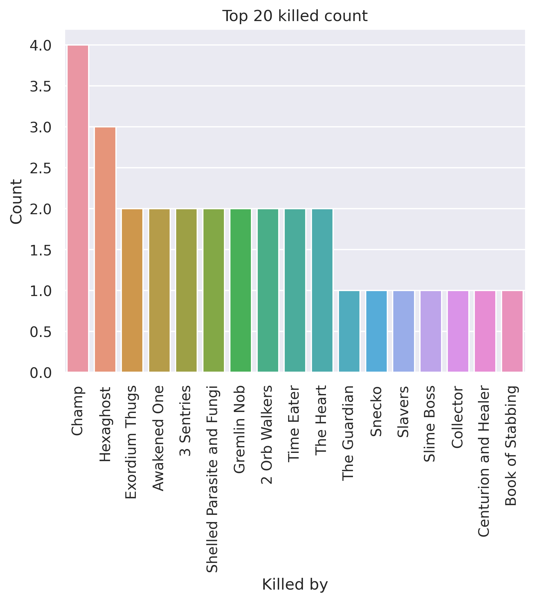
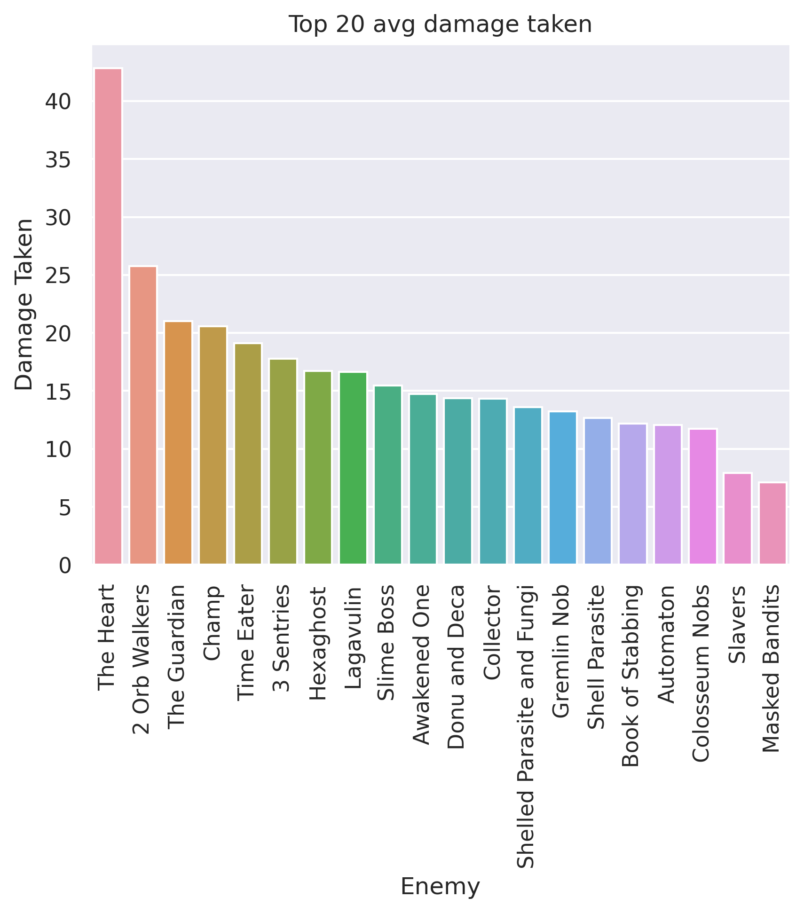
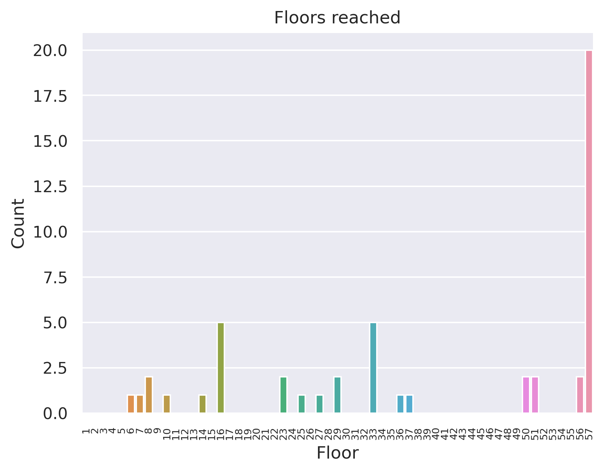
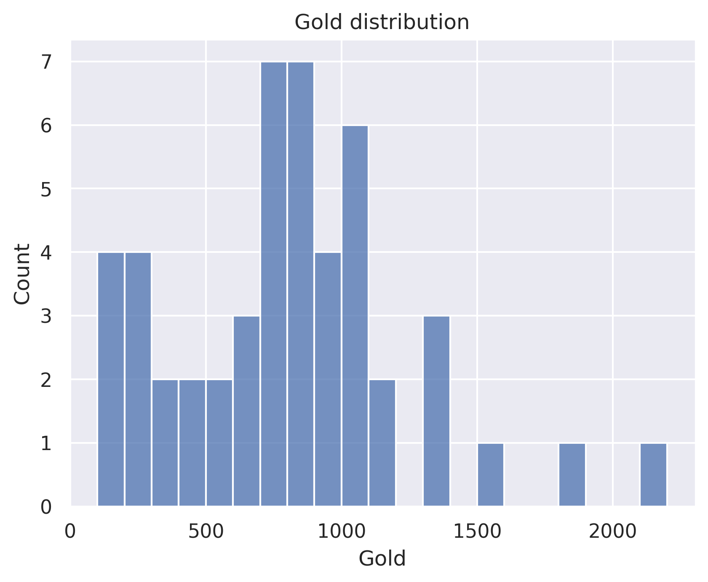

# 200 rotating sample - Silent
## General stats
- Total games played: 50
- Win rate (%): 40.0
- Avg playtime (mins): 77.39
- Avg floor reached: 39.62
- Max score: 3595
- Times rest: 1.42
- Times smith: 4.5
- Max hp >= 80: 9
- Max hp <= 40: 6

### Top 10 damage taken fights (excluding heart)
| Enemy         |   Damage Taken |
|---------------|----------------|
| 2 Orb Walkers |             84 |
| Champ         |             75 |
| Time Eater    |             73 |
| Champ         |             67 |
| 2 Orb Walkers |             66 |
| Collector     |             58 |
| Slime Boss    |             56 |
| Donu and Deca |             55 |
| Lagavulin     |             54 |
| The Guardian  |             52 |

## Card stats
### Top 10 card removed count
| Card          |   Count |
|---------------|---------|
| Strike_G      |      40 |
| Defend_G      |      10 |
| Regret        |       5 |
| Pain          |       4 |
| Deadly Poison |       3 |
| Dagger Spray  |       3 |
| Doubt         |       2 |
| Writhe        |       2 |
| Normality     |       2 |
| Unload        |       1 |

### Top 80 card win rate (exclude duplicate)
| Card               |   Win rate |     | Card               |   Win rate |
|--------------------|------------|-----|--------------------|------------|
| Writhe             |       1    |     | Dramatic Entrance  |       0.5  |
| Swift Strike       |       1    |     | Deflect            |       0.5  |
| Impatience         |       1    |     | Envenom            |       0.5  |
| Secret Technique   |       1    |     | Predator           |       0.5  |
| Master of Strategy |       1    |     | Quick Slash        |       0.5  |
| The Bomb           |       1    |     | PanicButton        |       0.5  |
| Glass Knife        |       0.83 |     | Underhanded Strike |       0.5  |
| Burst              |       0.83 |     | Backflip           |       0.5  |
| Apotheosis         |       0.8  |     | Madness            |       0.5  |
| Night Terror       |       0.77 |     | Leg Sweep          |       0.47 |
| Wraith Form        |       0.75 |     | Prepared           |       0.46 |
| Finisher           |       0.75 |     | Doppelganger       |       0.45 |
| Dark Shackles      |       0.75 |     | Bouncing Flask     |       0.44 |
| Tools of the Trade |       0.71 |     | Backstab           |       0.44 |
| Blur               |       0.71 |     | Concentrate        |       0.43 |
| Setup              |       0.67 |     | Bullet Time        |       0.43 |
| Caltrops           |       0.67 |     | Dash               |       0.43 |
| Malaise            |       0.67 |     | PiercingWail       |       0.42 |
| Eviscerate         |       0.67 |     | Blade Dance        |       0.42 |
| Corpse Explosion   |       0.67 |     | Choke              |       0.4  |
| Flechettes         |       0.67 |     | Survivor           |       0.4  |
| Escape Plan        |       0.64 |     | Neutralize         |       0.39 |
| Well Laid Plans    |       0.63 |     | Skewer             |       0.38 |
| Footwork           |       0.62 |     | Catalyst           |       0.38 |
| Endless Agony      |       0.62 |     | Deadly Poison      |       0.36 |
| Calculated Gamble  |       0.62 |     | Dagger Spray       |       0.36 |
| Reflex             |       0.62 |     | Crippling Poison   |       0.36 |
| After Image        |       0.61 |     | Noxious Fumes      |       0.36 |
| Grand Finale       |       0.6  |     | Defend_G           |       0.35 |
| Outmaneuver        |       0.6  |     | RitualDagger       |       0.33 |
| Phantasmal Killer  |       0.6  |     | Infinite Blades    |       0.33 |
| Expertise          |       0.6  |     | Strike_G           |       0.31 |
| Tactician          |       0.59 |     | Dagger Throw       |       0.29 |
| Terror             |       0.58 |     | Flying Knee        |       0.27 |
| Die Die Die        |       0.57 |     | Sucker Punch       |       0.25 |
| Accuracy           |       0.57 |     | A Thousand Cuts    |       0.2  |
| Dodge and Roll     |       0.56 |     | Poisoned Stab      |       0.18 |
| Alchemize          |       0.55 |     | Apparition         |       0.17 |
| Adrenaline         |       0.54 |     | Slice              |       0.12 |
| Acrobatics         |       0.53 |     | Bite               |       0    |

### Card pick rate act 1 (exclude boss)
| Card               |   Pick rate |     | Card              |   Pick rate |
|--------------------|-------------|-----|-------------------|-------------|
| A Thousand Cuts    |        1    |     | Night Terror      |        0.25 |
| Dramatic Entrance  |        1    |     | Storm of Steel    |        0.25 |
| The Bomb           |        1    |     | Flying Knee       |        0.24 |
| Swift Strike       |        1    |     | Footwork          |        0.22 |
| Master of Strategy |        1    |     | Infinite Blades   |        0.21 |
| Madness            |        1    |     | Choke             |        0.21 |
| HandOfGreed        |        1    |     | Unload            |        0.2  |
| Envenom            |        1    |     | Escape Plan       |        0.2  |
| Glass Knife        |        1    |     | Prepared          |        0.18 |
| Wraith Form        |        1    |     | Cloak And Dagger  |        0.16 |
| Adrenaline         |        1    |     | Slice             |        0.14 |
| After Image        |        1    |     | Sucker Punch      |        0.14 |
| Alchemize          |        1    |     | SKIP              |        0.11 |
| Terror             |        0.86 |     | Concentrate       |        0.08 |
| Tools of the Trade |        0.83 |     | Catalyst          |        0.08 |
| Die Die Die        |        0.83 |     | Caltrops          |        0.07 |
| Calculated Gamble  |        0.79 |     | Accuracy          |        0.06 |
| Predator           |        0.75 |     | Riddle With Holes |        0.06 |
| Bouncing Flask     |        0.71 |     | Flechettes        |        0.05 |
| Acrobatics         |        0.65 |     | Quick Slash       |        0.05 |
| Backstab           |        0.64 |     | Dodge and Roll    |        0.02 |
| Masterful Stab     |        0.64 |     | Trip              |        0    |
| Noxious Fumes      |        0.62 |     | Setup             |        0    |
| Malaise            |        0.6  |     | Secret Technique  |        0    |
| Blade Dance        |        0.59 |     | Violence          |        0    |
| Dagger Spray       |        0.58 |     | Secret Weapon     |        0    |
| Leg Sweep          |        0.55 |     | Bandage Up        |        0    |
| Well Laid Plans    |        0.55 |     | Purity            |        0    |
| Eviscerate         |        0.53 |     | Phantasmal Killer |        0    |
| Backflip           |        0.52 |     | Blur              |        0    |
| Bullet Time        |        0.5  |     | Burst             |        0    |
| Dark Shackles      |        0.5  |     | Deflect           |        0    |
| Crippling Poison   |        0.42 |     | Distraction       |        0    |
| Dagger Throw       |        0.4  |     | Doppelganger      |        0    |
| Reflex             |        0.38 |     | Enlightenment     |        0    |
| Endless Agony      |        0.36 |     | Expertise         |        0    |
| Underhanded Strike |        0.36 |     | Finisher          |        0    |
| PiercingWail       |        0.36 |     | Forethought       |        0    |
| Poisoned Stab      |        0.35 |     | Good Instincts    |        0    |
| Dash               |        0.33 |     | Grand Finale      |        0    |
| Deadly Poison      |        0.3  |     | Bane              |        0    |
| Tactician          |        0.29 |     | Mayhem            |        0    |
| Skewer             |        0.27 |     | Outmaneuver       |        0    |
| Singing Bowl       |        0.26 |     | Panacea           |        0    |
| All Out Attack     |        0.25 |     | Heel Hook         |        0    |

### Card pick rate after act 1 (exclude boss)
| Card               |   Pick rate |     | Card               |   Pick rate |
|--------------------|-------------|-----|--------------------|-------------|
| Dark Shackles      |        1    |     | Finisher           |        0.11 |
| Thinking Ahead     |        1    |     | Deflect            |        0.11 |
| Adrenaline         |        1    |     | Dodge and Roll     |        0.11 |
| Impatience         |        1    |     | Bouncing Flask     |        0.1  |
| Apotheosis         |        1    |     | Deadly Poison      |        0.08 |
| PanicButton        |        1    |     | Backstab           |        0.06 |
| After Image        |        0.9  |     | Masterful Stab     |        0.06 |
| Calculated Gamble  |        0.84 |     | Riddle With Holes  |        0.06 |
| Acrobatics         |        0.84 |     | Flechettes         |        0.05 |
| Alchemize          |        0.83 |     | Dagger Spray       |        0.05 |
| Night Terror       |        0.8  |     | Flying Knee        |        0.05 |
| Doppelganger       |        0.75 |     | All Out Attack     |        0.05 |
| Burst              |        0.75 |     | Endless Agony      |        0.05 |
| Wraith Form        |        0.71 |     | Dagger Throw       |        0.04 |
| Malaise            |        0.67 |     | Sucker Punch       |        0.04 |
| Tools of the Trade |        0.67 |     | Cloak And Dagger   |        0.03 |
| Backflip           |        0.66 |     | Slice              |        0.02 |
| PiercingWail       |        0.61 |     | Poisoned Stab      |        0.02 |
| Leg Sweep          |        0.58 |     | Quick Slash        |        0.02 |
| Reflex             |        0.52 |     | Chrysalis          |        0    |
| Tactician          |        0.52 |     | Storm of Steel     |        0    |
| Bullet Time        |        0.5  |     | Jack Of All Trades |        0    |
| Well Laid Plans    |        0.5  |     | Die Die Die        |        0    |
| Phantasmal Killer  |        0.5  |     | The Bomb           |        0    |
| Corpse Explosion   |        0.5  |     | Blind              |        0    |
| Catalyst           |        0.47 |     | Bane               |        0    |
| Footwork           |        0.44 |     | Bandage Up         |        0    |
| Escape Plan        |        0.41 |     | Unload             |        0    |
| Terror             |        0.35 |     | Violence           |        0    |
| Madness            |        0.33 |     | Choke              |        0    |
| Eviscerate         |        0.33 |     | Distraction        |        0    |
| Predator           |        0.33 |     | Discovery          |        0    |
| Blur               |        0.32 |     | Magnetism          |        0    |
| Concentrate        |        0.32 |     | Dramatic Entrance  |        0    |
| Crippling Poison   |        0.31 |     | Purity             |        0    |
| Prepared           |        0.27 |     | Enlightenment      |        0    |
| Singing Bowl       |        0.26 |     | Envenom            |        0    |
| SKIP               |        0.24 |     | Forethought        |        0    |
| Expertise          |        0.19 |     | Glass Knife        |        0    |
| Outmaneuver        |        0.18 |     | Good Instincts     |        0    |
| Dash               |        0.18 |     | Grand Finale       |        0    |
| Blade Dance        |        0.17 |     | HandOfGreed        |        0    |
| Setup              |        0.16 |     | Mind Blast         |        0    |
| Noxious Fumes      |        0.14 |     | Heel Hook          |        0    |
| Underhanded Strike |        0.13 |     | Master of Strategy |        0    |
| Accuracy           |        0.13 |     | Infinite Blades    |        0    |
| Skewer             |        0.12 |     | A Thousand Cuts    |        0    |
| Caltrops           |        0.11 |     |   |   |

## Relic stats
### Top relic win rate
| Relic               |   Win rate |     | Relic             |   Win rate |
|---------------------|------------|-----|-------------------|------------|
| WristBlade          |          1 |     | Molten Egg 2      |       1    |
| The Specimen        |          1 |     | Pen Nib           |       1    |
| Snecko Eye          |          1 |     | OrangePellets     |       1    |
| Tiny Chest          |          1 |     | Blue Candle       |       1    |
| Medical Kit         |          1 |     | WarpedTongs       |       1    |
| Tingsha             |          1 |     | TwistedFunnel     |       1    |
| Chemical X          |          1 |     | Pocketwatch       |       1    |
| TheAbacus           |          1 |     | Unceasing Top     |       1    |
| MealTicket          |          1 |     | Tough Bandages    |       1    |
| Busted Crown        |          1 |     | Bronze Scales     |       0.88 |
| Mark of the Bloom   |          1 |     | Meat on the Bone  |       0.86 |
| Du-Vu Doll          |          1 |     | StoneCalendar     |       0.86 |
| Ring of the Serpent |          1 |     | Whetstone         |       0.86 |
| Eternal Feather     |          1 |     | Mummified Hand    |       0.86 |
| Kunai               |          1 |     | TungstenRod       |       0.86 |
| SacredBark          |          1 |     | Sundial           |       0.83 |
| Torii               |          1 |     | Thread and Needle |       0.83 |
| Toolbox             |          1 |     | Runic Pyramid     |       0.83 |
| Black Star          |          1 |     | Fusion Hammer     |       0.83 |
| Nloth's Gift        |          1 |     | Pear              |       0.8  |

### Bottom relic win rate
| Relic              |   Win rate |     | Relic               |   Win rate |
|--------------------|------------|-----|---------------------|------------|
| WingedGreaves      |       0.5  |     | Ice Cream           |       0.29 |
| Bottled Flame      |       0.5  |     | Peace Pipe          |       0.29 |
| Empty Cage         |       0.5  |     | Coffee Dripper      |       0.29 |
| Art of War         |       0.45 |     | Regal Pillow        |       0.25 |
| Bag of Marbles     |       0.45 |     | Potion Belt         |       0.22 |
| StrikeDummy        |       0.43 |     | Darkstone Periapt   |       0.2  |
| CeramicFish        |       0.4  |     | Golden Idol         |       0.17 |
| War Paint          |       0.4  |     | NeowsBlessing       |       0.14 |
| Blood Vial         |       0.4  |     | Velvet Choker       |       0    |
| Bottled Lightning  |       0.4  |     | Bloody Idol         |       0    |
| SlaversCollar      |       0.4  |     | Orrery              |       0    |
| Paper Crane        |       0.4  |     | Toxic Egg 2         |       0    |
| Gremlin Horn       |       0.38 |     | Calipers            |       0    |
| Oddly Smooth Stone |       0.36 |     | CaptainsWheel       |       0    |
| Ring of the Snake  |       0.34 |     | Ectoplasm           |       0    |
| Girya              |       0.33 |     | Sling               |       0    |
| Strawberry         |       0.33 |     | GremlinMask         |       0    |
| Ornamental Fan     |       0.33 |     | Odd Mushroom        |       0    |
| Question Card      |       0.33 |     | Philosopher's Stone |       0    |
| Cauldron           |       0.33 |     | Sozu                |       0    |

### Act 1 boss relic pick rate
| Relic               |   Pick rate |     | Relic         |   Pick rate |
|---------------------|-------------|-----|---------------|-------------|
| Runic Pyramid       |        1    |     | Empty Cage    |        0.2  |
| Ring of the Serpent |        1    |     | Black Star    |        0.17 |
| Pandora's Box       |        0.88 |     | Snecko Eye    |        0.17 |
| Philosopher's Stone |        0.8  |     | Velvet Choker |        0.17 |
| Coffee Dripper      |        0.67 |     | WristBlade    |        0.11 |
| Fusion Hammer       |        0.6  |     | Ectoplasm     |        0    |
| SlaversCollar       |        0.33 |     | Runic Dome    |        0    |
| HoveringKite        |        0.29 |     | Calling Bell  |        0    |
| SacredBark          |        0.29 |     | Busted Crown  |        0    |
| Astrolabe           |        0.25 |     | Sozu          |        0    |
| Cursed Key          |        0.25 |     | Tiny House    |        0    |

### Act 1 boss relic win rate
| Relic               |   Win rate |     | Relic               |   Win rate |
|---------------------|------------|-----|---------------------|------------|
| Black Star          |       1    |     | Fusion Hammer       |       0.67 |
| Cursed Key          |       1    |     | HoveringKite        |       0.5  |
| Ring of the Serpent |       1    |     | Coffee Dripper      |       0.17 |
| SacredBark          |       1    |     | Astrolabe           |       0    |
| Snecko Eye          |       1    |     | Empty Cage          |       0    |
| WristBlade          |       1    |     | Philosopher's Stone |       0    |
| Runic Pyramid       |       0.8  |     | SlaversCollar       |       0    |
| Pandora's Box       |       0.71 |     | Velvet Choker       |       0    |

### Act 2 boss relic pick rate
| Relic               |   Pick rate |     | Relic               |   Pick rate |
|---------------------|-------------|-----|---------------------|-------------|
| SlaversCollar       |        1    |     | Philosopher's Stone |        0.25 |
| Astrolabe           |        0.75 |     | Empty Cage          |        0.2  |
| Cursed Key          |        0.75 |     | WristBlade          |        0.2  |
| HoveringKite        |        0.67 |     | Busted Crown        |        0.14 |
| Fusion Hammer       |        0.6  |     | Black Star          |        0    |
| Runic Pyramid       |        0.5  |     | Calling Bell        |        0    |
| Coffee Dripper      |        0.5  |     | SacredBark          |        0    |
| Ring of the Serpent |        0.43 |     | Snecko Eye          |        0    |
| Runic Dome          |        0.4  |     | Tiny House          |        0    |
| Sozu                |        0.33 |     | Velvet Choker       |        0    |

### Act 2 boss relic win rate
| Relic               |   Win rate |     | Relic               |   Win rate |
|---------------------|------------|-----|---------------------|------------|
| Busted Crown        |          1 |     | HoveringKite        |       0.75 |
| Coffee Dripper      |          1 |     | Astrolabe           |       0.67 |
| Empty Cage          |          1 |     | SlaversCollar       |       0.67 |
| Fusion Hammer       |          1 |     | Runic Dome          |       0.5  |
| Ring of the Serpent |          1 |     | Cursed Key          |       0.33 |
| Runic Pyramid       |          1 |     | Philosopher's Stone |       0    |
| WristBlade          |          1 |     | Sozu                |       0    |

