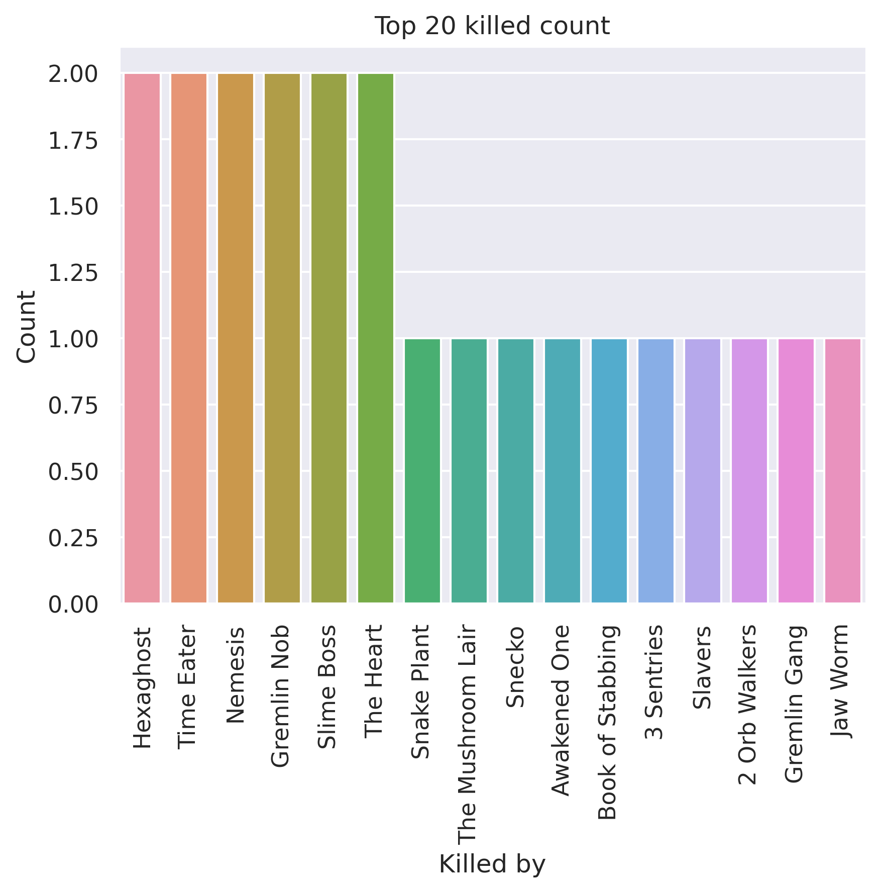
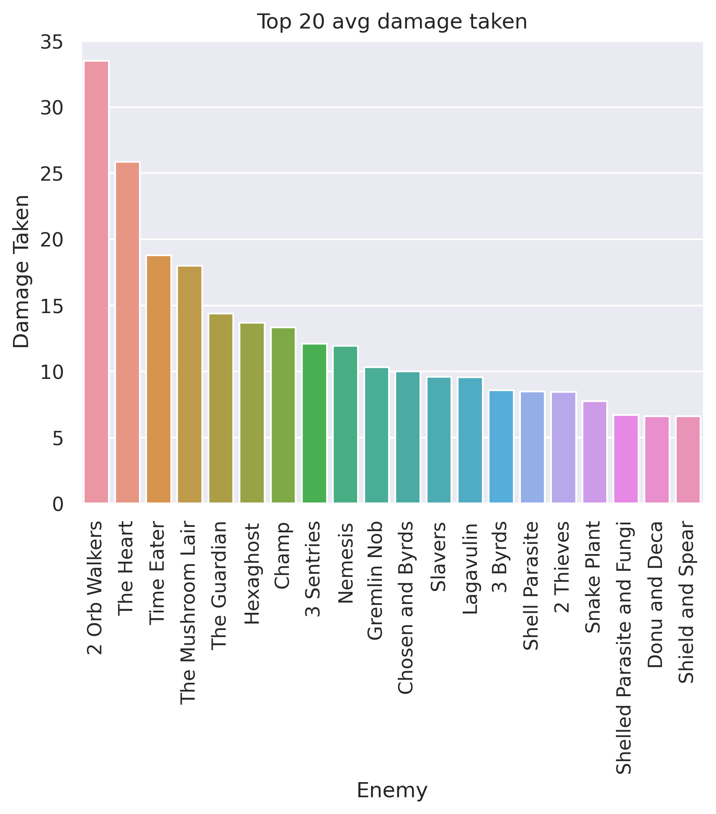
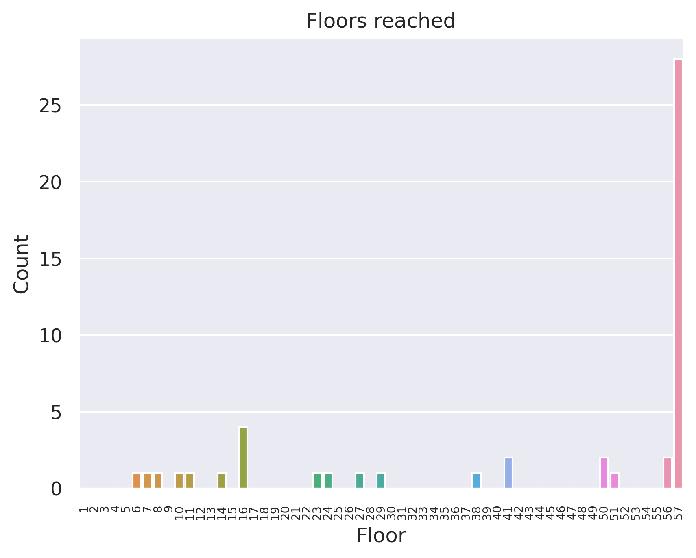
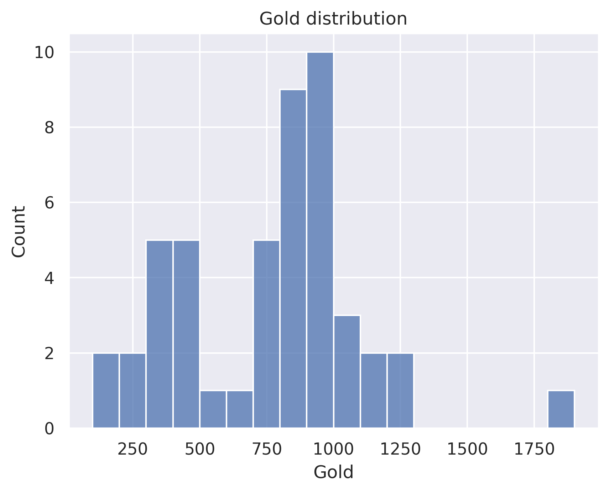

# 200 rotating sample - Watcher
## General stats
- Total games played: 50
- Win rate (%): 56.0
- Avg playtime (mins): 55.29
- Avg floor reached: 44.04
- Max score: 3622
- Times rest: 1.16
- Times smith: 4.48
- Max hp >= 80: 5
- Max hp <= 40: 5

### Top 10 damage taken fights (excluding heart)
| Enemy            |   Damage Taken |
|------------------|----------------|
| 2 Orb Walkers    |            122 |
| Time Eater       |            105 |
| Nemesis          |             79 |
| Gremlin Nob      |             70 |
| Nemesis          |             68 |
| Shield and Spear |             66 |
| Awakened One     |             63 |
| Time Eater       |             61 |
| Lagavulin        |             58 |
| Gremlin Nob      |             56 |

## Card stats
### Top 10 card removed count
| Card          |   Count |
|---------------|---------|
| Defend_P      |      67 |
| Strike_P      |      49 |
| Consecrate    |       3 |
| CrushJoints   |       3 |
| EmptyBody     |       2 |
| FearNoEvil    |       2 |
| Eruption      |       2 |
| WreathOfFlame |       2 |
| BowlingBash   |       2 |
| Judgement     |       1 |

### Top 80 card win rate (exclude duplicate)
| Card               |   Win rate |     | Card             |   Win rate |
|--------------------|------------|-----|------------------|------------|
| LikeWater          |       1    |     | MentalFortress   |       0.62 |
| Swivel             |       1    |     | WheelKick        |       0.6  |
| Alpha              |       1    |     | LessonLearned    |       0.57 |
| Master of Strategy |       1    |     | Consecrate       |       0.57 |
| FollowUp           |       1    |     | CrushJoints      |       0.57 |
| Flash of Steel     |       1    |     | Vigilance        |       0.55 |
| Establishment      |       1    |     | Eruption         |       0.53 |
| PanicButton        |       1    |     | DeusExMachina    |       0.5  |
| Enlightenment      |       1    |     | Wireheading      |       0.5  |
| Perseverance       |       1    |     | Secret Technique |       0.5  |
| SandsOfTime        |       1    |     | JustLucky        |       0.5  |
| Indignation        |       1    |     | SashWhip         |       0.5  |
| HandOfGreed        |       1    |     | RitualDagger     |       0.5  |
| Apparition         |       1    |     | Dark Shackles    |       0.5  |
| BattleHymn         |       1    |     | MasterReality    |       0.5  |
| ConjureBlade       |       1    |     | Evaluate         |       0.5  |
| Worship            |       1    |     | EmptyBody        |       0.5  |
| WindmillStrike     |       1    |     | ForeignInfluence |       0.4  |
| Weave              |       1    |     | FlurryOfBlows    |       0.4  |
| Devotion           |       0.86 |     | Pray             |       0.4  |
| Vault              |       0.83 |     | Study            |       0.4  |
| Crescendo          |       0.8  |     | Strike_P         |       0.38 |
| ClearTheMind       |       0.8  |     | DevaForm         |       0.33 |
| Omniscience        |       0.8  |     | EmptyFist        |       0.31 |
| Scrawl             |       0.79 |     | ReachHeaven      |       0.29 |
| TalkToTheHand      |       0.78 |     | Defend_P         |       0.26 |
| DeceiveReality     |       0.75 |     | Wish             |       0    |
| Ragnarok           |       0.75 |     | Collect          |       0    |
| EmptyMind          |       0.72 |     | Madness          |       0    |
| CutThroughFate     |       0.72 |     | Brilliance       |       0    |
| Tantrum            |       0.71 |     | BowlingBash      |       0    |
| Wallop             |       0.69 |     | CarveReality     |       0    |
| Prostrate          |       0.69 |     | WaveOfTheHand    |       0    |
| FearNoEvil         |       0.69 |     | ThirdEye         |       0    |
| Purity             |       0.67 |     | Vengeance        |       0    |
| Meditate           |       0.67 |     | Conclude         |       0    |
| Blasphemy          |       0.67 |     | Trip             |       0    |
| Adaptation         |       0.66 |     | Necronomicurse   |       0    |
| InnerPeace         |       0.64 |     | CurseOfTheBell   |       0    |
| Halt               |       0.64 |     | SignatureMove    |       0    |

### Card pick rate act 1 (exclude boss)
| Card             |   Pick rate |     | Card          |   Pick rate |
|------------------|-------------|-----|---------------|-------------|
| Scrawl           |        1    |     | Wireheading   |           0 |
| LessonLearned    |        1    |     | Wish          |           0 |
| Adaptation       |        0.85 |     | Swivel        |           0 |
| InnerPeace       |        0.85 |     | Protect       |           0 |
| MentalFortress   |        0.76 |     | ThirdEye      |           0 |
| Tantrum          |        0.75 |     | SashWhip      |           0 |
| FearNoEvil       |        0.69 |     | SandsOfTime   |           0 |
| TalkToTheHand    |        0.68 |     | Vengeance     |           0 |
| Meditate         |        0.62 |     | WaveOfTheHand |           0 |
| EmptyMind        |        0.58 |     | LikeWater     |           0 |
| EmptyFist        |        0.55 |     | Prostrate     |           0 |
| Wallop           |        0.53 |     | Establishment |           0 |
| Blasphemy        |        0.5  |     | BattleHymn    |           0 |
| FlurryOfBlows    |        0.46 |     | BowlingBash   |           0 |
| CutThroughFate   |        0.42 |     | Brilliance    |           0 |
| CarveReality     |        0.42 |     | ClearTheMind  |           0 |
| ReachHeaven      |        0.39 |     | Collect       |           0 |
| SKIP             |        0.34 |     | ConjureBlade  |           0 |
| Singing Bowl     |        0.33 |     | DeusExMachina |           0 |
| WheelKick        |        0.29 |     | DevaForm      |           0 |
| ForeignInfluence |        0.24 |     | Devotion      |           0 |
| Consecrate       |        0.23 |     | EmptyBody     |           0 |
| DeceiveReality   |        0.21 |     | Evaluate      |           0 |
| Conclude         |        0.17 |     | Pray          |           0 |
| SignatureMove    |        0.13 |     | Fasting2      |           0 |
| Crescendo        |        0.13 |     | FlyingSleeves |           0 |
| Weave            |        0.12 |     | FollowUp      |           0 |
| Indignation      |        0.11 |     | JustLucky     |           0 |
| Worship          |        0.09 |     | Alpha         |           0 |
| Halt             |        0.09 |     | MasterReality |           0 |
| Study            |        0.08 |     | Nirvana       |           0 |
| Sanctity         |        0.07 |     | Omniscience   |           0 |
| CrushJoints      |        0.06 |     | PathToVictory |           0 |
| WindmillStrike   |        0.05 |     | Perseverance  |           0 |
| SpiritShield     |        0    |     | WreathOfFlame |           0 |

### Card pick rate after act 1 (exclude boss)
| Card               |   Pick rate |     | Card               |   Pick rate |
|--------------------|-------------|-----|--------------------|-------------|
| Flash of Steel     |        1    |     | Bandage Up         |           0 |
| Vault              |        1    |     | Sadistic Nature    |           0 |
| Scrawl             |        1    |     | Sanctity           |           0 |
| Ragnarok           |        1    |     | SandsOfTime        |           0 |
| PanicButton        |        1    |     | BattleHymn         |           0 |
| Master of Strategy |        0.67 |     | The Bomb           |           0 |
| Adaptation         |        0.65 |     | Violence           |           0 |
| InnerPeace         |        0.6  |     | Secret Weapon      |           0 |
| Meditate           |        0.5  |     | SignatureMove      |           0 |
| Secret Technique   |        0.5  |     | Transmutation      |           0 |
| EmptyMind          |        0.48 |     | SpiritShield       |           0 |
| Devotion           |        0.44 |     | Swift Strike       |           0 |
| TalkToTheHand      |        0.44 |     | Thinking Ahead     |           0 |
| Omniscience        |        0.43 |     | WindmillStrike     |           0 |
| SKIP               |        0.42 |     | ThirdEye           |           0 |
| Dark Shackles      |        0.4  |     | Brilliance         |           0 |
| MentalFortress     |        0.37 |     | Perseverance       |           0 |
| Singing Bowl       |        0.36 |     | Impatience         |           0 |
| Trip               |        0.33 |     | Forethought        |           0 |
| Tantrum            |        0.28 |     | FollowUp           |           0 |
| Purity             |        0.25 |     | FlyingSleeves      |           0 |
| FearNoEvil         |        0.24 |     | BowlingBash        |           0 |
| CutThroughFate     |        0.21 |     | Fasting2           |           0 |
| HandOfGreed        |        0.2  |     | Enlightenment      |           0 |
| Wallop             |        0.19 |     | EmptyBody          |           0 |
| Study              |        0.18 |     | Dramatic Entrance  |           0 |
| MasterReality      |        0.17 |     | Discovery          |           0 |
| Prostrate          |        0.15 |     | DevaForm           |           0 |
| Pray               |        0.14 |     | DeusExMachina      |           0 |
| Wish               |        0.12 |     | Deep Breath        |           0 |
| Worship            |        0.11 |     | ConjureBlade       |           0 |
| Establishment      |        0.11 |     | Conclude           |           0 |
| WheelKick          |        0.1  |     | Chrysalis          |           0 |
| Halt               |        0.07 |     | Good Instincts     |           0 |
| CrushJoints        |        0.07 |     | Indignation        |           0 |
| ClearTheMind       |        0.07 |     | PathToVictory      |           0 |
| Wireheading        |        0.06 |     | Jack Of All Trades |           0 |
| FlurryOfBlows      |        0.06 |     | Blind              |           0 |
| Swivel             |        0.06 |     | Panache            |           0 |
| Crescendo          |        0.04 |     | Panacea            |           0 |
| WaveOfTheHand      |        0.04 |     | Nirvana            |           0 |
| Vengeance          |        0.04 |     | Mind Blast         |           0 |
| DeceiveReality     |        0.03 |     | Metamorphosis      |           0 |
| Collect            |        0.03 |     | CarveReality       |           0 |
| ForeignInfluence   |        0.03 |     | Mayhem             |           0 |
| SashWhip           |        0.03 |     | Alpha              |           0 |
| EmptyFist          |        0.02 |     | Magnetism          |           0 |
| Consecrate         |        0.01 |     | Madness            |           0 |
| Evaluate           |        0.01 |     | LikeWater          |           0 |
| Weave              |        0    |     | LessonLearned      |           0 |
| Protect            |        0    |     | JustLucky          |           0 |
| Blasphemy          |        0    |     | Judgement          |           0 |
| ReachHeaven        |        0    |     | WreathOfFlame      |           0 |

## Relic stats
### Top relic win rate
| Relic             |   Win rate |     | Relic             |   Win rate |
|-------------------|------------|-----|-------------------|------------|
| Meat on the Bone  |          1 |     | Letter Opener     |          1 |
| Singing Bowl      |          1 |     | SacredBark        |          1 |
| DollysMirror      |          1 |     | Shovel            |          1 |
| PreservedInsect   |          1 |     | Tiny House        |          1 |
| Pocketwatch       |          1 |     | Tiny Chest        |          1 |
| Peace Pipe        |          1 |     | VioletLotus       |          1 |
| Pantograph        |          1 |     | Vajra             |          1 |
| Enchiridion       |          1 |     | Unceasing Top     |          1 |
| Orrery            |          1 |     | Turnip            |          1 |
| OrangePellets     |          1 |     | Bird Faced Urn    |          1 |
| Frozen Eye        |          1 |     | Black Star        |          1 |
| Fusion Hammer     |          1 |     | TungstenRod       |          1 |
| Ginger            |          1 |     | Torii             |          1 |
| Girya             |          1 |     | Snecko Eye        |          1 |
| Nloth's Gift      |          1 |     | Lee's Waffle      |          1 |
| Mummified Hand    |          1 |     | Bottled Lightning |          1 |
| Anchor            |          1 |     | TheAbacus         |          1 |
| MealTicket        |          1 |     | Busted Crown      |          1 |
| Mark of the Bloom |          1 |     | StoneCalendar     |          1 |
| Ice Cream         |          1 |     | CaptainsWheel     |          1 |

### Bottom relic win rate
| Relic              |   Win rate |     | Relic               |   Win rate |
|--------------------|------------|-----|---------------------|------------|
| CeramicFish        |       0.64 |     | Bloody Idol         |       0.5  |
| Ancient Tea Set    |       0.62 |     | Toxic Egg 2         |       0.5  |
| Astrolabe          |       0.62 |     | Bottled Tornado     |       0.5  |
| Membership Card    |       0.62 |     | Potion Belt         |       0.5  |
| Question Card      |       0.62 |     | Bronze Scales       |       0.5  |
| War Paint          |       0.62 |     | Omamori             |       0.5  |
| PureWater          |       0.62 |     | Darkstone Periapt   |       0.5  |
| NeowsBlessing      |       0.6  |     | Matryoshka          |       0.4  |
| MawBank            |       0.6  |     | Philosopher's Stone |       0.33 |
| Bag of Marbles     |       0.6  |     | Cursed Key          |       0.33 |
| FossilizedHelix    |       0.6  |     | Smiling Mask        |       0.25 |
| White Beast Statue |       0.57 |     | Golden Idol         |       0.2  |
| Damaru             |       0.57 |     | WingedGreaves       |       0    |
| Dream Catcher      |       0.57 |     | Dead Branch         |       0    |
| Kunai              |       0.56 |     | Velvet Choker       |       0    |
| Pen Nib            |       0.56 |     | Bottled Flame       |       0    |
| Mango              |       0.5  |     | Calling Bell        |       0    |
| Art of War         |       0.5  |     | Ectoplasm           |       0    |
| HolyWater          |       0.5  |     | Necronomicon        |       0    |
| GoldenEye          |       0.5  |     | Runic Dome          |       0    |

### Act 1 boss relic pick rate
| Relic               |   Pick rate |     | Relic         |   Pick rate |
|---------------------|-------------|-----|---------------|-------------|
| Runic Pyramid       |        1    |     | Cursed Key    |           0 |
| Pandora's Box       |        0.8  |     | Ectoplasm     |           0 |
| Coffee Dripper      |        0.8  |     | Black Star    |           0 |
| Empty Cage          |        0.71 |     | Runic Dome    |           0 |
| VioletLotus         |        0.71 |     | Busted Crown  |           0 |
| SlaversCollar       |        0.67 |     | SacredBark    |           0 |
| Astrolabe           |        0.5  |     | Snecko Eye    |           0 |
| Philosopher's Stone |        0.4  |     | Sozu          |           0 |
| Fusion Hammer       |        0.33 |     | Tiny House    |           0 |
| HolyWater           |        0.25 |     | Velvet Choker |           0 |
| Calling Bell        |        0.17 |     |   |   |

### Act 1 boss relic win rate
| Relic          |   Win rate |     | Relic               |   Win rate |
|----------------|------------|-----|---------------------|------------|
| Coffee Dripper |       1    |     | Empty Cage          |        0.6 |
| Fusion Hammer  |       1    |     | HolyWater           |        0.5 |
| VioletLotus    |       1    |     | Pandora's Box       |        0.5 |
| Astrolabe      |       0.67 |     | Philosopher's Stone |        0.5 |
| Runic Pyramid  |       0.67 |     | Calling Bell        |        0   |
| SlaversCollar  |       0.67 |     |   |   |

### Act 2 boss relic pick rate
| Relic          |   Pick rate |     | Relic               |   Pick rate |
|----------------|-------------|-----|---------------------|-------------|
| Runic Pyramid  |        0.88 |     | Busted Crown        |        0.25 |
| Empty Cage     |        0.83 |     | Cursed Key          |        0.2  |
| Astrolabe      |        0.71 |     | Black Star          |        0.2  |
| SlaversCollar  |        0.5  |     | Philosopher's Stone |        0.2  |
| VioletLotus    |        0.5  |     | Pandora's Box       |        0.14 |
| Coffee Dripper |        0.5  |     | Sozu                |        0.08 |
| Fusion Hammer  |        0.33 |     | HolyWater           |        0    |
| SacredBark     |        0.33 |     | Calling Bell        |        0    |
| Runic Dome     |        0.29 |     | Snecko Eye          |        0    |
| Tiny House     |        0.29 |     | Velvet Choker       |        0    |

### Act 2 boss relic win rate
| Relic         |   Win rate |     | Relic               |   Win rate |
|---------------|------------|-----|---------------------|------------|
| Black Star    |          1 |     | Sozu                |       1    |
| Busted Crown  |          1 |     | Tiny House          |       1    |
| Cursed Key    |          1 |     | VioletLotus         |       1    |
| Empty Cage    |          1 |     | Runic Pyramid       |       0.71 |
| Fusion Hammer |          1 |     | Coffee Dripper      |       0.67 |
| Pandora's Box |          1 |     | Astrolabe           |       0.6  |
| SacredBark    |          1 |     | Philosopher's Stone |       0    |
| SlaversCollar |          1 |     | Runic Dome          |       0    |

