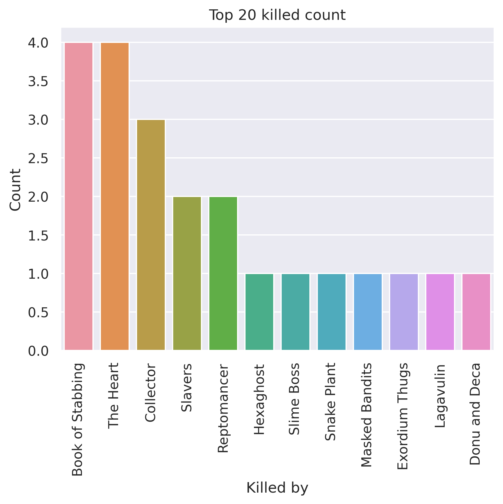
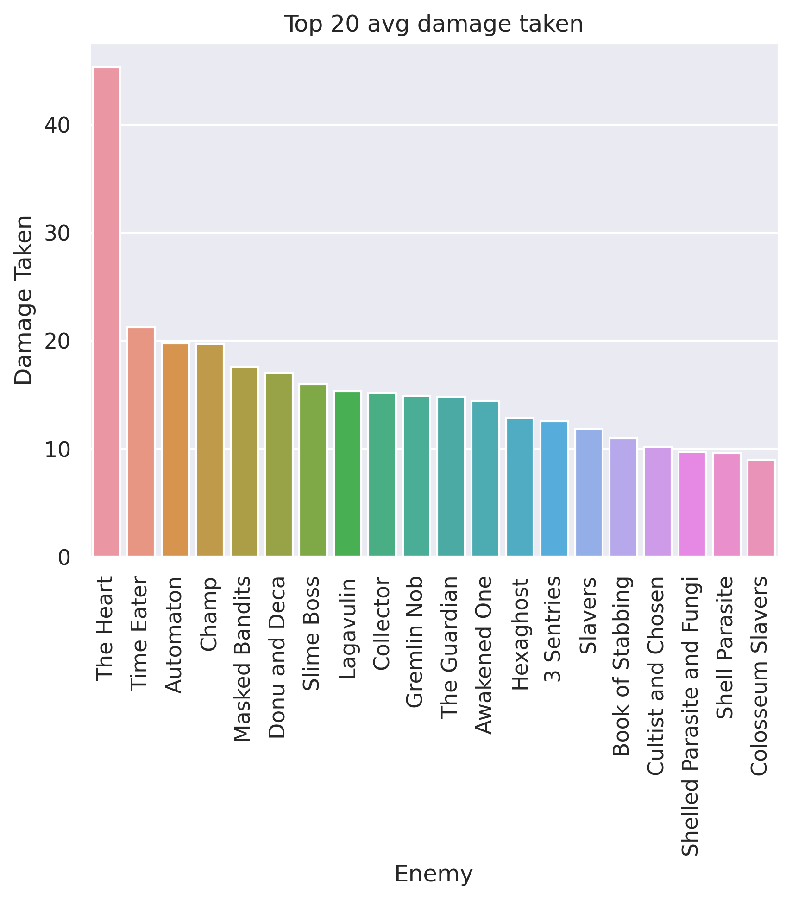
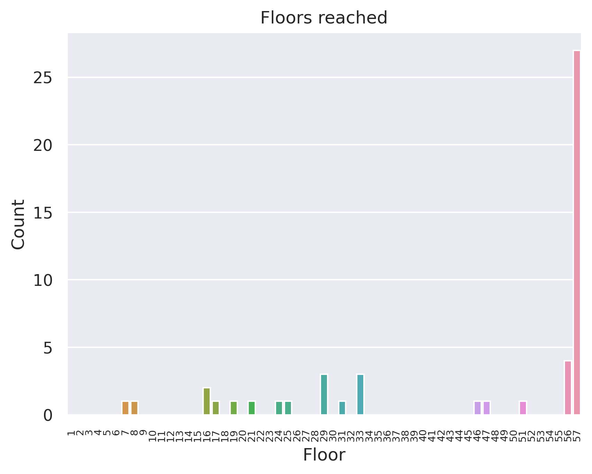
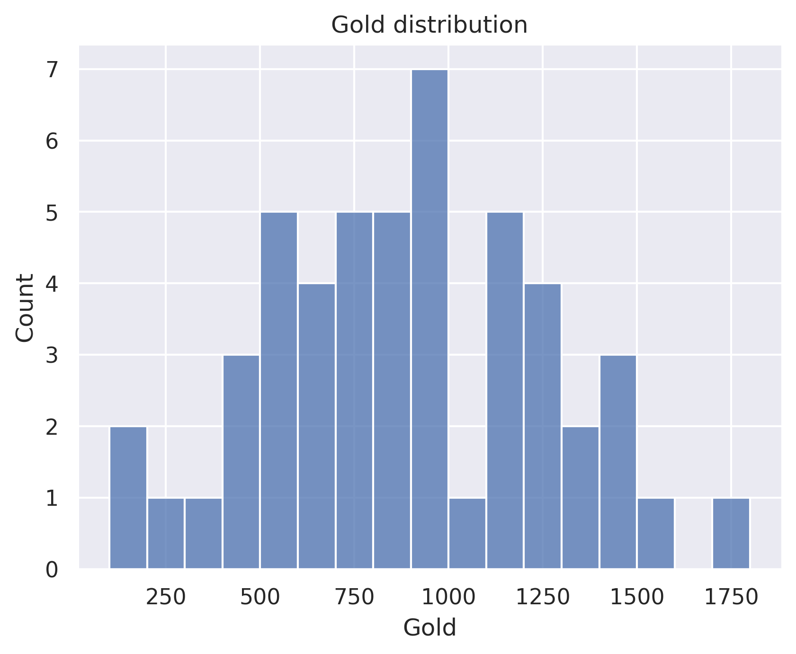

# Bad Silent
## General stats
- Total games played: 50
- Win rate (%): 54.0
- Avg playtime (mins): 124.29
- Avg floor reached: 45.54
- Max score: 3669
- Times rest: 1.26
- Times smith: 5.5
- Max hp >= 80: 7
- Max hp <= 40: 6

### Top 10 damage taken fights (excluding heart)
| Enemy         |   Damage Taken |
|---------------|----------------|
| Donu and Deca |             87 |
| Awakened One  |             76 |
| Lagavulin     |             72 |
| Time Eater    |             68 |
| Slime Boss    |             65 |
| Donu and Deca |             64 |
| Awakened One  |             64 |
| Donu and Deca |             59 |
| Slavers       |             58 |
| Slavers       |             58 |

## Card stats
### Top 10 card removed count
| Card           |   Count |
|----------------|---------|
| Strike_G       |      26 |
| Defend_G       |      14 |
| Writhe         |       5 |
| Regret         |       5 |
| Doubt          |       5 |
| All Out Attack |       4 |
| Decay          |       3 |
| Dagger Spray   |       2 |
| Deadly Poison  |       2 |
| Bane           |       1 |

### Top 80 card win rate (exclude duplicate)
| Card               |   Win rate |     | Card               |   Win rate |
|--------------------|------------|-----|--------------------|------------|
| Flechettes         |       1    |     | Leg Sweep          |       0.69 |
| Blind              |       1    |     | Dash               |       0.69 |
| The Bomb           |       1    |     | Underhanded Strike |       0.69 |
| Storm of Steel     |       1    |     | PiercingWail       |       0.68 |
| Unload             |       1    |     | Necronomicurse     |       0.67 |
| Regret             |       1    |     | Backstab           |       0.67 |
| Purity             |       1    |     | Setup              |       0.67 |
| Panacea            |       1    |     | Decay              |       0.67 |
| Madness            |       1    |     | Dark Shackles      |       0.67 |
| J.A.X.             |       1    |     | Backflip           |       0.66 |
| HandOfGreed        |       1    |     | Alchemize          |       0.65 |
| Good Instincts     |       1    |     | After Image        |       0.64 |
| Finesse            |       1    |     | Grand Finale       |       0.62 |
| Bandage Up         |       1    |     | Footwork           |       0.62 |
| Concentrate        |       0.88 |     | Escape Plan        |       0.62 |
| Finisher           |       0.86 |     | Predator           |       0.61 |
| Wraith Form        |       0.84 |     | Acrobatics         |       0.61 |
| Secret Technique   |       0.83 |     | Apotheosis         |       0.6  |
| Sucker Punch       |       0.82 |     | Infinite Blades    |       0.6  |
| Dodge and Roll     |       0.82 |     | Die Die Die        |       0.6  |
| Reflex             |       0.8  |     | Crippling Poison   |       0.6  |
| Bite               |       0.8  |     | Envenom            |       0.6  |
| Bouncing Flask     |       0.8  |     | Expertise          |       0.6  |
| Slice              |       0.79 |     | Bullet Time        |       0.58 |
| Calculated Gamble  |       0.77 |     | Endless Agony      |       0.58 |
| Prepared           |       0.76 |     | Poisoned Stab      |       0.58 |
| Accuracy           |       0.75 |     | Deflect            |       0.58 |
| Magnetism          |       0.75 |     | Well Laid Plans    |       0.57 |
| Master of Strategy |       0.75 |     | Caltrops           |       0.57 |
| Catalyst           |       0.75 |     | Bane               |       0.57 |
| Outmaneuver        |       0.74 |     | Apparition         |       0.57 |
| Night Terror       |       0.73 |     | PanicButton        |       0.57 |
| Skewer             |       0.71 |     | Noxious Fumes      |       0.56 |
| Blur               |       0.71 |     | Phantasmal Killer  |       0.56 |
| Adrenaline         |       0.71 |     | Cloak And Dagger   |       0.56 |
| Burst              |       0.71 |     | Tools of the Trade |       0.56 |
| Malaise            |       0.71 |     | Dagger Throw       |       0.55 |
| Terror             |       0.7  |     | Survivor           |       0.54 |
| Deadly Poison      |       0.7  |     | Flying Knee        |       0.54 |
| Tactician          |       0.7  |     | Neutralize         |       0.53 |

### Card pick rate act 1 (exclude boss)
| Card               |   Pick rate |     | Card              |   Pick rate |
|--------------------|-------------|-----|-------------------|-------------|
| Wraith Form        |        1    |     | Masterful Stab    |        0.29 |
| Phantasmal Killer  |        1    |     | Slice             |        0.28 |
| Bullet Time        |        1    |     | Eviscerate        |        0.26 |
| Tools of the Trade |        1    |     | Finisher          |        0.21 |
| Secret Technique   |        1    |     | Sucker Punch      |        0.21 |
| Apotheosis         |        1    |     | Infinite Blades   |        0.19 |
| Malaise            |        1    |     | Poisoned Stab     |        0.19 |
| Alchemize          |        1    |     | Singing Bowl      |        0.17 |
| Corpse Explosion   |        1    |     | Bouncing Flask    |        0.17 |
| Calculated Gamble  |        0.88 |     | Deflect           |        0.16 |
| Well Laid Plans    |        0.8  |     | Deadly Poison     |        0.16 |
| Terror             |        0.79 |     | Catalyst          |        0.14 |
| Backstab           |        0.77 |     | Grand Finale      |        0.14 |
| Blade Dance        |        0.73 |     | Escape Plan       |        0.13 |
| Doppelganger       |        0.71 |     | Choke             |        0.12 |
| Glass Knife        |        0.67 |     | SKIP              |        0.11 |
| After Image        |        0.6  |     | Prepared          |        0.11 |
| Night Terror       |        0.6  |     | Quick Slash       |        0.1  |
| Noxious Fumes      |        0.58 |     | Setup             |        0.1  |
| Tactician          |        0.55 |     | Reflex            |        0.09 |
| Predator           |        0.53 |     | Caltrops          |        0.08 |
| Dash               |        0.53 |     | Accuracy          |        0.06 |
| Magnetism          |        0.5  |     | Dodge and Roll    |        0.03 |
| Die Die Die        |        0.5  |     | Cloak And Dagger  |        0.02 |
| Burst              |        0.5  |     | Bane              |        0.02 |
| Sadistic Nature    |        0.5  |     | Secret Weapon     |        0    |
| The Bomb           |        0.5  |     | Blur              |        0    |
| All Out Attack     |        0.5  |     | Envenom           |        0    |
| Adrenaline         |        0.5  |     | Unload            |        0    |
| Endless Agony      |        0.47 |     | Expertise         |        0    |
| Acrobatics         |        0.46 |     | Transmutation     |        0    |
| Footwork           |        0.46 |     | Thinking Ahead    |        0    |
| Backflip           |        0.46 |     | Flechettes        |        0    |
| PiercingWail       |        0.46 |     | Riddle With Holes |        0    |
| Dagger Spray       |        0.44 |     | Heel Hook         |        0    |
| Dagger Throw       |        0.39 |     | Metamorphosis     |        0    |
| Crippling Poison   |        0.38 |     | Storm of Steel    |        0    |
| Flying Knee        |        0.34 |     | Outmaneuver       |        0    |
| Underhanded Strike |        0.33 |     | Concentrate       |        0    |
| Leg Sweep          |        0.33 |     | Distraction       |        0    |
| Skewer             |        0.31 |     | A Thousand Cuts   |        0    |

### Card pick rate after act 1 (exclude boss)
| Card               |   Pick rate |     | Card               |   Pick rate |
|--------------------|-------------|-----|--------------------|-------------|
| Secret Technique   |        1    |     | Finisher           |        0.14 |
| Adrenaline         |        1    |     | Expertise          |        0.12 |
| Panacea            |        1    |     | Concentrate        |        0.12 |
| Master of Strategy |        1    |     | Glass Knife        |        0.1  |
| Malaise            |        1    |     | Cloak And Dagger   |        0.1  |
| Dark Shackles      |        1    |     | Bane               |        0.1  |
| Alchemize          |        0.86 |     | Noxious Fumes      |        0.08 |
| Calculated Gamble  |        0.83 |     | Flechettes         |        0.08 |
| Burst              |        0.82 |     | Dagger Spray       |        0.08 |
| After Image        |        0.75 |     | Underhanded Strike |        0.07 |
| Night Terror       |        0.75 |     | Accuracy           |        0.06 |
| Acrobatics         |        0.74 |     | Deadly Poison      |        0.06 |
| PiercingWail       |        0.72 |     | Masterful Stab     |        0.05 |
| Wraith Form        |        0.7  |     | Setup              |        0.04 |
| Corpse Explosion   |        0.67 |     | Poisoned Stab      |        0.04 |
| Discovery          |        0.67 |     | Choke              |        0.04 |
| Backflip           |        0.66 |     | All Out Attack     |        0.04 |
| Tools of the Trade |        0.62 |     | Caltrops           |        0.03 |
| Terror             |        0.57 |     | Sucker Punch       |        0.03 |
| Finesse            |        0.5  |     | Flying Knee        |        0.02 |
| Doppelganger       |        0.5  |     | Slice              |        0.01 |
| Tactician          |        0.46 |     | Skewer             |        0    |
| Catalyst           |        0.43 |     | Unload             |        0    |
| Die Die Die        |        0.43 |     | Storm of Steel     |        0    |
| Reflex             |        0.42 |     | Trip               |        0    |
| Well Laid Plans    |        0.41 |     | Swift Strike       |        0    |
| Escape Plan        |        0.38 |     | Transmutation      |        0    |
| Eviscerate         |        0.38 |     | Violence           |        0    |
| Footwork           |        0.34 |     | The Bomb           |        0    |
| Leg Sweep          |        0.33 |     | Secret Weapon      |        0    |
| Bullet Time        |        0.33 |     | Thinking Ahead     |        0    |
| PanicButton        |        0.33 |     | A Thousand Cuts    |        0    |
| Phantasmal Killer  |        0.33 |     | Riddle With Holes  |        0    |
| Predator           |        0.33 |     | HandOfGreed        |        0    |
| Purity             |        0.33 |     | Bandage Up         |        0    |
| Prepared           |        0.29 |     | Chrysalis          |        0    |
| Outmaneuver        |        0.27 |     | Deep Breath        |        0    |
| Deflect            |        0.26 |     | Distraction        |        0    |
| Envenom            |        0.25 |     | Dramatic Entrance  |        0    |
| Blind              |        0.25 |     | Enlightenment      |        0    |
| SKIP               |        0.23 |     | Flash of Steel     |        0    |
| Blur               |        0.22 |     | Forethought        |        0    |
| Dash               |        0.2  |     | Heel Hook          |        0    |
| Madness            |        0.2  |     | Quick Slash        |        0    |
| Crippling Poison   |        0.2  |     | Impatience         |        0    |
| Singing Bowl       |        0.18 |     | Infinite Blades    |        0    |
| Dodge and Roll     |        0.18 |     | Jack Of All Trades |        0    |
| Bouncing Flask     |        0.18 |     | Magnetism          |        0    |
| Grand Finale       |        0.17 |     | Mayhem             |        0    |
| Dagger Throw       |        0.15 |     | Metamorphosis      |        0    |
| Backstab           |        0.15 |     | Mind Blast         |        0    |
| Blade Dance        |        0.15 |     | Panache            |        0    |
| Endless Agony      |        0.14 |     | Good Instincts     |        0    |

## Relic stats
### Top relic win rate
| Relic               |   Win rate |     | Relic               |   Win rate |
|---------------------|------------|-----|---------------------|------------|
| StoneCalendar       |          1 |     | Sozu                |       1    |
| Tiny Chest          |          1 |     | Odd Mushroom        |       1    |
| Chemical X          |          1 |     | WarpedTongs         |       1    |
| ClockworkSouvenir   |          1 |     | White Beast Statue  |       1    |
| Tingsha             |          1 |     | TungstenRod         |       1    |
| Darkstone Periapt   |          1 |     | Astrolabe           |       1    |
| Dead Branch         |          1 |     | Turnip              |       1    |
| Thread and Needle   |          1 |     | Orrery              |       1    |
| TheAbacus           |          1 |     | Unceasing Top       |       1    |
| The Specimen        |          1 |     | Torii               |       1    |
| Ring of the Serpent |          1 |     | Philosopher's Stone |       1    |
| Medical Kit         |          1 |     | Nunchaku            |       0.92 |
| Runic Dome          |          1 |     | Ornamental Fan      |       0.9  |
| Frozen Eye          |          1 |     | Coffee Dripper      |       0.88 |
| Shovel              |          1 |     | Bag of Preparation  |       0.88 |
| Mark of the Bloom   |          1 |     | FossilizedHelix     |       0.88 |
| Lizard Tail         |          1 |     | Toolbox             |       0.86 |
| Peace Pipe          |          1 |     | Pen Nib             |       0.85 |
| Lee's Waffle        |          1 |     | Pocketwatch         |       0.83 |
| Sling               |          1 |     | Runic Pyramid       |       0.83 |

### Bottom relic win rate
| Relic             |   Win rate |     | Relic           |   Win rate |
|-------------------|------------|-----|-----------------|------------|
| MealTicket        |       0.57 |     | SacredBark      |       0.5  |
| InkBottle         |       0.57 |     | Molten Egg 2    |       0.5  |
| Red Mask          |       0.55 |     | PreservedInsect |       0.46 |
| Happy Flower      |       0.54 |     | Art of War      |       0.45 |
| Ring of the Snake |       0.51 |     | Juzu Bracelet   |       0.43 |
| Centennial Puzzle |       0.5  |     | Membership Card |       0.43 |
| Du-Vu Doll        |       0.5  |     | Prayer Wheel    |       0.4  |
| Dream Catcher     |       0.5  |     | WingedGreaves   |       0.33 |
| Blue Candle       |       0.5  |     | Golden Idol     |       0.33 |
| Black Star        |       0.5  |     | Frozen Egg 2    |       0.33 |
| Bottled Lightning |       0.5  |     | War Paint       |       0.29 |
| Calling Bell      |       0.5  |     | Girya           |       0.25 |
| Toxic Egg 2       |       0.5  |     | Regal Pillow    |       0.2  |
| Toy Ornithopter   |       0.5  |     | Bloody Idol     |       0    |
| Bottled Tornado   |       0.5  |     | Calipers        |       0    |
| CaptainsWheel     |       0.5  |     | NeowsBlessing   |       0    |
| WristBlade        |       0.5  |     | Nilry's Codex   |       0    |
| HoveringKite      |       0.5  |     | Cauldron        |       0    |
| Singing Bowl      |       0.5  |     | Ectoplasm       |       0    |
| MawBank           |       0.5  |     | Fusion Hammer   |       0    |

### Act 1 boss relic pick rate
| Relic               |   Pick rate |     | Relic               |   Pick rate |
|---------------------|-------------|-----|---------------------|-------------|
| Runic Pyramid       |        1    |     | Calling Bell        |        0.22 |
| Fusion Hammer       |        1    |     | Ectoplasm           |        0.2  |
| Pandora's Box       |        0.92 |     | Astrolabe           |        0.2  |
| Philosopher's Stone |        0.67 |     | Empty Cage          |        0.17 |
| Coffee Dripper      |        0.62 |     | Ring of the Serpent |        0    |
| HoveringKite        |        0.43 |     | Runic Dome          |        0    |
| SacredBark          |        0.4  |     | Busted Crown        |        0    |
| Black Star          |        0.36 |     | Snecko Eye          |        0    |
| SlaversCollar       |        0.33 |     | Sozu                |        0    |
| Cursed Key          |        0.33 |     | Tiny House          |        0    |
| WristBlade          |        0.22 |     | Velvet Choker       |        0    |

### Act 1 boss relic win rate
| Relic               |   Win rate |     | Relic         |   Win rate |
|---------------------|------------|-----|---------------|------------|
| Astrolabe           |       1    |     | SacredBark    |        0.5 |
| Philosopher's Stone |       1    |     | WristBlade    |        0.5 |
| Runic Pyramid       |       0.86 |     | Cursed Key    |        0   |
| Coffee Dripper      |       0.8  |     | Ectoplasm     |        0   |
| HoveringKite        |       0.67 |     | Empty Cage    |        0   |
| Pandora's Box       |       0.64 |     | Fusion Hammer |        0   |
| Black Star          |       0.5  |     | SlaversCollar |        0   |
| Calling Bell        |       0.5  |     |   |   |

### Act 2 boss relic pick rate
| Relic               |   Pick rate |     | Relic               |   Pick rate |
|---------------------|-------------|-----|---------------------|-------------|
| Runic Pyramid       |        1    |     | HoveringKite        |        0.25 |
| SlaversCollar       |        0.86 |     | Runic Dome          |        0.25 |
| Cursed Key          |        0.8  |     | Pandora's Box       |        0.2  |
| Coffee Dripper      |        0.6  |     | Philosopher's Stone |        0.17 |
| Empty Cage          |        0.5  |     | Astrolabe           |        0.14 |
| Calling Bell        |        0.4  |     | Snecko Eye          |        0    |
| SacredBark          |        0.4  |     | Busted Crown        |        0    |
| Ring of the Serpent |        0.38 |     | Tiny House          |        0    |
| Fusion Hammer       |        0.33 |     | Velvet Choker       |        0    |
| Sozu                |        0.33 |     | WristBlade          |        0    |

### Act 2 boss relic win rate
| Relic               |   Win rate |     | Relic         |   Win rate |
|---------------------|------------|-----|---------------|------------|
| Astrolabe           |          1 |     | SlaversCollar |       0.83 |
| Coffee Dripper      |          1 |     | Runic Pyramid |       0.8  |
| Empty Cage          |          1 |     | Cursed Key    |       0.75 |
| Pandora's Box       |          1 |     | Calling Bell  |       0.5  |
| Philosopher's Stone |          1 |     | SacredBark    |       0.5  |
| Ring of the Serpent |          1 |     | Fusion Hammer |       0    |
| Runic Dome          |          1 |     | HoveringKite  |       0    |
| Sozu                |          1 |     |   |   |

