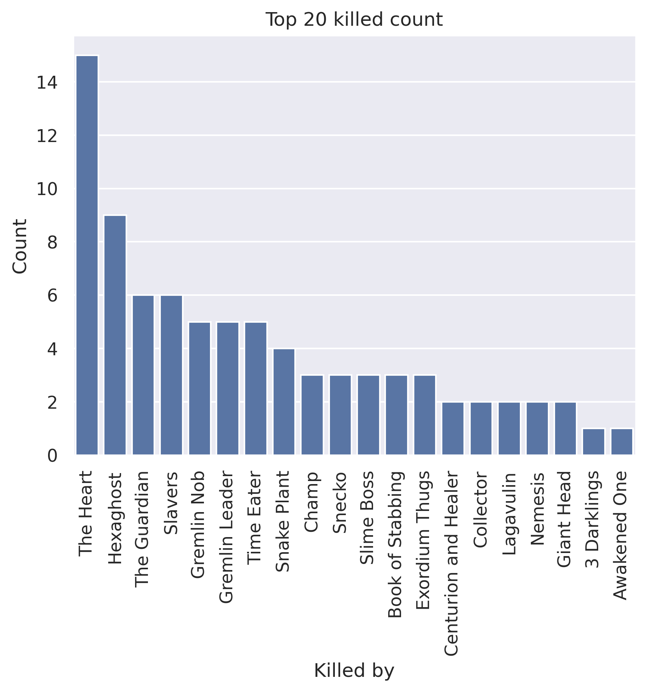
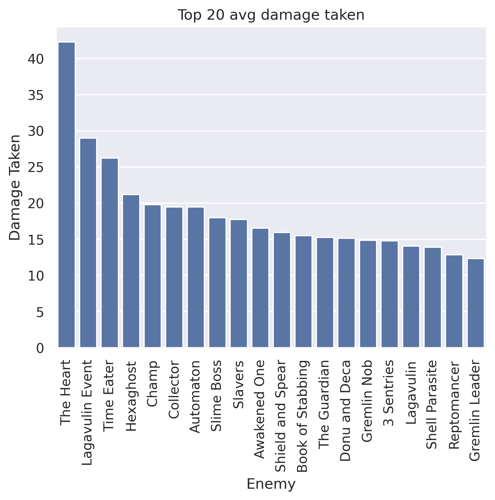
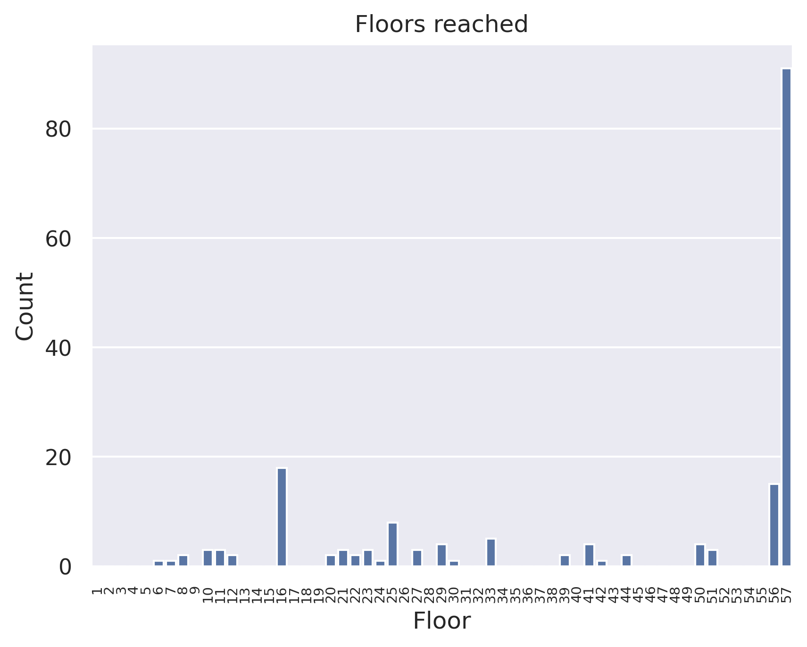
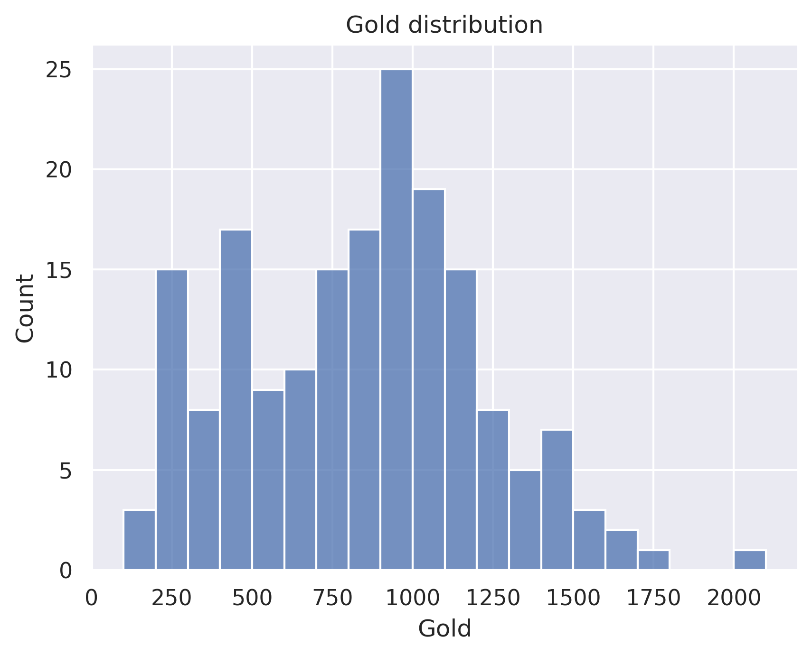

# all chegs
## General stats
- Total games played: 184
- Win rate (%): 49.46
- Avg playtime (mins): 47.32
- Avg floor reached: 43.41
- Max score: 3512
- Times rest: 1.67
- Times smith: 4.6
- Max hp >= 80: 49
- Max hp <= 40: 1

### Top 10 damage taken fights (excluding heart)
| Enemy          |   Damage Taken |
|----------------|----------------|
| Transient      |            127 |
| Time Eater     |             96 |
| Masked Bandits |             95 |
| Champ          |             92 |
| Awakened One   |             91 |
| Awakened One   |             90 |
| Gremlin Leader |             90 |
| Automaton      |             90 |
| Donu and Deca  |             89 |
| Collector      |             86 |

## Card stats
### Top 10 card removed count
| Card      |   Count |
|-----------|---------|
| Defend_P  |      48 |
| Strike_P  |      44 |
| Strike_R  |      37 |
| Strike_B  |      30 |
| Strike_G  |      28 |
| Zap       |      14 |
| Defend_B  |       9 |
| Normality |       8 |
| Defend_G  |       7 |
| Pain      |       7 |

### Top 80 card win rate (exclude duplicate)
| Card              |   Win rate |     | Card             |   Win rate |
|-------------------|------------|-----|------------------|------------|
| Chrysalis         |       1    |     | Finesse          |       0.83 |
| Concentrate       |       1    |     | Apotheosis       |       0.83 |
| LikeWater         |       1    |     | Corpse Explosion |       0.81 |
| Panache           |       1    |     | Catalyst         |       0.81 |
| Thinking Ahead    |       1    |     | Reaper           |       0.81 |
| Brilliance        |       1    |     | Adrenaline       |       0.8  |
| Thunder Strike    |       1    |     | Night Terror     |       0.8  |
| Pray              |       1    |     | Meteor Strike    |       0.8  |
| Shame             |       1    |     | Scrawl           |       0.8  |
| Wild Strike       |       1    |     | Chaos            |       0.8  |
| Clumsy            |       1    |     | Discovery        |       0.8  |
| Prostrate         |       1    |     | Heatsinks        |       0.8  |
| White Noise       |       1    |     | Blind            |       0.8  |
| BattleHymn        |       1    |     | PanicButton      |       0.8  |
| Purity            |       1    |     | Double Tap       |       0.8  |
| FollowUp          |       1    |     | Malaise          |       0.8  |
| Sword Boomerang   |       1    |     | Redo             |       0.79 |
| SashWhip          |       1    |     | Aggregate        |       0.79 |
| Swivel            |       1    |     | Seek             |       0.79 |
| Rampage           |       1    |     | After Image      |       0.79 |
| Evaluate          |       1    |     | Halt             |       0.79 |
| Rip and Tear      |       1    |     | Amplify          |       0.78 |
| Double Energy     |       1    |     | Crescendo        |       0.78 |
| Dramatic Entrance |       1    |     | Burst            |       0.78 |
| SpiritShield      |       1    |     | Glacier          |       0.77 |
| EmptyBody         |       1    |     | Dark Shackles    |       0.77 |
| Tempest           |       1    |     | Barricade        |       0.77 |
| Steam Power       |       1    |     | Echo Form        |       0.76 |
| All Out Attack    |       1    |     | Envenom          |       0.75 |
| All For One       |       1    |     | Turbo            |       0.75 |
| Stack             |       1    |     | Doppelganger     |       0.75 |
| Blur              |       0.93 |     | Blizzard         |       0.75 |
| Secret Technique  |       0.88 |     | Auto Shields     |       0.75 |
| Body Slam         |       0.88 |     | Wraith Form      |       0.75 |
| Panacea           |       0.86 |     | Recycle          |       0.75 |
| Entrench          |       0.86 |     | Sentinel         |       0.75 |
| Parasite          |       0.86 |     | Prepared         |       0.75 |
| Biased Cognition  |       0.85 |     | Self Repair      |       0.75 |
| Vault             |       0.83 |     | Hologram         |       0.74 |
| Genetic Algorithm |       0.83 |     | Terror           |       0.74 |

### Card pick rate act 1 (exclude boss)
| Card               |   Pick rate |     | Card               |   Pick rate |
|--------------------|-------------|-----|--------------------|-------------|
| Tools of the Trade |        1    |     | Slice              |        0.22 |
| Defragment         |        1    |     | Dagger Spray       |        0.21 |
| Panacea            |        1    |     | Hyperbeam          |        0.2  |
| Omniscience        |        1    |     | Multi-Cast         |        0.2  |
| Buffer             |        1    |     | WindmillStrike     |        0.2  |
| Violence           |        1    |     | Sentinel           |        0.2  |
| Leg Sweep          |        1    |     | Machine Learning   |        0.2  |
| Vault              |        1    |     | Twin Strike        |        0.19 |
| Corpse Explosion   |        1    |     | Underhanded Strike |        0.18 |
| InnerPeace         |        1    |     | Eviscerate         |        0.18 |
| Dark Shackles      |        1    |     | Combust            |        0.18 |
| Glass Knife        |        1    |     | Conclude           |        0.17 |
| Biased Cognition   |        1    |     | Rip and Tear       |        0.17 |
| Glacier            |        1    |     | Poisoned Stab      |        0.16 |
| Discovery          |        1    |     | Steam              |        0.16 |
| Terror             |        1    |     | Indignation        |        0.15 |
| Doppelganger       |        1    |     | Redo               |        0.15 |
| Dramatic Entrance  |        1    |     | SKIP               |        0.14 |
| Echo Form          |        1    |     | Streamline         |        0.14 |
| Electrodynamics    |        1    |     | Entrench           |        0.14 |
| Fiend Fire         |        1    |     | Fire Breathing     |        0.13 |
| Scrawl             |        1    |     | Aggregate          |        0.13 |
| Phantasmal Killer  |        1    |     | ForeignInfluence   |        0.13 |
| Malaise            |        1    |     | Quick Slash        |        0.13 |
| Trip               |        1    |     | Weave              |        0.12 |
| After Image        |        1    |     | Ghostly Armor      |        0.12 |
| Apotheosis         |        1    |     | Sucker Punch       |        0.12 |
| Reaper             |        1    |     | Auto Shields       |        0.12 |
| Shockwave          |        1    |     | Dropkick           |        0.12 |
| Alchemize          |        1    |     | Heatsinks          |        0.11 |
| Wraith Form        |        1    |     | Dual Wield         |        0.11 |
| Chill              |        0.94 |     | Accuracy           |        0.11 |
| Well Laid Plans    |        0.93 |     | WheelKick          |        0.11 |
| Footwork           |        0.92 |     | WaveOfTheHand      |        0.11 |
| Tantrum            |        0.91 |     | Rebound            |        0.11 |
| Self Repair        |        0.89 |     | Dark Embrace       |        0.11 |
| Adaptation         |        0.88 |     | Crescendo          |        0.1  |
| MentalFortress     |        0.86 |     | Havoc              |        0.1  |
| Power Through      |        0.83 |     | Melter             |        0.09 |
| Backstab           |        0.82 |     | ThirdEye           |        0.09 |
| Calculated Gamble  |        0.82 |     | SignatureMove      |        0.08 |
| Pommel Strike      |        0.81 |     | Double Energy      |        0.08 |
| Feed               |        0.8  |     | All Out Attack     |        0.08 |
| Consume            |        0.8  |     | BowlingBash        |        0.08 |
| EmptyMind          |        0.79 |     | Cloak And Dagger   |        0.08 |
| FearNoEvil         |        0.79 |     | Go for the Eyes    |        0.07 |
| Disarm             |        0.78 |     | Prepared           |        0.07 |
| Coolheaded         |        0.78 |     | Finisher           |        0.07 |
| Noxious Fumes      |        0.75 |     | Skewer             |        0.07 |
| Fission            |        0.75 |     | Turbo              |        0.07 |
| Impervious         |        0.75 |     | Barrage            |        0.07 |
| Core Surge         |        0.75 |     | Rampage            |        0.07 |
| LessonLearned      |        0.75 |     | Choke              |        0.07 |
| Cold Snap          |        0.74 |     | Riddle With Holes  |        0.07 |
| Wireheading        |        0.73 |     | Wild Strike        |        0.06 |
| Meditate           |        0.73 |     | Dodge and Roll     |        0.05 |
| Blade Dance        |        0.72 |     | Cleave             |        0.05 |
| CutThroughFate     |        0.72 |     | Deadly Poison      |        0.04 |
| Hemokinesis        |        0.71 |     | Clash              |        0.04 |
| Sunder             |        0.71 |     | EmptyBody          |        0.04 |
| DeceiveReality     |        0.7  |     | Halt               |        0.04 |
| Backflip           |        0.7  |     | Warcry             |        0.04 |
| TalkToTheHand      |        0.69 |     | FollowUp           |        0.04 |
| Inflame            |        0.69 |     | ClearTheMind       |        0.04 |
| Shrug It Off       |        0.69 |     | Body Slam          |        0.03 |
| Doom and Gloom     |        0.69 |     | Thunder Strike     |        0    |
| Rainbow            |        0.67 |     | Tactician          |        0    |
| Exhume             |        0.67 |     | Sword Boomerang    |        0    |
| Meteor Strike      |        0.67 |     | Unload             |        0    |
| Immolate           |        0.67 |     | Swivel             |        0    |
| Burning Pact       |        0.67 |     | Tempest            |        0    |
| Skim               |        0.64 |     | Vengeance          |        0    |
| Whirlwind          |        0.62 |     | Seek               |        0    |
| Conserve Battery   |        0.58 |     | Worship            |        0    |
| Loop               |        0.57 |     | Storm              |        0    |
| Anger              |        0.57 |     | SpiritShield       |        0    |
| Crippling Poison   |        0.57 |     | Setup              |        0    |
| Study              |        0.57 |     | The Bomb           |        0    |
| Headbutt           |        0.57 |     | Thunderclap        |        0    |
| EmptyFist          |        0.56 |     | Wish               |        0    |
| PiercingWail       |        0.56 |     | True Grit          |        0    |
| Bloodletting       |        0.56 |     | Steam Power        |        0    |
| SandsOfTime        |        0.56 |     | Thinking Ahead     |        0    |
| Spot Weakness      |        0.56 |     | Sever Soul         |        0    |
| Second Wind        |        0.53 |     | Stack              |        0    |
| Masterful Stab     |        0.53 |     | Searing Blow       |        0    |
| Undo               |        0.52 |     | Heel Hook          |        0    |
| Double Tap         |        0.5  |     | Scrape             |        0    |
| Battle Trance      |        0.5  |     | Enlightenment      |        0    |
| Capacitor          |        0.5  |     | Creative AI        |        0    |
| Adrenaline         |        0.5  |     | CrushJoints        |        0    |
| Master of Strategy |        0.5  |     | Deep Breath        |        0    |
| Envenom            |        0.5  |     | DevaForm           |        0    |
| Acrobatics         |        0.5  |     | Devotion           |        0    |
| Blood for Blood    |        0.5  |     | Distraction        |        0    |
| Wallop             |        0.5  |     | Evaluate           |        0    |
| Metallicize        |        0.5  |     | SashWhip           |        0    |
| Corruption         |        0.5  |     | Expertise          |        0    |
| ReachHeaven        |        0.5  |     | Fasting2           |        0    |
| Brutality          |        0.5  |     | Finesse            |        0    |
| Demon Form         |        0.5  |     | Flechettes         |        0    |
| Bullet Time        |        0.5  |     | Flex               |        0    |
| Burst              |        0.5  |     | FlyingSleeves      |        0    |
| Night Terror       |        0.5  |     | ConjureBlade       |        0    |
| Dagger Throw       |        0.47 |     | Concentrate        |        0    |
| Lockon             |        0.47 |     | Collect            |        0    |
| FTL                |        0.47 |     | Claw               |        0    |
| FlurryOfBlows      |        0.46 |     | Chaos              |        0    |
| Darkness           |        0.46 |     | Caltrops           |        0    |
| BootSequence       |        0.46 |     | Brilliance         |        0    |
| Genetic Algorithm  |        0.44 |     | Blur               |        0    |
| Predator           |        0.42 |     | Blizzard           |        0    |
| Infernal Blade     |        0.4  |     | Blind              |        0    |
| Offering           |        0.4  |     | Blasphemy          |        0    |
| Static Discharge   |        0.4  |     | Berserk            |        0    |
| Ball Lightning     |        0.4  |     | BattleHymn         |        0    |
| Uppercut           |        0.4  |     | Bane               |        0    |
| A Thousand Cuts    |        0.38 |     | Amplify            |        0    |
| Sanctity           |        0.36 |     | Alpha              |        0    |
| Sweeping Beam      |        0.36 |     | All For One        |        0    |
| CarveReality       |        0.36 |     | Force Field        |        0    |
| Flying Knee        |        0.35 |     | Forethought        |        0    |
| Escape Plan        |        0.33 |     | Fusion             |        0    |
| Reboot             |        0.33 |     | PathToVictory      |        0    |
| Armaments          |        0.33 |     | Sadistic Nature    |        0    |
| Endless Agony      |        0.33 |     | Rupture            |        0    |
| Feel No Pain       |        0.33 |     | Reprogram          |        0    |
| Die Die Die        |        0.33 |     | Reinforced Body    |        0    |
| Madness            |        0.33 |     | Reflex             |        0    |
| Bludgeon           |        0.33 |     | Reckless Charge    |        0    |
| Storm of Steel     |        0.33 |     | Ragnarok           |        0    |
| Flash of Steel     |        0.33 |     | Rage               |        0    |
| Infinite Blades    |        0.31 |     | Purity             |        0    |
| Hello World        |        0.31 |     | Pummel             |        0    |
| Clothesline        |        0.3  |     | Protect            |        0    |
| Hologram           |        0.3  |     | Prostrate          |        0    |
| Singing Bowl       |        0.29 |     | Pray               |        0    |
| White Noise        |        0.29 |     | Perseverance       |        0    |
| Beam Cell          |        0.28 |     | PanicButton        |        0    |
| Dash               |        0.27 |     | Grand Finale       |        0    |
| Bouncing Flask     |        0.27 |     | Panache            |        0    |
| Perfected Strike   |        0.27 |     | Outmaneuver        |        0    |
| Carnage            |        0.27 |     | Nirvana            |        0    |
| Consecrate         |        0.26 |     | Mind Blast         |        0    |
| DeusExMachina      |        0.25 |     | Metamorphosis      |        0    |
| Catalyst           |        0.25 |     | MasterReality      |        0    |
| Compile Driver     |        0.25 |     | Limit Break        |        0    |
| Intimidate         |        0.25 |     | LikeWater          |        0    |
| Barricade          |        0.25 |     | Leap               |        0    |
| Evolve             |        0.25 |     | JustLucky          |        0    |
| Flame Barrier      |        0.25 |     | Juggernaut         |        0    |
| Iron Wave          |        0.24 |     | Judgement          |        0    |
| Seeing Red         |        0.23 |     | Impatience         |        0    |
| Deflect            |        0.22 |     | Heavy Blade        |        0    |
| Recycle            |        0.22 |     | WreathOfFlame      |        0    |

### Card pick rate after act 1 (exclude boss)
| Card               |   Pick rate |     | Card               |   Pick rate |
|--------------------|-------------|-----|--------------------|-------------|
| Seek               |        1    |     | Inflame            |        0.14 |
| Offering           |        1    |     | FlurryOfBlows      |        0.14 |
| Burst              |        1    |     | DeceiveReality     |        0.14 |
| Adrenaline         |        1    |     | Go for the Eyes    |        0.14 |
| After Image        |        1    |     | Flechettes         |        0.12 |
| Exhume             |        1    |     | Omniscience        |        0.12 |
| Impervious         |        1    |     | Pummel             |        0.12 |
| Wraith Form        |        1    |     | Setup              |        0.12 |
| Vault              |        1    |     | Steam              |        0.12 |
| Night Terror       |        1    |     | Ghostly Armor      |        0.12 |
| Scrawl             |        1    |     | Cloak And Dagger   |        0.11 |
| Echo Form          |        1    |     | Underhanded Strike |        0.11 |
| Apotheosis         |        1    |     | Sweeping Beam      |        0.11 |
| Burning Pact       |        0.94 |     | Whirlwind          |        0.11 |
| Glacier            |        0.94 |     | Havoc              |        0.11 |
| Dark Shackles      |        0.93 |     | Carnage            |        0.11 |
| Secret Technique   |        0.88 |     | Storm              |        0.1  |
| Shockwave          |        0.85 |     | Rupture            |        0.1  |
| EmptyMind          |        0.84 |     | Endless Agony      |        0.1  |
| Barricade          |        0.83 |     | Good Instincts     |        0.1  |
| InnerPeace         |        0.82 |     | Worship            |        0.1  |
| Defragment         |        0.82 |     | Blizzard           |        0.1  |
| Master of Strategy |        0.8  |     | Dash               |        0.1  |
| Rainbow            |        0.8  |     | Anger              |        0.09 |
| Phantasmal Killer  |        0.8  |     | Alpha              |        0.09 |
| Biased Cognition   |        0.78 |     | Finisher           |        0.09 |
| Disarm             |        0.77 |     | Rage               |        0.08 |
| Malaise            |        0.75 |     | Deep Breath        |        0.08 |
| Core Surge         |        0.75 |     | Static Discharge   |        0.08 |
| Capacitor          |        0.75 |     | Sentinel           |        0.08 |
| Footwork           |        0.74 |     | Beam Cell          |        0.08 |
| Calculated Gamble  |        0.73 |     | Indignation        |        0.08 |
| Skim               |        0.72 |     | Trip               |        0.08 |
| Power Through      |        0.7  |     | Sucker Punch       |        0.08 |
| Shrug It Off       |        0.69 |     | Crescendo          |        0.07 |
| Feel No Pain       |        0.67 |     | Masterful Stab     |        0.07 |
| Corruption         |        0.67 |     | Chaos              |        0.07 |
| Coolheaded         |        0.64 |     | Dagger Spray       |        0.06 |
| Loop               |        0.64 |     | Clothesline        |        0.06 |
| Acrobatics         |        0.63 |     | Dagger Throw       |        0.06 |
| PiercingWail       |        0.62 |     | Tempest            |        0.06 |
| Tactician          |        0.62 |     | Steam Power        |        0.06 |
| Adaptation         |        0.62 |     | Vengeance          |        0.06 |
| Backflip           |        0.62 |     | Perfected Strike   |        0.05 |
| MentalFortress     |        0.6  |     | ThirdEye           |        0.05 |
| Reaper             |        0.6  |     | Auto Shields       |        0.05 |
| Chill              |        0.6  |     | Infernal Blade     |        0.05 |
| Discovery          |        0.57 |     | Combust            |        0.05 |
| Sunder             |        0.56 |     | WheelKick          |        0.04 |
| Flash of Steel     |        0.55 |     | EmptyBody          |        0.04 |
| Leg Sweep          |        0.55 |     | JustLucky          |        0.04 |
| Finesse            |        0.55 |     | Barrage            |        0.04 |
| Blur               |        0.54 |     | Pray               |        0.04 |
| Catalyst           |        0.52 |     | Weave              |        0.04 |
| Feed               |        0.5  |     | Predator           |        0.04 |
| DevaForm           |        0.5  |     | BowlingBash        |        0.03 |
| Die Die Die        |        0.5  |     | Flex               |        0.03 |
| Brutality          |        0.5  |     | EmptyFist          |        0.03 |
| Bloodletting       |        0.5  |     | Rebound            |        0.03 |
| MasterReality      |        0.5  |     | Poisoned Stab      |        0.02 |
| Undo               |        0.5  |     | Deadly Poison      |        0.02 |
| Aggregate          |        0.47 |     | Prostrate          |        0.02 |
| Well Laid Plans    |        0.46 |     | Sword Boomerang    |        0.02 |
| Hologram           |        0.46 |     | Twin Strike        |        0.02 |
| Tantrum            |        0.46 |     | Slice              |        0.02 |
| Fission            |        0.45 |     | SashWhip           |        0.02 |
| Self Repair        |        0.45 |     | Flying Knee        |        0.02 |
| CutThroughFate     |        0.45 |     | Streamline         |        0.02 |
| Amplify            |        0.44 |     | Stack              |        0.01 |
| Heatsinks          |        0.44 |     | Wild Strike        |        0    |
| Dual Wield         |        0.44 |     | WindmillStrike     |        0    |
| Sanctity           |        0.43 |     | Searing Blow       |        0    |
| Consume            |        0.43 |     | Wish               |        0    |
| Compile Driver     |        0.43 |     | Scrape             |        0    |
| FearNoEvil         |        0.42 |     | SignatureMove      |        0    |
| Second Wind        |        0.41 |     | Thunder Strike     |        0    |
| Wireheading        |        0.38 |     | Unload             |        0    |
| Escape Plan        |        0.38 |     | Transmutation      |        0    |
| Dark Embrace       |        0.38 |     | Thunderclap        |        0    |
| Cold Snap          |        0.38 |     | Skewer             |        0    |
| Alchemize          |        0.38 |     | The Bomb           |        0    |
| Reboot             |        0.36 |     | Swivel             |        0    |
| PanicButton        |        0.36 |     | Swift Strike       |        0    |
| Singing Bowl       |        0.36 |     | Sever Soul         |        0    |
| Blade Dance        |        0.36 |     | SpiritShield       |        0    |
| Entrench           |        0.36 |     | A Thousand Cuts    |        0    |
| Reinforced Body    |        0.35 |     | Hello World        |        0    |
| Meteor Strike      |        0.33 |     | SandsOfTime        |        0    |
| Fiend Fire         |        0.33 |     | ConjureBlade       |        0    |
| Limit Break        |        0.33 |     | CrushJoints        |        0    |
| Tools of the Trade |        0.33 |     | DeusExMachina      |        0    |
| Immolate           |        0.33 |     | Devotion           |        0    |
| Genetic Algorithm  |        0.33 |     | Distraction        |        0    |
| Flame Barrier      |        0.33 |     | Double Tap         |        0    |
| LessonLearned      |        0.33 |     | Dramatic Entrance  |        0    |
| Doppelganger       |        0.33 |     | Envenom            |        0    |
| Deflect            |        0.33 |     | Establishment      |        0    |
| Corpse Explosion   |        0.33 |     | Evaluate           |        0    |
| Noxious Fumes      |        0.32 |     | Eviscerate         |        0    |
| Pommel Strike      |        0.32 |     | Expertise          |        0    |
| Spot Weakness      |        0.32 |     | Fasting2           |        0    |
| Redo               |        0.31 |     | Fire Breathing     |        0    |
| Double Energy      |        0.31 |     | FlyingSleeves      |        0    |
| Reflex             |        0.29 |     | FollowUp           |        0    |
| Bouncing Flask     |        0.29 |     | Consecrate         |        0    |
| Terror             |        0.29 |     | Conclude           |        0    |
| Uppercut           |        0.29 |     | Sadistic Nature    |        0    |
| Blood for Blood    |        0.29 |     | Collect            |        0    |
| Creative AI        |        0.29 |     | All For One        |        0    |
| Blind              |        0.29 |     | All Out Attack     |        0    |
| True Grit          |        0.28 |     | Ball Lightning     |        0    |
| BootSequence       |        0.28 |     | Bane               |        0    |
| WaveOfTheHand      |        0.28 |     | BattleHymn         |        0    |
| SKIP               |        0.27 |     | Berserk            |        0    |
| Crippling Poison   |        0.26 |     | Blasphemy          |        0    |
| Panacea            |        0.25 |     | Bludgeon           |        0    |
| Electrodynamics    |        0.25 |     | Brilliance         |        0    |
| Concentrate        |        0.25 |     | Caltrops           |        0    |
| Demon Form         |        0.25 |     | CarveReality       |        0    |
| Recycle            |        0.25 |     | Choke              |        0    |
| Buffer             |        0.25 |     | Clash              |        0    |
| Darkness           |        0.24 |     | Claw               |        0    |
| TalkToTheHand      |        0.24 |     | Cleave             |        0    |
| Outmaneuver        |        0.24 |     | ForeignInfluence   |        0    |
| Halt               |        0.24 |     | Forethought        |        0    |
| Meditate           |        0.24 |     | Glass Knife        |        0    |
| White Noise        |        0.23 |     | Grand Finale       |        0    |
| Turbo              |        0.23 |     | Metamorphosis      |        0    |
| Evolve             |        0.23 |     | Mind Blast         |        0    |
| Force Field        |        0.22 |     | Nirvana            |        0    |
| Seeing Red         |        0.21 |     | PathToVictory      |        0    |
| Bandage Up         |        0.21 |     | Perseverance       |        0    |
| Enlightenment      |        0.21 |     | Protect            |        0    |
| Dodge and Roll     |        0.21 |     | Purity             |        0    |
| Intimidate         |        0.21 |     | Quick Slash        |        0    |
| Accuracy           |        0.21 |     | Ragnarok           |        0    |
| Doom and Gloom     |        0.21 |     | Rampage            |        0    |
| FTL                |        0.21 |     | ReachHeaven        |        0    |
| ClearTheMind       |        0.2  |     | Reckless Charge    |        0    |
| Bullet Time        |        0.2  |     | Reprogram          |        0    |
| Thinking Ahead     |        0.2  |     | Riddle With Holes  |        0    |
| Violence           |        0.2  |     | Rip and Tear       |        0    |
| Headbutt           |        0.2  |     | Melter             |        0    |
| Fusion             |        0.19 |     | Mayhem             |        0    |
| Study              |        0.19 |     | Magnetism          |        0    |
| Body Slam          |        0.18 |     | Infinite Blades    |        0    |
| Backstab           |        0.17 |     | HandOfGreed        |        0    |
| Multi-Cast         |        0.17 |     | Heavy Blade        |        0    |
| Machine Learning   |        0.17 |     | Heel Hook          |        0    |
| Storm of Steel     |        0.17 |     | Hemokinesis        |        0    |
| Secret Weapon      |        0.17 |     | Hyperbeam          |        0    |
| Conserve Battery   |        0.17 |     | Impatience         |        0    |
| Dropkick           |        0.17 |     | Iron Wave          |        0    |
| Wallop             |        0.16 |     | Madness            |        0    |
| Prepared           |        0.16 |     | Jack Of All Trades |        0    |
| Armaments          |        0.16 |     | Judgement          |        0    |
| Warcry             |        0.16 |     | Juggernaut         |        0    |
| Battle Trance      |        0.15 |     | Leap               |        0    |
| Metallicize        |        0.15 |     | LikeWater          |        0    |
| Chrysalis          |        0.14 |     | Lockon             |        0    |
| Panache            |        0.14 |     | WreathOfFlame      |        0    |

## Relic stats
### Top relic win rate
| Relic               |   Win rate |     | Relic             |   Win rate |
|---------------------|------------|-----|-------------------|------------|
| CloakClasp          |       1    |     | Damaru            |       0.86 |
| Brimstone           |       1    |     | Bottled Lightning |       0.86 |
| HoveringKite        |       1    |     | Ornamental Fan    |       0.84 |
| Mark of the Bloom   |       1    |     | Paper Frog        |       0.83 |
| Melange             |       1    |     | Yang              |       0.83 |
| Nilry's Codex       |       1    |     | Sundial           |       0.83 |
| FrozenCore          |       1    |     | Bottled Tornado   |       0.83 |
| Tiny House          |       1    |     | Unceasing Top     |       0.82 |
| Cauldron            |       1    |     | StoneCalendar     |       0.82 |
| Enchiridion         |       1    |     | Prayer Wheel      |       0.81 |
| Chemical X          |       1    |     | Peace Pipe        |       0.8  |
| DollysMirror        |       0.94 |     | Emotion Chip      |       0.8  |
| OrangePellets       |       0.94 |     | Bird Faced Urn    |       0.8  |
| Whetstone           |       0.91 |     | Du-Vu Doll        |       0.79 |
| Philosopher's Stone |       0.89 |     | Pen Nib           |       0.79 |
| Dead Branch         |       0.88 |     | Shuriken          |       0.78 |
| Torii               |       0.88 |     | Happy Flower      |       0.78 |
| InkBottle           |       0.87 |     | HornCleat         |       0.77 |
| Red Mask            |       0.87 |     | Medical Kit       |       0.77 |
| Juzu Bracelet       |       0.87 |     | Old Coin          |       0.77 |

### Bottom relic win rate
| Relic             |   Win rate |     | Relic             |   Win rate |
|-------------------|------------|-----|-------------------|------------|
| Regal Pillow      |       0.54 |     | PureWater         |       0.44 |
| Gremlin Horn      |       0.53 |     | Burning Blood     |       0.44 |
| Omamori           |       0.52 |     | Molten Egg 2      |       0.43 |
| Pantograph        |       0.52 |     | Cables            |       0.4  |
| Membership Card   |       0.5  |     | Singing Bowl      |       0.38 |
| TeardropLocket    |       0.5  |     | Lee's Waffle      |       0.38 |
| Tough Bandages    |       0.5  |     | WarpedTongs       |       0.38 |
| Champion Belt     |       0.5  |     | Golden Idol       |       0.33 |
| Strange Spoon     |       0.5  |     | Mark of Pain      |       0.33 |
| Sling             |       0.5  |     | GoldenEye         |       0.33 |
| Matryoshka        |       0.5  |     | Orichalcum        |       0.29 |
| Nloth's Gift      |       0.5  |     | Odd Mushroom      |       0.25 |
| Velvet Choker     |       0.5  |     | Runic Capacitor   |       0.25 |
| Bloody Idol       |       0.5  |     | Ectoplasm         |       0.17 |
| Cracked Core      |       0.49 |     | The Specimen      |       0    |
| Strawberry        |       0.48 |     | MutagenicStrength |       0    |
| Dream Catcher     |       0.48 |     | NeowsBlessing     |       0    |
| Runic Dome        |       0.45 |     | Necronomicon      |       0    |
| Ring of the Snake |       0.45 |     | Black Blood       |       0    |
| Blue Candle       |       0.45 |     | Busted Crown      |       0    |

### Act 1 boss relic pick rate
| Relic               |   Pick rate |     | Relic               |   Pick rate |
|---------------------|-------------|-----|---------------------|-------------|
| Runic Pyramid       |        0.94 |     | Black Star          |        0.28 |
| Nuclear Battery     |        0.88 |     | FrozenCore          |        0.22 |
| Pandora's Box       |        0.81 |     | Calling Bell        |        0.22 |
| VioletLotus         |        0.8  |     | Snecko Eye          |        0.22 |
| HolyWater           |        0.8  |     | Runic Dome          |        0.2  |
| Runic Cube          |        0.75 |     | Black Blood         |        0.17 |
| Coffee Dripper      |        0.67 |     | Sozu                |        0.15 |
| Inserter            |        0.67 |     | HoveringKite        |        0.14 |
| Fusion Hammer       |        0.6  |     | SacredBark          |        0.11 |
| Mark of Pain        |        0.6  |     | Velvet Choker       |        0.11 |
| Astrolabe           |        0.5  |     | Ectoplasm           |        0.1  |
| Cursed Key          |        0.46 |     | Tiny House          |        0.04 |
| SlaversCollar       |        0.32 |     | Busted Crown        |        0    |
| Philosopher's Stone |        0.3  |     | Ring of the Serpent |        0    |
| Empty Cage          |        0.28 |     | WristBlade          |        0    |

### Act 1 boss relic win rate
| Relic               |   Win rate |     | Relic          |   Win rate |
|---------------------|------------|-----|----------------|------------|
| Tiny House          |       1    |     | VioletLotus    |       0.5  |
| FrozenCore          |       1    |     | Inserter       |       0.5  |
| HoveringKite        |       1    |     | HolyWater      |       0.5  |
| Philosopher's Stone |       0.83 |     | Fusion Hammer  |       0.5  |
| Empty Cage          |       0.78 |     | Coffee Dripper |       0.5  |
| Pandora's Box       |       0.77 |     | Calling Bell   |       0.5  |
| Runic Pyramid       |       0.76 |     | SlaversCollar  |       0.33 |
| Astrolabe           |       0.71 |     | Mark of Pain   |       0.33 |
| Cursed Key          |       0.67 |     | Runic Dome     |       0.25 |
| Runic Cube          |       0.67 |     | Sozu           |       0.25 |
| Snecko Eye          |       0.6  |     | Black Blood    |       0    |
| Nuclear Battery     |       0.57 |     | SacredBark     |       0    |
| Black Star          |       0.57 |     | Ectoplasm      |       0    |
| Velvet Choker       |       0.5  |     |   |   |

### Act 2 boss relic pick rate
| Relic           |   Pick rate |     | Relic               |   Pick rate |
|-----------------|-------------|-----|---------------------|-------------|
| Runic Pyramid   |        0.85 |     | Philosopher's Stone |        0.25 |
| VioletLotus     |        0.78 |     | Inserter            |        0.25 |
| Fusion Hammer   |        0.78 |     | Sozu                |        0.09 |
| Nuclear Battery |        0.67 |     | Velvet Choker       |        0.06 |
| HolyWater       |        0.67 |     | Tiny House          |        0.05 |
| Coffee Dripper  |        0.65 |     | Black Star          |        0.04 |
| SlaversCollar   |        0.59 |     | Black Blood         |        0    |
| HoveringKite    |        0.5  |     | Ring of the Serpent |        0    |
| Cursed Key      |        0.44 |     | Runic Cube          |        0    |
| SacredBark      |        0.44 |     | Mark of Pain        |        0    |
| Calling Bell    |        0.35 |     | FrozenCore          |        0    |
| Runic Dome      |        0.3  |     | Busted Crown        |        0    |
| Empty Cage      |        0.28 |     | Snecko Eye          |        0    |
| Astrolabe       |        0.27 |     | WristBlade          |        0    |
| Pandora's Box   |        0.27 |     |   |   |

### Act 2 boss relic win rate
| Relic               |   Win rate |     | Relic           |   Win rate |
|---------------------|------------|-----|-----------------|------------|
| Tiny House          |       1    |     | Fusion Hammer   |       0.79 |
| Sozu                |       1    |     | Runic Pyramid   |       0.76 |
| HolyWater           |       1    |     | SacredBark      |       0.71 |
| HoveringKite        |       1    |     | VioletLotus     |       0.71 |
| Inserter            |       1    |     | Coffee Dripper  |       0.67 |
| Black Star          |       1    |     | Calling Bell    |       0.57 |
| Philosopher's Stone |       1    |     | Runic Dome      |       0.5  |
| Cursed Key          |       0.86 |     | Pandora's Box   |       0.5  |
| SlaversCollar       |       0.85 |     | Nuclear Battery |       0.5  |
| Astrolabe           |       0.83 |     | Velvet Choker   |       0    |
| Empty Cage          |       0.8  |     |   |   |

