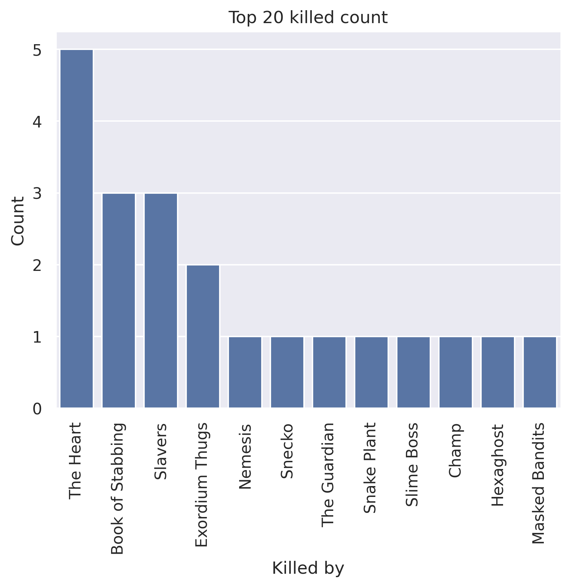
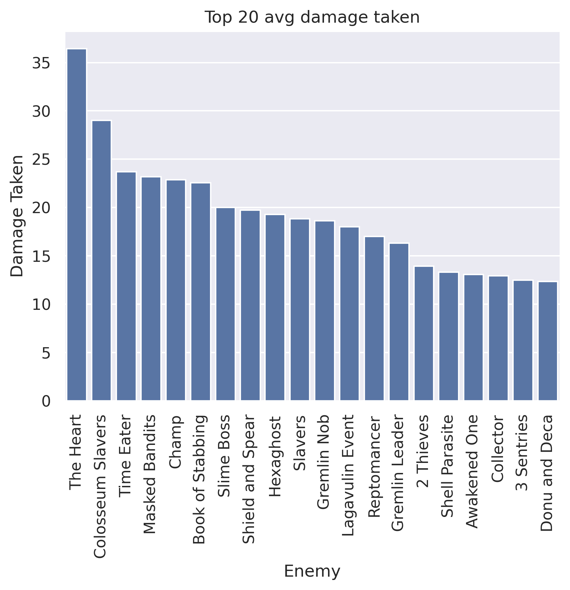
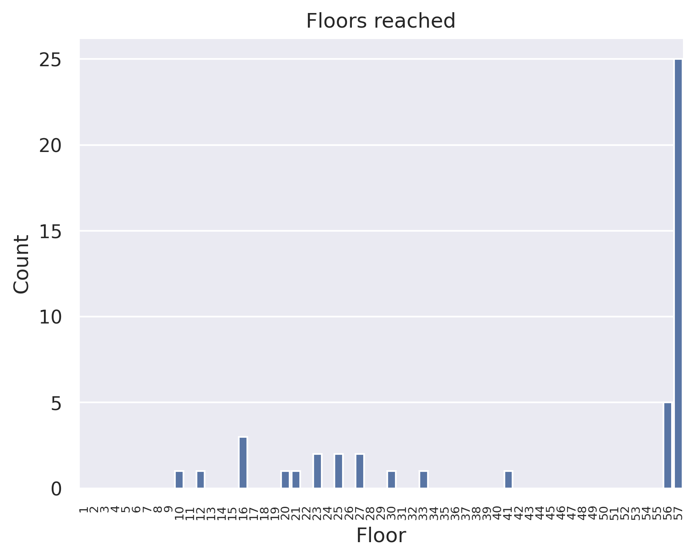
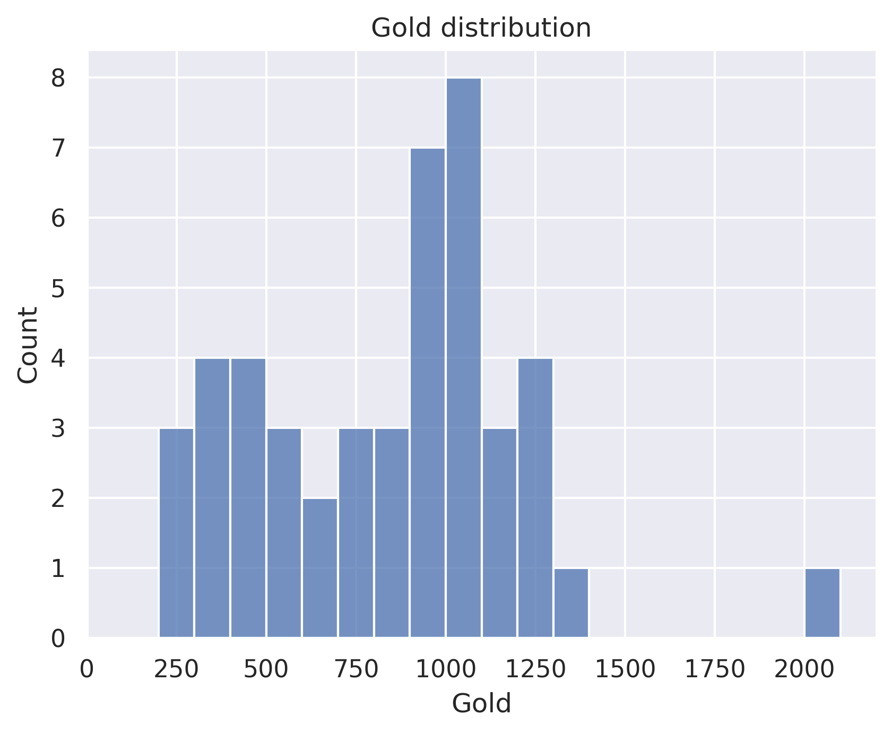

# defect chegs
## General stats
- Total games played: 46
- Win rate (%): 54.35
- Avg playtime (mins): 55.09
- Avg floor reached: 45.0
- Max score: 3512
- Times rest: 1.76
- Times smith: 5.3
- Max hp >= 80: 11
- Max hp <= 40: 0

### Top 10 damage taken fights (excluding heart)
| Enemy            |   Damage Taken |
|------------------|----------------|
| Masked Bandits   |             95 |
| Champ            |             92 |
| Book of Stabbing |             78 |
| Reptomancer      |             73 |
| Time Eater       |             72 |
| Giant Head       |             71 |
| Shield and Spear |             66 |
| Reptomancer      |             66 |
| Giant Head       |             63 |
| Gremlin Leader   |             62 |

## Card stats
### Top 10 card removed count
| Card      |   Count |
|-----------|---------|
| Strike_B  |      30 |
| Zap       |      14 |
| Defend_B  |       9 |
| Normality |       2 |
| Regret    |       2 |
| Reprogram |       2 |
| Writhe    |       2 |
| Claw      |       1 |
| Bite      |       1 |
| Injury    |       1 |

### Top 80 card win rate (exclude duplicate)
| Card               |   Win rate |     | Card             |   Win rate |
|--------------------|------------|-----|------------------|------------|
| After Image        |       1    |     | Auto Shields     |       0.75 |
| Blur               |       1    |     | Parasite         |       0.75 |
| Secret Technique   |       1    |     | Hologram         |       0.74 |
| RitualDagger       |       1    |     | Turbo            |       0.73 |
| Rip and Tear       |       1    |     | Steam            |       0.73 |
| Stack              |       1    |     | Multi-Cast       |       0.71 |
| PanicButton        |       1    |     | Darkness         |       0.71 |
| Steam Power        |       1    |     | Consume          |       0.71 |
| Malaise            |       1    |     | Fission          |       0.7  |
| Madness            |       1    |     | Beam Cell        |       0.69 |
| Leg Sweep          |       1    |     | Sunder           |       0.69 |
| Finesse            |       1    |     | Go for the Eyes  |       0.69 |
| Double Energy      |       1    |     | Sweeping Beam    |       0.68 |
| Disarm             |       1    |     | Rainbow          |       0.67 |
| Thinking Ahead     |       1    |     | CurseOfTheBell   |       0.67 |
| Tempest            |       1    |     | Compile Driver   |       0.67 |
| Thunder Strike     |       1    |     | Fusion           |       0.67 |
| All For One        |       1    |     | Flash of Steel   |       0.67 |
| Apotheosis         |       1    |     | Machine Learning |       0.67 |
| Apparition         |       1    |     | Capacitor        |       0.67 |
| Bite               |       1    |     | Defragment       |       0.65 |
| White Noise        |       1    |     | Coolheaded       |       0.65 |
| Biased Cognition   |       0.85 |     | Cold Snap        |       0.64 |
| Genetic Algorithm  |       0.83 |     | Core Surge       |       0.64 |
| Panacea            |       0.83 |     | Chill            |       0.64 |
| Dark Shackles      |       0.8  |     | Loop             |       0.63 |
| Heatsinks          |       0.8  |     | Skim             |       0.62 |
| Meteor Strike      |       0.8  |     | Conserve Battery |       0.61 |
| Master of Strategy |       0.8  |     | Hyperbeam        |       0.6  |
| Chaos              |       0.8  |     | Buffer           |       0.6  |
| Redo               |       0.79 |     | Discovery        |       0.6  |
| Aggregate          |       0.79 |     | Doom and Gloom   |       0.59 |
| Seek               |       0.79 |     | FTL              |       0.59 |
| Glacier            |       0.77 |     | Reboot           |       0.57 |
| Echo Form          |       0.76 |     | BootSequence     |       0.56 |
| Blind              |       0.75 |     | Hello World      |       0.56 |
| Self Repair        |       0.75 |     | Dualcast         |       0.54 |
| Recycle            |       0.75 |     | Defend_B         |       0.51 |
| Blizzard           |       0.75 |     | Storm            |       0.5  |
| Amplify            |       0.75 |     | Good Instincts   |       0.5  |

### Card pick rate act 1 (exclude boss)
| Card              |   Pick rate |     | Card               |   Pick rate |
|-------------------|-------------|-----|--------------------|-------------|
| Panacea           |        1    |     | Multi-Cast         |        0.2  |
| Biased Cognition  |        1    |     | Rip and Tear       |        0.17 |
| Electrodynamics   |        1    |     | Steam              |        0.16 |
| Echo Form         |        1    |     | Redo               |        0.15 |
| Meditate          |        1    |     | Streamline         |        0.14 |
| Discovery         |        1    |     | Aggregate          |        0.13 |
| Defragment        |        1    |     | Auto Shields       |        0.12 |
| Buffer            |        1    |     | Heatsinks          |        0.11 |
| Glacier           |        1    |     | Rebound            |        0.11 |
| Apotheosis        |        1    |     | Singing Bowl       |        0.1  |
| Tantrum           |        1    |     | SKIP               |        0.1  |
| Chill             |        0.94 |     | Melter             |        0.09 |
| Self Repair       |        0.89 |     | Double Energy      |        0.08 |
| Consume           |        0.8  |     | Go for the Eyes    |        0.07 |
| Coolheaded        |        0.78 |     | Turbo              |        0.07 |
| Fission           |        0.75 |     | Barrage            |        0.07 |
| Core Surge        |        0.75 |     | Tempest            |        0    |
| Cold Snap         |        0.74 |     | Seek               |        0    |
| Sunder            |        0.71 |     | Thunder Strike     |        0    |
| Doom and Gloom    |        0.69 |     | Storm              |        0    |
| Meteor Strike     |        0.67 |     | Steam Power        |        0    |
| Rainbow           |        0.67 |     | Force Field        |        0    |
| Skim              |        0.64 |     | Blizzard           |        0    |
| Conserve Battery  |        0.58 |     | Stack              |        0    |
| Loop              |        0.57 |     | Bullet Time        |        0    |
| Undo              |        0.52 |     | Amplify            |        0    |
| Flash of Steel    |        0.5  |     | Chaos              |        0    |
| Capacitor         |        0.5  |     | Enlightenment      |        0    |
| FTL               |        0.47 |     | Scrape             |        0    |
| Lockon            |        0.47 |     | Poisoned Stab      |        0    |
| BootSequence      |        0.46 |     | Master of Strategy |        0    |
| Darkness          |        0.46 |     | Creative AI        |        0    |
| Genetic Algorithm |        0.44 |     | Finesse            |        0    |
| Static Discharge  |        0.4  |     | Leap               |        0    |
| Ball Lightning    |        0.4  |     | Panache            |        0    |
| Sweeping Beam     |        0.36 |     | PathToVictory      |        0    |
| Reboot            |        0.33 |     | Cleave             |        0    |
| Hello World       |        0.31 |     | Madness            |        0    |
| Hologram          |        0.3  |     | Claw               |        0    |
| White Noise       |        0.29 |     | Forethought        |        0    |
| Beam Cell         |        0.28 |     | Impatience         |        0    |
| Compile Driver    |        0.25 |     | Reinforced Body    |        0    |
| Recycle           |        0.22 |     | Reprogram          |        0    |
| Machine Learning  |        0.2  |     | All For One        |        0    |
| Hyperbeam         |        0.2  |     | Fusion             |        0    |

### Card pick rate after act 1 (exclude boss)
| Card               |   Pick rate |     | Card               |   Pick rate |
|--------------------|-------------|-----|--------------------|-------------|
| Blur               |        1    |     | Static Discharge   |        0.09 |
| Seek               |        1    |     | Beam Cell          |        0.08 |
| Malaise            |        1    |     | Chaos              |        0.07 |
| After Image        |        1    |     | Steam Power        |        0.06 |
| Disarm             |        1    |     | Tempest            |        0.06 |
| Secret Technique   |        1    |     | Auto Shields       |        0.05 |
| Leg Sweep          |        1    |     | Barrage            |        0.04 |
| Echo Form          |        1    |     | Rebound            |        0.03 |
| Apotheosis         |        1    |     | Streamline         |        0.02 |
| Glacier            |        0.94 |     | Stack              |        0.01 |
| Dark Shackles      |        0.83 |     | BowlingBash        |        0    |
| Defragment         |        0.82 |     | Scrape             |        0    |
| Master of Strategy |        0.8  |     | Bouncing Flask     |        0    |
| Rainbow            |        0.8  |     | Violence           |        0    |
| Biased Cognition   |        0.78 |     | All For One        |        0    |
| Core Surge         |        0.75 |     | Blade Dance        |        0    |
| Capacitor          |        0.75 |     | Reprogram          |        0    |
| Skim               |        0.72 |     | Underhanded Strike |        0    |
| Discovery          |        0.67 |     | Rip and Tear       |        0    |
| Coolheaded         |        0.64 |     | Trip               |        0    |
| Loop               |        0.64 |     | Transmutation      |        0    |
| PanicButton        |        0.6  |     | Swift Strike       |        0    |
| Chill              |        0.6  |     | Secret Weapon      |        0    |
| Blind              |        0.6  |     | Sucker Punch       |        0    |
| Sunder             |        0.56 |     | Bandage Up         |        0    |
| Finesse            |        0.5  |     | Ball Lightning     |        0    |
| Undo               |        0.5  |     | Thunder Strike     |        0    |
| Thinking Ahead     |        0.5  |     | Anger              |        0    |
| Aggregate          |        0.47 |     | The Bomb           |        0    |
| Hologram           |        0.46 |     | BattleHymn         |        0    |
| Fission            |        0.45 |     | Eviscerate         |        0    |
| Self Repair        |        0.45 |     | Catalyst           |        0    |
| Heatsinks          |        0.44 |     | Purity             |        0    |
| Compile Driver     |        0.43 |     | Impatience         |        0    |
| Panacea            |        0.43 |     | Hyperbeam          |        0    |
| Consume            |        0.43 |     | Crescendo          |        0    |
| Flash of Steel     |        0.4  |     | Hello World        |        0    |
| Cold Snap          |        0.38 |     | Heel Hook          |        0    |
| Amplify            |        0.38 |     | Crippling Poison   |        0    |
| Reboot             |        0.36 |     | HandOfGreed        |        0    |
| Singing Bowl       |        0.34 |     | Deep Breath        |        0    |
| Meteor Strike      |        0.33 |     | Deflect            |        0    |
| Genetic Algorithm  |        0.33 |     | Forethought        |        0    |
| Reinforced Body    |        0.32 |     | FollowUp           |        0    |
| Double Energy      |        0.31 |     | FlyingSleeves      |        0    |
| Redo               |        0.31 |     | Dramatic Entrance  |        0    |
| Creative AI        |        0.29 |     | EmptyFist          |        0    |
| BootSequence       |        0.28 |     | Enlightenment      |        0    |
| Recycle            |        0.25 |     | Iron Wave          |        0    |
| Buffer             |        0.25 |     | Jack Of All Trades |        0    |
| Electrodynamics    |        0.25 |     | Leap               |        0    |
| Good Instincts     |        0.25 |     | Metamorphosis      |        0    |
| Darkness           |        0.24 |     | Prepared           |        0    |
| White Noise        |        0.23 |     | Pray               |        0    |
| Force Field        |        0.22 |     | Panache            |        0    |
| Turbo              |        0.22 |     | Chrysalis          |        0    |
| Doom and Gloom     |        0.21 |     | Mind Blast         |        0    |
| FTL                |        0.21 |     | Clash              |        0    |
| SKIP               |        0.2  |     | Melter             |        0    |
| Fusion             |        0.19 |     | Lockon             |        0    |
| Multi-Cast         |        0.17 |     | Mayhem             |        0    |
| Machine Learning   |        0.17 |     | Claw               |        0    |
| Conserve Battery   |        0.17 |     | ClearTheMind       |        0    |
| Go for the Eyes    |        0.14 |     | Magnetism          |        0    |
| Steam              |        0.12 |     | Madness            |        0    |
| Sweeping Beam      |        0.11 |     | Cleave             |        0    |
| Storm              |        0.1  |     | Adaptation         |        0    |
| Blizzard           |        0.1  |     |   |   |

## Relic stats
### Top relic win rate
| Relic             |   Win rate |     | Relic             |   Win rate |
|-------------------|------------|-----|-------------------|------------|
| Frozen Eye        |          1 |     | War Paint         |       1    |
| Nilry's Codex     |          1 |     | WarpedTongs       |       1    |
| Dead Branch       |          1 |     | Incense Burner    |       1    |
| Sundial           |          1 |     | InkBottle         |       1    |
| Medical Kit       |          1 |     | Kunai             |       1    |
| Enchiridion       |          1 |     | SacredBark        |       1    |
| Chemical X        |          1 |     | Red Mask          |       1    |
| Nunchaku          |          1 |     | Ornamental Fan    |       1    |
| Strange Spoon     |          1 |     | Darkstone Periapt |       1    |
| StoneCalendar     |          1 |     | Happy Flower      |       0.89 |
| FrozenCore        |          1 |     | DollysMirror      |       0.88 |
| Calipers          |          1 |     | Runic Pyramid     |       0.88 |
| Sozu              |          1 |     | CaptainsWheel     |       0.86 |
| Tiny House        |          1 |     | Art of War        |       0.86 |
| Torii             |          1 |     | Lizard Tail       |       0.86 |
| Ginger            |          1 |     | OrangePellets     |       0.86 |
| Bottled Lightning |          1 |     | Juzu Bracelet     |       0.83 |
| Shovel            |          1 |     | Gambling Chip     |       0.83 |
| Old Coin          |          1 |     | Shuriken          |       0.83 |
| Ice Cream         |          1 |     | Prayer Wheel      |       0.83 |

### Bottom relic win rate
| Relic             |   Win rate |     | Relic            |   Win rate |
|-------------------|------------|-----|------------------|------------|
| Strawberry        |       0.6  |     | HornCleat        |       0.5  |
| Smiling Mask      |       0.6  |     | Lantern          |       0.5  |
| Ancient Tea Set   |       0.57 |     | Meat on the Bone |       0.5  |
| Eternal Feather   |       0.57 |     | Cracked Core     |       0.49 |
| Potion Belt       |       0.57 |     | Cables           |       0.4  |
| Vajra             |       0.55 |     | Blue Candle      |       0.38 |
| FossilizedHelix   |       0.5  |     | Question Card    |       0.33 |
| Blood Vial        |       0.5  |     | Orichalcum       |       0.33 |
| Toolbox           |       0.5  |     | StrikeDummy      |       0.33 |
| Black Star        |       0.5  |     | Runic Capacitor  |       0.25 |
| Thread and Needle |       0.5  |     | Fusion Hammer    |       0.25 |
| Runic Dome        |       0.5  |     | Odd Mushroom     |       0    |
| TungstenRod       |       0.5  |     | Velvet Choker    |       0    |
| PrismaticShard    |       0.5  |     | TheAbacus        |       0    |
| Bottled Flame     |       0.5  |     | Bloody Idol      |       0    |
| Peace Pipe        |       0.5  |     | Nloth's Gift     |       0    |
| Snecko Eye        |       0.5  |     | Busted Crown     |       0    |
| Mercury Hourglass |       0.5  |     | NeowsBlessing    |       0    |
| Golden Idol       |       0.5  |     | Girya            |       0    |
| Regal Pillow      |       0.5  |     | WingedGreaves    |       0    |

### Act 1 boss relic pick rate
| Relic           |   Pick rate |     | Relic               |   Pick rate |
|-----------------|-------------|-----|---------------------|-------------|
| Astrolabe       |        1    |     | Runic Dome          |        0.25 |
| Runic Pyramid   |        1    |     | Snecko Eye          |        0.25 |
| Nuclear Battery |        0.88 |     | FrozenCore          |        0.22 |
| Pandora's Box   |        0.8  |     | Velvet Choker       |        0.2  |
| Inserter        |        0.67 |     | Black Star          |        0.12 |
| Coffee Dripper  |        0.6  |     | Tiny House          |        0.12 |
| Cursed Key      |        0.4  |     | Philosopher's Stone |        0    |
| SlaversCollar   |        0.4  |     | Busted Crown        |        0    |
| Fusion Hammer   |        0.33 |     | SacredBark          |        0    |
| Calling Bell    |        0.33 |     | Ectoplasm           |        0    |
| Empty Cage      |        0.33 |     | Sozu                |        0    |

### Act 1 boss relic win rate
| Relic           |   Win rate |     | Relic          |   Win rate |
|-----------------|------------|-----|----------------|------------|
| Astrolabe       |       1    |     | Inserter       |       0.5  |
| Tiny House      |       1    |     | Cursed Key     |       0.5  |
| FrozenCore      |       1    |     | Calling Bell   |       0.5  |
| Runic Pyramid   |       1    |     | Coffee Dripper |       0.33 |
| Pandora's Box   |       0.75 |     | Black Star     |       0    |
| Empty Cage      |       0.67 |     | Runic Dome     |       0    |
| Nuclear Battery |       0.57 |     | Fusion Hammer  |       0    |
| Snecko Eye      |       0.5  |     | Velvet Choker  |       0    |
| SlaversCollar   |       0.5  |     |   |   |

### Act 2 boss relic pick rate
| Relic           |   Pick rate |     | Relic               |   Pick rate |
|-----------------|-------------|-----|---------------------|-------------|
| Fusion Hammer   |        1    |     | Tiny House          |        0.2  |
| SacredBark      |        1    |     | Runic Dome          |        0.17 |
| Runic Pyramid   |        0.8  |     | Empty Cage          |        0.14 |
| Nuclear Battery |        0.67 |     | Black Star          |        0.12 |
| Cursed Key      |        0.67 |     | FrozenCore          |        0    |
| Coffee Dripper  |        0.57 |     | Pandora's Box       |        0    |
| Astrolabe       |        0.5  |     | Philosopher's Stone |        0    |
| Calling Bell    |        0.5  |     | Busted Crown        |        0    |
| SlaversCollar   |        0.33 |     | Snecko Eye          |        0    |
| Inserter        |        0.25 |     | Velvet Choker       |        0    |
| Sozu            |        0.25 |     |   |   |

### Act 2 boss relic win rate
| Relic         |   Win rate |     | Relic           |   Win rate |
|---------------|------------|-----|-----------------|------------|
| Black Star    |          1 |     | Sozu            |       1    |
| Calling Bell  |          1 |     | Tiny House      |       1    |
| Cursed Key    |          1 |     | Astrolabe       |       0.75 |
| Empty Cage    |          1 |     | Coffee Dripper  |       0.75 |
| Inserter      |          1 |     | Runic Pyramid   |       0.75 |
| Runic Dome    |          1 |     | Nuclear Battery |       0.5  |
| SacredBark    |          1 |     | Fusion Hammer   |       0.33 |
| SlaversCollar |          1 |     |   |   |

