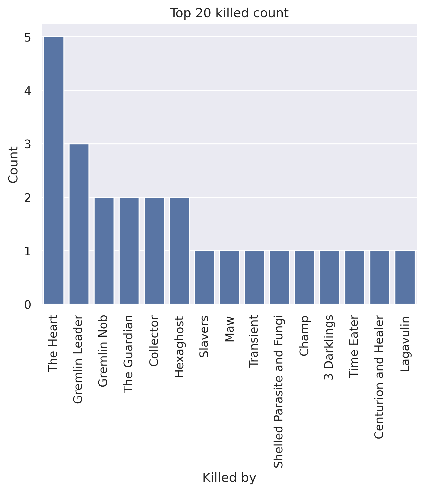

# ironclad chegs
## General stats
- Total games played: 46
- Win rate (%): 45.65
- Avg playtime (mins): 46.43
- Avg floor reached: 43.15
- Max score: 3429
- Times rest: 1.57
- Times smith: 4.35
- Max hp >= 80: 26
- Max hp <= 40: 0

### Top 10 damage taken fights (excluding heart)
| Enemy            |   Damage Taken |
|------------------|----------------|
| Transient        |            127 |
| Time Eater       |             96 |
| Awakened One     |             91 |
| Awakened One     |             90 |
| Gremlin Leader   |             90 |
| Automaton        |             90 |
| Donu and Deca    |             89 |
| Collector        |             86 |
| Shield and Spear |             78 |
| Time Eater       |             77 |

## Card stats
### Top 10 card removed count
| Card      |   Count |
|-----------|---------|
| Strike_R  |      37 |
| Bash      |       4 |
| Doubt     |       3 |
| Bite      |       2 |
| Writhe    |       2 |
| Pain      |       2 |
| Anger     |       2 |
| Normality |       2 |
| Regret    |       2 |
| Defend_R  |       1 |

### Top 80 card win rate (exclude duplicate)
| Card             |   Win rate |     | Card             |   Win rate |
|------------------|------------|-----|------------------|------------|
| Shame            |       1    |     | Bloodletting     |       0.59 |
| Pain             |       1    |     | Flame Barrier    |       0.57 |
| Sword Boomerang  |       1    |     | Dark Embrace     |       0.57 |
| Rampage          |       1    |     | Carnage          |       0.57 |
| Finesse          |       1    |     | Intimidate       |       0.57 |
| Clumsy           |       1    |     | Shrug It Off     |       0.57 |
| Chrysalis        |       1    |     | Power Through    |       0.57 |
| Injury           |       1    |     | Fiend Fire       |       0.56 |
| Secret Technique |       1    |     | Second Wind      |       0.56 |
| Discovery        |       1    |     | Havoc            |       0.56 |
| Apparition       |       1    |     | Immolate         |       0.55 |
| Purity           |       1    |     | True Grit        |       0.54 |
| Wild Strike      |       1    |     | Blood for Blood  |       0.53 |
| Body Slam        |       0.88 |     | Impervious       |       0.53 |
| Entrench         |       0.86 |     | Armaments        |       0.53 |
| Dark Shackles    |       0.86 |     | Perfected Strike |       0.5  |
| Reaper           |       0.81 |     | Ghostly Armor    |       0.5  |
| Double Tap       |       0.8  |     | Violence         |       0.5  |
| Barricade        |       0.77 |     | Cleave           |       0.5  |
| Sentinel         |       0.75 |     | Combust          |       0.5  |
| Whirlwind        |       0.71 |     | Trip             |       0.5  |
| Shockwave        |       0.71 |     | Dual Wield       |       0.5  |
| Disarm           |       0.68 |     | Rupture          |       0.5  |
| Fire Breathing   |       0.67 |     | Pommel Strike    |       0.48 |
| Apotheosis       |       0.67 |     | Headbutt         |       0.48 |
| Spot Weakness    |       0.67 |     | Inflame          |       0.47 |
| Pummel           |       0.67 |     | Metallicize      |       0.45 |
| Heavy Blade      |       0.67 |     | Battle Trance    |       0.45 |
| Flash of Steel   |       0.67 |     | Defend_R         |       0.45 |
| Rage             |       0.67 |     | Demon Form       |       0.43 |
| Clothesline      |       0.67 |     | Seeing Red       |       0.4  |
| Warcry           |       0.67 |     | Bash             |       0.4  |
| Corruption       |       0.64 |     | Strike_R         |       0.4  |
| Exhume           |       0.64 |     | Writhe           |       0.33 |
| Burning Pact     |       0.64 |     | PanicButton      |       0.33 |
| Feed             |       0.62 |     | Iron Wave        |       0.33 |
| Feel No Pain     |       0.6  |     | Bite             |       0.33 |
| Offering         |       0.6  |     | Brutality        |       0.33 |
| Limit Break      |       0.6  |     | Dropkick         |       0.33 |
| Evolve           |       0.6  |     | Hemokinesis      |       0.29 |

### Card pick rate act 1 (exclude boss)
| Card             |   Pick rate |     | Card            |   Pick rate |
|------------------|-------------|-----|-----------------|-------------|
| Shockwave        |        1    |     | Evolve          |        0.25 |
| Reaper           |        1    |     | Intimidate      |        0.25 |
| Violence         |        1    |     | Iron Wave       |        0.24 |
| Fiend Fire       |        1    |     | Seeing Red      |        0.23 |
| Trip             |        1    |     | Sentinel        |        0.2  |
| Madness          |        1    |     | Twin Strike     |        0.19 |
| Power Through    |        0.83 |     | Combust         |        0.18 |
| Pommel Strike    |        0.81 |     | Entrench        |        0.14 |
| Feed             |        0.8  |     | Fire Breathing  |        0.13 |
| Disarm           |        0.78 |     | Ghostly Armor   |        0.12 |
| Impervious       |        0.75 |     | Dropkick        |        0.12 |
| Hemokinesis      |        0.71 |     | SKIP            |        0.12 |
| Inflame          |        0.69 |     | Dual Wield      |        0.11 |
| Shrug It Off     |        0.69 |     | Dark Embrace    |        0.11 |
| Burning Pact     |        0.67 |     | Havoc           |        0.1  |
| Immolate         |        0.67 |     | Rampage         |        0.07 |
| Exhume           |        0.67 |     | Wild Strike     |        0.06 |
| Whirlwind        |        0.62 |     | Cleave          |        0.05 |
| Anger            |        0.57 |     | Clash           |        0.04 |
| Headbutt         |        0.57 |     | Warcry          |        0.04 |
| Spot Weakness    |        0.56 |     | Body Slam       |        0.03 |
| Bloodletting     |        0.56 |     | Reckless Charge |        0    |
| Second Wind      |        0.53 |     | The Bomb        |        0    |
| Demon Form       |        0.5  |     | Flex            |        0    |
| Double Tap       |        0.5  |     | Berserk         |        0    |
| Metallicize      |        0.5  |     | Heavy Blade     |        0    |
| Brutality        |        0.5  |     | Juggernaut      |        0    |
| Blood for Blood  |        0.5  |     | True Grit       |        0    |
| Battle Trance    |        0.5  |     | Thunderclap     |        0    |
| Corruption       |        0.5  |     | Thinking Ahead  |        0    |
| Offering         |        0.4  |     | Sword Boomerang |        0    |
| Uppercut         |        0.4  |     | Rupture         |        0    |
| Infernal Blade   |        0.4  |     | Limit Break     |        0    |
| Singing Bowl     |        0.36 |     | Mind Blast      |        0    |
| Bludgeon         |        0.33 |     | Sever Soul      |        0    |
| Feel No Pain     |        0.33 |     | Deep Breath     |        0    |
| Armaments        |        0.33 |     | Pummel          |        0    |
| Clothesline      |        0.3  |     | Purity          |        0    |
| Perfected Strike |        0.27 |     | Searing Blow    |        0    |
| Carnage          |        0.27 |     | Rage            |        0    |
| Barricade        |        0.25 |     | Forethought     |        0    |
| Flame Barrier    |        0.25 |     |   |   |

### Card pick rate after act 1 (exclude boss)
| Card             |   Pick rate |     | Card               |   Pick rate |
|------------------|-------------|-----|--------------------|-------------|
| Impervious       |        1    |     | Ghostly Armor      |        0.12 |
| Chrysalis        |        1    |     | Havoc              |        0.11 |
| Offering         |        1    |     | Carnage            |        0.11 |
| Secret Technique |        1    |     | Whirlwind          |        0.11 |
| Secret Weapon    |        1    |     | Rupture            |        0.1  |
| Apotheosis       |        1    |     | Inflame            |        0.1  |
| Finesse          |        1    |     | Anger              |        0.09 |
| Exhume           |        1    |     | Rage               |        0.08 |
| Discovery        |        1    |     | Sentinel           |        0.08 |
| Dark Shackles    |        1    |     | Clothesline        |        0.06 |
| Burning Pact     |        0.94 |     | Perfected Strike   |        0.05 |
| Shockwave        |        0.85 |     | Infernal Blade     |        0.05 |
| Barricade        |        0.83 |     | Combust            |        0.05 |
| Disarm           |        0.76 |     | Flex               |        0.03 |
| Power Through    |        0.74 |     | Twin Strike        |        0.02 |
| Shrug It Off     |        0.69 |     | Sword Boomerang    |        0.02 |
| Feel No Pain     |        0.67 |     | Clash              |        0    |
| Corruption       |        0.67 |     | Sever Soul         |        0    |
| Reaper           |        0.6  |     | Double Tap         |        0    |
| Brutality        |        0.5  |     | Deep Breath        |        0    |
| Bloodletting     |        0.5  |     | Bandage Up         |        0    |
| Flash of Steel   |        0.5  |     | Berserk            |        0    |
| Feed             |        0.5  |     | Swift Strike       |        0    |
| Dual Wield       |        0.44 |     | The Bomb           |        0    |
| Second Wind      |        0.41 |     | Cleave             |        0    |
| Dark Embrace     |        0.38 |     | Blind              |        0    |
| Entrench         |        0.36 |     | Thinking Ahead     |        0    |
| Flame Barrier    |        0.33 |     | Dramatic Entrance  |        0    |
| Immolate         |        0.33 |     | Bludgeon           |        0    |
| Limit Break      |        0.33 |     | Transmutation      |        0    |
| Violence         |        0.33 |     | Thunderclap        |        0    |
| Fiend Fire       |        0.33 |     | Juggernaut         |        0    |
| Pommel Strike    |        0.32 |     | Fire Breathing     |        0    |
| Spot Weakness    |        0.32 |     | Impatience         |        0    |
| Uppercut         |        0.31 |     | Magnetism          |        0    |
| Blood for Blood  |        0.29 |     | Mayhem             |        0    |
| True Grit        |        0.28 |     | Jack Of All Trades |        0    |
| SKIP             |        0.28 |     | Mind Blast         |        0    |
| Singing Bowl     |        0.27 |     | Iron Wave          |        0    |
| Demon Form       |        0.25 |     | Panacea            |        0    |
| Evolve           |        0.23 |     | Panache            |        0    |
| Seeing Red       |        0.21 |     | PanicButton        |        0    |
| Intimidate       |        0.21 |     | Hemokinesis        |        0    |
| Trip             |        0.2  |     | Madness            |        0    |
| Enlightenment    |        0.2  |     | Rampage            |        0    |
| Headbutt         |        0.2  |     | Heavy Blade        |        0    |
| Body Slam        |        0.18 |     | Reckless Charge    |        0    |
| Dropkick         |        0.17 |     | HandOfGreed        |        0    |
| Armaments        |        0.16 |     | Good Instincts     |        0    |
| Warcry           |        0.16 |     | Sadistic Nature    |        0    |
| Battle Trance    |        0.15 |     | Searing Blow       |        0    |
| Metallicize      |        0.15 |     | Forethought        |        0    |
| Pummel           |        0.12 |     | Wild Strike        |        0    |

## Relic stats
### Top relic win rate
| Relic               |   Win rate |     | Relic             |   Win rate |
|---------------------|------------|-----|-------------------|------------|
| WingedGreaves       |          1 |     | Dead Branch       |       1    |
| Peace Pipe          |          1 |     | Cursed Key        |       0.88 |
| DollysMirror        |          1 |     | SlaversCollar     |       0.86 |
| Empty Cage          |          1 |     | MealTicket        |       0.86 |
| Enchiridion         |          1 |     | Akabeko           |       0.86 |
| Gambling Chip       |          1 |     | Bottled Lightning |       0.86 |
| Ginger              |          1 |     | StoneCalendar     |       0.83 |
| Brimstone           |          1 |     | Fusion Hammer     |       0.83 |
| Bottled Tornado     |          1 |     | Ornamental Fan    |       0.83 |
| Nilry's Codex       |          1 |     | Paper Frog        |       0.83 |
| Bottled Flame       |          1 |     | Red Mask          |       0.8  |
| OrangePellets       |          1 |     | Orrery            |       0.8  |
| Philosopher's Stone |          1 |     | Ice Cream         |       0.8  |
| Runic Dome          |          1 |     | Pen Nib           |       0.8  |
| Bird Faced Urn      |          1 |     | InkBottle         |       0.78 |
| TheAbacus           |          1 |     | Snecko Eye        |       0.75 |
| Torii               |          1 |     | Red Skull         |       0.75 |
| Astrolabe           |          1 |     | Toolbox           |       0.75 |
| Whetstone           |          1 |     | Toxic Egg 2       |       0.75 |
| White Beast Statue  |          1 |     | Sundial           |       0.75 |

### Bottom relic win rate
| Relic           |   Win rate |     | Relic             |   Win rate |
|-----------------|------------|-----|-------------------|------------|
| Bronze Scales   |       0.5  |     | Lee's Waffle      |       0.33 |
| Golden Idol     |       0.5  |     | Bag of Marbles    |       0.29 |
| FossilizedHelix |       0.5  |     | Molten Egg 2      |       0.2  |
| Mango           |       0.5  |     | Orichalcum        |       0.17 |
| Lizard Tail     |       0.5  |     | Strawberry        |       0.14 |
| CaptainsWheel   |       0.5  |     | Kunai             |       0    |
| Pandora's Box   |       0.5  |     | Calling Bell      |       0    |
| Gremlin Horn    |       0.44 |     | Black Blood       |       0    |
| Coffee Dripper  |       0.44 |     | Pocketwatch       |       0    |
| Burning Blood   |       0.44 |     | Odd Mushroom      |       0    |
| Anchor          |       0.44 |     | Ectoplasm         |       0    |
| CeramicFish     |       0.43 |     | Necronomicon      |       0    |
| Blue Candle     |       0.43 |     | Matryoshka        |       0    |
| Calipers        |       0.4  |     | Black Star        |       0    |
| Pear            |       0.4  |     | Busted Crown      |       0    |
| Mark of Pain    |       0.33 |     | MutagenicStrength |       0    |
| The Courier     |       0.33 |     | Sozu              |       0    |
| PreservedInsect |       0.33 |     | Girya             |       0    |
| WarpedTongs     |       0.33 |     | SacredBark        |       0    |
| Old Coin        |       0.33 |     | Strange Spoon     |       0    |

### Act 1 boss relic pick rate
| Relic          |   Pick rate |     | Relic               |   Pick rate |
|----------------|-------------|-----|---------------------|-------------|
| Runic Pyramid  |        1    |     | Velvet Choker       |        0.2  |
| Coffee Dripper |        0.83 |     | Ectoplasm           |        0.2  |
| Runic Cube     |        0.75 |     | Black Blood         |        0.17 |
| Black Star     |        0.67 |     | Calling Bell        |        0.17 |
| Cursed Key     |        0.62 |     | Philosopher's Stone |        0    |
| Fusion Hammer  |        0.6  |     | Runic Dome          |        0    |
| Mark of Pain   |        0.6  |     | SacredBark          |        0    |
| Snecko Eye     |        0.5  |     | SlaversCollar       |        0    |
| Pandora's Box  |        0.33 |     | Busted Crown        |        0    |
| Sozu           |        0.33 |     | Tiny House          |        0    |
| Empty Cage     |        0.27 |     | Astrolabe           |        0    |

### Act 1 boss relic win rate
| Relic         |   Win rate |     | Relic          |   Win rate |
|---------------|------------|-----|----------------|------------|
| Empty Cage    |       1    |     | Coffee Dripper |        0.2 |
| Fusion Hammer |       1    |     | Black Blood    |        0   |
| Velvet Choker |       1    |     | Black Star     |        0   |
| Cursed Key    |       0.8  |     | Calling Bell   |        0   |
| Runic Pyramid |       0.8  |     | Ectoplasm      |        0   |
| Runic Cube    |       0.67 |     | Pandora's Box  |        0   |
| Snecko Eye    |       0.67 |     | Sozu           |        0   |
| Mark of Pain  |       0.33 |     |   |   |

### Act 2 boss relic pick rate
| Relic               |   Pick rate |     | Relic         |   Pick rate |
|---------------------|-------------|-----|---------------|-------------|
| Cursed Key          |        0.75 |     | Runic Dome    |         0.2 |
| Fusion Hammer       |        0.75 |     | Astrolabe     |         0.2 |
| SlaversCollar       |        0.7  |     | Runic Cube    |         0   |
| Coffee Dripper      |        0.67 |     | Black Blood   |         0   |
| Philosopher's Stone |        0.5  |     | Mark of Pain  |         0   |
| Runic Pyramid       |        0.5  |     | Busted Crown  |         0   |
| SacredBark          |        0.4  |     | Black Star    |         0   |
| Empty Cage          |        0.4  |     | Sozu          |         0   |
| Velvet Choker       |        0.33 |     | Tiny House    |         0   |
| Calling Bell        |        0.29 |     | Pandora's Box |         0   |

### Act 2 boss relic win rate
| Relic               |   Win rate |     | Relic          |   Win rate |
|---------------------|------------|-----|----------------|------------|
| Astrolabe           |       1    |     | Coffee Dripper |       0.75 |
| Cursed Key          |       1    |     | Fusion Hammer  |       0.67 |
| Empty Cage          |       1    |     | Runic Pyramid  |       0.5  |
| Philosopher's Stone |       1    |     | Calling Bell   |       0    |
| Runic Dome          |       1    |     | SacredBark     |       0    |
| SlaversCollar       |       0.86 |     | Velvet Choker  |       0    |

