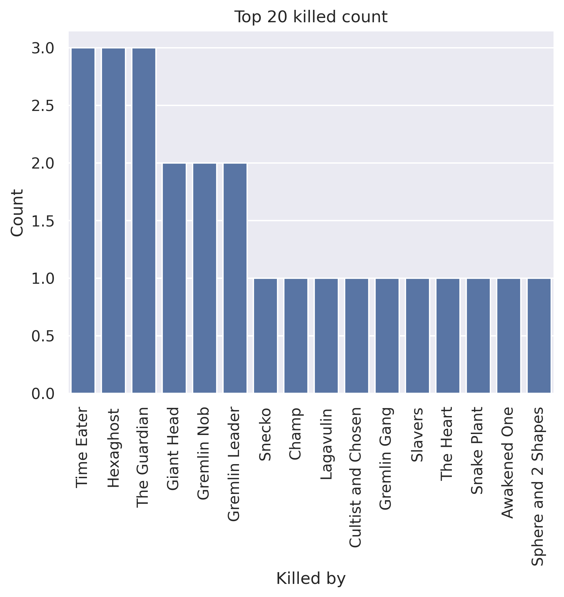
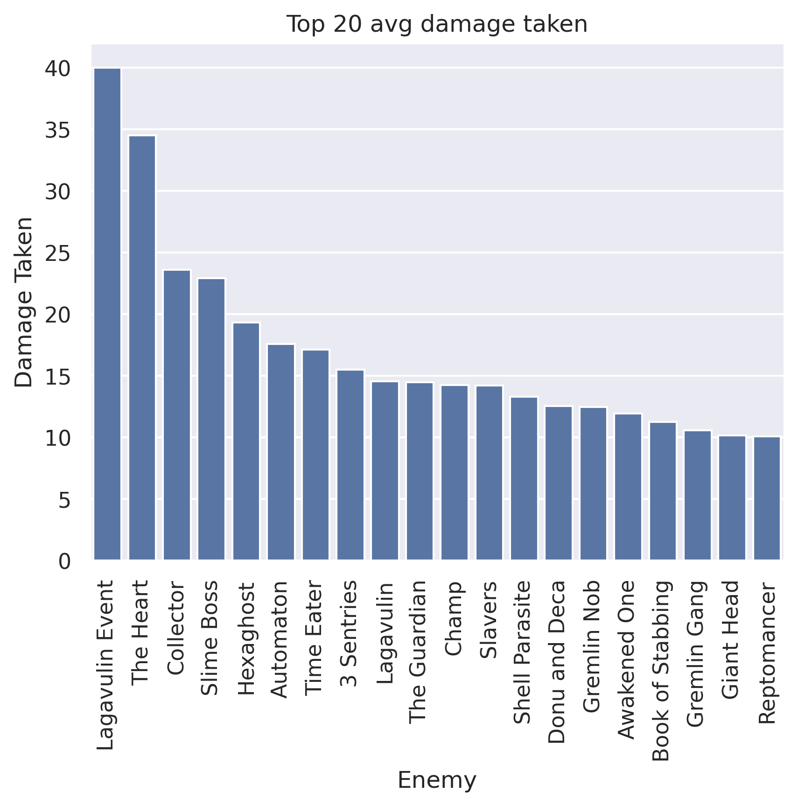
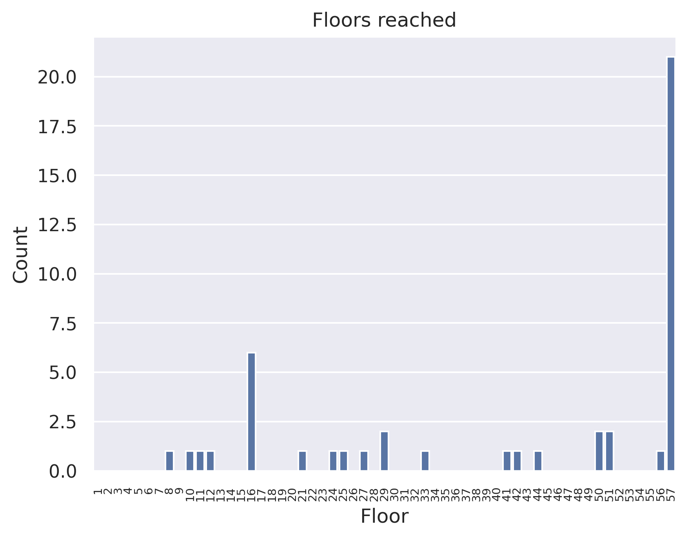
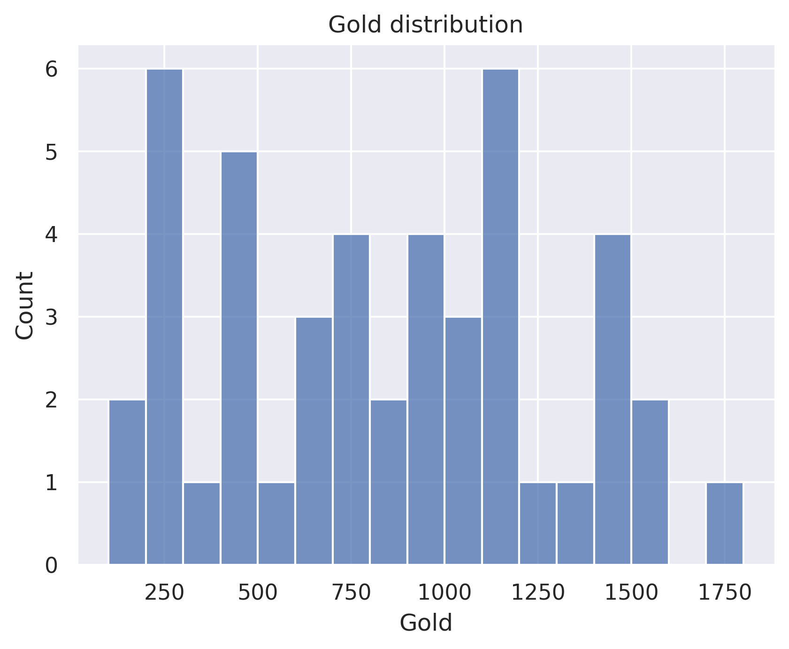

# silent chegs
## General stats
- Total games played: 46
- Win rate (%): 45.65
- Avg playtime (mins): 47.97
- Avg floor reached: 41.46
- Max score: 3489
- Times rest: 1.7
- Times smith: 4.54
- Max hp >= 80: 4
- Max hp <= 40: 1

### Top 10 damage taken fights (excluding heart)
| Enemy            |   Damage Taken |
|------------------|----------------|
| Time Eater       |             77 |
| Champ            |             73 |
| Book of Stabbing |             64 |
| Donu and Deca    |             62 |
| Awakened One     |             58 |
| Collector        |             57 |
| Giant Head       |             54 |
| Hexaghost        |             53 |
| Book of Stabbing |             50 |
| Reptomancer      |             50 |

## Card stats
### Top 10 card removed count
| Card           |   Count |
|----------------|---------|
| Strike_G       |      28 |
| Defend_G       |       7 |
| Normality      |       3 |
| Writhe         |       2 |
| Regret         |       2 |
| Glass Knife    |       2 |
| All Out Attack |       1 |
| Shame          |       1 |
| Dash           |       1 |
| Masterful Stab |       1 |

### Top 80 card win rate (exclude duplicate)
| Card               |   Win rate |     | Card               |   Win rate |
|--------------------|------------|-----|--------------------|------------|
| PanicButton        |       1    |     | Footwork           |       0.67 |
| Discovery          |       1    |     | Writhe             |       0.67 |
| Dramatic Entrance  |       1    |     | Crippling Poison   |       0.67 |
| Panacea            |       1    |     | Bandage Up         |       0.67 |
| Reinforced Body    |       1    |     | Bouncing Flask     |       0.67 |
| Blind              |       1    |     | Setup              |       0.6  |
| Secret Technique   |       1    |     | Dash               |       0.6  |
| Panache            |       1    |     | Backstab           |       0.59 |
| Inflame            |       1    |     | Escape Plan        |       0.58 |
| Parasite           |       1    |     | Acrobatics         |       0.58 |
| Impervious         |       1    |     | PiercingWail       |       0.58 |
| Turbo              |       1    |     | Deflect            |       0.57 |
| Amplify            |       1    |     | Reflex             |       0.57 |
| All Out Attack     |       1    |     | Predator           |       0.56 |
| Flash of Steel     |       1    |     | Backflip           |       0.56 |
| Concentrate        |       1    |     | Dagger Throw       |       0.55 |
| Blur               |       0.92 |     | Calculated Gamble  |       0.55 |
| Apotheosis         |       0.83 |     | Well Laid Plans    |       0.54 |
| Corpse Explosion   |       0.81 |     | Blade Dance        |       0.54 |
| Catalyst           |       0.81 |     | Dodge and Roll     |       0.53 |
| Night Terror       |       0.8  |     | Skewer             |       0.5  |
| Adrenaline         |       0.8  |     | Choke              |       0.5  |
| Malaise            |       0.78 |     | Bite               |       0.5  |
| Burst              |       0.78 |     | Dark Shackles      |       0.5  |
| After Image        |       0.77 |     | Endless Agony      |       0.5  |
| Envenom            |       0.75 |     | Heel Hook          |       0.5  |
| Prepared           |       0.75 |     | Infinite Blades    |       0.5  |
| Doppelganger       |       0.75 |     | Flechettes         |       0.5  |
| CurseOfTheBell     |       0.75 |     | Grand Finale       |       0.5  |
| RitualDagger       |       0.75 |     | Master of Strategy |       0.5  |
| Wraith Form        |       0.75 |     | Deadly Poison      |       0.5  |
| Terror             |       0.74 |     | Outmaneuver        |       0.46 |
| Cloak And Dagger   |       0.71 |     | Survivor           |       0.46 |
| Tools of the Trade |       0.7  |     | Neutralize         |       0.46 |
| Tactician          |       0.69 |     | Sucker Punch       |       0.44 |
| Alchemize          |       0.69 |     | Poisoned Stab      |       0.43 |
| Leg Sweep          |       0.68 |     | Dagger Spray       |       0.4  |
| Noxious Fumes      |       0.67 |     | Defend_G           |       0.4  |
| Storm of Steel     |       0.67 |     | Strike_G           |       0.38 |
| Accuracy           |       0.67 |     | Flying Knee        |       0.38 |

### Card pick rate act 1 (exclude boss)
| Card               |   Pick rate |     | Card               |   Pick rate |
|--------------------|-------------|-----|--------------------|-------------|
| Wraith Form        |        1    |     | Catalyst           |        0.25 |
| Terror             |        1    |     | Deflect            |        0.22 |
| Dramatic Entrance  |        1    |     | Slice              |        0.22 |
| Glass Knife        |        1    |     | Dagger Spray       |        0.21 |
| Leg Sweep          |        1    |     | Eviscerate         |        0.18 |
| Dark Shackles      |        1    |     | Underhanded Strike |        0.18 |
| Malaise            |        1    |     | Poisoned Stab      |        0.16 |
| Corpse Explosion   |        1    |     | Quick Slash        |        0.13 |
| Master of Strategy |        1    |     | Sucker Punch       |        0.12 |
| Phantasmal Killer  |        1    |     | Accuracy           |        0.11 |
| Doppelganger       |        1    |     | SKIP               |        0.11 |
| Discovery          |        1    |     | All Out Attack     |        0.08 |
| After Image        |        1    |     | Cloak And Dagger   |        0.08 |
| Tools of the Trade |        1    |     | Prepared           |        0.07 |
| Alchemize          |        1    |     | Skewer             |        0.07 |
| Well Laid Plans    |        0.93 |     | Finisher           |        0.07 |
| Footwork           |        0.92 |     | Riddle With Holes  |        0.07 |
| Backstab           |        0.82 |     | Choke              |        0.07 |
| Calculated Gamble  |        0.82 |     | Dodge and Roll     |        0.05 |
| Noxious Fumes      |        0.75 |     | Deadly Poison      |        0.04 |
| Blade Dance        |        0.72 |     | Caltrops           |        0    |
| Backflip           |        0.7  |     | Grand Finale       |        0    |
| Bullet Time        |        0.67 |     | Expertise          |        0    |
| Crippling Poison   |        0.57 |     | Unload             |        0    |
| PiercingWail       |        0.56 |     | Flash of Steel     |        0    |
| Masterful Stab     |        0.53 |     | Bane               |        0    |
| Night Terror       |        0.5  |     | Blind              |        0    |
| Burst              |        0.5  |     | Tactician          |        0    |
| Adrenaline         |        0.5  |     | Flechettes         |        0    |
| Envenom            |        0.5  |     | Deep Breath        |        0    |
| Acrobatics         |        0.5  |     | Setup              |        0    |
| Dagger Throw       |        0.47 |     | PanicButton        |        0    |
| Predator           |        0.42 |     | Sadistic Nature    |        0    |
| A Thousand Cuts    |        0.38 |     | Heel Hook          |        0    |
| Flying Knee        |        0.35 |     | Impatience         |        0    |
| Die Die Die        |        0.33 |     | Reflex             |        0    |
| Endless Agony      |        0.33 |     | Concentrate        |        0    |
| Escape Plan        |        0.33 |     | Purity             |        0    |
| Storm of Steel     |        0.33 |     | Metamorphosis      |        0    |
| Infinite Blades    |        0.31 |     | Blur               |        0    |
| Dash               |        0.27 |     | Distraction        |        0    |
| Bouncing Flask     |        0.27 |     | Outmaneuver        |        0    |

### Card pick rate after act 1 (exclude boss)
| Card               |   Pick rate |     | Card               |   Pick rate |
|--------------------|-------------|-----|--------------------|-------------|
| Wraith Form        |        1    |     | Poisoned Stab      |        0.02 |
| Panache            |        1    |     | Deadly Poison      |        0.02 |
| Burst              |        1    |     | Slice              |        0.02 |
| Turbo              |        1    |     | Flying Knee        |        0.02 |
| Flash of Steel     |        1    |     | WindmillStrike     |        0    |
| Blind              |        1    |     | Power Through      |        0    |
| Inflame            |        1    |     | Unload             |        0    |
| Reinforced Body    |        1    |     | Twin Strike        |        0    |
| Dark Shackles      |        1    |     | Violence           |        0    |
| Night Terror       |        1    |     | Protect            |        0    |
| Apotheosis         |        1    |     | Trip               |        0    |
| Amplify            |        1    |     | Purity             |        0    |
| PanicButton        |        1    |     | Quick Slash        |        0    |
| After Image        |        1    |     | Streamline         |        0    |
| Adrenaline         |        1    |     | Wild Strike        |        0    |
| Phantasmal Killer  |        0.8  |     | Riddle With Holes  |        0    |
| Footwork           |        0.74 |     | ThirdEye           |        0    |
| Calculated Gamble  |        0.73 |     | Secret Technique   |        0    |
| Malaise            |        0.67 |     | Secret Weapon      |        0    |
| Acrobatics         |        0.63 |     | The Bomb           |        0    |
| Tactician          |        0.62 |     | Skewer             |        0    |
| PiercingWail       |        0.62 |     | Swift Strike       |        0    |
| Backflip           |        0.62 |     | Static Discharge   |        0    |
| Bandage Up         |        0.6  |     | Uppercut           |        0    |
| Catalyst           |        0.55 |     | Thinking Ahead     |        0    |
| Leg Sweep          |        0.52 |     | A Thousand Cuts    |        0    |
| Blur               |        0.52 |     | Perfected Strike   |        0    |
| Panacea            |        0.5  |     | Deep Breath        |        0    |
| Singing Bowl       |        0.5  |     | Evaluate           |        0    |
| Die Die Die        |        0.5  |     | Envenom            |        0    |
| Well Laid Plans    |        0.46 |     | Enlightenment      |        0    |
| Escape Plan        |        0.38 |     | EmptyFist          |        0    |
| Alchemize          |        0.38 |     | Dramatic Entrance  |        0    |
| Blade Dance        |        0.37 |     | Distraction        |        0    |
| Deflect            |        0.34 |     | Discovery          |        0    |
| Tools of the Trade |        0.33 |     | Compile Driver     |        0    |
| Corpse Explosion   |        0.33 |     | Mind Blast         |        0    |
| Doppelganger       |        0.33 |     | Cleave             |        0    |
| Noxious Fumes      |        0.32 |     | Chrysalis          |        0    |
| Bouncing Flask     |        0.31 |     | Choke              |        0    |
| Reflex             |        0.29 |     | Caltrops           |        0    |
| Terror             |        0.29 |     | BowlingBash        |        0    |
| Crippling Poison   |        0.28 |     | Bane               |        0    |
| Concentrate        |        0.25 |     | All Out Attack     |        0    |
| Outmaneuver        |        0.24 |     | Eviscerate         |        0    |
| SKIP               |        0.23 |     | Expertise          |        0    |
| Dodge and Roll     |        0.21 |     | Finesse            |        0    |
| Accuracy           |        0.21 |     | Flex               |        0    |
| Bullet Time        |        0.2  |     | Metallicize        |        0    |
| Backstab           |        0.17 |     | Melter             |        0    |
| Storm of Steel     |        0.17 |     | Magnetism          |        0    |
| Prepared           |        0.16 |     | Madness            |        0    |
| Flechettes         |        0.12 |     | Lockon             |        0    |
| Setup              |        0.12 |     | Jack Of All Trades |        0    |
| Underhanded Strike |        0.11 |     | Iron Wave          |        0    |
| Cloak And Dagger   |        0.11 |     | Infinite Blades    |        0    |
| Endless Agony      |        0.1  |     | Impatience         |        0    |
| Dash               |        0.1  |     | Heel Hook          |        0    |
| Finisher           |        0.09 |     | Grand Finale       |        0    |
| Sucker Punch       |        0.08 |     | Glass Knife        |        0    |
| Masterful Stab     |        0.07 |     | Forethought        |        0    |
| Dagger Spray       |        0.06 |     | FlyingSleeves      |        0    |
| Dagger Throw       |        0.06 |     | FlurryOfBlows      |        0    |
| Predator           |        0.04 |     | Heavy Blade        |        0    |

## Relic stats
### Top relic win rate
| Relic               |   Win rate |     | Relic              |   Win rate |
|---------------------|------------|-----|--------------------|------------|
| Enchiridion         |          1 |     | StrikeDummy        |       1    |
| Philosopher's Stone |          1 |     | Nloth's Gift       |       1    |
| StoneCalendar       |          1 |     | Astrolabe          |       1    |
| Dead Branch         |          1 |     | Thread and Needle  |       1    |
| DollysMirror        |          1 |     | Bird Faced Urn     |       1    |
| Shuriken            |          1 |     | Unceasing Top      |       1    |
| Nilry's Codex       |          1 |     | Toolbox            |       1    |
| PrismaticShard      |          1 |     | Black Star         |       1    |
| Prayer Wheel        |          1 |     | TheAbacus          |       1    |
| Girya               |          1 |     | Happy Flower       |       0.89 |
| HornCleat           |          1 |     | Ancient Tea Set    |       0.88 |
| Chemical X          |          1 |     | Question Card      |       0.88 |
| HoveringKite        |          1 |     | Ornamental Fan     |       0.86 |
| Ice Cream           |          1 |     | Whetstone          |       0.86 |
| Juzu Bracelet       |          1 |     | Red Mask           |       0.86 |
| Peace Pipe          |          1 |     | InkBottle          |       0.83 |
| Mark of the Bloom   |          1 |     | Potion Belt        |       0.83 |
| OrangePellets       |          1 |     | Mango              |       0.83 |
| Medical Kit         |          1 |     | Pandora's Box      |       0.8  |
| Old Coin            |          1 |     | Oddly Smooth Stone |       0.8  |

### Bottom relic win rate
| Relic              |   Win rate |     | Relic           |   Win rate |
|--------------------|------------|-----|-----------------|------------|
| SlaversCollar      |       0.5  |     | WarpedTongs     |       0.33 |
| Bottled Tornado    |       0.5  |     | Mummified Hand  |       0.33 |
| Bottled Lightning  |       0.5  |     | Odd Mushroom    |       0.33 |
| Torii              |       0.5  |     | Ginger          |       0.33 |
| Tough Bandages     |       0.5  |     | Lee's Waffle    |       0.33 |
| Runic Dome         |       0.5  |     | Incense Burner  |       0.33 |
| Frozen Egg 2       |       0.5  |     | Membership Card |       0.25 |
| Frozen Eye         |       0.5  |     | Omamori         |       0.25 |
| CaptainsWheel      |       0.5  |     | Regal Pillow    |       0.2  |
| Mercury Hourglass  |       0.5  |     | Dream Catcher   |       0.17 |
| Blue Candle        |       0.5  |     | Golden Idol     |       0.14 |
| Pocketwatch        |       0.5  |     | Pear            |       0    |
| PreservedInsect    |       0.5  |     | Orichalcum      |       0    |
| Ring of the Snake  |       0.45 |     | Busted Crown    |       0    |
| Boot               |       0.44 |     | The Specimen    |       0    |
| Darkstone Periapt  |       0.4  |     | Eternal Feather |       0    |
| Cursed Key         |       0.4  |     | Empty Cage      |       0    |
| Bag of Preparation |       0.38 |     | Ectoplasm       |       0    |
| Bottled Flame      |       0.33 |     | Necronomicon    |       0    |
| Turnip             |       0.33 |     | Singing Bowl    |       0    |

### Act 1 boss relic pick rate
| Relic               |   Pick rate |     | Relic               |   Pick rate |
|---------------------|-------------|-----|---------------------|-------------|
| Philosopher's Stone |        1    |     | Black Star          |        0.2  |
| Pandora's Box       |        1    |     | Sozu                |        0.2  |
| Fusion Hammer       |        0.88 |     | Ectoplasm           |        0.17 |
| Runic Pyramid       |        0.8  |     | HoveringKite        |        0.14 |
| Coffee Dripper      |        0.71 |     | Empty Cage          |        0    |
| Astrolabe           |        0.5  |     | Ring of the Serpent |        0    |
| Cursed Key          |        0.5  |     | Busted Crown        |        0    |
| Calling Bell        |        0.5  |     | Snecko Eye          |        0    |
| Runic Dome          |        0.4  |     | Tiny House          |        0    |
| SacredBark          |        0.33 |     | Velvet Choker       |        0    |
| SlaversCollar       |        0.33 |     | WristBlade          |        0    |

### Act 1 boss relic win rate
| Relic               |   Win rate |     | Relic         |   Win rate |
|---------------------|------------|-----|---------------|------------|
| Astrolabe           |        1   |     | Runic Pyramid |       0.5  |
| Black Star          |        1   |     | Fusion Hammer |       0.43 |
| Calling Bell        |        1   |     | Cursed Key    |       0.33 |
| HoveringKite        |        1   |     | Ectoplasm     |       0    |
| Pandora's Box       |        1   |     | SacredBark    |       0    |
| Philosopher's Stone |        1   |     | SlaversCollar |       0    |
| Coffee Dripper      |        0.8 |     | Sozu          |       0    |
| Runic Dome          |        0.5 |     |   |   |

### Act 2 boss relic pick rate
| Relic               |   Pick rate |     | Relic               |   Pick rate |
|---------------------|-------------|-----|---------------------|-------------|
| Coffee Dripper      |        1    |     | Empty Cage          |        0.25 |
| Fusion Hammer       |        1    |     | Astrolabe           |        0.17 |
| Runic Pyramid       |        1    |     | Sozu                |        0.09 |
| Cursed Key          |        0.67 |     | Ring of the Serpent |        0    |
| Calling Bell        |        0.6  |     | Black Star          |        0    |
| Runic Dome          |        0.5  |     | Busted Crown        |        0    |
| SlaversCollar       |        0.5  |     | Snecko Eye          |        0    |
| HoveringKite        |        0.5  |     | Tiny House          |        0    |
| Pandora's Box       |        0.33 |     | Velvet Choker       |        0    |
| SacredBark          |        0.33 |     | WristBlade          |        0    |
| Philosopher's Stone |        0.25 |     |   |   |

### Act 2 boss relic win rate
| Relic               |   Win rate |     | Relic          |   Win rate |
|---------------------|------------|-----|----------------|------------|
| Astrolabe           |          1 |     | Sozu           |       1    |
| Fusion Hammer       |          1 |     | Calling Bell   |       0.67 |
| HoveringKite        |          1 |     | Cursed Key     |       0.5  |
| Philosopher's Stone |          1 |     | Runic Dome     |       0.5  |
| Runic Pyramid       |          1 |     | Coffee Dripper |       0.25 |
| SacredBark          |          1 |     | Empty Cage     |       0    |
| SlaversCollar       |          1 |     | Pandora's Box  |       0    |

