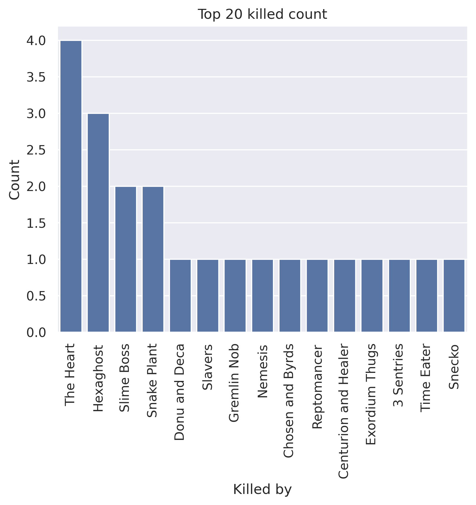
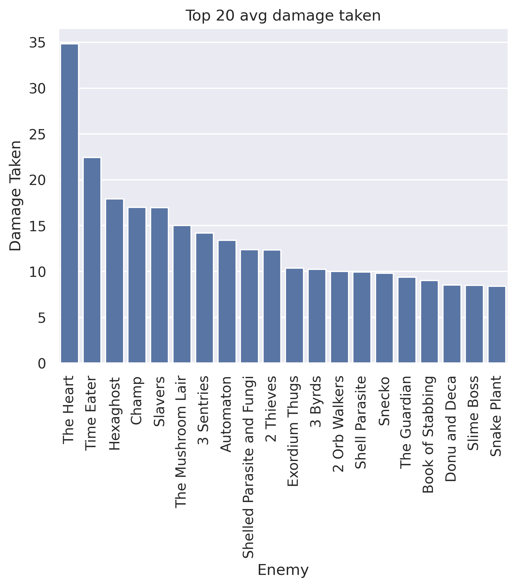
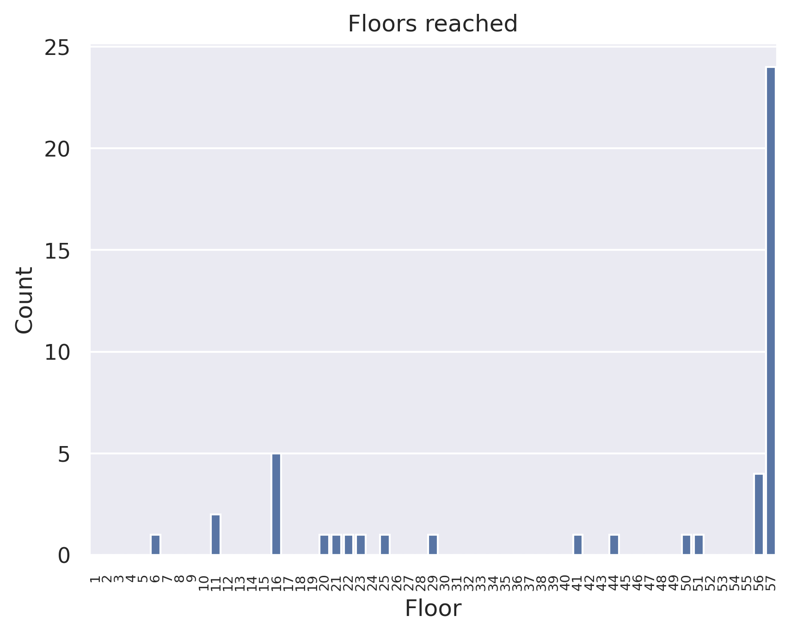
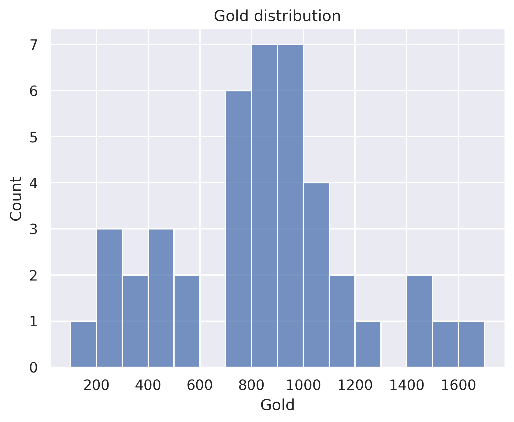

# watcher chegs
## General stats
- Total games played: 46
- Win rate (%): 52.17
- Avg playtime (mins): 39.79
- Avg floor reached: 44.04
- Max score: 3492
- Times rest: 1.65
- Times smith: 4.22
- Max hp >= 80: 8
- Max hp <= 40: 0

### Top 10 damage taken fights (excluding heart)
| Enemy       |   Damage Taken |
|-------------|----------------|
| 3 Shapes    |             69 |
| Time Eater  |             64 |
| Hexaghost   |             59 |
| Time Eater  |             56 |
| 3 Darklings |             56 |
| Champ       |             55 |
| Reptomancer |             55 |
| 3 Sentries  |             54 |
| Hexaghost   |             53 |
| Automaton   |             50 |

## Card stats
### Top 10 card removed count
| Card          |   Count |
|---------------|---------|
| Defend_P      |      48 |
| Strike_P      |      44 |
| ReachHeaven   |       4 |
| Pain          |       3 |
| PathToVictory |       2 |
| CarveReality  |       2 |
| ThirdEye      |       2 |
| FollowUp      |       2 |
| Decay         |       2 |
| WheelKick     |       1 |

### Top 80 card win rate (exclude duplicate)
| Card               |   Win rate |     | Card             |   Win rate |
|--------------------|------------|-----|------------------|------------|
| SashWhip           |       1    |     | Blasphemy        |       0.5  |
| Evaluate           |       1    |     | BowlingBash      |       0.5  |
| LikeWater          |       1    |     | CarveReality     |       0.5  |
| Master of Strategy |       1    |     | Vengeance        |       0.5  |
| Parasite           |       1    |     | Collect          |       0.5  |
| EmptyBody          |       1    |     | Secret Technique |       0.5  |
| Pray               |       1    |     | WindmillStrike   |       0.5  |
| Prostrate          |       1    |     | Wireheading      |       0.5  |
| Purity             |       1    |     | Fasting2         |       0.5  |
| Deep Breath        |       1    |     | Worship          |       0.5  |
| Dark Shackles      |       1    |     | Enlightenment    |       0.5  |
| FollowUp           |       1    |     | Establishment    |       0.5  |
| SpiritShield       |       1    |     | HandOfGreed      |       0.5  |
| Swivel             |       1    |     | Finesse          |       0.5  |
| Brilliance         |       1    |     | Omniscience      |       0.5  |
| Thinking Ahead     |       1    |     | Indignation      |       0.5  |
| BattleHymn         |       1    |     | Judgement        |       0.5  |
| Apparition         |       1    |     | MasterReality    |       0.5  |
| Vault              |       0.83 |     | LessonLearned    |       0.47 |
| Scrawl             |       0.8  |     | ClearTheMind     |       0.47 |
| Halt               |       0.79 |     | EmptyFist        |       0.44 |
| Crescendo          |       0.78 |     | Strike_P         |       0.37 |
| Adaptation         |       0.71 |     | WheelKick        |       0.33 |
| Tantrum            |       0.69 |     | DeusExMachina    |       0.33 |
| SandsOfTime        |       0.67 |     | Wallop           |       0.3  |
| TalkToTheHand      |       0.67 |     | Consecrate       |       0.29 |
| JustLucky          |       0.67 |     | Meditate         |       0.27 |
| MentalFortress     |       0.65 |     | Defend_P         |       0.21 |
| Sanctity           |       0.64 |     | ReachHeaven      |       0.2  |
| DeceiveReality     |       0.64 |     | FlyingSleeves    |       0    |
| Study              |       0.64 |     | Flash of Steel   |       0    |
| FlurryOfBlows      |       0.62 |     | Wish             |       0    |
| EmptyMind          |       0.62 |     | Weave            |       0    |
| ThirdEye           |       0.6  |     | Alpha            |       0    |
| FearNoEvil         |       0.59 |     | ForeignInfluence |       0    |
| CutThroughFate     |       0.58 |     | Bite             |       0    |
| InnerPeace         |       0.58 |     | Protect          |       0    |
| WaveOfTheHand      |       0.57 |     | RitualDagger     |       0    |
| Vigilance          |       0.52 |     | DevaForm         |       0    |
| Eruption           |       0.51 |     | Ragnarok         |       0    |

### Card pick rate act 1 (exclude boss)
| Card             |   Pick rate |     | Card          |   Pick rate |
|------------------|-------------|-----|---------------|-------------|
| Scrawl           |        1    |     | SignatureMove |        0.08 |
| Omniscience      |        1    |     | BowlingBash   |        0.08 |
| InnerPeace       |        1    |     | EmptyBody     |        0.04 |
| Vault            |        1    |     | Halt          |        0.04 |
| Tantrum          |        0.9  |     | ClearTheMind  |        0.04 |
| Adaptation       |        0.88 |     | FollowUp      |        0.04 |
| MentalFortress   |        0.86 |     | SpiritShield  |        0    |
| EmptyMind        |        0.79 |     | Wish          |        0    |
| FearNoEvil       |        0.79 |     | Vengeance     |        0    |
| LessonLearned    |        0.75 |     | Swivel        |        0    |
| Wireheading      |        0.73 |     | Worship       |        0    |
| CutThroughFate   |        0.72 |     | SashWhip      |        0    |
| Meditate         |        0.7  |     | MasterReality |        0    |
| DeceiveReality   |        0.7  |     | Ragnarok      |        0    |
| TalkToTheHand    |        0.69 |     | Fasting2      |        0    |
| Study            |        0.57 |     | BattleHymn    |        0    |
| EmptyFist        |        0.56 |     | Blasphemy     |        0    |
| SandsOfTime      |        0.56 |     | Brilliance    |        0    |
| ReachHeaven      |        0.5  |     | Collect       |        0    |
| Wallop           |        0.5  |     | ConjureBlade  |        0    |
| FlurryOfBlows    |        0.46 |     | CrushJoints   |        0    |
| Sanctity         |        0.36 |     | DevaForm      |        0    |
| CarveReality     |        0.36 |     | Devotion      |        0    |
| Singing Bowl     |        0.31 |     | Evaluate      |        0    |
| Consecrate       |        0.26 |     | FlyingSleeves |        0    |
| SKIP             |        0.26 |     | Protect       |        0    |
| DeusExMachina    |        0.25 |     | Judgement     |        0    |
| WindmillStrike   |        0.2  |     | JustLucky     |        0    |
| Conclude         |        0.17 |     | LikeWater     |        0    |
| Indignation      |        0.15 |     | Alpha         |        0    |
| ForeignInfluence |        0.13 |     | Nirvana       |        0    |
| Weave            |        0.12 |     | PathToVictory |        0    |
| WheelKick        |        0.11 |     | Perseverance  |        0    |
| WaveOfTheHand    |        0.11 |     | Pray          |        0    |
| Crescendo        |        0.1  |     | Prostrate     |        0    |
| ThirdEye         |        0.09 |     | WreathOfFlame |        0    |

### Card pick rate after act 1 (exclude boss)
| Card             |   Pick rate |     | Card               |   Pick rate |
|------------------|-------------|-----|--------------------|-------------|
| Secret Technique |        1    |     | Ragnarok           |           0 |
| Scrawl           |        1    |     | ReachHeaven        |           0 |
| Dark Shackles    |        1    |     | WindmillStrike     |           0 |
| Vault            |        1    |     | Secret Weapon      |           0 |
| EmptyMind        |        0.84 |     | SignatureMove      |           0 |
| InnerPeace       |        0.82 |     | Trip               |           0 |
| Enlightenment    |        0.67 |     | The Bomb           |           0 |
| Adaptation       |        0.65 |     | SandsOfTime        |           0 |
| MentalFortress   |        0.6  |     | Swivel             |           0 |
| Finesse          |        0.6  |     | Perseverance       |           0 |
| DevaForm         |        0.5  |     | SpiritShield       |           0 |
| MasterReality    |        0.5  |     | Swift Strike       |           0 |
| Tantrum          |        0.46 |     | Madness            |           0 |
| CutThroughFate   |        0.45 |     | PathToVictory      |           0 |
| Sanctity         |        0.43 |     | PanicButton        |           0 |
| Singing Bowl     |        0.42 |     | Dramatic Entrance  |           0 |
| FearNoEvil       |        0.42 |     | Discovery          |           0 |
| Wireheading      |        0.38 |     | Devotion           |           0 |
| SKIP             |        0.37 |     | DeusExMachina      |           0 |
| LessonLearned    |        0.33 |     | CrushJoints        |           0 |
| Deep Breath      |        0.33 |     | Consecrate         |           0 |
| WaveOfTheHand    |        0.28 |     | ConjureBlade       |           0 |
| Thinking Ahead   |        0.25 |     | Conclude           |           0 |
| TalkToTheHand    |        0.24 |     | Collect            |           0 |
| Halt             |        0.24 |     | CarveReality       |           0 |
| Meditate         |        0.24 |     | Brilliance         |           0 |
| ClearTheMind     |        0.21 |     | Blind              |           0 |
| Study            |        0.19 |     | Blasphemy          |           0 |
| Wallop           |        0.16 |     | BattleHymn         |           0 |
| FlurryOfBlows    |        0.14 |     | Bandage Up         |           0 |
| DeceiveReality   |        0.14 |     | Establishment      |           0 |
| Omniscience      |        0.12 |     | Evaluate           |           0 |
| Worship          |        0.1  |     | Fasting2           |           0 |
| Alpha            |        0.09 |     | LikeWater          |           0 |
| Indignation      |        0.08 |     | Panache            |           0 |
| Crescendo        |        0.08 |     | Panacea            |           0 |
| Vengeance        |        0.06 |     | Nirvana            |           0 |
| ThirdEye         |        0.05 |     | Mind Blast         |           0 |
| WheelKick        |        0.04 |     | Metamorphosis      |           0 |
| EmptyBody        |        0.04 |     | Magnetism          |           0 |
| JustLucky        |        0.04 |     | Judgement          |           0 |
| Pray             |        0.04 |     | FlyingSleeves      |           0 |
| Weave            |        0.04 |     | Jack Of All Trades |           0 |
| BowlingBash      |        0.04 |     | Impatience         |           0 |
| EmptyFist        |        0.03 |     | Good Instincts     |           0 |
| Prostrate        |        0.02 |     | Forethought        |           0 |
| SashWhip         |        0.02 |     | ForeignInfluence   |           0 |
| Protect          |        0    |     | FollowUp           |           0 |
| Purity           |        0    |     | WreathOfFlame      |           0 |
| Wish             |        0    |     |   |   |

## Relic stats
### Top relic win rate
| Relic             |   Win rate |     | Relic              |   Win rate |
|-------------------|------------|-----|--------------------|------------|
| Meat on the Bone  |          1 |     | Blue Candle        |       1    |
| Cauldron          |          1 |     | White Beast Statue |       1    |
| Shuriken          |          1 |     | Whetstone          |       1    |
| ClockworkSouvenir |          1 |     | Velvet Choker      |       1    |
| Coffee Dripper    |          1 |     | Unceasing Top      |       1    |
| Cursed Key        |          1 |     | TungstenRod        |       1    |
| Darkstone Periapt |          1 |     | Calipers           |       1    |
| DollysMirror      |          1 |     | Toxic Egg 2        |       1    |
| Question Card     |          1 |     | Bloody Idol        |       1    |
| PreservedInsect   |          1 |     | Black Star         |       1    |
| Pocketwatch       |          1 |     | Torii              |       1    |
| OrangePellets     |          1 |     | Bottled Flame      |       1    |
| Frozen Eye        |          1 |     | Bottled Lightning  |       1    |
| Melange           |          1 |     | Bottled Tornado    |       1    |
| Kunai             |          1 |     | Thread and Needle  |       1    |
| Juzu Bracelet     |          1 |     | Incense Burner     |       1    |
| InkBottle         |          1 |     | Pen Nib            |       0.88 |
| Sozu              |          1 |     | Mercury Hourglass  |       0.88 |
| CloakClasp        |          1 |     | Bag of Marbles     |       0.88 |
| Sundial           |          1 |     | HornCleat          |       0.88 |

### Bottom relic win rate
| Relic             |   Win rate |     | Relic         |   Win rate |
|-------------------|------------|-----|---------------|------------|
| Prayer Wheel      |       0.6  |     | Orichalcum    |       0.5  |
| Centennial Puzzle |       0.6  |     | PureWater     |       0.44 |
| Ginger            |       0.6  |     | MawBank       |       0.4  |
| Ice Cream         |       0.57 |     | Letter Opener |       0.38 |
| War Paint         |       0.57 |     | Gremlin Horn  |       0.38 |
| Akabeko           |       0.57 |     | GoldenEye     |       0.33 |
| Toy Ornithopter   |       0.56 |     | Astrolabe     |       0.33 |
| Odd Mushroom      |       0.5  |     | Tiny Chest    |       0.33 |
| Lizard Tail       |       0.5  |     | Dead Branch   |       0.33 |
| Lee's Waffle      |       0.5  |     | Pantograph    |       0.3  |
| Matryoshka        |       0.5  |     | Singing Bowl  |       0.25 |
| The Courier       |       0.5  |     | Ectoplasm     |       0.25 |
| TeardropLocket    |       0.5  |     | Runic Dome    |       0.25 |
| Omamori           |       0.5  |     | Golden Idol   |       0.2  |
| Orrery            |       0.5  |     | Mango         |       0    |
| StoneCalendar     |       0.5  |     | Frozen Egg 2  |       0    |
| Dream Catcher     |       0.5  |     | WarpedTongs   |       0    |
| Membership Card   |       0.5  |     | SacredBark    |       0    |
| Gambling Chip     |       0.5  |     | Molten Egg 2  |       0    |
| Art of War        |       0.5  |     | TheAbacus     |       0    |

### Act 1 boss relic pick rate
| Relic               |   Pick rate |     | Relic         |   Pick rate |
|---------------------|-------------|-----|---------------|-------------|
| Pandora's Box       |        1    |     | Fusion Hammer |        0.25 |
| Runic Pyramid       |        1    |     | Runic Dome    |        0.25 |
| HolyWater           |        0.8  |     | SacredBark    |        0.2  |
| VioletLotus         |        0.8  |     | Sozu          |        0.11 |
| Black Star          |        0.5  |     | Calling Bell  |        0    |
| Empty Cage          |        0.5  |     | Ectoplasm     |        0    |
| Philosopher's Stone |        0.44 |     | Busted Crown  |        0    |
| Astrolabe           |        0.43 |     | Snecko Eye    |        0    |
| Coffee Dripper      |        0.33 |     | Tiny House    |        0    |
| Cursed Key          |        0.29 |     | Velvet Choker |        0    |
| SlaversCollar       |        0.29 |     |   |   |

### Act 1 boss relic win rate
| Relic               |   Win rate |     | Relic         |   Win rate |
|---------------------|------------|-----|---------------|------------|
| Black Star          |       1    |     | HolyWater     |       0.5  |
| Coffee Dripper      |       1    |     | SlaversCollar |       0.5  |
| Cursed Key          |       1    |     | VioletLotus   |       0.5  |
| Sozu                |       1    |     | Astrolabe     |       0.33 |
| Pandora's Box       |       0.8  |     | Fusion Hammer |       0    |
| Philosopher's Stone |       0.75 |     | Runic Dome    |       0    |
| Runic Pyramid       |       0.75 |     | SacredBark    |       0    |
| Empty Cage          |       0.67 |     |   |   |

### Act 2 boss relic pick rate
| Relic          |   Pick rate |     | Relic               |   Pick rate |
|----------------|-------------|-----|---------------------|-------------|
| Runic Pyramid  |        1    |     | Tiny House          |           0 |
| VioletLotus    |        0.78 |     | Sozu                |           0 |
| SlaversCollar  |        0.67 |     | Snecko Eye          |           0 |
| HolyWater      |        0.67 |     | Astrolabe           |           0 |
| Pandora's Box  |        0.6  |     | SacredBark          |           0 |
| Fusion Hammer  |        0.57 |     | Black Star          |           0 |
| Coffee Dripper |        0.5  |     | Cursed Key          |           0 |
| Empty Cage     |        0.5  |     | Calling Bell        |           0 |
| Runic Dome     |        0.4  |     | Busted Crown        |           0 |
| Velvet Choker  |        0    |     | Philosopher's Stone |           0 |

### Act 2 boss relic win rate
| Relic          |   Win rate |     | Relic         |   Win rate |
|----------------|------------|-----|---------------|------------|
| Coffee Dripper |       1    |     | VioletLotus   |       0.71 |
| Empty Cage     |       1    |     | Pandora's Box |       0.67 |
| Fusion Hammer  |       1    |     | SlaversCollar |       0.5  |
| HolyWater      |       1    |     | Runic Dome    |       0    |
| Runic Pyramid  |       0.75 |     |   |   |

