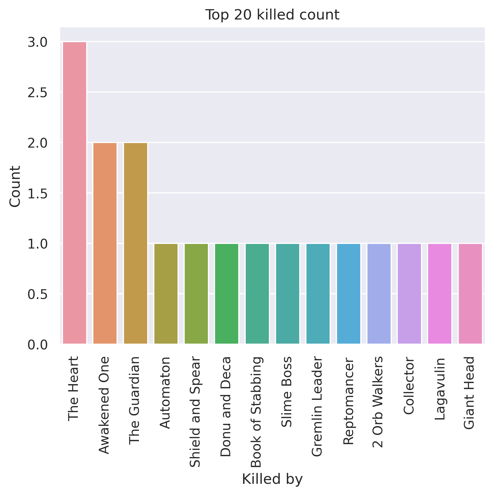
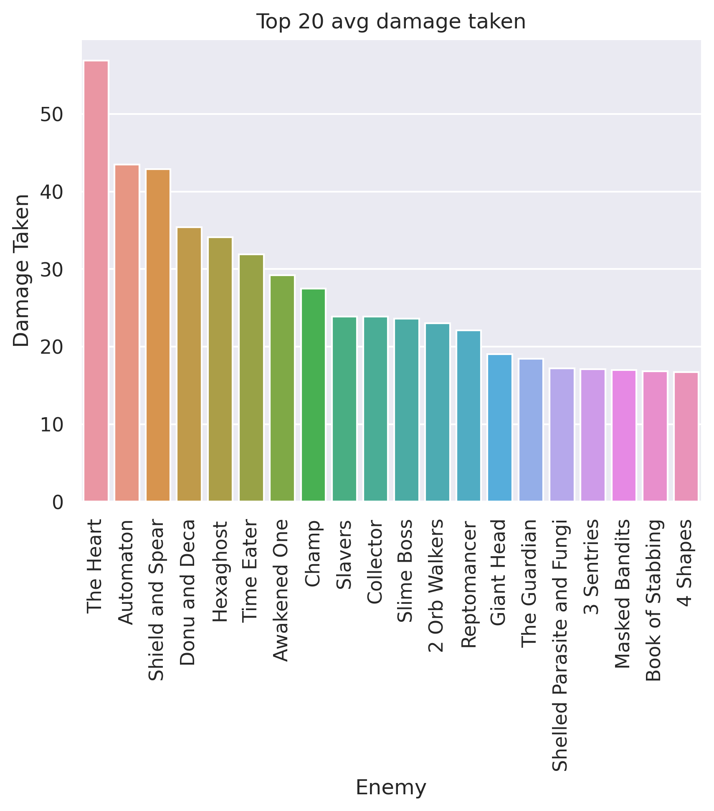
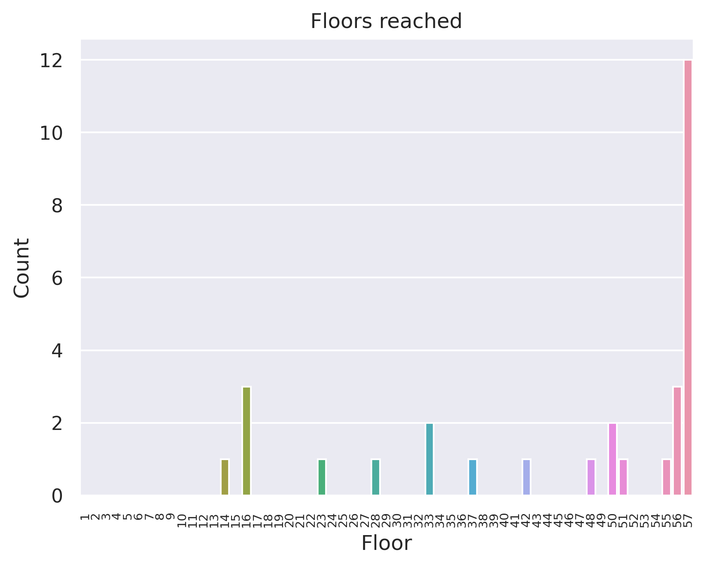
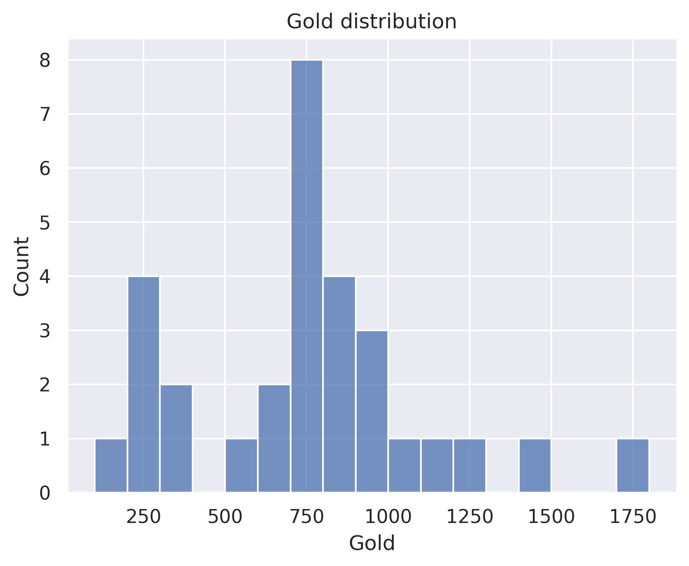

# Lose all gold for max HP - All Characters
## General stats
- Total games played: 30
- Win rate (%): 40.0
- Avg playtime (mins): 88.44
- Avg floor reached: 45.47
- Max score: 3782
- Times rest: 1.03
- Times smith: 5.67
- Max hp >= 80: 22
- Max hp <= 40: 0

### Top 10 damage taken fights (excluding heart)
| Enemy            |   Damage Taken |
|------------------|----------------|
| Shield and Spear |            132 |
| Giant Head       |            126 |
| Shield and Spear |            126 |
| Donu and Deca    |            125 |
| Donu and Deca    |            121 |
| Awakened One     |            111 |
| Nemesis          |            102 |
| Reptomancer      |            100 |
| Shield and Spear |             95 |
| Shield and Spear |             90 |

## Card stats
### Top 10 card removed count
| Card             |   Count |
|------------------|---------|
| Strike_R         |       8 |
| Strike_G         |       4 |
| Strike_B         |       4 |
| Perfected Strike |       3 |
| Defend_B         |       3 |
| Zap              |       3 |
| Anger            |       3 |
| Writhe           |       2 |
| Decay            |       2 |
| Blizzard         |       2 |

### Top 80 card win rate (exclude duplicate)
| Card               |   Win rate |     | Card               |   Win rate |
|--------------------|------------|-----|--------------------|------------|
| A Thousand Cuts    |       1    |     | Terror             |       0.8  |
| Loop               |       1    |     | Deflect            |       0.75 |
| Dark Embrace       |       1    |     | Dagger Throw       |       0.75 |
| Deadly Poison      |       1    |     | Dash               |       0.75 |
| Die Die Die        |       1    |     | Dual Wield         |       0.75 |
| Dodge and Roll     |       1    |     | PiercingWail       |       0.75 |
| Doppelganger       |       1    |     | Tools of the Trade |       0.75 |
| Double Energy      |       1    |     | Exhume             |       0.75 |
| Entrench           |       1    |     | Backflip           |       0.71 |
| Escape Plan        |       1    |     | Infernal Blade     |       0.67 |
| Expertise          |       1    |     | Iron Wave          |       0.67 |
| Finisher           |       1    |     | Malaise            |       0.67 |
| Ghostly Armor      |       1    |     | Sentinel           |       0.67 |
| Good Instincts     |       1    |     | Heatsinks          |       0.67 |
| Grand Finale       |       1    |     | Blade Dance        |       0.67 |
| Machine Learning   |       1    |     | Slice              |       0.67 |
| Clothesline        |       1    |     | Burst              |       0.67 |
| Night Terror       |       1    |     | Spot Weakness      |       0.67 |
| Outmaneuver        |       1    |     | Bite               |       0.67 |
| Phantasmal Killer  |       1    |     | Flying Knee        |       0.67 |
| Prepared           |       1    |     | Catalyst           |       0.67 |
| Reckless Charge    |       1    |     | Fusion             |       0.67 |
| Reflex             |       1    |     | Eviscerate         |       0.67 |
| Setup              |       1    |     | Tactician          |       0.67 |
| Sucker Punch       |       1    |     | Acrobatics         |       0.62 |
| Sword Boomerang    |       1    |     | Neutralize         |       0.6  |
| Twin Strike        |       1    |     | Leg Sweep          |       0.6  |
| Underhanded Strike |       1    |     | Dagger Spray       |       0.6  |
| Violence           |       1    |     | Survivor           |       0.6  |
| Well Laid Plans    |       1    |     | Reaper             |       0.6  |
| Crippling Poison   |       1    |     | Defend_G           |       0.56 |
| Glass Knife        |       1    |     | Leap               |       0.5  |
| Apotheosis         |       1    |     | Meteor Strike      |       0.5  |
| Blur               |       1    |     | Quick Slash        |       0.5  |
| Barricade          |       1    |     | Noxious Fumes      |       0.5  |
| Calculated Gamble  |       0.86 |     | All Out Attack     |       0.5  |
| Backstab           |       0.8  |     | Whirlwind          |       0.5  |
| Wraith Form        |       0.8  |     | Adrenaline         |       0.5  |
| Footwork           |       0.8  |     | Warcry             |       0.5  |
| Predator           |       0.8  |     | Aggregate          |       0.5  |

### Card pick rate act 1 (exclude boss)
| Card               |   Pick rate |     | Card              |   Pick rate |
|--------------------|-------------|-----|-------------------|-------------|
| Wraith Form        |        1    |     | Footwork          |        0.2  |
| Hemokinesis        |        1    |     | Burning Pact      |        0.2  |
| Offering           |        1    |     | Pummel            |        0.2  |
| Malaise            |        1    |     | Flying Knee       |        0.17 |
| FTL                |        1    |     | Bouncing Flask    |        0.17 |
| Terror             |        1    |     | Compile Driver    |        0.17 |
| Leg Sweep          |        1    |     | Cleave            |        0.14 |
| Second Wind        |        1    |     | Turbo             |        0.14 |
| Inflame            |        1    |     | SKIP              |        0.14 |
| Seek               |        1    |     | Deflect           |        0.12 |
| Hyperbeam          |        1    |     | Dagger Throw      |        0.12 |
| Corpse Explosion   |        1    |     | Coolheaded        |        0.12 |
| Dash               |        1    |     | Sucker Punch      |        0.1  |
| Calculated Gamble  |        1    |     | Claw              |        0.1  |
| Defragment         |        1    |     | Singing Bowl      |        0.08 |
| Demon Form         |        1    |     | Steam             |        0.08 |
| Glass Knife        |        1    |     | Well Laid Plans   |        0    |
| Doom and Gloom     |        1    |     | Wild Strike       |        0    |
| Doppelganger       |        1    |     | Riddle With Holes |        0    |
| Glacier            |        1    |     | Stack             |        0    |
| Ghostly Armor      |        1    |     | White Noise       |        0    |
| Electrodynamics    |        1    |     | Warcry            |        0    |
| Shockwave          |        1    |     | Twin Strike       |        0    |
| Feed               |        1    |     | Reprogram         |        0    |
| Rip and Tear       |        1    |     | Storm             |        0    |
| Skim               |        1    |     | Thunderclap       |        0    |
| After Image        |        1    |     | Static Discharge  |        0    |
| Bullet Time        |        1    |     | True Grit         |        0    |
| Adrenaline         |        1    |     | Rupture           |        0    |
| Berserk            |        1    |     | Thunder Strike    |        0    |
| Reaper             |        1    |     | Scrape            |        0    |
| Power Through      |        1    |     | Searing Blow      |        0    |
| Auto Shields       |        1    |     | Tempest           |        0    |
| Reboot             |        1    |     | Spot Weakness     |        0    |
| All Out Attack     |        1    |     | Seeing Red        |        0    |
| Undo               |        1    |     | Sword Boomerang   |        0    |
| Uppercut           |        1    |     | Reflex            |        0    |
| Battle Trance      |        1    |     | Sentinel          |        0    |
| Blade Dance        |        0.83 |     | Setup             |        0    |
| Sunder             |        0.75 |     | Steam Power       |        0    |
| Predator           |        0.75 |     | Accuracy          |        0    |
| Rage               |        0.67 |     | Redo              |        0    |
| Backstab           |        0.67 |     | Dropkick          |        0    |
| Lockon             |        0.67 |     | Dodge and Roll    |        0    |
| Whirlwind          |        0.67 |     | Distraction       |        0    |
| Blood for Blood    |        0.67 |     | Deadly Poison     |        0    |
| Bloodletting       |        0.67 |     | Corruption        |        0    |
| Metallicize        |        0.67 |     | Consume           |        0    |
| Pommel Strike      |        0.67 |     | Concentrate       |        0    |
| Conserve Battery   |        0.6  |     | Clothesline       |        0    |
| Shrug It Off       |        0.6  |     | Cloak And Dagger  |        0    |
| Eviscerate         |        0.6  |     | Clash             |        0    |
| Genetic Algorithm  |        0.6  |     | Choke             |        0    |
| Acrobatics         |        0.57 |     | Chaos             |        0    |
| Headbutt           |        0.57 |     | Carnage           |        0    |
| Poisoned Stab      |        0.57 |     | Caltrops          |        0    |
| Hologram           |        0.57 |     | BootSequence      |        0    |
| Dagger Spray       |        0.55 |     | Body Slam         |        0    |
| Anger              |        0.5  |     | Blur              |        0    |
| Feel No Pain       |        0.5  |     | Barricade         |        0    |
| Perfected Strike   |        0.5  |     | Barrage           |        0    |
| Chill              |        0.5  |     | Bane              |        0    |
| Reckless Charge    |        0.5  |     | Armaments         |        0    |
| Darkness           |        0.5  |     | Aggregate         |        0    |
| Burst              |        0.5  |     | Double Energy     |        0    |
| Disarm             |        0.5  |     | Dual Wield        |        0    |
| Self Repair        |        0.5  |     | Recycle           |        0    |
| Ball Lightning     |        0.46 |     | Entrench          |        0    |
| Backflip           |        0.43 |     | Rampage           |        0    |
| Cold Snap          |        0.4  |     | Prepared          |        0    |
| Flame Barrier      |        0.4  |     | Outmaneuver       |        0    |
| Infernal Blade     |        0.4  |     | Noxious Fumes     |        0    |
| Sweeping Beam      |        0.38 |     | Multi-Cast        |        0    |
| Melter             |        0.33 |     | Loop              |        0    |
| PiercingWail       |        0.33 |     | Limit Break       |        0    |
| Reinforced Body    |        0.33 |     | Leap              |        0    |
| Slice              |        0.33 |     | Intimidate        |        0    |
| Streamline         |        0.33 |     | Infinite Blades   |        0    |
| Beam Cell          |        0.33 |     | Heel Hook         |        0    |
| Endless Agony      |        0.33 |     | Heavy Blade       |        0    |
| Crippling Poison   |        0.33 |     | Heatsinks         |        0    |
| Iron Wave          |        0.3  |     | Go for the Eyes   |        0    |
| Rebound            |        0.29 |     | Flechettes        |        0    |
| Flex               |        0.29 |     | Fire Breathing    |        0    |
| Catalyst           |        0.25 |     | Finisher          |        0    |
| Tactician          |        0.25 |     | Expertise         |        0    |
| Dark Embrace       |        0.25 |     | Exhume            |        0    |
| Sever Soul         |        0.25 |     | Evolve            |        0    |
| Combust            |        0.25 |     | Escape Plan       |        0    |
| Underhanded Strike |        0.22 |     | Havoc             |        0    |
| Quick Slash        |        0.22 |     |   |   |

### Card pick rate after act 1 (exclude boss)
| Card               |   Pick rate |     | Card               |   Pick rate |
|--------------------|-------------|-----|--------------------|-------------|
| Wraith Form        |        1    |     | Armaments          |        0.08 |
| Good Instincts     |        1    |     | Body Slam          |        0.08 |
| Corruption         |        1    |     | Deadly Poison      |        0.08 |
| Calculated Gamble  |        1    |     | Clothesline        |        0.07 |
| Burst              |        1    |     | Flying Knee        |        0.07 |
| Demon Form         |        1    |     | Sucker Punch       |        0.06 |
| Buffer             |        1    |     | Anger              |        0.06 |
| Disarm             |        1    |     | Wild Strike        |        0.05 |
| Echo Form          |        1    |     | White Noise        |        0    |
| Skim               |        1    |     | Terror             |        0    |
| Exhume             |        1    |     | Quick Slash        |        0    |
| Fiend Fire         |        1    |     | Thinking Ahead     |        0    |
| Shockwave          |        1    |     | Rage               |        0    |
| Seek               |        1    |     | Rampage            |        0    |
| Glacier            |        1    |     | Tempest            |        0    |
| Secret Technique   |        1    |     | Purity             |        0    |
| Biased Cognition   |        1    |     | Poisoned Stab      |        0    |
| Reaper             |        1    |     | Tools of the Trade |        0    |
| Backstab           |        1    |     | Reckless Charge    |        0    |
| Adrenaline         |        1    |     | Thunderclap        |        0    |
| Master of Strategy |        1    |     | Static Discharge   |        0    |
| Apotheosis         |        1    |     | Stack              |        0    |
| Barricade          |        1    |     | Slice              |        0    |
| Recycle            |        1    |     | Trip               |        0    |
| Core Surge         |        1    |     | Skewer             |        0    |
| Grand Finale       |        1    |     | Thunder Strike     |        0    |
| Acrobatics         |        0.89 |     | Sever Soul         |        0    |
| Power Through      |        0.86 |     | Sweeping Beam      |        0    |
| PanicButton        |        0.8  |     | Whirlwind          |        0    |
| Battle Trance      |        0.8  |     | Twin Strike        |        0    |
| Backflip           |        0.77 |     | Swift Strike       |        0    |
| Well Laid Plans    |        0.75 |     | Searing Blow       |        0    |
| Defragment         |        0.75 |     | Scrape             |        0    |
| Hologram           |        0.73 |     | Rip and Tear       |        0    |
| Compile Driver     |        0.73 |     | Riddle With Holes  |        0    |
| Seeing Red         |        0.71 |     | Reinforced Body    |        0    |
| Burning Pact       |        0.67 |     | Unload             |        0    |
| Aggregate          |        0.67 |     | Accuracy           |        0    |
| Dark Shackles      |        0.67 |     | Perfected Strike   |        0    |
| PiercingWail       |        0.61 |     | Panache            |        0    |
| Noxious Fumes      |        0.6  |     | Clash              |        0    |
| Sentinel           |        0.6  |     | Cleave             |        0    |
| Leg Sweep          |        0.57 |     | Cloak And Dagger   |        0    |
| Footwork           |        0.57 |     | Combust            |        0    |
| Pommel Strike      |        0.55 |     | Concentrate        |        0    |
| Shrug It Off       |        0.54 |     | Consume            |        0    |
| Bloodletting       |        0.5  |     | Creative AI        |        0    |
| Undo               |        0.5  |     | Crippling Poison   |        0    |
| Phantasmal Killer  |        0.5  |     | Dagger Spray       |        0    |
| Double Energy      |        0.5  |     | Dagger Throw       |        0    |
| Setup              |        0.5  |     | Deep Breath        |        0    |
| Self Repair        |        0.5  |     | Discovery          |        0    |
| Violence           |        0.5  |     | Distraction        |        0    |
| Immolate           |        0.5  |     | Doom and Gloom     |        0    |
| Malaise            |        0.5  |     | Dramatic Entrance  |        0    |
| Bullet Time        |        0.5  |     | Chrysalis          |        0    |
| Tactician          |        0.43 |     | Choke              |        0    |
| Turbo              |        0.43 |     | Carnage            |        0    |
| Fusion             |        0.4  |     | Barrage            |        0    |
| Coolheaded         |        0.4  |     | Alchemize          |        0    |
| Uppercut           |        0.4  |     | All Out Attack     |        0    |
| Entrench           |        0.4  |     | Auto Shields       |        0    |
| Dark Embrace       |        0.4  |     | Ball Lightning     |        0    |
| Dropkick           |        0.4  |     | Bandage Up         |        0    |
| Pummel             |        0.4  |     | Bane               |        0    |
| Deflect            |        0.38 |     | Beam Cell          |        0    |
| Dash               |        0.38 |     | Caltrops           |        0    |
| Spot Weakness      |        0.36 |     | Blind              |        0    |
| Blade Dance        |        0.36 |     | Blizzard           |        0    |
| Chill              |        0.33 |     | Blood for Blood    |        0    |
| Capacitor          |        0.33 |     | Bludgeon           |        0    |
| Heatsinks          |        0.33 |     | Blur               |        0    |
| Feel No Pain       |        0.33 |     | BootSequence       |        0    |
| Evolve             |        0.33 |     | Enlightenment      |        0    |
| Dual Wield         |        0.33 |     | FTL                |        0    |
| Escape Plan        |        0.33 |     | Feed               |        0    |
| Reflex             |        0.29 |     | Madness            |        0    |
| Go for the Eyes    |        0.27 |     | Iron Wave          |        0    |
| Double Tap         |        0.25 |     | Juggernaut         |        0    |
| Second Wind        |        0.25 |     | Leap               |        0    |
| Bouncing Flask     |        0.25 |     | Limit Break        |        0    |
| Hemokinesis        |        0.25 |     | Lockon             |        0    |
| Conserve Battery   |        0.25 |     | Loop               |        0    |
| Darkness           |        0.25 |     | Magnetism          |        0    |
| Predator           |        0.22 |     | Inflame            |        0    |
| SKIP               |        0.22 |     | Masterful Stab     |        0    |
| Steam Power        |        0.2  |     | Melter             |        0    |
| Genetic Algorithm  |        0.2  |     | Metallicize        |        0    |
| Catalyst           |        0.2  |     | Metamorphosis      |        0    |
| Prepared           |        0.2  |     | Multi-Cast         |        0    |
| Sunder             |        0.2  |     | Panacea            |        0    |
| Finisher           |        0.2  |     | Intimidate         |        0    |
| Outmaneuver        |        0.2  |     | Infinite Blades    |        0    |
| Cold Snap          |        0.2  |     | Fire Breathing     |        0    |
| Chaos              |        0.2  |     | Ghostly Armor      |        0    |
| True Grit          |        0.18 |     | Fission            |        0    |
| Dodge and Roll     |        0.18 |     | Flame Barrier      |        0    |
| Singing Bowl       |        0.18 |     | Flechettes         |        0    |
| Streamline         |        0.17 |     | Flex               |        0    |
| Reprogram          |        0.17 |     | Force Field        |        0    |
| Expertise          |        0.17 |     | Forethought        |        0    |
| Warcry             |        0.14 |     | Glass Knife        |        0    |
| Endless Agony      |        0.14 |     | Infernal Blade     |        0    |
| Redo               |        0.13 |     | Headbutt           |        0    |
| Claw               |        0.12 |     | Heavy Blade        |        0    |
| Havoc              |        0.12 |     | Heel Hook          |        0    |
| Sword Boomerang    |        0.12 |     | Hello World        |        0    |
| Steam              |        0.12 |     | Hyperbeam          |        0    |
| Rupture            |        0.11 |     | Impatience         |        0    |
| Rebound            |        0.11 |     | HandOfGreed        |        0    |
| Underhanded Strike |        0.09 |     |   |   |

## Relic stats
### Top relic win rate
| Relic             |   Win rate |     | Relic              |   Win rate |
|-------------------|------------|-----|--------------------|------------|
| Ectoplasm         |          1 |     | MutagenicStrength  |       1    |
| StoneCalendar     |          1 |     | TwistedFunnel      |       1    |
| Self Forming Clay |          1 |     | TungstenRod        |       1    |
| Dead Branch       |          1 |     | Toy Ornithopter    |       1    |
| Runic Dome        |          1 |     | Tough Bandages     |       1    |
| Du-Vu Doll        |          1 |     | Sundial            |       1    |
| Nilry's Codex     |          1 |     | Bottled Flame      |       1    |
| Fusion Hammer     |          1 |     | StrikeDummy        |       1    |
| Paper Crane       |          1 |     | The Specimen       |       1    |
| Orrery            |          1 |     | Toolbox            |       0.8  |
| HornCleat         |          1 |     | InkBottle          |       0.75 |
| HoveringKite      |          1 |     | Ginger             |       0.75 |
| Incense Burner    |          1 |     | Omamori            |       0.75 |
| Inserter          |          1 |     | Red Mask           |       0.75 |
| Letter Opener     |          1 |     | Pen Nib            |       0.75 |
| Mark of the Bloom |          1 |     | Smiling Mask       |       0.75 |
| OrangePellets     |          1 |     | War Paint          |       0.67 |
| Ninja Scroll      |          1 |     | Blue Candle        |       0.67 |
| Mercury Hourglass |          1 |     | Oddly Smooth Stone |       0.67 |
| Snecko Eye        |          1 |     | Lizard Tail        |       0.67 |

### Bottom relic win rate
| Relic              |   Win rate |     | Relic           |   Win rate |
|--------------------|------------|-----|-----------------|------------|
| White Beast Statue |       0.33 |     | Matryoshka      |          0 |
| Chemical X         |       0.33 |     | Turnip          |          0 |
| Necronomicon       |       0.33 |     | Ancient Tea Set |          0 |
| Akabeko            |       0.33 |     | WarpedTongs     |          0 |
| Regal Pillow       |       0.33 |     | Bird Faced Urn  |          0 |
| Pantograph         |       0.33 |     | Medical Kit     |          0 |
| Dream Catcher      |       0.33 |     | NlothsMask      |          0 |
| Mango              |       0.33 |     | Runic Cube      |          0 |
| Frozen Egg 2       |       0.33 |     | Paper Frog      |          0 |
| Happy Flower       |       0.3  |     | Symbiotic Virus |          0 |
| SlaversCollar      |       0.25 |     | Peace Pipe      |          0 |
| Gremlin Horn       |       0.2  |     | Gambling Chip   |          0 |
| The Courier        |       0.2  |     | Cauldron        |          0 |
| Cracked Core       |       0.2  |     | Emotion Chip    |          0 |
| MealTicket         |       0.17 |     | Sling           |          0 |
| Coffee Dripper     |       0.17 |     | Membership Card |          0 |
| CeramicFish        |       0.14 |     | Shovel          |          0 |
| Astrolabe          |       0    |     | Cursed Key      |          0 |
| Blood Vial         |       0    |     | DataDisk        |          0 |
| Odd Mushroom       |       0    |     | Calipers        |          0 |

### Act 1 boss relic pick rate
| Relic               |   Pick rate |     | Relic               |   Pick rate |
|---------------------|-------------|-----|---------------------|-------------|
| Nuclear Battery     |        1    |     | Runic Dome          |        0.18 |
| Runic Pyramid       |        1    |     | Black Blood         |        0    |
| Runic Cube          |        1    |     | Inserter            |        0    |
| Cursed Key          |        1    |     | FrozenCore          |        0    |
| Philosopher's Stone |        1    |     | Empty Cage          |        0    |
| Pandora's Box       |        1    |     | Ring of the Serpent |        0    |
| HoveringKite        |        1    |     | Calling Bell        |        0    |
| Coffee Dripper      |        0.83 |     | Busted Crown        |        0    |
| Velvet Choker       |        0.5  |     | SacredBark          |        0    |
| Fusion Hammer       |        0.5  |     | Black Star          |        0    |
| SlaversCollar       |        0.33 |     | Sozu                |        0    |
| Ectoplasm           |        0.33 |     | Tiny House          |        0    |
| Astrolabe           |        0.2  |     | Mark of Pain        |        0    |

### Act 1 boss relic win rate
| Relic           |   Win rate |     | Relic               |   Win rate |
|-----------------|------------|-----|---------------------|------------|
| Ectoplasm       |        1   |     | Philosopher's Stone |       0.33 |
| Fusion Hammer   |        1   |     | Coffee Dripper      |       0.2  |
| HoveringKite    |        1   |     | Astrolabe           |       0    |
| Nuclear Battery |        1   |     | Cursed Key          |       0    |
| Pandora's Box   |        1   |     | Runic Cube          |       0    |
| Runic Dome      |        1   |     | Runic Pyramid       |       0    |
| Velvet Choker   |        0.5 |     | SlaversCollar       |       0    |

### Act 2 boss relic pick rate
| Relic               |   Pick rate |     | Relic               |   Pick rate |
|---------------------|-------------|-----|---------------------|-------------|
| Astrolabe           |        1    |     | Pandora's Box       |        0.33 |
| Coffee Dripper      |        1    |     | Snecko Eye          |        0.17 |
| SlaversCollar       |        1    |     | Black Star          |        0    |
| Runic Pyramid       |        1    |     | Velvet Choker       |        0    |
| Fusion Hammer       |        1    |     | Tiny House          |        0    |
| Nuclear Battery     |        1    |     | Sozu                |        0    |
| Calling Bell        |        0.75 |     | Ring of the Serpent |        0    |
| Cursed Key          |        0.5  |     | Busted Crown        |        0    |
| HoveringKite        |        0.5  |     | Empty Cage          |        0    |
| Inserter            |        0.5  |     | Black Blood         |        0    |
| Runic Dome          |        0.5  |     | Mark of Pain        |        0    |
| Philosopher's Stone |        0.4  |     | WristBlade          |        0    |

### Act 2 boss relic win rate
| Relic               |   Win rate |     | Relic           |   Win rate |
|---------------------|------------|-----|-----------------|------------|
| Fusion Hammer       |        1   |     | SlaversCollar   |       0.5  |
| HoveringKite        |        1   |     | Calling Bell    |       0.33 |
| Inserter            |        1   |     | Astrolabe       |       0    |
| Runic Dome          |        1   |     | Coffee Dripper  |       0    |
| Runic Pyramid       |        1   |     | Cursed Key      |       0    |
| Snecko Eye          |        1   |     | Nuclear Battery |       0    |
| Philosopher's Stone |        0.5 |     | Pandora's Box   |       0    |

