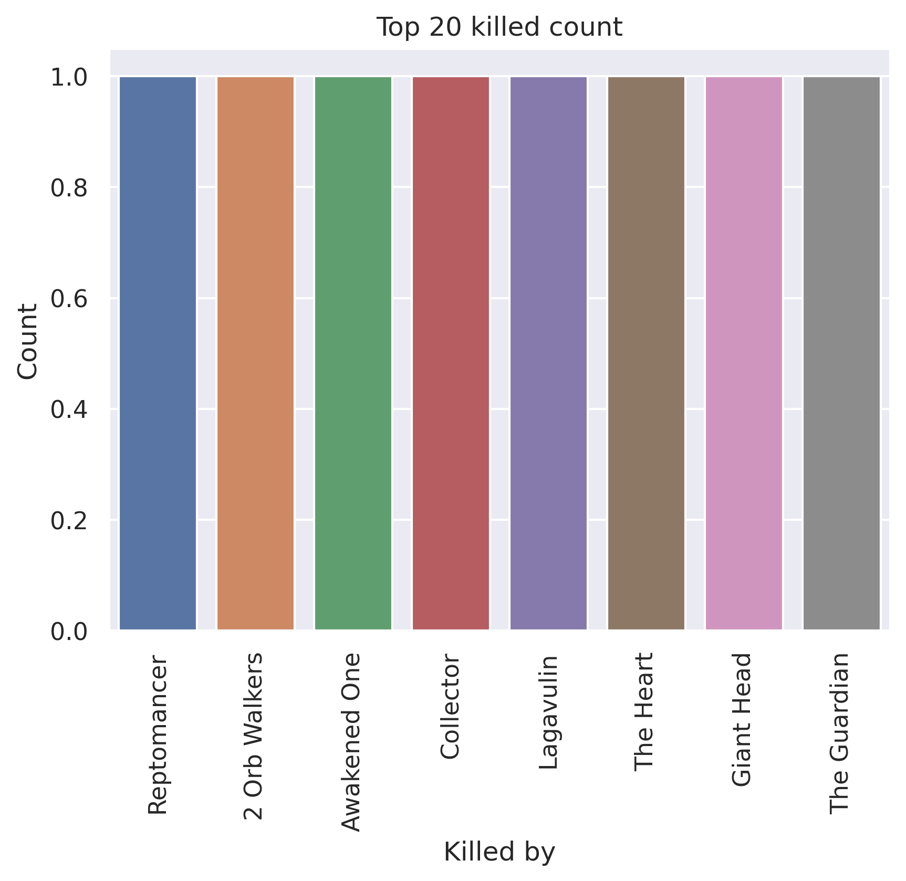
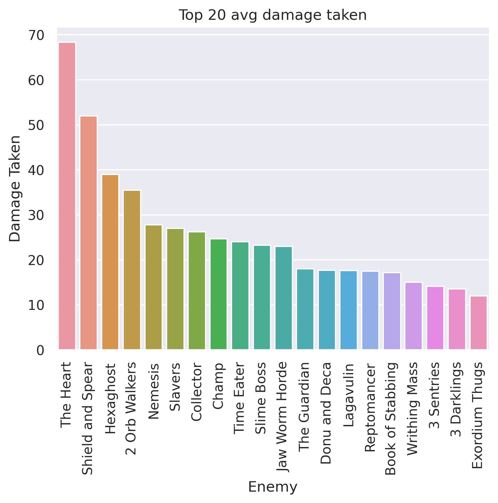
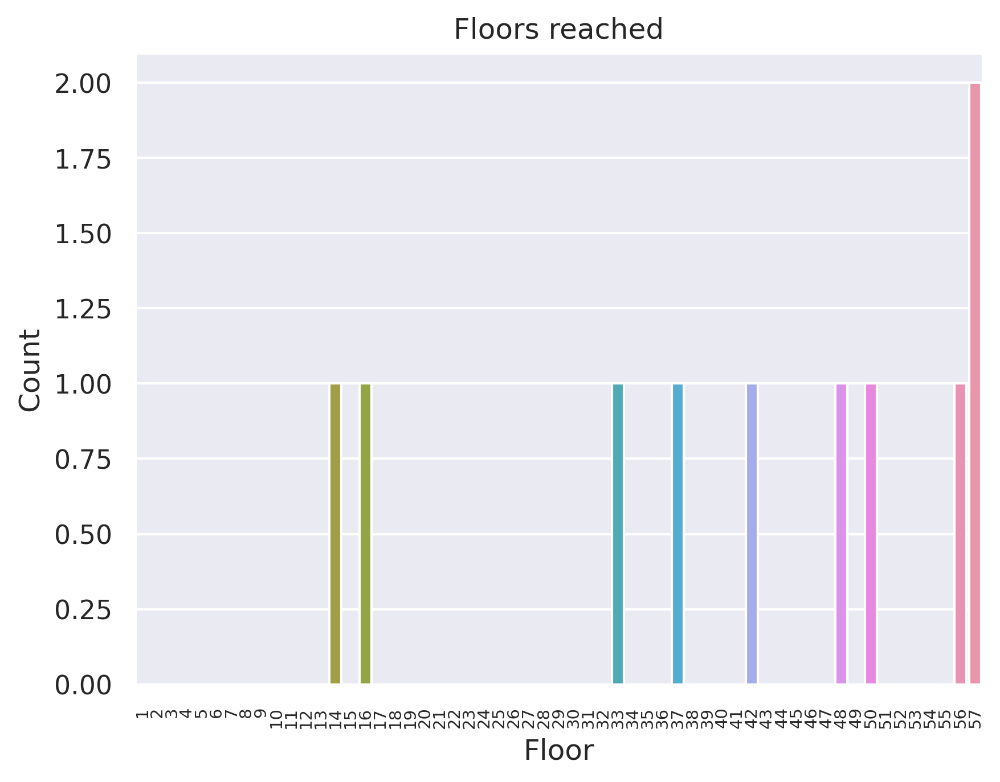
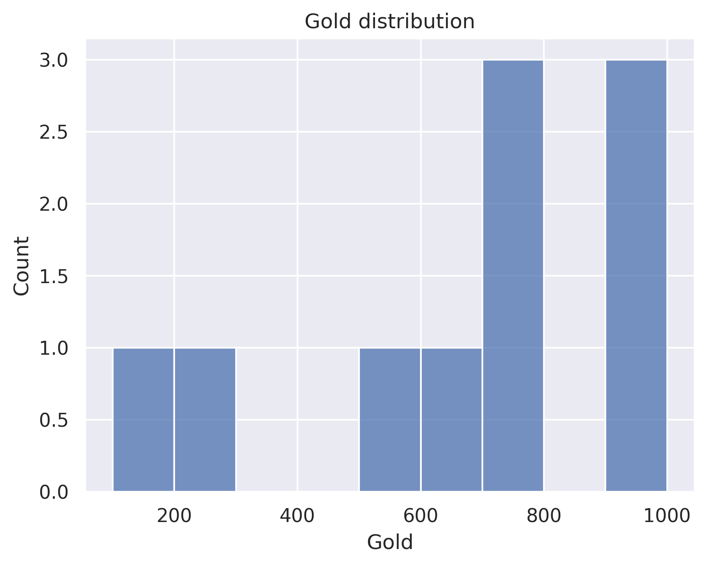

# Lose all gold for max HP - Defect
## General stats
- Total games played: 10
- Win rate (%): 20.0
- Avg playtime (mins): 62.43
- Avg floor reached: 41.0
- Max score: 2924
- Times rest: 0.5
- Times smith: 6.1
- Max hp >= 80: 8
- Max hp <= 40: 0

### Top 10 damage taken fights (excluding heart)
| Enemy            |   Damage Taken |
|------------------|----------------|
| Shield and Spear |             82 |
| Shield and Spear |             74 |
| Reptomancer      |             58 |
| Slavers          |             54 |
| Book of Stabbing |             54 |
| Nemesis          |             50 |
| Collector        |             49 |
| Nemesis          |             48 |
| 2 Orb Walkers    |             45 |
| Slavers          |             41 |

## Card stats
### Top 10 card removed count
| Card           |   Count |
|----------------|---------|
| Strike_B       |       4 |
| Zap            |       3 |
| Defend_B       |       3 |
| Writhe         |       2 |
| Blizzard       |       2 |
| Dualcast       |       1 |
| Ball Lightning |       1 |
| Hello World    |       1 |

### Top 80 card win rate (exclude duplicate)
| Card              |   Win rate |     | Card               |   Win rate |
|-------------------|------------|-----|--------------------|------------|
| Double Energy     |       1    |     | Steam              |          0 |
| Loop              |       1    |     | Rip and Tear       |          0 |
| Machine Learning  |       1    |     | RitualDagger       |          0 |
| Fusion            |       0.67 |     | Scrape             |          0 |
| Heatsinks         |       0.67 |     | Secret Technique   |          0 |
| Chill             |       0.5  |     | Chaos              |          0 |
| Electrodynamics   |       0.5  |     | Capacitor          |          0 |
| Echo Form         |       0.5  |     | Buffer             |          0 |
| Leap              |       0.5  |     | Streamline         |          0 |
| Meteor Strike     |       0.5  |     | Steam Power        |          0 |
| Aggregate         |       0.5  |     | Reinforced Body    |          0 |
| Sweeping Beam     |       0.5  |     | Blind              |          0 |
| Go for the Eyes   |       0.4  |     | Beam Cell          |          0 |
| Defragment        |       0.33 |     | Trip               |          0 |
| Lockon            |       0.33 |     | Ball Lightning     |          0 |
| FTL               |       0.33 |     | Auto Shields       |          0 |
| Turbo             |       0.33 |     | Reprogram          |          0 |
| Biased Cognition  |       0.33 |     | Claw               |          0 |
| Doom and Gloom    |       0.33 |     | Flash of Steel     |          0 |
| Recycle           |       0.33 |     | Coolheaded         |          0 |
| Self Repair       |       0.33 |     | Dramatic Entrance  |          0 |
| Seek              |       0.33 |     | All For One        |          0 |
| Glacier           |       0.33 |     | Darkness           |          0 |
| Compile Driver    |       0.29 |     | Dark Shackles      |          0 |
| Sunder            |       0.25 |     | CurseOfTheBell     |          0 |
| Skim              |       0.25 |     | Madness            |          0 |
| Hologram          |       0.25 |     | Master of Strategy |          0 |
| Undo              |       0.25 |     | Melter             |          0 |
| Cold Snap         |       0.2  |     | Core Surge         |          0 |
| Conserve Battery  |       0.2  |     | Multi-Cast         |          0 |
| Redo              |       0.2  |     | Necronomicurse     |          0 |
| Zap               |       0.17 |     | Panacea            |          0 |
| Dualcast          |       0.12 |     | PanicButton        |          0 |
| Strike_B          |       0.12 |     | Reboot             |          0 |
| Defend_B          |       0.11 |     | Rebound            |          0 |
| Genetic Algorithm |       0    |     | Hyperbeam          |          0 |

### Card pick rate act 1 (exclude boss)
| Card              |   Pick rate |     | Card             |   Pick rate |
|-------------------|-------------|-----|------------------|-------------|
| Seek              |        1    |     | Compile Driver   |        0.17 |
| Defragment        |        1    |     | Turbo            |        0.14 |
| Skim              |        1    |     | Coolheaded       |        0.12 |
| Undo              |        1    |     | Claw             |        0.1  |
| Rip and Tear      |        1    |     | SKIP             |        0.1  |
| Reboot            |        1    |     | Steam            |        0.08 |
| Auto Shields      |        1    |     | Stack            |        0    |
| Hyperbeam         |        1    |     | Thunder Strike   |        0    |
| Glacier           |        1    |     | Static Discharge |        0    |
| FTL               |        1    |     | Steam Power      |        0    |
| Electrodynamics   |        1    |     | Storm            |        0    |
| Doom and Gloom    |        1    |     | Tempest          |        0    |
| Sunder            |        0.75 |     | Aggregate        |        0    |
| Lockon            |        0.67 |     | Loop             |        0    |
| Genetic Algorithm |        0.6  |     | Scrape           |        0    |
| Conserve Battery  |        0.6  |     | Reprogram        |        0    |
| Hologram          |        0.57 |     | Redo             |        0    |
| Darkness          |        0.5  |     | Recycle          |        0    |
| Self Repair       |        0.5  |     | Multi-Cast       |        0    |
| Chill             |        0.5  |     | Leap             |        0    |
| Ball Lightning    |        0.46 |     | Heatsinks        |        0    |
| Cold Snap         |        0.4  |     | Go for the Eyes  |        0    |
| Sweeping Beam     |        0.38 |     | Double Energy    |        0    |
| Streamline        |        0.33 |     | Consume          |        0    |
| Reinforced Body   |        0.33 |     | Chaos            |        0    |
| Melter            |        0.33 |     | BootSequence     |        0    |
| Beam Cell         |        0.33 |     | Barrage          |        0    |
| Rebound           |        0.29 |     | White Noise      |        0    |

### Card pick rate after act 1 (exclude boss)
| Card               |   Pick rate |     | Card             |   Pick rate |
|--------------------|-------------|-----|------------------|-------------|
| Master of Strategy |        1    |     | Claw             |        0.12 |
| Secret Technique   |        1    |     | Steam            |        0.12 |
| Seek               |        1    |     | Rebound          |        0.11 |
| Biased Cognition   |        1    |     | Tempest          |        0    |
| Glacier            |        1    |     | Thinking Ahead   |        0    |
| Skim               |        1    |     | Thunder Strike   |        0    |
| Echo Form          |        1    |     | Sweeping Beam    |        0    |
| Buffer             |        1    |     | Scrape           |        0    |
| Recycle            |        1    |     | Rip and Tear     |        0    |
| Core Surge         |        1    |     | Stack            |        0    |
| Defragment         |        0.75 |     | Static Discharge |        0    |
| Compile Driver     |        0.73 |     | Reinforced Body  |        0    |
| Hologram           |        0.73 |     | Hello World      |        0    |
| Aggregate          |        0.67 |     | Multi-Cast       |        0    |
| Undo               |        0.5  |     | Creative AI      |        0    |
| Self Repair        |        0.5  |     | Ball Lightning   |        0    |
| Double Energy      |        0.5  |     | Bandage Up       |        0    |
| PanicButton        |        0.5  |     | Barrage          |        0    |
| Turbo              |        0.43 |     | Beam Cell        |        0    |
| Fusion             |        0.4  |     | Blind            |        0    |
| Coolheaded         |        0.4  |     | Blizzard         |        0    |
| Heatsinks          |        0.33 |     | BootSequence     |        0    |
| Chill              |        0.33 |     | Chrysalis        |        0    |
| Capacitor          |        0.33 |     | Consume          |        0    |
| Go for the Eyes    |        0.27 |     | Doom and Gloom   |        0    |
| Darkness           |        0.25 |     | Melter           |        0    |
| Conserve Battery   |        0.25 |     | FTL              |        0    |
| Chaos              |        0.2  |     | Fission          |        0    |
| Sunder             |        0.2  |     | Force Field      |        0    |
| Steam Power        |        0.2  |     | Auto Shields     |        0    |
| Cold Snap          |        0.2  |     | Hyperbeam        |        0    |
| Genetic Algorithm  |        0.2  |     | Leap             |        0    |
| Reprogram          |        0.17 |     | Lockon           |        0    |
| Streamline         |        0.17 |     | Loop             |        0    |
| SKIP               |        0.14 |     | Madness          |        0    |
| Redo               |        0.13 |     | White Noise      |        0    |

## Relic stats
### Top relic win rate
| Relic              |   Win rate |     | Relic               |   Win rate |
|--------------------|------------|-----|---------------------|------------|
| Sundial            |        1   |     | Nuclear Battery     |       0.5  |
| Toy Ornithopter    |        1   |     | Vajra               |       0.5  |
| TheAbacus          |        1   |     | Cables              |       0.5  |
| Toolbox            |        1   |     | Thread and Needle   |       0.5  |
| Runic Dome         |        1   |     | Whetstone           |       0.33 |
| Bottled Tornado    |        1   |     | Centennial Puzzle   |       0.33 |
| Bottled Flame      |        1   |     | Potion Belt         |       0.33 |
| Smiling Mask       |        1   |     | Unceasing Top       |       0.33 |
| Boot               |        1   |     | MealTicket          |       0.25 |
| InkBottle          |        1   |     | Anchor              |       0.25 |
| Inserter           |        1   |     | Happy Flower        |       0.25 |
| Bag of Preparation |        1   |     | Cracked Core        |       0.2  |
| PreservedInsect    |        1   |     | Torii               |       0    |
| Pantograph         |        1   |     | Runic Pyramid       |       0    |
| Pandora's Box      |        1   |     | Symbiotic Virus     |       0    |
| ClockworkSouvenir  |        1   |     | Velvet Choker       |       0    |
| Golden Idol        |        0.5 |     | Shovel              |       0    |
| Eternal Feather    |        0.5 |     | Philosopher's Stone |       0    |
| Shuriken           |        0.5 |     | Peace Pipe          |       0    |
| Orichalcum         |        0.5 |     | Sling               |       0    |

### Bottom relic win rate
| Relic              |   Win rate |     | Relic            |   Win rate |
|--------------------|------------|-----|------------------|------------|
| Sling              |          0 |     | CeramicFish      |          0 |
| The Courier        |          0 |     | Chemical X       |          0 |
| War Paint          |          0 |     | Coffee Dripper   |          0 |
| Oddly Smooth Stone |          0 |     | Cursed Key       |          0 |
| Ornamental Fan     |          0 |     | DataDisk         |          0 |
| White Beast Statue |          0 |     | NlothsMask       |          0 |
| Omamori            |          0 |     | Emotion Chip     |          0 |
| Akabeko            |          0 |     | Enchiridion      |          0 |
| Matryoshka         |          0 |     | Frozen Egg 2     |          0 |
| Nunchaku           |          0 |     | Ginger           |          0 |
| Darkstone Periapt  |          0 |     | Gremlin Horn     |          0 |
| Ancient Tea Set    |          0 |     | Juzu Bracelet    |          0 |
| Art of War         |          0 |     | Kunai            |          0 |
| Astrolabe          |          0 |     | Lantern          |          0 |
| Bag of Marbles     |          0 |     | Mango            |          0 |
| Bird Faced Urn     |          0 |     | Meat on the Bone |          0 |
| Blood Vial         |          0 |     | Membership Card  |          0 |
| Blue Candle        |          0 |     | Molten Egg 2     |          0 |
| Calling Bell       |          0 |     | Necronomicon     |          0 |
| CaptainsWheel      |          0 |     | WingedGreaves    |          0 |

### Act 1 boss relic pick rate
| Relic               |   Pick rate |     | Relic         |   Pick rate |
|---------------------|-------------|-----|---------------|-------------|
| Nuclear Battery     |         1   |     | Black Star    |           0 |
| Pandora's Box       |         1   |     | FrozenCore    |           0 |
| Runic Pyramid       |         1   |     | Calling Bell  |           0 |
| Philosopher's Stone |         1   |     | Runic Dome    |           0 |
| Coffee Dripper      |         1   |     | Busted Crown  |           0 |
| Cursed Key          |         1   |     | SacredBark    |           0 |
| Velvet Choker       |         0.5 |     | SlaversCollar |           0 |
| Fusion Hammer       |         0   |     | Sozu          |           0 |
| Inserter            |         0   |     | Astrolabe     |           0 |

### Act 1 boss relic win rate
| Relic           |   Win rate |     | Relic               |   Win rate |
|-----------------|------------|-----|---------------------|------------|
| Nuclear Battery |          1 |     | Philosopher's Stone |          0 |
| Pandora's Box   |          1 |     | Runic Pyramid       |          0 |
| Coffee Dripper  |          0 |     | Velvet Choker       |          0 |
| Cursed Key      |          0 |     |   |   |

### Act 2 boss relic pick rate
| Relic           |   Pick rate |     | Relic               |   Pick rate |
|-----------------|-------------|-----|---------------------|-------------|
| Astrolabe       |         1   |     | Cursed Key          |           0 |
| Calling Bell    |         1   |     | Empty Cage          |           0 |
| Coffee Dripper  |         1   |     | Philosopher's Stone |           0 |
| Nuclear Battery |         1   |     | Snecko Eye          |           0 |
| Runic Dome      |         1   |     | Sozu                |           0 |
| Inserter        |         0.5 |     | Tiny House          |           0 |
| Black Star      |         0   |     | Velvet Choker       |           0 |

### Act 2 boss relic win rate
| Relic      |   Win rate |     | Relic           |   Win rate |
|------------|------------|-----|-----------------|------------|
| Inserter   |          1 |     | Calling Bell    |          0 |
| Runic Dome |          1 |     | Coffee Dripper  |          0 |
| Astrolabe  |          0 |     | Nuclear Battery |          0 |

