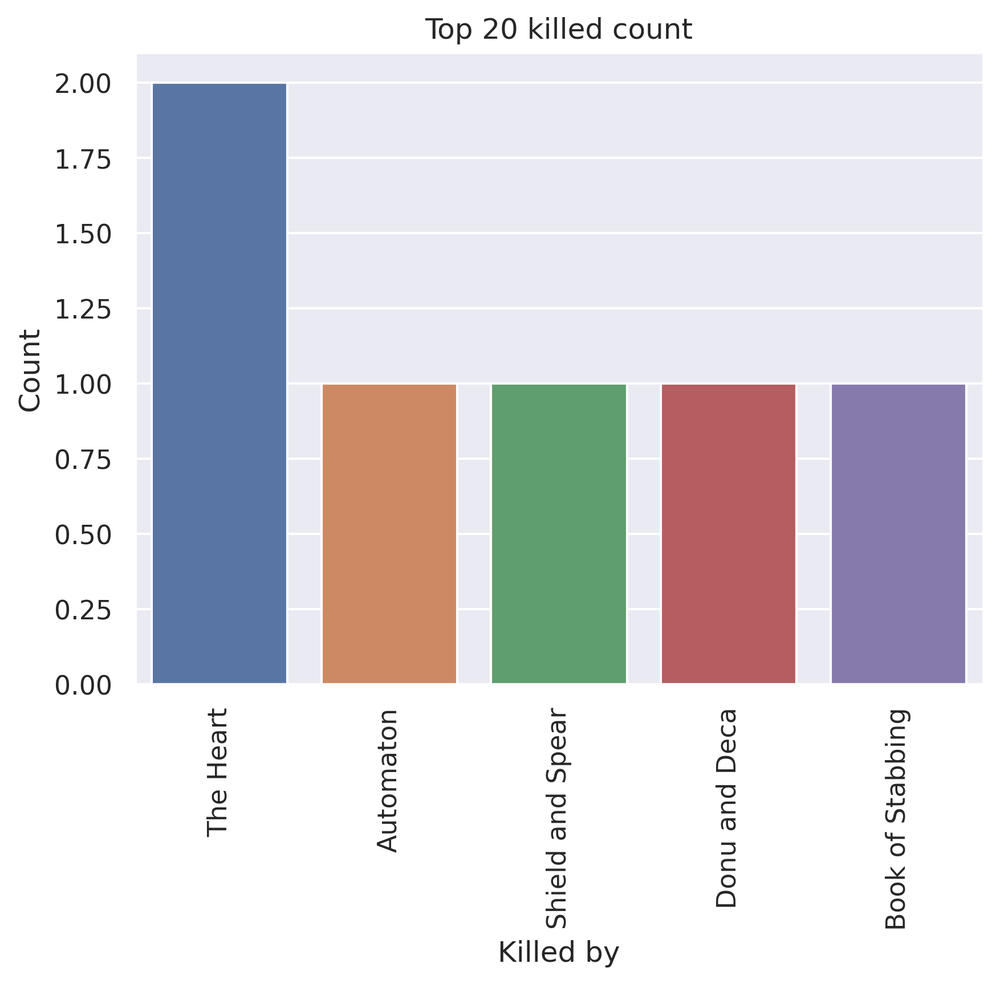
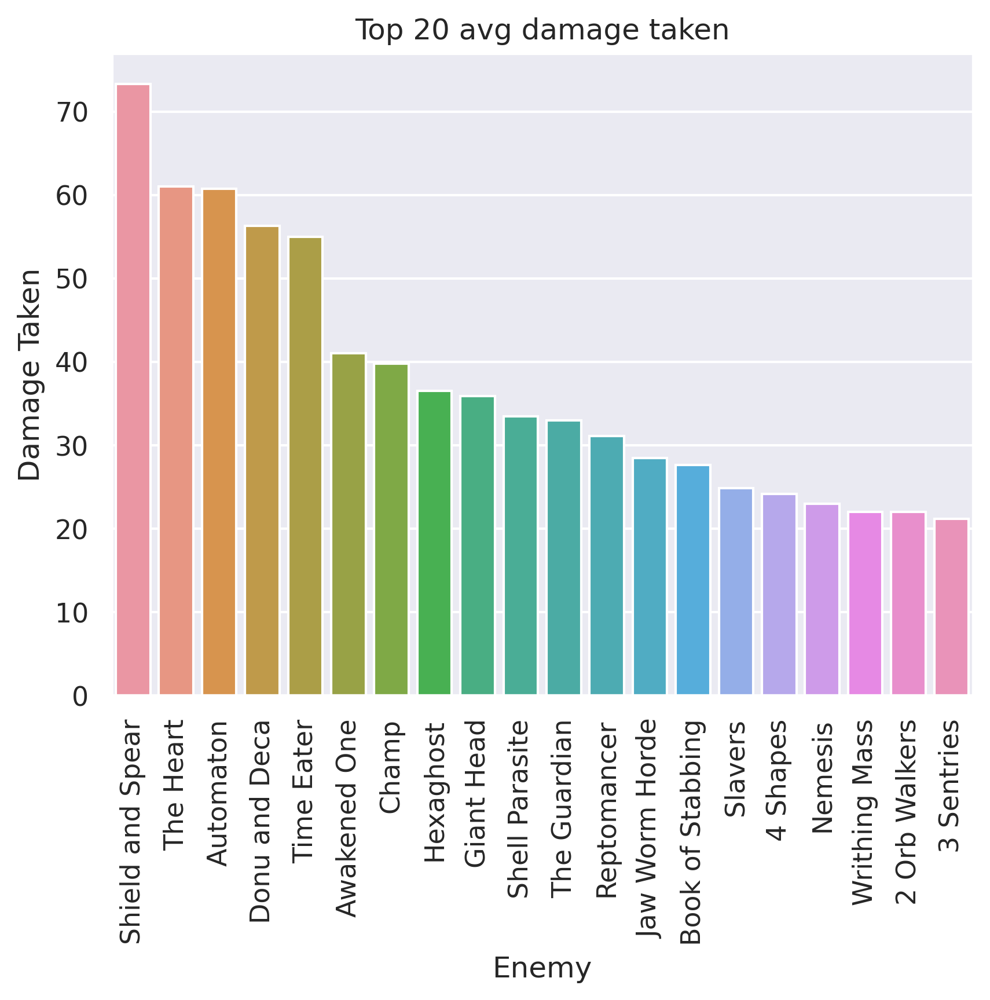
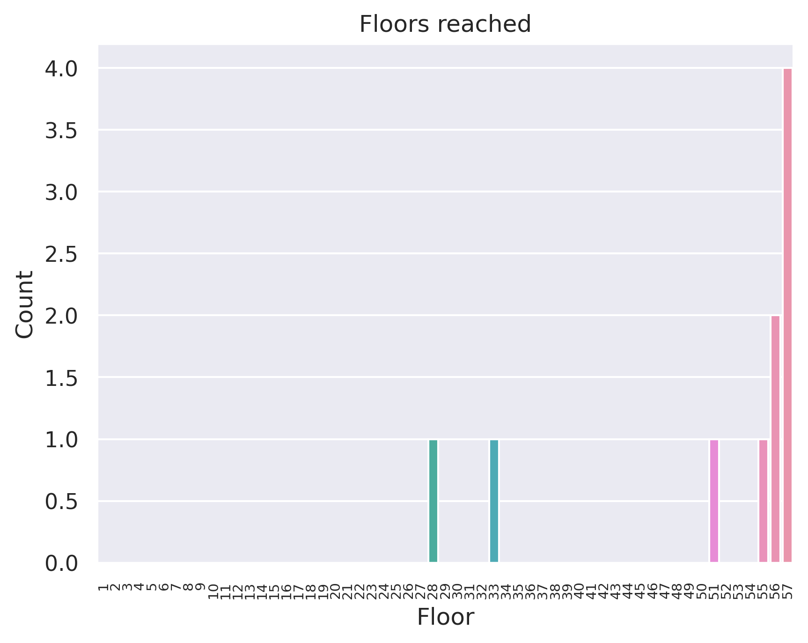
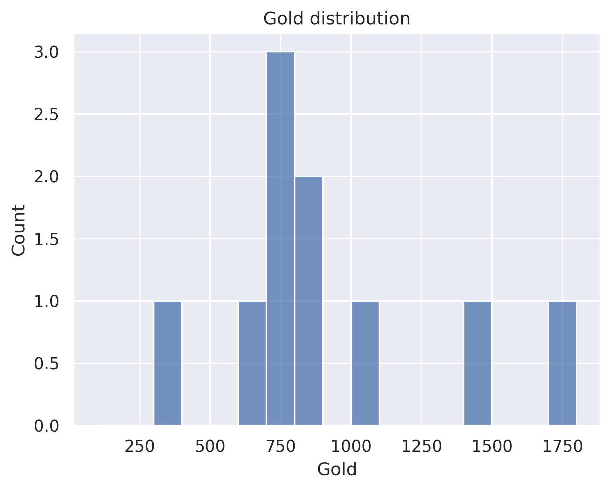

# Lose all gold for max HP - Ironclad
## General stats
- Total games played: 10
- Win rate (%): 40.0
- Avg playtime (mins): 105.51
- Avg floor reached: 50.7
- Max score: 3033
- Times rest: 1.3
- Times smith: 5.9
- Max hp >= 80: 9
- Max hp <= 40: 0

### Top 10 damage taken fights (excluding heart)
| Enemy            |   Damage Taken |
|------------------|----------------|
| Shield and Spear |            132 |
| Shield and Spear |            126 |
| Giant Head       |            126 |
| Donu and Deca    |            125 |
| Donu and Deca    |            121 |
| Nemesis          |            102 |
| Reptomancer      |            100 |
| Shield and Spear |             95 |
| Shield and Spear |             90 |
| Awakened One     |             86 |

## Card stats
### Top 10 card removed count
| Card             |   Count |
|------------------|---------|
| Strike_R         |       8 |
| Perfected Strike |       3 |
| Anger            |       3 |
| Decay            |       2 |
| Clash            |       1 |

### Top 80 card win rate (exclude duplicate)
| Card             |   Win rate |     | Card            |   Win rate |
|------------------|------------|-----|-----------------|------------|
| Good Instincts   |       1    |     | Pommel Strike   |       0.43 |
| Entrench         |       1    |     | Feel No Pain    |       0.4  |
| Barricade        |       1    |     | Immolate        |       0.4  |
| Violence         |       1    |     | Blood for Blood |       0.4  |
| Twin Strike      |       1    |     | Strike_R        |       0.4  |
| Sword Boomerang  |       1    |     | Pummel          |       0.33 |
| Ghostly Armor    |       1    |     | Second Wind     |       0.33 |
| Dark Embrace     |       1    |     | Havoc           |       0.33 |
| Madness          |       1    |     | Flame Barrier   |       0.33 |
| Reckless Charge  |       1    |     | Bash            |       0.33 |
| Clothesline      |       1    |     | Uppercut        |       0.33 |
| Exhume           |       0.75 |     | Battle Trance   |       0.33 |
| Dual Wield       |       0.75 |     | Demon Form      |       0.33 |
| Sentinel         |       0.67 |     | Brutality       |       0.33 |
| Iron Wave        |       0.67 |     | Bloodletting    |       0.29 |
| Infernal Blade   |       0.67 |     | Hemokinesis     |       0.25 |
| Spot Weakness    |       0.67 |     | Offering        |       0.25 |
| Reaper           |       0.6  |     | Inflame         |       0.25 |
| Rage             |       0.5  |     | Seeing Red      |       0.25 |
| PanicButton      |       0.5  |     | Headbutt        |       0.25 |
| Shockwave        |       0.5  |     | Burning Pact    |       0.2  |
| Flex             |       0.5  |     | Power Through   |       0.17 |
| Fiend Fire       |       0.5  |     | True Grit       |       0    |
| Feed             |       0.5  |     | Armaments       |       0    |
| Warcry           |       0.5  |     | Dark Shackles   |       0    |
| Evolve           |       0.5  |     | Sever Soul      |       0    |
| Perfected Strike |       0.5  |     | Rupture         |       0    |
| Anger            |       0.5  |     | RitualDagger    |       0    |
| Whirlwind        |       0.5  |     | Double Tap      |       0    |
| Corruption       |       0.5  |     | Carnage         |       0    |
| Disarm           |       0.5  |     | Apparition      |       0    |
| Berserk          |       0.5  |     | Metallicize     |       0    |
| Bite             |       0.5  |     | Clumsy          |       0    |
| Body Slam        |       0.5  |     | Combust         |       0    |
| Cleave           |       0.5  |     | Impervious      |       0    |
| Shrug It Off     |       0.44 |     | Dropkick        |       0    |
| Defend_R         |       0.44 |     |   |   |

### Card pick rate act 1 (exclude boss)
| Card             |   Pick rate |     | Card            |   Pick rate |
|------------------|-------------|-----|-----------------|-------------|
| Second Wind      |        1    |     | Pummel          |        0.2  |
| Shockwave        |        1    |     | Burning Pact    |        0.2  |
| Inflame          |        1    |     | SKIP            |        0.16 |
| Hemokinesis      |        1    |     | Cleave          |        0.14 |
| Demon Form       |        1    |     | Sword Boomerang |        0    |
| Power Through    |        1    |     | Thunderclap     |        0    |
| Ghostly Armor    |        1    |     | Spot Weakness   |        0    |
| Reaper           |        1    |     | Searing Blow    |        0    |
| Feed             |        1    |     | Carnage         |        0    |
| Offering         |        1    |     | True Grit       |        0    |
| Uppercut         |        1    |     | Twin Strike     |        0    |
| Berserk          |        1    |     | Sentinel        |        0    |
| Battle Trance    |        1    |     | Body Slam       |        0    |
| Metallicize      |        0.67 |     | Warcry          |        0    |
| Bloodletting     |        0.67 |     | Seeing Red      |        0    |
| Blood for Blood  |        0.67 |     | Barricade       |        0    |
| Pommel Strike    |        0.67 |     | Clash           |        0    |
| Whirlwind        |        0.67 |     | Clothesline     |        0    |
| Rage             |        0.67 |     | Rupture         |        0    |
| Shrug It Off     |        0.6  |     | Rampage         |        0    |
| Headbutt         |        0.57 |     | Corruption      |        0    |
| Perfected Strike |        0.5  |     | Dropkick        |        0    |
| Disarm           |        0.5  |     | Dual Wield      |        0    |
| Reckless Charge  |        0.5  |     | Entrench        |        0    |
| Feel No Pain     |        0.5  |     | Limit Break     |        0    |
| Anger            |        0.5  |     | Intimidate      |        0    |
| Infernal Blade   |        0.4  |     | Evolve          |        0    |
| Flame Barrier    |        0.4  |     | Armaments       |        0    |
| Iron Wave        |        0.3  |     | Exhume          |        0    |
| Flex             |        0.29 |     | Heavy Blade     |        0    |
| Combust          |        0.25 |     | Fire Breathing  |        0    |
| Dark Embrace     |        0.25 |     | Havoc           |        0    |
| Sever Soul       |        0.25 |     | Wild Strike     |        0    |

### Card pick rate after act 1 (exclude boss)
| Card            |   Pick rate |     | Card              |   Pick rate |
|-----------------|-------------|-----|-------------------|-------------|
| Disarm          |        1    |     | Wild Strike       |        0.05 |
| Corruption      |        1    |     | Headbutt          |        0    |
| Reaper          |        1    |     | Fire Breathing    |        0    |
| Fiend Fire      |        1    |     | Feed              |        0    |
| Exhume          |        1    |     | Enlightenment     |        0    |
| Demon Form      |        1    |     | Dramatic Entrance |        0    |
| Dark Shackles   |        1    |     | Sever Soul        |        0    |
| Shockwave       |        1    |     | Deep Breath       |        0    |
| Good Instincts  |        1    |     | Combust           |        0    |
| Violence        |        1    |     | Cleave            |        0    |
| Barricade       |        1    |     | Clash             |        0    |
| Power Through   |        0.86 |     | Swift Strike      |        0    |
| Battle Trance   |        0.8  |     | Carnage           |        0    |
| Seeing Red      |        0.71 |     | Thunderclap       |        0    |
| Burning Pact    |        0.67 |     | Bludgeon          |        0    |
| Sentinel        |        0.6  |     | Twin Strike       |        0    |
| Pommel Strike   |        0.55 |     | Blood for Blood   |        0    |
| Shrug It Off    |        0.54 |     | Blind             |        0    |
| Bloodletting    |        0.5  |     | Bandage Up        |        0    |
| Immolate        |        0.5  |     | Whirlwind         |        0    |
| Pummel          |        0.4  |     | Searing Blow      |        0    |
| Dark Embrace    |        0.4  |     | Flame Barrier     |        0    |
| Dropkick        |        0.4  |     | Infernal Blade    |        0    |
| Entrench        |        0.4  |     | Reckless Charge   |        0    |
| Uppercut        |        0.4  |     | Inflame           |        0    |
| Spot Weakness   |        0.36 |     | Intimidate        |        0    |
| Dual Wield      |        0.33 |     | Iron Wave         |        0    |
| Evolve          |        0.33 |     | Juggernaut        |        0    |
| Singing Bowl    |        0.33 |     | Limit Break       |        0    |
| Feel No Pain    |        0.33 |     | Madness           |        0    |
| SKIP            |        0.26 |     | Magnetism         |        0    |
| Double Tap      |        0.25 |     | Metallicize       |        0    |
| Hemokinesis     |        0.25 |     | Panacea           |        0    |
| Second Wind     |        0.25 |     | Panache           |        0    |
| True Grit       |        0.18 |     | Perfected Strike  |        0    |
| Warcry          |        0.14 |     | HandOfGreed       |        0    |
| Havoc           |        0.12 |     | Ghostly Armor     |        0    |
| Sword Boomerang |        0.12 |     | Forethought       |        0    |
| Rupture         |        0.11 |     | Rage              |        0    |
| Armaments       |        0.08 |     | Rampage           |        0    |
| Body Slam       |        0.08 |     | Flex              |        0    |
| Clothesline     |        0.07 |     | Heavy Blade       |        0    |
| Anger           |        0.06 |     |   |   |

## Relic stats
### Top relic win rate
| Relic             |   Win rate |     | Relic               |   Win rate |
|-------------------|------------|-----|---------------------|------------|
| MawBank           |          1 |     | Velvet Choker       |       1    |
| Self Forming Clay |          1 |     | Blue Candle         |       1    |
| Runic Dome        |          1 |     | Bottled Flame       |       1    |
| Nilry's Codex     |          1 |     | Bag of Marbles      |       1    |
| Enchiridion       |          1 |     | Snecko Eye          |       1    |
| Pen Nib           |          1 |     | Toy Ornithopter     |       1    |
| Fusion Hammer     |          1 |     | War Paint           |       0.75 |
| Orrery            |          1 |     | Anchor              |       0.67 |
| Ginger            |          1 |     | Art of War          |       0.67 |
| Ornamental Fan    |          1 |     | Toolbox             |       0.67 |
| Omamori           |          1 |     | Oddly Smooth Stone  |       0.67 |
| HornCleat         |          1 |     | Philosopher's Stone |       0.67 |
| Incense Burner    |          1 |     | Darkstone Periapt   |       0.67 |
| Juzu Bracelet     |          1 |     | InkBottle           |       0.67 |
| Kunai             |          1 |     | Meat on the Bone    |       0.5  |
| Mango             |          1 |     | Nunchaku            |       0.5  |
| Molten Egg 2      |          1 |     | Lantern             |       0.5  |
| Runic Pyramid     |          1 |     | Centennial Puzzle   |       0.5  |
| Dead Branch       |          1 |     | TheAbacus           |       0.5  |
| Mummified Hand    |          1 |     | The Courier         |       0.5  |

### Bottom relic win rate
| Relic              |   Win rate |     | Relic           |   Win rate |
|--------------------|------------|-----|-----------------|------------|
| CaptainsWheel      |       0.33 |     | Ancient Tea Set |          0 |
| Dream Catcher      |       0.33 |     | CeramicFish     |          0 |
| Akabeko            |       0.25 |     | Runic Cube      |          0 |
| Happy Flower       |       0.25 |     | MealTicket      |          0 |
| Bag of Preparation |       0.25 |     | Peace Pipe      |          0 |
| Bronze Scales      |       0.25 |     | Orichalcum      |          0 |
| Medical Kit        |       0    |     | Golden Idol     |          0 |
| Strawberry         |       0    |     | Gambling Chip   |          0 |
| Cauldron           |       0    |     | Pandora's Box   |          0 |
| Calipers           |       0    |     | Pantograph      |          0 |
| Singing Bowl       |       0    |     | Paper Frog      |          0 |
| SlaversCollar      |       0    |     | Pear            |          0 |
| Bottled Tornado    |       0    |     | Regal Pillow    |          0 |
| Blood Vial         |       0    |     | Frozen Eye      |          0 |
| Bottled Lightning  |       0    |     | Frozen Egg 2    |          0 |
| ClockworkSouvenir  |       0    |     | FossilizedHelix |          0 |
| Bird Faced Urn     |       0    |     | PreservedInsect |          0 |
| Turnip             |       0    |     | Cursed Key      |          0 |
| Vajra              |       0    |     | Coffee Dripper  |          0 |
| Astrolabe          |       0    |     | WarpedTongs     |          0 |

### Act 1 boss relic pick rate
| Relic               |   Pick rate |     | Relic        |   Pick rate |
|---------------------|-------------|-----|--------------|-------------|
| Coffee Dripper      |        1    |     | Runic Dome   |         0.2 |
| Philosopher's Stone |        1    |     | Black Blood  |         0   |
| Runic Cube          |        1    |     | Ectoplasm    |         0   |
| SlaversCollar       |        0.67 |     | Empty Cage   |         0   |
| Fusion Hammer       |        0.5  |     | Mark of Pain |         0   |
| Velvet Choker       |        0.5  |     | Sozu         |         0   |
| Astrolabe           |        0.25 |     | Tiny House   |         0   |

### Act 1 boss relic win rate
| Relic               |   Win rate |     | Relic          |   Win rate |
|---------------------|------------|-----|----------------|------------|
| Fusion Hammer       |          1 |     | Astrolabe      |          0 |
| Philosopher's Stone |          1 |     | Coffee Dripper |          0 |
| Runic Dome          |          1 |     | Runic Cube     |          0 |
| Velvet Choker       |          1 |     | SlaversCollar  |          0 |

### Act 2 boss relic pick rate
| Relic               |   Pick rate |     | Relic         |   Pick rate |
|---------------------|-------------|-----|---------------|-------------|
| Astrolabe           |        1    |     | Black Star    |           0 |
| Cursed Key          |        1    |     | Busted Crown  |           0 |
| Fusion Hammer       |        1    |     | Calling Bell  |           0 |
| Philosopher's Stone |        1    |     | Mark of Pain  |           0 |
| Runic Pyramid       |        1    |     | Runic Dome    |           0 |
| Snecko Eye          |        0.5  |     | Sozu          |           0 |
| Pandora's Box       |        0.33 |     | Tiny House    |           0 |
| Black Blood         |        0    |     | Velvet Choker |           0 |

### Act 2 boss relic win rate
| Relic               |   Win rate |     | Relic         |   Win rate |
|---------------------|------------|-----|---------------|------------|
| Fusion Hammer       |        1   |     | Astrolabe     |          0 |
| Runic Pyramid       |        1   |     | Cursed Key    |          0 |
| Snecko Eye          |        1   |     | Pandora's Box |          0 |
| Philosopher's Stone |        0.5 |     |   |   |

