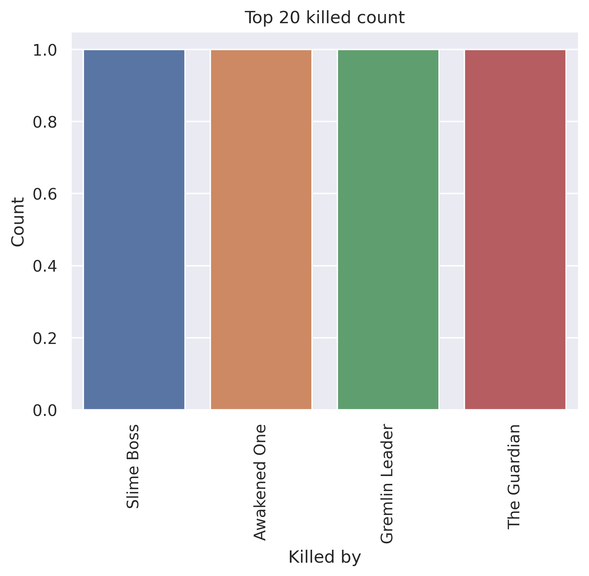
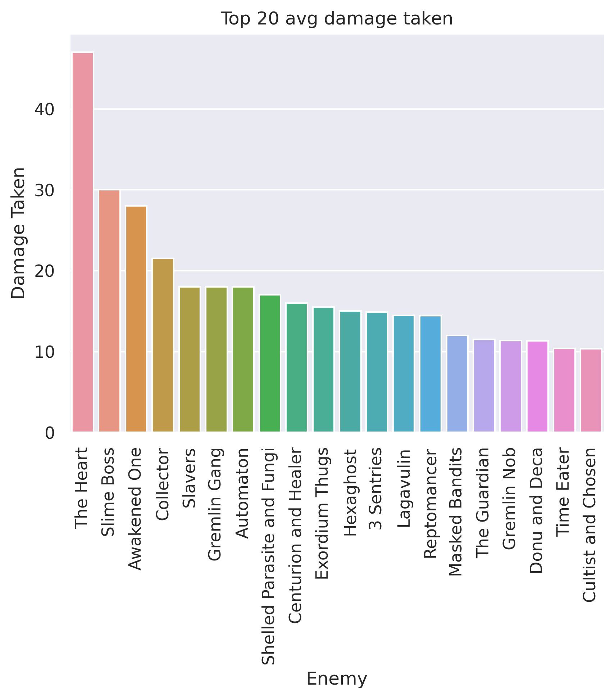
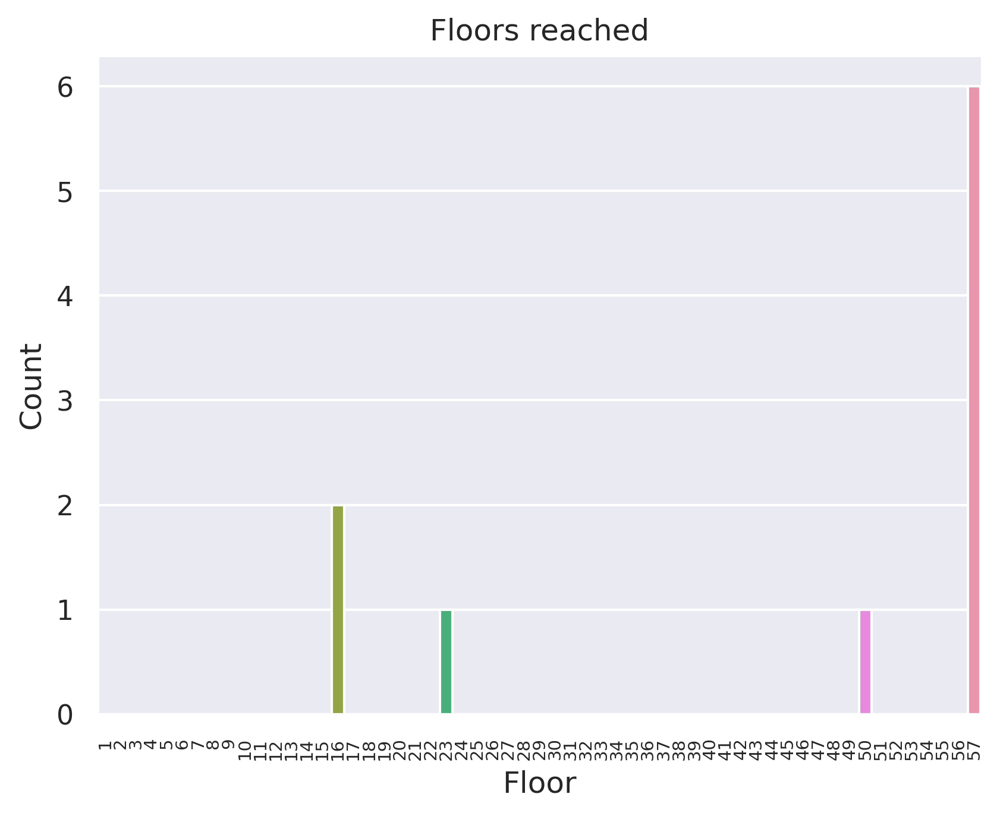
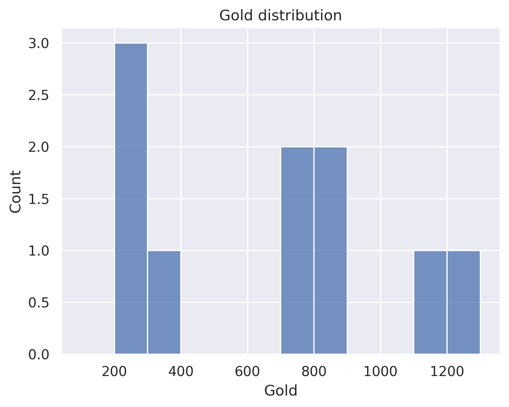

# Lose all gold for max HP - Silent
## General stats
- Total games played: 10
- Win rate (%): 60.0
- Avg playtime (mins): 97.38
- Avg floor reached: 44.7
- Max score: 3782
- Times rest: 1.3
- Times smith: 5.0
- Max hp >= 80: 5
- Max hp <= 40: 0

### Top 10 damage taken fights (excluding heart)
| Enemy             |   Damage Taken |
|-------------------|----------------|
| Awakened One      |            111 |
| Reptomancer       |             63 |
| Slime Boss        |             56 |
| 3 Darklings       |             55 |
| Exordium Wildlife |             39 |
| Collector         |             38 |
| 3 Sentries        |             37 |
| Gremlin Nob       |             36 |
| Slavers           |             35 |
| Slime Boss        |             34 |

## Card stats
### Top 10 card removed count
| Card           |   Count |
|----------------|---------|
| Strike_G       |       4 |
| Dagger Spray   |       1 |
| All Out Attack |       1 |
| Pain           |       1 |
| Regret         |       1 |
| Defend_G       |       1 |

### Top 80 card win rate (exclude duplicate)
| Card               |   Win rate |     | Card             |   Win rate |
|--------------------|------------|-----|------------------|------------|
| A Thousand Cuts    |       1    |     | PiercingWail     |       0.75 |
| Night Terror       |       1    |     | Dash             |       0.75 |
| Dodge and Roll     |       1    |     | Backflip         |       0.71 |
| Doppelganger       |       1    |     | PanicButton      |       0.67 |
| Escape Plan        |       1    |     | Malaise          |       0.67 |
| Expertise          |       1    |     | Blade Dance      |       0.67 |
| Glass Knife        |       1    |     | Slice            |       0.67 |
| Grand Finale       |       1    |     | Tactician        |       0.67 |
| Necronomicurse     |       1    |     | Burst            |       0.67 |
| Outmaneuver        |       1    |     | Eviscerate       |       0.67 |
| Deadly Poison      |       1    |     | Catalyst         |       0.67 |
| Phantasmal Killer  |       1    |     | Flying Knee      |       0.67 |
| Prepared           |       1    |     | Acrobatics       |       0.62 |
| Reflex             |       1    |     | Survivor         |       0.6  |
| Setup              |       1    |     | Dagger Spray     |       0.6  |
| Sucker Punch       |       1    |     | Neutralize       |       0.6  |
| Underhanded Strike |       1    |     | Leg Sweep        |       0.6  |
| Well Laid Plans    |       1    |     | Defend_G         |       0.56 |
| Die Die Die        |       1    |     | Poisoned Stab    |       0.5  |
| Finisher           |       1    |     | Noxious Fumes    |       0.5  |
| Apotheosis         |       1    |     | Adrenaline       |       0.5  |
| Blur               |       1    |     | Corpse Explosion |       0.5  |
| CurseOfTheBell     |       1    |     | Bullet Time      |       0.5  |
| Crippling Poison   |       1    |     | Bouncing Flask   |       0.5  |
| Bite               |       1    |     | Alchemize        |       0.5  |
| Calculated Gamble  |       0.86 |     | Shame            |       0.5  |
| Backstab           |       0.8  |     | All Out Attack   |       0.5  |
| Footwork           |       0.8  |     | Quick Slash      |       0.5  |
| Predator           |       0.8  |     | Strike_G         |       0.43 |
| Terror             |       0.8  |     | Endless Agony    |       0.33 |
| Wraith Form        |       0.8  |     | After Image      |       0    |
| Tools of the Trade |       0.75 |     | Magnetism        |       0    |
| Deflect            |       0.75 |     | Writhe           |       0    |
| Dagger Throw       |       0.75 |     |   |   |

### Card pick rate act 1 (exclude boss)
| Card               |   Pick rate |     | Card              |   Pick rate |
|--------------------|-------------|-----|-------------------|-------------|
| Wraith Form        |        1    |     | Flying Knee       |        0.17 |
| Corpse Explosion   |        1    |     | Bouncing Flask    |        0.17 |
| Doppelganger       |        1    |     | SKIP              |        0.15 |
| Terror             |        1    |     | Deflect           |        0.12 |
| Calculated Gamble  |        1    |     | Dagger Throw      |        0.12 |
| Bullet Time        |        1    |     | Sucker Punch      |        0.1  |
| Glass Knife        |        1    |     | Singing Bowl      |        0.08 |
| Dash               |        1    |     | Well Laid Plans   |        0    |
| Leg Sweep          |        1    |     | Setup             |        0    |
| Malaise            |        1    |     | Prepared          |        0    |
| All Out Attack     |        1    |     | Reflex            |        0    |
| After Image        |        1    |     | Riddle With Holes |        0    |
| Adrenaline         |        1    |     | Accuracy          |        0    |
| Blade Dance        |        0.83 |     | Outmaneuver       |        0    |
| Predator           |        0.75 |     | Deadly Poison     |        0    |
| Backstab           |        0.67 |     | Bane              |        0    |
| Eviscerate         |        0.6  |     | Blur              |        0    |
| Acrobatics         |        0.57 |     | Caltrops          |        0    |
| Poisoned Stab      |        0.57 |     | Choke             |        0    |
| Dagger Spray       |        0.55 |     | Cloak And Dagger  |        0    |
| Burst              |        0.5  |     | Concentrate       |        0    |
| Backflip           |        0.43 |     | Distraction       |        0    |
| PiercingWail       |        0.33 |     | Noxious Fumes     |        0    |
| Endless Agony      |        0.33 |     | Dodge and Roll    |        0    |
| Crippling Poison   |        0.33 |     | Expertise         |        0    |
| Slice              |        0.33 |     | Finisher          |        0    |
| Tactician          |        0.25 |     | Flechettes        |        0    |
| Catalyst           |        0.25 |     | Heel Hook         |        0    |
| Quick Slash        |        0.22 |     | Infinite Blades   |        0    |
| Underhanded Strike |        0.22 |     | Escape Plan       |        0    |
| Footwork           |        0.2  |     |   |   |

### Card pick rate after act 1 (exclude boss)
| Card               |   Pick rate |     | Card               |   Pick rate |
|--------------------|-------------|-----|--------------------|-------------|
| Wraith Form        |        1    |     | Sucker Punch       |        0.06 |
| Grand Finale       |        1    |     | Terror             |        0    |
| Adrenaline         |        1    |     | Quick Slash        |        0    |
| Calculated Gamble  |        1    |     | Trip               |        0    |
| Apotheosis         |        1    |     | Purity             |        0    |
| Backstab           |        1    |     | Riddle With Holes  |        0    |
| PanicButton        |        1    |     | Tools of the Trade |        0    |
| Burst              |        1    |     | Skewer             |        0    |
| Acrobatics         |        0.89 |     | Slice              |        0    |
| Backflip           |        0.77 |     | Poisoned Stab      |        0    |
| Well Laid Plans    |        0.75 |     | Unload             |        0    |
| PiercingWail       |        0.61 |     | Violence           |        0    |
| Noxious Fumes      |        0.6  |     | Thinking Ahead     |        0    |
| Leg Sweep          |        0.57 |     | Accuracy           |        0    |
| Footwork           |        0.57 |     | Panache            |        0    |
| Malaise            |        0.5  |     | Dagger Spray       |        0    |
| Setup              |        0.5  |     | Alchemize          |        0    |
| Phantasmal Killer  |        0.5  |     | All Out Attack     |        0    |
| Bullet Time        |        0.5  |     | Bane               |        0    |
| Tactician          |        0.43 |     | Blind              |        0    |
| Deflect            |        0.38 |     | Blur               |        0    |
| Dash               |        0.38 |     | Caltrops           |        0    |
| Blade Dance        |        0.36 |     | Choke              |        0    |
| Escape Plan        |        0.33 |     | Cloak And Dagger   |        0    |
| Reflex             |        0.29 |     | Concentrate        |        0    |
| Bouncing Flask     |        0.25 |     | Crippling Poison   |        0    |
| Predator           |        0.22 |     | Dagger Throw       |        0    |
| SKIP               |        0.21 |     | Metamorphosis      |        0    |
| Catalyst           |        0.2  |     | Dark Shackles      |        0    |
| Prepared           |        0.2  |     | Deep Breath        |        0    |
| Outmaneuver        |        0.2  |     | Discovery          |        0    |
| Finisher           |        0.2  |     | Distraction        |        0    |
| Dodge and Roll     |        0.18 |     | Flechettes         |        0    |
| Singing Bowl       |        0.17 |     | Glass Knife        |        0    |
| Expertise          |        0.17 |     | Heel Hook          |        0    |
| Endless Agony      |        0.14 |     | Impatience         |        0    |
| Underhanded Strike |        0.09 |     | Infinite Blades    |        0    |
| Deadly Poison      |        0.08 |     | Masterful Stab     |        0    |
| Flying Knee        |        0.07 |     | Forethought        |        0    |

## Relic stats
### Top relic win rate
| Relic              |   Win rate |     | Relic              |   Win rate |
|--------------------|------------|-----|--------------------|------------|
| Mercury Hourglass  |          1 |     | StoneCalendar      |          1 |
| Regal Pillow       |          1 |     | Strawberry         |          1 |
| Meat on the Bone   |          1 |     | StrikeDummy        |          1 |
| Anchor             |          1 |     | The Specimen       |          1 |
| MutagenicStrength  |          1 |     | Toolbox            |          1 |
| Necronomicon       |          1 |     | Torii              |          1 |
| Ninja Scroll       |          1 |     | Tough Bandages     |          1 |
| Oddly Smooth Stone |          1 |     | Toy Ornithopter    |          1 |
| OrangePellets      |          1 |     | TungstenRod        |          1 |
| Orichalcum         |          1 |     | TwistedFunnel      |          1 |
| Pandora's Box      |          1 |     | War Paint          |          1 |
| Paper Crane        |          1 |     | White Beast Statue |          1 |
| Pear               |          1 |     | Mark of the Bloom  |          1 |
| Potion Belt        |          1 |     | WingedGreaves      |          1 |
| PreservedInsect    |          1 |     | Lantern            |          1 |
| Red Mask           |          1 |     | Frozen Eye         |          1 |
| Runic Dome         |          1 |     | Art of War         |          1 |
| Letter Opener      |          1 |     | Bag of Marbles     |          1 |
| Runic Pyramid      |          1 |     | Blue Candle        |          1 |
| Shuriken           |          1 |     | Boot               |          1 |

### Bottom relic win rate
| Relic             |   Win rate |     | Relic               |   Win rate |
|-------------------|------------|-----|---------------------|------------|
| Calling Bell      |       1    |     | Pen Nib             |       0.67 |
| CaptainsWheel     |       1    |     | Akabeko             |       0.67 |
| Coffee Dripper    |       1    |     | Ring of the Snake   |       0.6  |
| Darkstone Periapt |       1    |     | Gremlin Horn        |       0.5  |
| Du-Vu Doll        |       1    |     | Golden Idol         |       0.5  |
| FossilizedHelix   |       1    |     | Chemical X          |       0.5  |
| Frozen Egg 2      |       1    |     | Bottled Lightning   |       0.5  |
| Ectoplasm         |       1    |     | SlaversCollar       |       0.5  |
| Fusion Hammer     |       1    |     | Mummified Hand      |       0.5  |
| Ginger            |       1    |     | Eternal Feather     |       0.5  |
| Kunai             |       1    |     | Happy Flower        |       0.5  |
| Incense Burner    |       1    |     | CeramicFish         |       0.5  |
| HoveringKite      |       1    |     | The Courier         |       0    |
| HornCleat         |       1    |     | Odd Mushroom        |       0    |
| Nunchaku          |       0.75 |     | Philosopher's Stone |       0    |
| Singing Bowl      |       0.67 |     | MealTicket          |       0    |
| Vajra             |       0.67 |     | MawBank             |       0    |
| Centennial Puzzle |       0.67 |     | Pantograph          |       0    |
| Snake Skull       |       0.67 |     | Mango               |       0    |
| Lizard Tail       |       0.67 |     | Cursed Key          |       0    |

### Act 1 boss relic pick rate
| Relic               |   Pick rate |     | Relic               |   Pick rate |
|---------------------|-------------|-----|---------------------|-------------|
| Cursed Key          |        1    |     | Black Star          |           0 |
| Ectoplasm           |        1    |     | Busted Crown        |           0 |
| Fusion Hammer       |        1    |     | Empty Cage          |           0 |
| HoveringKite        |        1    |     | Ring of the Serpent |           0 |
| Pandora's Box       |        1    |     | SacredBark          |           0 |
| Philosopher's Stone |        1    |     | SlaversCollar       |           0 |
| Coffee Dripper      |        0.5  |     | Tiny House          |           0 |
| Runic Dome          |        0.25 |     |   |   |

### Act 1 boss relic win rate
| Relic          |   Win rate |     | Relic               |   Win rate |
|----------------|------------|-----|---------------------|------------|
| Coffee Dripper |          1 |     | Pandora's Box       |          1 |
| Ectoplasm      |          1 |     | Runic Dome          |          1 |
| Fusion Hammer  |          1 |     | Cursed Key          |          0 |
| HoveringKite   |          1 |     | Philosopher's Stone |          0 |

### Act 2 boss relic pick rate
| Relic         |   Pick rate |     | Relic               |   Pick rate |
|---------------|-------------|-----|---------------------|-------------|
| Calling Bell  |         1   |     | Philosopher's Stone |           0 |
| Fusion Hammer |         1   |     | Ring of the Serpent |           0 |
| Runic Pyramid |         1   |     | Snecko Eye          |           0 |
| SlaversCollar |         1   |     | Sozu                |           0 |
| HoveringKite  |         0.5 |     | Velvet Choker       |           0 |
| Busted Crown  |         0   |     | WristBlade          |           0 |
| Empty Cage    |         0   |     |   |   |

### Act 2 boss relic win rate
| Relic         |   Win rate |     | Relic         |   Win rate |
|---------------|------------|-----|---------------|------------|
| Calling Bell  |          1 |     | Runic Pyramid |        1   |
| Fusion Hammer |          1 |     | SlaversCollar |        0.5 |
| HoveringKite  |          1 |     |   |   |

