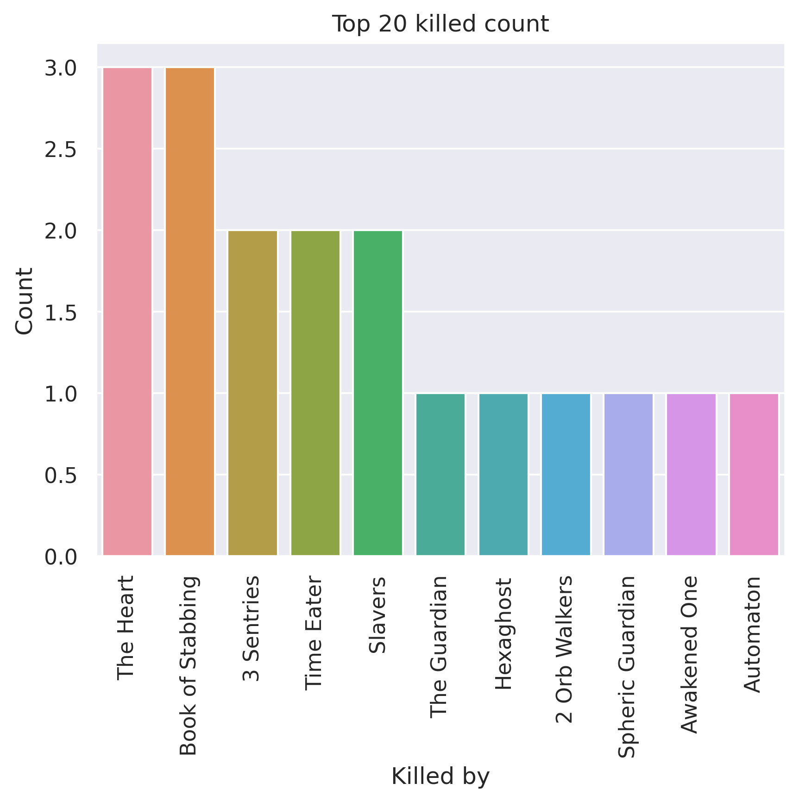
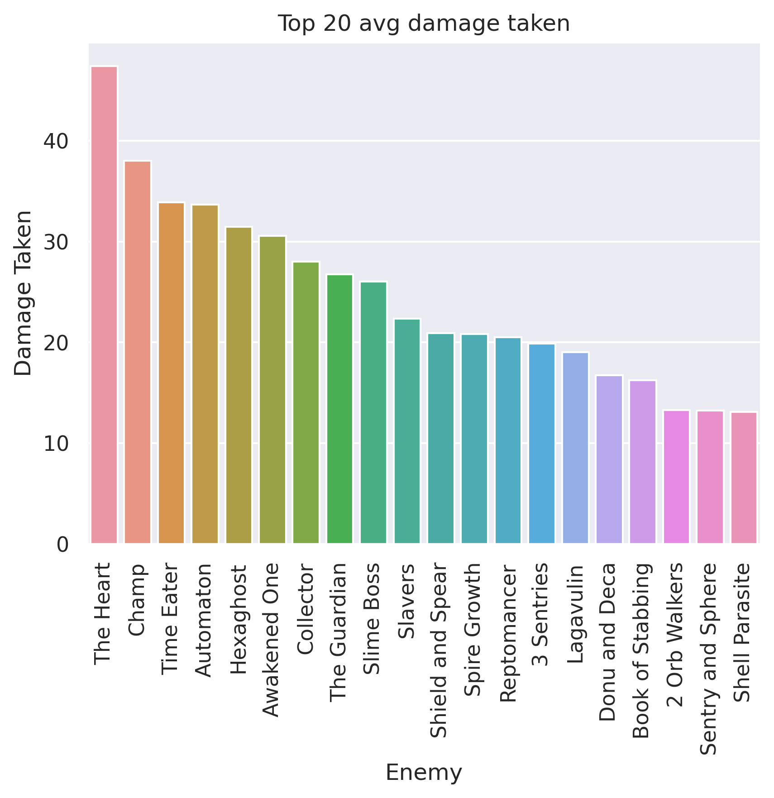
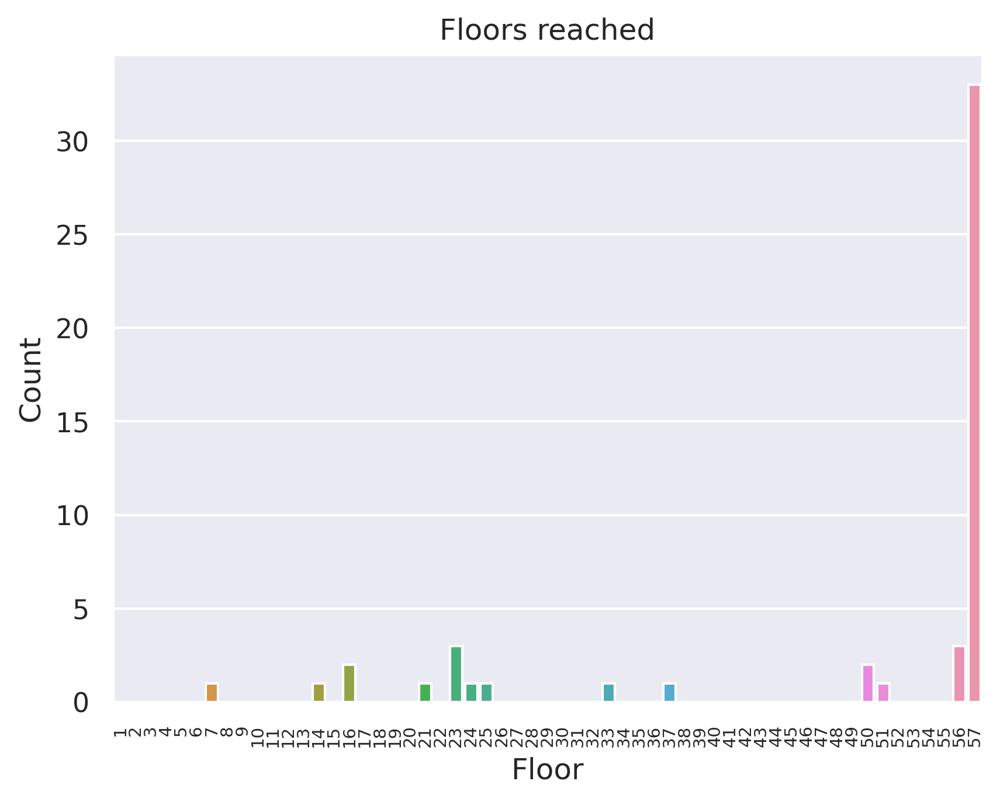
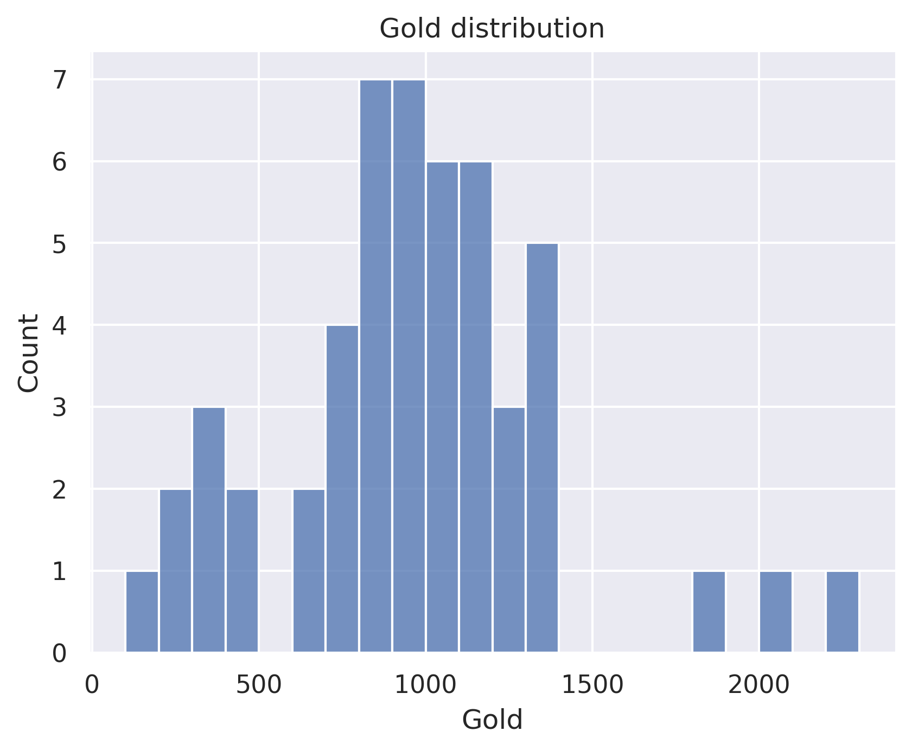

# Panacea Ironclad Sample
## General stats
- Total games played: 51
- Win rate (%): 64.71
- Avg playtime (mins): 123.88
- Avg floor reached: 48.27
- Max score: 3500
- Times rest: 0.82
- Times smith: 4.37
- Max hp >= 80: 24
- Max hp <= 40: 1

### Top 10 damage taken fights (excluding heart)
| Enemy            |   Damage Taken |
|------------------|----------------|
| Champ            |            141 |
| Time Eater       |            111 |
| Reptomancer      |            107 |
| Time Eater       |            101 |
| Time Eater       |            100 |
| Book of Stabbing |             99 |
| Time Eater       |             95 |
| Spire Growth     |             89 |
| Awakened One     |             85 |
| Slavers          |             80 |

## Card stats
### Top 10 card removed count
| Card            |   Count |
|-----------------|---------|
| Strike_R        |      67 |
| Anger           |       5 |
| Defend_R        |       5 |
| Normality       |       4 |
| Bash            |       3 |
| Reckless Charge |       2 |
| Twin Strike     |       2 |
| Parasite        |       2 |
| Writhe          |       2 |
| Wild Strike     |       2 |

### Top 80 card win rate (exclude duplicate)
| Card              |   Win rate |     | Card            |   Win rate |
|-------------------|------------|-----|-----------------|------------|
| Dropkick          |       1    |     | Impervious      |       0.8  |
| Infernal Blade    |       1    |     | Reckless Charge |       0.8  |
| Deep Breath       |       1    |     | Shockwave       |       0.79 |
| Trip              |       1    |     | Inflame         |       0.79 |
| Doubt             |       1    |     | Whirlwind       |       0.77 |
| Dramatic Entrance |       1    |     | Demon Form      |       0.77 |
| Panacea           |       1    |     | Battle Trance   |       0.76 |
| Flash of Steel    |       1    |     | Thunderclap     |       0.75 |
| Flex              |       1    |     | Entrench        |       0.75 |
| Good Instincts    |       1    |     | Blood for Blood |       0.75 |
| Heavy Blade       |       1    |     | Evolve          |       0.74 |
| Discovery         |       1    |     | Spot Weakness   |       0.74 |
| Purity            |       1    |     | Dark Embrace    |       0.73 |
| Intimidate        |       1    |     | Body Slam       |       0.73 |
| Juggernaut        |       1    |     | Disarm          |       0.73 |
| Limit Break       |       1    |     | Headbutt        |       0.72 |
| Shame             |       1    |     | Apotheosis      |       0.71 |
| Magnetism         |       1    |     | Carnage         |       0.71 |
| Rage              |       1    |     | Berserk         |       0.71 |
| Regret            |       1    |     | Shrug It Off    |       0.69 |
| Sentinel          |       1    |     | Corruption      |       0.69 |
| Panache           |       1    |     | Metallicize     |       0.67 |
| Barricade         |       0.94 |     | RitualDagger    |       0.67 |
| Second Wind       |       0.9  |     | PanicButton     |       0.67 |
| Bloodletting      |       0.89 |     | Writhe          |       0.67 |
| Exhume            |       0.88 |     | HandOfGreed     |       0.67 |
| Seeing Red        |       0.88 |     | Brutality       |       0.67 |
| Dark Shackles     |       0.88 |     | Armaments       |       0.67 |
| Dual Wield        |       0.86 |     | Finesse         |       0.67 |
| Offering          |       0.85 |     | Pommel Strike   |       0.66 |
| Feel No Pain      |       0.85 |     | Clothesline     |       0.64 |
| Apparition        |       0.83 |     | Ghostly Armor   |       0.64 |
| Warcry            |       0.83 |     | Defend_R        |       0.62 |
| Fiend Fire        |       0.83 |     | Twin Strike     |       0.62 |
| Power Through     |       0.82 |     | Rupture         |       0.6  |
| Burning Pact      |       0.82 |     | Pummel          |       0.6  |
| Reaper            |       0.81 |     | Uppercut        |       0.59 |
| True Grit         |       0.8  |     | Bash            |       0.59 |
| Secret Technique  |       0.8  |     | Feed            |       0.59 |
| Bludgeon          |       0.8  |     | Flame Barrier   |       0.57 |

### Card pick rate act 1 (exclude boss)
| Card            |   Pick rate |     | Card             |   Pick rate |
|-----------------|-------------|-----|------------------|-------------|
| Immolate        |        1    |     | Reckless Charge  |        0.19 |
| Discovery       |        1    |     | SKIP             |        0.17 |
| Mayhem          |        1    |     | Perfected Strike |        0.17 |
| Offering        |        1    |     | Clothesline      |        0.17 |
| Feed            |        1    |     | Bludgeon         |        0.17 |
| Secret Weapon   |        1    |     | Rampage          |        0.17 |
| Shockwave       |        1    |     | Body Slam        |        0.17 |
| Spot Weakness   |        0.9  |     | Dark Embrace     |        0.15 |
| Impervious      |        0.88 |     | Dropkick         |        0.14 |
| Corruption      |        0.88 |     | Fire Breathing   |        0.14 |
| Battle Trance   |        0.8  |     | Infernal Blade   |        0.14 |
| Double Tap      |        0.71 |     | Rage             |        0.13 |
| Fiend Fire      |        0.71 |     | Burning Pact     |        0.11 |
| Whirlwind       |        0.7  |     | Cleave           |        0.08 |
| Berserk         |        0.67 |     | Clash            |        0.07 |
| Carnage         |        0.62 |     | Sever Soul       |        0.07 |
| Hemokinesis     |        0.62 |     | Intimidate       |        0.07 |
| Uppercut        |        0.61 |     | Pummel           |        0.06 |
| Feel No Pain    |        0.6  |     | Warcry           |        0.06 |
| Shrug It Off    |        0.6  |     | Metallicize      |        0.06 |
| Seeing Red      |        0.57 |     | Havoc            |        0.03 |
| Pommel Strike   |        0.57 |     | True Grit        |        0.02 |
| Power Through   |        0.56 |     | Sword Boomerang  |        0    |
| Inflame         |        0.5  |     | Thunderclap      |        0    |
| Flame Barrier   |        0.5  |     | Barricade        |        0    |
| Exhume          |        0.5  |     | Sentinel         |        0    |
| Reaper          |        0.5  |     | Flex             |        0    |
| Brutality       |        0.5  |     | Secret Technique |        0    |
| Headbutt        |        0.47 |     | Searing Blow     |        0    |
| Armaments       |        0.45 |     | Sadistic Nature  |        0    |
| Blood for Blood |        0.45 |     | Rupture          |        0    |
| Anger           |        0.45 |     | Panache          |        0    |
| Ghostly Armor   |        0.35 |     | Metamorphosis    |        0    |
| Demon Form      |        0.33 |     | Limit Break      |        0    |
| Disarm          |        0.31 |     | Juggernaut       |        0    |
| Twin Strike     |        0.29 |     | Dual Wield       |        0    |
| Singing Bowl    |        0.26 |     | Impatience       |        0    |
| Evolve          |        0.25 |     | Entrench         |        0    |
| Bloodletting    |        0.22 |     | Heavy Blade      |        0    |
| Second Wind     |        0.21 |     | Good Instincts   |        0    |
| Iron Wave       |        0.21 |     | Wild Strike      |        0    |
| Combust         |        0.19 |     |   |   |

### Card pick rate after act 1 (exclude boss)
| Card               |   Pick rate |     | Card               |   Pick rate |
|--------------------|-------------|-----|--------------------|-------------|
| Secret Technique   |        1    |     | Warcry             |        0.09 |
| Dark Shackles      |        1    |     | Rupture            |        0.09 |
| Offering           |        1    |     | Ghostly Armor      |        0.09 |
| Impervious         |        1    |     | Inflame            |        0.09 |
| Exhume             |        1    |     | Armaments          |        0.08 |
| Fiend Fire         |        0.86 |     | Pummel             |        0.08 |
| PanicButton        |        0.8  |     | Intimidate         |        0.06 |
| Feel No Pain       |        0.79 |     | Sentinel           |        0.06 |
| Reaper             |        0.78 |     | Clothesline        |        0.04 |
| Dark Embrace       |        0.77 |     | True Grit          |        0.04 |
| Shockwave          |        0.76 |     | Headbutt           |        0.04 |
| Disarm             |        0.75 |     | Perfected Strike   |        0.04 |
| Barricade          |        0.69 |     | Heavy Blade        |        0.04 |
| Burning Pact       |        0.69 |     | Havoc              |        0.04 |
| Finesse            |        0.67 |     | Reckless Charge    |        0.04 |
| Discovery          |        0.67 |     | Sever Soul         |        0.03 |
| Master of Strategy |        0.67 |     | Dropkick           |        0.03 |
| Shrug It Off       |        0.66 |     | Anger              |        0.01 |
| Second Wind        |        0.6  |     | Flex               |        0.01 |
| Corruption         |        0.6  |     | Swift Strike       |        0    |
| Demon Form         |        0.58 |     | Sword Boomerang    |        0    |
| Apotheosis         |        0.5  |     | The Bomb           |        0    |
| Flash of Steel     |        0.5  |     | Thinking Ahead     |        0    |
| Magnetism          |        0.5  |     | Thunderclap        |        0    |
| Evolve             |        0.46 |     | Secret Weapon      |        0    |
| Power Through      |        0.45 |     | Transmutation      |        0    |
| Spot Weakness      |        0.43 |     | Trip               |        0    |
| Dual Wield         |        0.41 |     | Twin Strike        |        0    |
| Feed               |        0.4  |     | Violence           |        0    |
| Singing Bowl       |        0.39 |     | Infernal Blade     |        0    |
| Battle Trance      |        0.39 |     | Searing Blow       |        0    |
| Bloodletting       |        0.38 |     | Sadistic Nature    |        0    |
| Entrench           |        0.36 |     | Bandage Up         |        0    |
| Panache            |        0.33 |     | Chrysalis          |        0    |
| Deep Breath        |        0.33 |     | Clash              |        0    |
| Mayhem             |        0.33 |     | Cleave             |        0    |
| Flame Barrier      |        0.32 |     | Combust            |        0    |
| SKIP               |        0.3  |     | Double Tap         |        0    |
| Whirlwind          |        0.29 |     | Dramatic Entrance  |        0    |
| Uppercut           |        0.25 |     | Enlightenment      |        0    |
| Berserk            |        0.25 |     | Fire Breathing     |        0    |
| Seeing Red         |        0.25 |     | Forethought        |        0    |
| Limit Break        |        0.25 |     | Good Instincts     |        0    |
| Purity             |        0.25 |     | HandOfGreed        |        0    |
| Immolate           |        0.22 |     | Hemokinesis        |        0    |
| Carnage            |        0.21 |     | Impatience         |        0    |
| Body Slam          |        0.2  |     | Iron Wave          |        0    |
| Madness            |        0.2  |     | Jack Of All Trades |        0    |
| Blind              |        0.2  |     | Metallicize        |        0    |
| Pommel Strike      |        0.17 |     | Metamorphosis      |        0    |
| Rage               |        0.15 |     | Mind Blast         |        0    |
| Bludgeon           |        0.14 |     | Panacea            |        0    |
| Brutality          |        0.12 |     | Rampage            |        0    |
| Juggernaut         |        0.1  |     | Wild Strike        |        0    |
| Blood for Blood    |        0.1  |     |   |   |

## Relic stats
### Top relic win rate
| Relic             |   Win rate |     | Relic             |   Win rate |
|-------------------|------------|-----|-------------------|------------|
| Membership Card   |          1 |     | Mercury Hourglass |          1 |
| DollysMirror      |          1 |     | MutagenicStrength |          1 |
| Empty Cage        |          1 |     | Sling             |          1 |
| Tiny Chest        |          1 |     | Nloth's Gift      |          1 |
| FaceOfCleric      |          1 |     | Shovel            |          1 |
| FossilizedHelix   |          1 |     | OrangePellets     |          1 |
| Gambling Chip     |          1 |     | Paper Frog        |          1 |
| TheAbacus         |          1 |     | SacredBark        |          1 |
| Sundial           |          1 |     | Pocketwatch       |          1 |
| StrikeDummy       |          1 |     | Prayer Wheel      |          1 |
| Incense Burner    |          1 |     | PreservedInsect   |          1 |
| InkBottle         |          1 |     | Du-Vu Doll        |          1 |
| Strange Spoon     |          1 |     | HornCleat         |          1 |
| StoneCalendar     |          1 |     | Dead Branch       |          1 |
| Sozu              |          1 |     | Champion Belt     |          1 |
| Mango             |          1 |     | Bloody Idol       |          1 |
| Mark of Pain      |          1 |     | Black Blood       |          1 |
| Mark of the Bloom |          1 |     | Bird Faced Urn    |          1 |
| Matryoshka        |          1 |     | Brimstone         |          1 |
| Anchor            |          1 |     | Unceasing Top     |          1 |

### Bottom relic win rate
| Relic             |   Win rate |     | Relic               |   Win rate |
|-------------------|------------|-----|---------------------|------------|
| Thread and Needle |       0.71 |     | Juzu Bracelet       |       0.6  |
| Cursed Key        |       0.71 |     | The Courier         |       0.57 |
| Lantern           |       0.71 |     | Singing Bowl        |       0.56 |
| Smiling Mask      |       0.7  |     | Turnip              |       0.5  |
| Akabeko           |       0.7  |     | Charon's Ashes      |       0.5  |
| Orrery            |       0.7  |     | Calling Bell        |       0.5  |
| Bronze Scales     |       0.69 |     | Golden Idol         |       0.5  |
| Lizard Tail       |       0.67 |     | Enchiridion         |       0.5  |
| Boot              |       0.67 |     | Philosopher's Stone |       0.5  |
| Vajra             |       0.67 |     | WarpedTongs         |       0.5  |
| Eternal Feather   |       0.67 |     | Shuriken            |       0.5  |
| Necronomicon      |       0.67 |     | Old Coin            |       0.5  |
| Blood Vial        |       0.67 |     | Bottled Flame       |       0.5  |
| Letter Opener     |       0.67 |     | MealTicket          |       0.4  |
| Ice Cream         |       0.67 |     | Coffee Dripper      |       0.33 |
| TungstenRod       |       0.67 |     | Ginger              |       0.33 |
| Burning Blood     |       0.64 |     | Runic Dome          |       0    |
| Girya             |       0.6  |     | Velvet Choker       |       0    |
| Odd Mushroom      |       0.6  |     | Spirit Poop         |       0    |
| Molten Egg 2      |       0.6  |     | WingedGreaves       |       0    |

### Act 1 boss relic pick rate
| Relic               |   Pick rate |     | Relic         |   Pick rate |
|---------------------|-------------|-----|---------------|-------------|
| Astrolabe           |        1    |     | SlaversCollar |        0.14 |
| Snecko Eye          |        1    |     | Velvet Choker |        0.14 |
| Runic Pyramid       |        1    |     | Empty Cage    |        0.12 |
| Fusion Hammer       |        0.75 |     | Black Star    |        0.12 |
| Pandora's Box       |        0.71 |     | SacredBark    |        0.11 |
| Philosopher's Stone |        0.56 |     | Mark of Pain  |        0.1  |
| Coffee Dripper      |        0.5  |     | Ectoplasm     |        0    |
| Cursed Key          |        0.5  |     | Runic Dome    |        0    |
| Runic Cube          |        0.5  |     | Busted Crown  |        0    |
| Calling Bell        |        0.2  |     | Sozu          |        0    |
| Black Blood         |        0.14 |     | Tiny House    |        0    |

### Act 1 boss relic win rate
| Relic         |   Win rate |     | Relic               |   Win rate |
|---------------|------------|-----|---------------------|------------|
| Astrolabe     |       1    |     | Fusion Hammer       |       0.67 |
| Empty Cage    |       1    |     | Pandora's Box       |       0.6  |
| SacredBark    |       1    |     | Runic Cube          |       0.5  |
| Runic Pyramid |       1    |     | Calling Bell        |       0.5  |
| Black Blood   |       1    |     | Philosopher's Stone |       0.4  |
| Mark of Pain  |       1    |     | Coffee Dripper      |       0.33 |
| Black Star    |       1    |     | SlaversCollar       |       0    |
| Snecko Eye    |       0.89 |     | Velvet Choker       |       0    |
| Cursed Key    |       0.75 |     |   |   |

### Act 2 boss relic pick rate
| Relic               |   Pick rate |     | Relic         |   Pick rate |
|---------------------|-------------|-----|---------------|-------------|
| Snecko Eye          |        1    |     | Black Star    |        0.25 |
| SlaversCollar       |        1    |     | SacredBark    |        0.25 |
| Runic Pyramid       |        1    |     | Runic Dome    |        0.2  |
| Pandora's Box       |        0.75 |     | Sozu          |        0.17 |
| Fusion Hammer       |        0.7  |     | Empty Cage    |        0.14 |
| Coffee Dripper      |        0.6  |     | Mark of Pain  |        0.1  |
| Runic Cube          |        0.43 |     | Tiny House    |        0    |
| Philosopher's Stone |        0.43 |     | Black Blood   |        0    |
| Cursed Key          |        0.43 |     | Busted Crown  |        0    |
| Calling Bell        |        0.33 |     | Velvet Choker |        0    |

### Act 2 boss relic win rate
| Relic         |   Win rate |     | Relic               |   Win rate |
|---------------|------------|-----|---------------------|------------|
| Black Star    |          1 |     | Snecko Eye          |       1    |
| Empty Cage    |          1 |     | Sozu                |       1    |
| Fusion Hammer |          1 |     | Cursed Key          |       0.67 |
| Mark of Pain  |          1 |     | Philosopher's Stone |       0.67 |
| Pandora's Box |          1 |     | Calling Bell        |       0.5  |
| Runic Cube    |          1 |     | Runic Pyramid       |       0.5  |
| SacredBark    |          1 |     | Coffee Dripper      |       0.33 |
| SlaversCollar |          1 |     | Runic Dome          |       0    |

