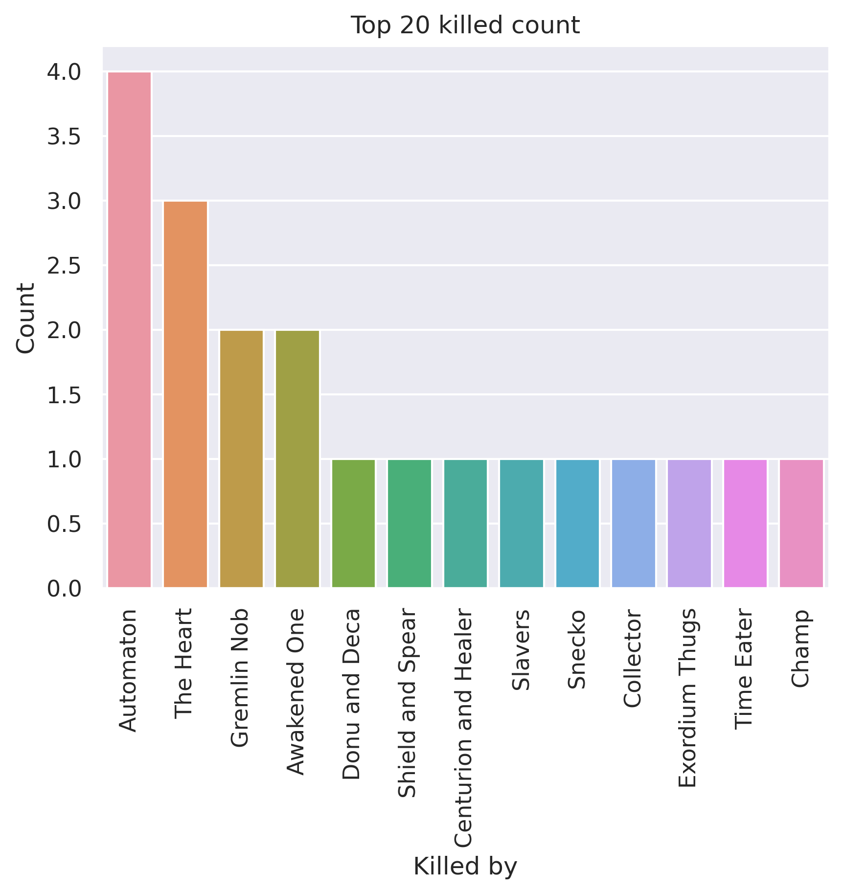
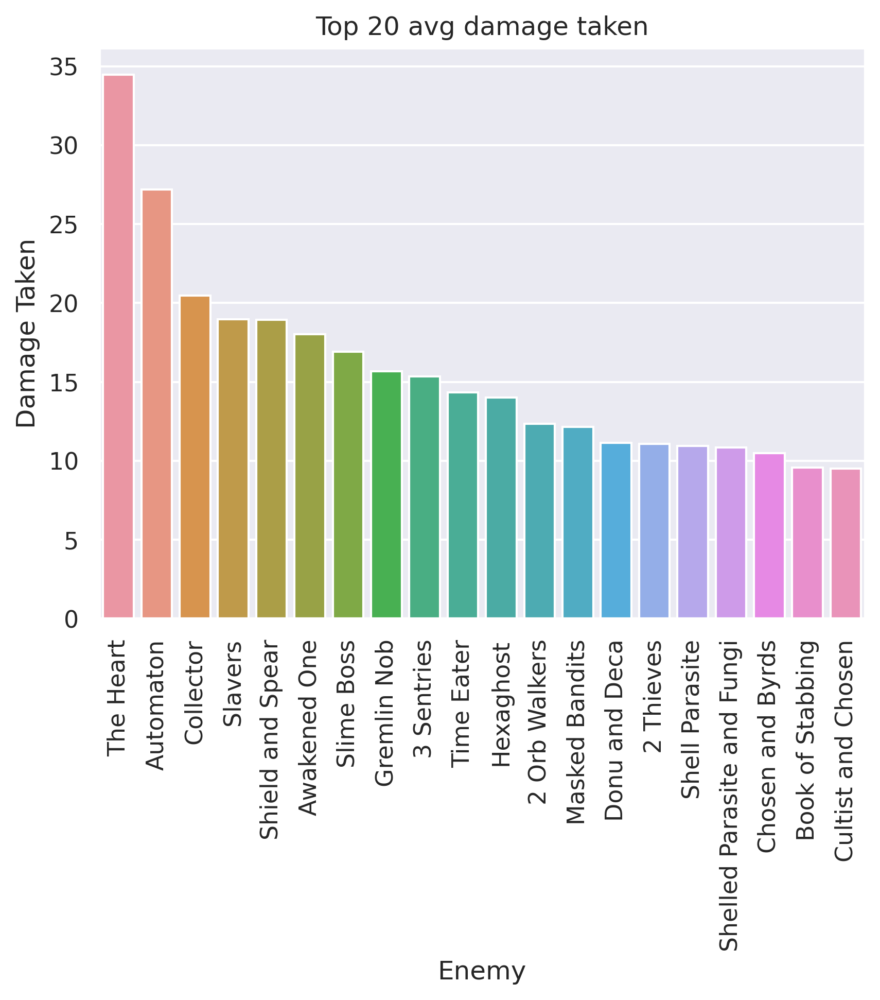
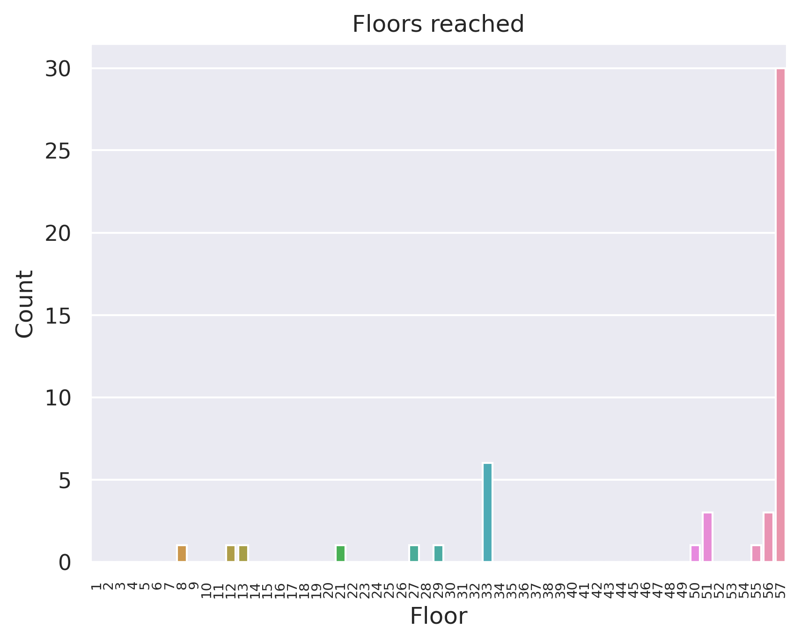
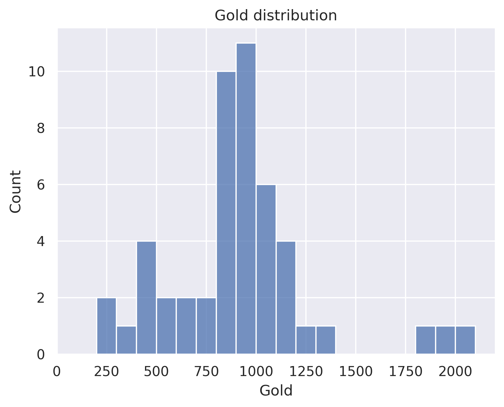

# Robit
## General stats
- Total games played: 50
- Win rate (%): 60.0
- Avg playtime (mins): 118.19
- Avg floor reached: 48.88
- Max score: 3614
- Times rest: 1.38
- Times smith: 6.28
- Max hp >= 80: 12
- Max hp <= 40: 5

### Top 10 damage taken fights (excluding heart)
| Enemy            |   Damage Taken |
|------------------|----------------|
| Shield and Spear |            103 |
| Automaton        |             82 |
| Awakened One     |             79 |
| Automaton        |             78 |
| Awakened One     |             77 |
| Giant Head       |             67 |
| Time Eater       |             65 |
| Reptomancer      |             63 |
| Shield and Spear |             62 |
| Nemesis          |             62 |

## Card stats
### Top 10 card removed count
| Card      |   Count |
|-----------|---------|
| Strike_B  |      24 |
| Defend_B  |      19 |
| Zap       |      10 |
| Dualcast  |       6 |
| Writhe    |       4 |
| Regret    |       4 |
| Normality |       3 |
| Pain      |       2 |
| Doubt     |       1 |
| Shame     |       1 |

### Top 80 card win rate (exclude duplicate)
| Card               |   Win rate |     | Card              |   Win rate |
|--------------------|------------|-----|-------------------|------------|
| Finesse            |       1    |     | Meteor Strike     |       0.76 |
| Mayhem             |       1    |     | Sweeping Beam     |       0.76 |
| Swift Strike       |       1    |     | Biased Cognition  |       0.75 |
| Dark Embrace       |       1    |     | Blind             |       0.75 |
| Parasite           |       1    |     | Undo              |       0.75 |
| Storm              |       1    |     | Recycle           |       0.75 |
| Corruption         |       1    |     | Force Field       |       0.75 |
| Dramatic Entrance  |       1    |     | Secret Technique  |       0.75 |
| Panacea            |       1    |     | Coolheaded        |       0.72 |
| Necronomicurse     |       1    |     | Glacier           |       0.69 |
| ThirdEye           |       1    |     | Turbo             |       0.69 |
| Vault              |       1    |     | BootSequence      |       0.68 |
| Claw               |       1    |     | Self Repair       |       0.68 |
| Sentinel           |       1    |     | Tempest           |       0.67 |
| Deep Breath        |       1    |     | Buffer            |       0.67 |
| Melter             |       1    |     | Multi-Cast        |       0.67 |
| Bandage Up         |       1    |     | CurseOfTheBell    |       0.67 |
| Worship            |       1    |     | Rainbow           |       0.67 |
| Amplify            |       1    |     | Hologram          |       0.67 |
| Leap               |       1    |     | Hyperbeam         |       0.67 |
| Wraith Form        |       1    |     | Apparition        |       0.67 |
| Backflip           |       1    |     | Reprogram         |       0.67 |
| Iron Wave          |       1    |     | Compile Driver    |       0.67 |
| Tantrum            |       1    |     | Go for the Eyes   |       0.66 |
| Deflect            |       1    |     | Skim              |       0.64 |
| Battle Trance      |       1    |     | Aggregate         |       0.64 |
| Magnetism          |       1    |     | Defragment        |       0.64 |
| Heavy Blade        |       1    |     | Static Discharge  |       0.64 |
| Master of Strategy |       1    |     | Stack             |       0.64 |
| Core Surge         |       0.9  |     | Darkness          |       0.64 |
| Blizzard           |       0.88 |     | Fusion            |       0.62 |
| Chaos              |       0.86 |     | Capacitor         |       0.62 |
| Apotheosis         |       0.83 |     | Chill             |       0.62 |
| Steam Power        |       0.82 |     | Heatsinks         |       0.62 |
| Reboot             |       0.8  |     | Double Energy     |       0.62 |
| Dark Shackles      |       0.8  |     | Genetic Algorithm |       0.61 |
| Loop               |       0.8  |     | Conserve Battery  |       0.61 |
| White Noise        |       0.8  |     | RitualDagger      |       0.6  |
| Ball Lightning     |       0.78 |     | Redo              |       0.6  |
| Echo Form          |       0.77 |     | Lockon            |       0.6  |

### Card pick rate act 1 (exclude boss)
| Card              |   Pick rate |     | Card             |   Pick rate |
|-------------------|-------------|-----|------------------|-------------|
| Mayhem            |        1    |     | Go for the Eyes  |        0.24 |
| Core Surge        |        1    |     | Conserve Battery |        0.22 |
| Panache           |        1    |     | Steam Power      |        0.22 |
| All For One       |        1    |     | Redo             |        0.21 |
| Reboot            |        1    |     | Hello World      |        0.2  |
| Swift Strike      |        1    |     | Streamline       |        0.19 |
| Seek              |        1    |     | Aggregate        |        0.18 |
| Biased Cognition  |        1    |     | Turbo            |        0.17 |
| Self Repair       |        1    |     | Steam            |        0.15 |
| Electrodynamics   |        1    |     | Auto Shields     |        0.15 |
| Buffer            |        1    |     | Rebound          |        0.12 |
| Echo Form         |        1    |     | Reinforced Body  |        0.1  |
| Defragment        |        0.88 |     | SKIP             |        0.08 |
| Skim              |        0.87 |     | Chaos            |        0.08 |
| Glacier           |        0.8  |     | Rip and Tear     |        0.06 |
| Doom and Gloom    |        0.75 |     | Blizzard         |        0.06 |
| Chill             |        0.73 |     | Consume          |        0.04 |
| Sunder            |        0.73 |     | Leap             |        0.03 |
| Undo              |        0.69 |     | Thunder Strike   |        0    |
| BootSequence      |        0.67 |     | Amplify          |        0    |
| Cold Snap         |        0.63 |     | Thinking Ahead   |        0    |
| Hologram          |        0.62 |     | Claw             |        0    |
| Loop              |        0.62 |     | The Bomb         |        0    |
| Lockon            |        0.58 |     | Barrage          |        0    |
| Coolheaded        |        0.57 |     | Capacitor        |        0    |
| Genetic Algorithm |        0.5  |     | Storm            |        0    |
| Rainbow           |        0.5  |     | Melter           |        0    |
| Hyperbeam         |        0.5  |     | Creative AI      |        0    |
| Fission           |        0.5  |     | Stack            |        0    |
| FTL               |        0.5  |     | Machine Learning |        0    |
| Double Energy     |        0.5  |     | Singing Bowl     |        0    |
| Multi-Cast        |        0.5  |     | Force Field      |        0    |
| Beam Cell         |        0.4  |     | Forethought      |        0    |
| Sweeping Beam     |        0.39 |     | Scrape           |        0    |
| Static Discharge  |        0.38 |     | Sadistic Nature  |        0    |
| Ball Lightning    |        0.36 |     | Reprogram        |        0    |
| Darkness          |        0.33 |     | Fusion           |        0    |
| White Noise       |        0.32 |     | Recycle          |        0    |
| Compile Driver    |        0.25 |     | Heatsinks        |        0    |
| Tempest           |        0.25 |     | Impatience       |        0    |

### Card pick rate after act 1 (exclude boss)
| Card               |   Pick rate |     | Card               |   Pick rate |
|--------------------|-------------|-----|--------------------|-------------|
| Wraith Form        |        1    |     | Rainbow            |        0.11 |
| Iron Wave          |        1    |     | Force Field        |        0.11 |
| Heavy Blade        |        1    |     | Steam              |        0.1  |
| Panacea            |        1    |     | Hello World        |        0.1  |
| Echo Form          |        1    |     | Reprogram          |        0.09 |
| Deflect            |        1    |     | Sweeping Beam      |        0.08 |
| Secret Technique   |        1    |     | Static Discharge   |        0.07 |
| Seek               |        1    |     | Storm              |        0.07 |
| Battle Trance      |        1    |     | Barrage            |        0.06 |
| Sentinel           |        1    |     | Rebound            |        0.05 |
| Tantrum            |        1    |     | FTL                |        0.05 |
| Backflip           |        1    |     | Melter             |        0.05 |
| ThirdEye           |        1    |     | Auto Shields       |        0.03 |
| Apotheosis         |        1    |     | Streamline         |        0.02 |
| Corruption         |        1    |     | Ball Lightning     |        0.01 |
| Worship            |        1    |     | Claw               |        0.01 |
| All For One        |        1    |     | Leap               |        0.01 |
| Skim               |        0.86 |     | Shrug It Off       |        0    |
| Core Surge         |        0.83 |     | Skewer             |        0    |
| Dark Shackles      |        0.83 |     | Swift Strike       |        0    |
| Glacier            |        0.75 |     | Bandage Up         |        0    |
| Defragment         |        0.7  |     | Slice              |        0    |
| Hologram           |        0.68 |     | Scrape             |        0    |
| Meteor Strike      |        0.64 |     | Sword Boomerang    |        0    |
| Biased Cognition   |        0.62 |     | Tempest            |        0    |
| Magnetism          |        0.5  |     | The Bomb           |        0    |
| Electrodynamics    |        0.5  |     | Thinking Ahead     |        0    |
| Deep Breath        |        0.5  |     | Thunder Strike     |        0    |
| Blind              |        0.5  |     | Transmutation      |        0    |
| Finesse            |        0.5  |     | Trip               |        0    |
| Master of Strategy |        0.5  |     | Violence           |        0    |
| Dark Embrace       |        0.5  |     | Warcry             |        0    |
| Buffer             |        0.5  |     | Weave              |        0    |
| Loop               |        0.47 |     | Wild Strike        |        0    |
| Genetic Algorithm  |        0.47 |     | All Out Attack     |        0    |
| Coolheaded         |        0.46 |     | Blade Dance        |        0    |
| Reboot             |        0.45 |     | PanicButton        |        0    |
| Chill              |        0.45 |     | SashWhip           |        0    |
| Undo               |        0.43 |     | Impatience         |        0    |
| Aggregate          |        0.41 |     | Chrysalis          |        0    |
| BootSequence       |        0.4  |     | Clash              |        0    |
| Recycle            |        0.39 |     | HandOfGreed        |        0    |
| Doom and Gloom     |        0.38 |     | Good Instincts     |        0    |
| Double Energy      |        0.36 |     | Clothesline        |        0    |
| Turbo              |        0.34 |     | Forethought        |        0    |
| Creative AI        |        0.33 |     | FlyingSleeves      |        0    |
| Fission            |        0.31 |     | Finisher           |        0    |
| Compile Driver     |        0.29 |     | Eviscerate         |        0    |
| Steam Power        |        0.29 |     | Enlightenment      |        0    |
| Multi-Cast         |        0.29 |     | Consecrate         |        0    |
| Self Repair        |        0.28 |     | Dramatic Entrance  |        0    |
| Go for the Eyes    |        0.27 |     | Discovery          |        0    |
| Singing Bowl       |        0.26 |     | Corpse Explosion   |        0    |
| Machine Learning   |        0.25 |     | Deadly Poison      |        0    |
| Fusion             |        0.24 |     | Immolate           |        0    |
| Heatsinks          |        0.23 |     | Carnage            |        0    |
| Cold Snap          |        0.22 |     | Sadistic Nature    |        0    |
| Blizzard           |        0.22 |     | Jack Of All Trades |        0    |
| SKIP               |        0.21 |     | Rupture            |        0    |
| Conserve Battery   |        0.21 |     | Rip and Tear       |        0    |
| Redo               |        0.21 |     | Purity             |        0    |
| Amplify            |        0.2  |     | Pommel Strike      |        0    |
| Madness            |        0.2  |     | Poisoned Stab      |        0    |
| Lockon             |        0.19 |     | Perseverance       |        0    |
| White Noise        |        0.19 |     | Panache            |        0    |
| Consume            |        0.18 |     | Blood for Blood    |        0    |
| Capacitor          |        0.17 |     | Outmaneuver        |        0    |
| Darkness           |        0.15 |     | Body Slam          |        0    |
| Reinforced Body    |        0.15 |     | Metamorphosis      |        0    |
| Hyperbeam          |        0.14 |     | MentalFortress     |        0    |
| Chaos              |        0.14 |     | Mayhem             |        0    |
| Stack              |        0.13 |     | Masterful Stab     |        0    |
| Beam Cell          |        0.12 |     | Burning Pact       |        0    |
| Sunder             |        0.11 |     | Indignation        |        0    |

## Relic stats
### Top relic win rate
| Relic               |   Win rate |     | Relic              |   Win rate |
|---------------------|------------|-----|--------------------|------------|
| Velvet Choker       |          1 |     | Black Star         |       1    |
| StoneCalendar       |          1 |     | Pocketwatch        |       1    |
| Tiny House          |          1 |     | Prayer Wheel       |       1    |
| Mark of the Bloom   |          1 |     | PrismaticShard     |       1    |
| Turnip              |          1 |     | White Beast Statue |       1    |
| Unceasing Top       |          1 |     | Runic Capacitor    |       1    |
| Medical Kit         |          1 |     | Runic Dome         |       1    |
| Chemical X          |          1 |     | Thread and Needle  |       1    |
| Vajra               |          1 |     | Happy Flower       |       0.93 |
| Necronomicon        |          1 |     | Runic Pyramid      |       0.92 |
| Enchiridion         |          1 |     | DollysMirror       |       0.89 |
| Strange Spoon       |          1 |     | HornCleat          |       0.89 |
| Nilry's Codex       |          1 |     | Oddly Smooth Stone |       0.89 |
| Cables              |          1 |     | The Courier        |       0.88 |
| Odd Mushroom        |          1 |     | InkBottle          |       0.88 |
| Dead Branch         |          1 |     | Frozen Egg 2       |       0.88 |
| WarpedTongs         |          1 |     | Juzu Bracelet      |       0.86 |
| Old Coin            |          1 |     | Mango              |       0.86 |
| Snecko Eye          |          1 |     | Toolbox            |       0.86 |
| Philosopher's Stone |          1 |     | Incense Burner     |       0.86 |

### Bottom relic win rate
| Relic            |   Win rate |     | Relic          |   Win rate |
|------------------|------------|-----|----------------|------------|
| Bronze Scales    |       0.64 |     | Bottled Flame  |       0.5  |
| Blood Vial       |       0.62 |     | Du-Vu Doll     |       0.5  |
| MawBank          |       0.62 |     | Ginger         |       0.5  |
| Art of War       |       0.62 |     | Torii          |       0.5  |
| Singing Bowl     |       0.6  |     | Shovel         |       0.5  |
| Toxic Egg 2      |       0.6  |     | SacredBark     |       0.5  |
| Akabeko          |       0.6  |     | Ornamental Fan |       0.5  |
| Kunai            |       0.6  |     | Peace Pipe     |       0.5  |
| Blue Candle      |       0.6  |     | WingedGreaves  |       0.5  |
| Letter Opener    |       0.6  |     | Nunchaku       |       0.46 |
| Meat on the Bone |       0.6  |     | StrikeDummy    |       0.43 |
| Girya            |       0.6  |     | Coffee Dripper |       0.4  |
| CaptainsWheel    |       0.6  |     | Calipers       |       0.4  |
| Potion Belt      |       0.57 |     | Inserter       |       0.33 |
| CeramicFish      |       0.57 |     | Tiny Chest     |       0.33 |
| SlaversCollar    |       0.57 |     | NeowsBlessing  |       0.33 |
| Sundial          |       0.57 |     | TheAbacus      |       0    |
| Red Mask         |       0.57 |     | Ectoplasm      |       0    |
| Cracked Core     |       0.56 |     | Lee's Waffle   |       0    |
| Astrolabe        |       0.55 |     | Sozu           |       0    |

### Act 1 boss relic pick rate
| Relic           |   Pick rate |     | Relic               |   Pick rate |
|-----------------|-------------|-----|---------------------|-------------|
| Runic Pyramid   |        1    |     | Cursed Key          |        0.2  |
| Fusion Hammer   |        0.78 |     | Ectoplasm           |        0.11 |
| Pandora's Box   |        0.75 |     | Black Star          |        0    |
| Astrolabe       |        0.64 |     | Runic Dome          |        0    |
| Nuclear Battery |        0.62 |     | Busted Crown        |        0    |
| Coffee Dripper  |        0.57 |     | SacredBark          |        0    |
| Snecko Eye      |        0.5  |     | FrozenCore          |        0    |
| SlaversCollar   |        0.4  |     | Empty Cage          |        0    |
| Calling Bell    |        0.29 |     | Sozu                |        0    |
| Velvet Choker   |        0.25 |     | Tiny House          |        0    |
| Inserter        |        0.25 |     | Philosopher's Stone |        0    |

### Act 1 boss relic win rate
| Relic           |   Win rate |     | Relic          |   Win rate |
|-----------------|------------|-----|----------------|------------|
| Cursed Key      |       1    |     | Calling Bell   |       0.5  |
| Snecko Eye      |       1    |     | Coffee Dripper |       0.5  |
| Velvet Choker   |       1    |     | Inserter       |       0.5  |
| Runic Pyramid   |       0.86 |     | SlaversCollar  |       0.5  |
| Fusion Hammer   |       0.71 |     | Astrolabe      |       0.43 |
| Pandora's Box   |       0.67 |     | Ectoplasm      |       0    |
| Nuclear Battery |       0.6  |     |   |   |

### Act 2 boss relic pick rate
| Relic               |   Pick rate |     | Relic         |   Pick rate |
|---------------------|-------------|-----|---------------|-------------|
| Coffee Dripper      |        1    |     | Sozu          |        0.25 |
| Runic Pyramid       |        0.75 |     | Fusion Hammer |        0.2  |
| Astrolabe           |        0.67 |     | Black Star    |        0.17 |
| SlaversCollar       |        0.67 |     | Calling Bell  |        0.17 |
| Nuclear Battery     |        0.62 |     | FrozenCore    |        0    |
| Cursed Key          |        0.5  |     | Inserter      |        0    |
| Empty Cage          |        0.5  |     | Runic Dome    |        0    |
| Philosopher's Stone |        0.5  |     | Busted Crown  |        0    |
| SacredBark          |        0.5  |     | Snecko Eye    |        0    |
| Tiny House          |        0.4  |     | Velvet Choker |        0    |
| Pandora's Box       |        0.33 |     |   |   |

### Act 2 boss relic win rate
| Relic               |   Win rate |     | Relic          |   Win rate |
|---------------------|------------|-----|----------------|------------|
| Black Star          |          1 |     | Astrolabe      |       0.75 |
| Calling Bell        |          1 |     | Empty Cage     |       0.75 |
| Fusion Hammer       |          1 |     | Cursed Key     |       0.67 |
| Nuclear Battery     |          1 |     | SacredBark     |       0.5  |
| Pandora's Box       |          1 |     | SlaversCollar  |       0.5  |
| Philosopher's Stone |          1 |     | Coffee Dripper |       0    |
| Runic Pyramid       |          1 |     | Sozu           |       0    |
| Tiny House          |          1 |     |   |   |

